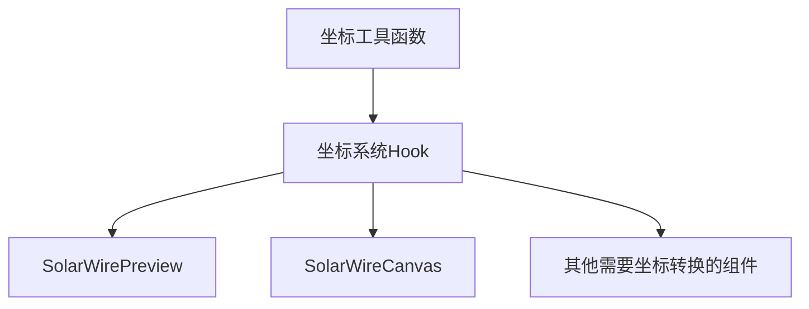

# 坐标转换系统开发设计文档

## 1. 问题分析

### 1.1 现状

当前 SolarWire 编辑器中存在以下坐标相关问题：

1. **坐标转换函数重复**：`SolarWirePreview.tsx` 和 `SolarWireCanvas.tsx` 中都有类似的坐标转换函数
   - `SolarWirePreview.tsx:286` 的 `getSVGCoords`
   - `SolarWireCanvas.tsx:213` 的 `getCanvasCoords`

2. **坐标系统管理分散**：坐标转换逻辑分散在多个组件中，缺乏统一管理

3. **视口变换一致性**：虽然两个组件都使用了类似的变换逻辑，但实现细节可能存在差异

4. **性能优化空间**：每次鼠标移动都需要重新计算坐标转换

5. **测试友好性差**：坐标转换逻辑难以单独测试

### 1.2 影响

- **代码维护困难**：重复代码导致修改时需要同时修改多个地方
- **潜在的位置偏差**：不同组件的坐标转换逻辑不一致可能导致位置偏差
- **性能开销**：频繁的坐标计算影响用户体验
- **测试覆盖不足**：难以对坐标转换逻辑进行单独测试

## 2. 设计方案

### 2.1 总体设计

创建一个统一的坐标系统管理模块，封装所有坐标转换逻辑，提供清晰的接口供各组件使用。

### 2.2 架构设计



### 2.3 模块划分

1. **坐标工具函数**：纯函数，负责具体的坐标转换计算
2. **坐标系统Hook**：封装状态和逻辑，提供便捷的坐标转换方法
3. **组件集成**：各组件使用统一的坐标系统

## 3. 实现细节

### 3.1 坐标工具函数

创建 `src/shared/utils/coordinate-utils.ts` 文件：

```typescript
/**
 * 坐标工具函数
 * 提供屏幕坐标、世界坐标、SVG坐标之间的转换
 */

/**
 * 屏幕坐标转世界坐标
 * @param clientX 屏幕X坐标
 * @param clientY 屏幕Y坐标
 * @param containerRect 容器边界
 * @param position 视口位置
 * @param scale 缩放比例
 * @returns 世界坐标 {x, y}
 */
export function screenToWorld(
  clientX: number,
  clientY: number,
  containerRect: DOMRect,
  position: { x: number; y: number },
  scale: number
): { x: number; y: number } {
  return {
    x: (clientX - containerRect.left - position.x) / scale,
    y: (clientY - containerRect.top - position.y) / scale
  };
}

/**
 * 世界坐标转屏幕坐标
 * @param worldX 世界X坐标
 * @param worldY 世界Y坐标
 * @param containerRect 容器边界
 * @param position 视口位置
 * @param scale 缩放比例
 * @returns 屏幕坐标 {x, y}
 */
export function worldToScreen(
  worldX: number,
  worldY: number,
  containerRect: DOMRect,
  position: { x: number; y: number },
  scale: number
): { x: number; y: number } {
  return {
    x: worldX * scale + position.x + containerRect.left,
    y: worldY * scale + position.y + containerRect.top
  };
}

/**
 * SVG坐标转世界坐标
 * @param svgX SVG X坐标
 * @param svgY SVG Y坐标
 * @returns 世界坐标 {x, y}
 */
export function svgToWorld(svgX: number, svgY: number): { x: number; y: number } {
  // SVG坐标与世界坐标在当前实现中是一致的
  return { x: svgX, y: svgY };
}

/**
 * 世界坐标转SVG坐标
 * @param worldX 世界X坐标
 * @param worldY 世界Y坐标
 * @returns SVG坐标 {x, y}
 */
export function worldToSvg(worldX: number, worldY: number): { x: number; y: number } {
  // SVG坐标与世界坐标在当前实现中是一致的
  return { x: worldX, y: worldY };
}

/**
 * 计算视口变换矩阵
 * @param position 视口位置
 * @param scale 缩放比例
 * @returns CSS transform 字符串
 */
export function getTransformString(position: { x: number; y: number }, scale: number): string {
  return `translate(${position.x}px, ${position.y}px) scale(${scale})`;
}
```

### 3.2 坐标系统Hook

创建 `src/shared/hooks/useCoordinateSystem.ts` 文件：

```typescript
/**
 * 坐标系统Hook
 * 提供统一的坐标转换功能
 */
import { useCallback, useRef } from 'react';
import { screenToWorld, worldToScreen, svgToWorld, worldToSvg, getTransformString } from '../utils/coordinate-utils';

interface UseCoordinateSystemOptions {
  position: { x: number; y: number };
  scale: number;
}

interface UseCoordinateSystemReturn {
  getWorldCoords: (clientX: number, clientY: number) => { x: number; y: number };
  getScreenCoords: (worldX: number, worldY: number) => { x: number; y: number };
  getSvgCoords: (clientX: number, clientY: number) => { x: number; y: number };
  getTransform: () => string;
  containerRef: React.RefObject<HTMLElement>;
}

export function useCoordinateSystem({
  position,
  scale
}: UseCoordinateSystemOptions): UseCoordinateSystemReturn {
  const containerRef = useRef<HTMLElement>(null);

  const getWorldCoords = useCallback(
    (clientX: number, clientY: number): { x: number; y: number } => {
      if (!containerRef.current) {
        return { x: 0, y: 0 };
      }
      const rect = containerRef.current.getBoundingClientRect();
      return screenToWorld(clientX, clientY, rect, position, scale);
    },
    [position, scale]
  );

  const getScreenCoords = useCallback(
    (worldX: number, worldY: number): { x: number; y: number } => {
      if (!containerRef.current) {
        return { x: 0, y: 0 };
      }
      const rect = containerRef.current.getBoundingClientRect();
      return worldToScreen(worldX, worldY, rect, position, scale);
    },
    [position, scale]
  );

  const getSvgCoords = useCallback(
    (clientX: number, clientY: number): { x: number; y: number } => {
      const worldCoords = getWorldCoords(clientX, clientY);
      return worldToSvg(worldCoords.x, worldCoords.y);
    },
    [getWorldCoords]
  );

  const getTransform = useCallback((): string => {
    return getTransformString(position, scale);
  }, [position, scale]);

  return {
    getWorldCoords,
    getScreenCoords,
    getSvgCoords,
    getTransform,
    containerRef
  };
}
```

### 3.3 组件集成

#### 3.3.1 SolarWirePreview 集成

```typescript
// SolarWirePreview.tsx
import { useCoordinateSystem } from '../../shared/hooks/useCoordinateSystem';

function SolarWirePreview(...) {
  const [position, setPosition] = useState({ x: 0, y: 0 });
  const [scale, setScale] = useState(1);

  const { getSvgCoords, getTransform, containerRef } = useCoordinateSystem({
    position,
    scale
  });

  // 使用 getSvgCoords 替代原来的 getSVGCoords
  const handleMouseMove = (e: React.MouseEvent) => {
    // ...
    if (dragElementState) {
      const currentCoords = getSvgCoords(e.clientX, e.clientY);
      const startCoords = getSvgCoords(dragElementState.startX, dragElementState.startY);
      // ...
    }
  };

  // 使用 getTransform 替代内联的 transform 计算
  return (
    <div ref={containerRef} ...>
      {svg && (
        <div
          className="svg-container"
          style={{
            // ...
            transform: getTransform(),
            // ...
          }}
        />
      )}
    </div>
  );
}
```

#### 3.3.2 SolarWireCanvas 集成

```typescript
// SolarWireCanvas.tsx
import { useCoordinateSystem } from '../../shared/hooks/useCoordinateSystem';

function SolarWireCanvas(...) {
  const [position, setPosition] = useState({ x: 0, y: 0 });
  const [scale, setScale] = useState(zoomLevel / 100);

  const { getWorldCoords, getTransform, containerRef } = useCoordinateSystem({
    position,
    scale
  });

  // 使用 getWorldCoords 替代原来的 getCanvasCoords
  const handleMouseDown = useCallback((e: React.MouseEvent) => {
    // ...
    const coords = getWorldCoords(e.clientX, e.clientY);
    // ...
  }, [getWorldCoords, ...]);

  // 使用 getTransform 替代内联的 transform 计算
  return (
    <div ref={containerRef} ...>
      <canvas
        style={{
          // ...
          transform: getTransform(),
          // ...
        }}
      />
    </div>
  );
}
```

## 4. 性能优化

### 4.1 缓存策略

- 使用 `useCallback` 缓存坐标转换函数，避免每次渲染都重新创建
- 使用 `useMemo` 缓存容器边界计算结果

### 4.2 批量处理

- 对于频繁的鼠标移动事件，考虑使用节流（throttle）处理
- 批量更新坐标计算结果

## 5. 测试计划

### 5.1 单元测试

为坐标工具函数编写单元测试：

```typescript
// tests/unit/coordinate-utils.test.ts
import { screenToWorld, worldToScreen, getTransformString } from '../../src/shared/utils/coordinate-utils';

describe('Coordinate Utils', () => {
  const containerRect = {
    left: 100,
    top: 50,
    width: 800,
    height: 600
  } as DOMRect;

  const position = { x: 50, y: 30 };
  const scale = 2;

  test('screenToWorld should correctly convert screen coordinates to world coordinates', () => {
    const result = screenToWorld(200, 150, containerRect, position, scale);
    expect(result).toEqual({ x: 25, y: 35 });
  });

  test('worldToScreen should correctly convert world coordinates to screen coordinates', () => {
    const result = worldToScreen(25, 35, containerRect, position, scale);
    expect(result).toEqual({ x: 200, y: 150 });
  });

  test('getTransformString should return correct CSS transform', () => {
    const result = getTransformString(position, scale);
    expect(result).toBe('translate(50px, 30px) scale(2)');
  });
});
```

### 5.2 集成测试

测试坐标系统 Hook 在实际组件中的使用：

- 测试鼠标移动时的坐标转换准确性
- 测试缩放和偏移变化时的坐标一致性
- 测试不同组件间的坐标转换一致性

## 6. 兼容性考虑

- 保持向后兼容，确保现有代码可以平滑迁移
- 提供清晰的迁移指南
- 保留旧的坐标转换函数作为过渡方案

## 7. 实现时间表

| 阶段 | 任务 | 时间估计 |
|------|------|----------|
| 1 | 创建坐标工具函数 | 1小时 |
| 2 | 创建坐标系统Hook | 1小时 |
| 3 | 集成到SolarWirePreview | 1.5小时 |
| 4 | 集成到SolarWireCanvas | 1.5小时 |
| 5 | 编写单元测试 | 1小时 |
| 6 | 测试和调试 | 2小时 |
| **总计** | | **8小时** |

## 8. 预期收益

1. **代码一致性**：统一的坐标转换逻辑，减少重复代码
2. **可维护性**：集中管理坐标系统，便于后续修改和扩展
3. **性能提升**：优化的坐标计算和缓存策略
4. **可测试性**：纯函数形式的坐标转换逻辑便于单元测试
5. **可扩展性**：为未来的坐标系统扩展提供基础架构

## 9. 风险评估

| 风险 | 影响 | 缓解措施 |
|------|------|----------|
| 坐标转换精度问题 | 元素位置偏差 | 编写详细的单元测试，确保转换精度 |
| 性能回归 | 鼠标移动卡顿 | 实现缓存策略和节流处理 |
| 集成复杂性 | 迁移困难 | 提供详细的迁移指南，保留旧接口作为过渡 |
| 边界情况处理 | 特殊场景下的坐标错误 | 充分测试边界情况，如容器大小变化、缩放极限等 |

## 10. 结论

通过实现统一的坐标转换系统，可以显著提高代码质量和可维护性，同时确保坐标转换的一致性和准确性。这将为 SolarWire 编辑器的后续开发和扩展奠定坚实的基础。