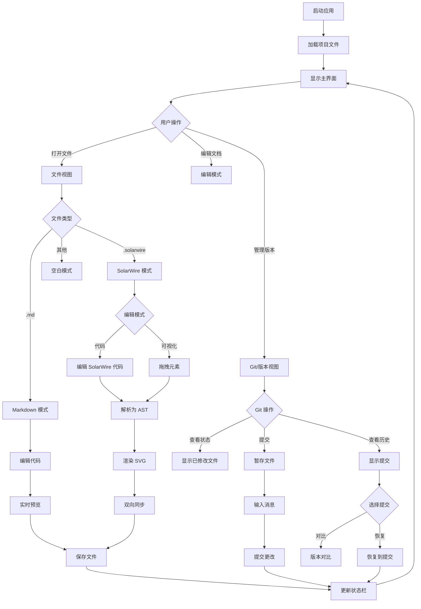
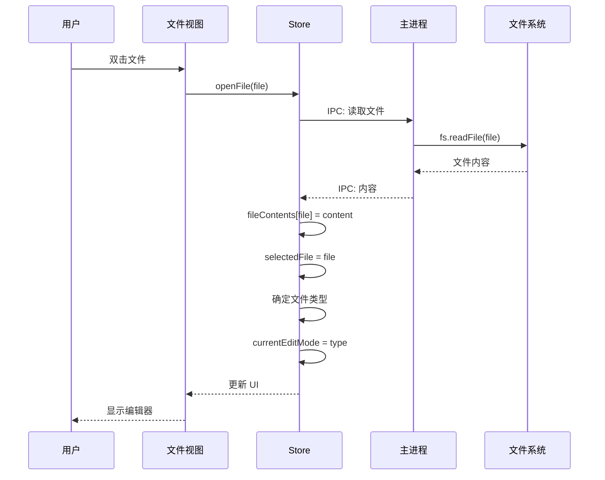
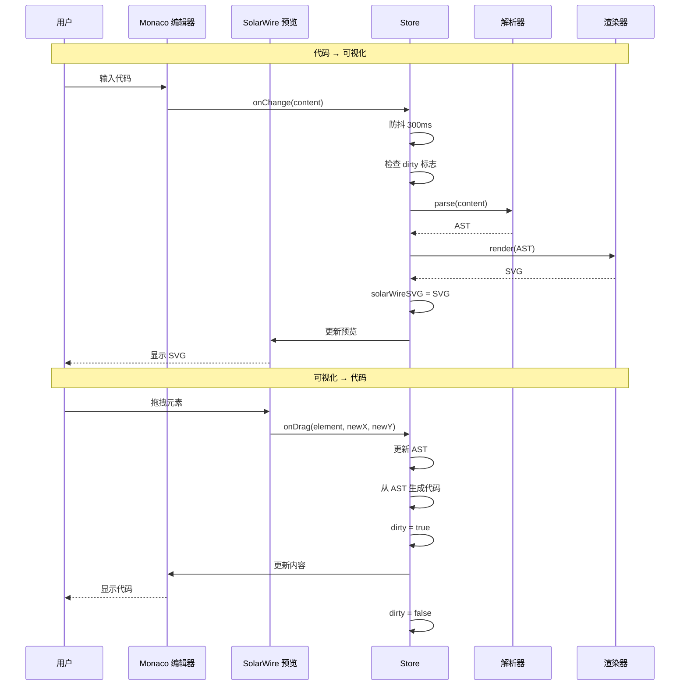
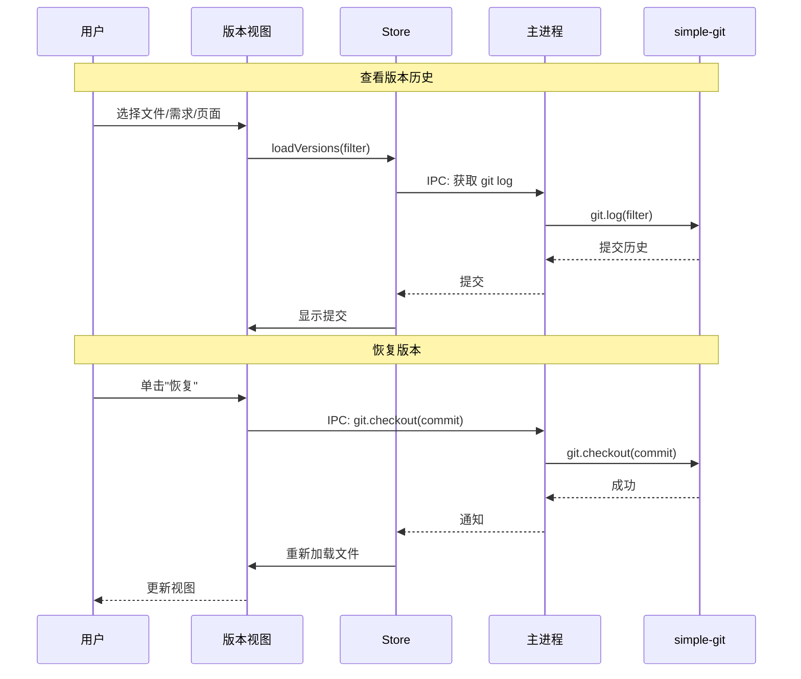

# 产品需求文档 - SolarWire 编辑器

## 文档信息
| 项目名称 | SolarWire 编辑器 |
|---------|------------------|
| 版本 | v1.0 |
| 创建日期 | 2025-04-01 |
| 作者 | SolarWire 团队 |

---

## 1. 产品概述

### 1.1 产品背景

SolarWire 编辑器是一个完整的文档工作台，提供 SolarWire 代码编辑、可视化拖拽编辑、Markdown 编辑、实时预览、批量 SVG 生成、版本管理和 Git 管理功能。这是一个基于 Electron、React 和 TypeScript 构建的独立桌面应用程序，旨在为开发者和产品经理提供高效的 SolarWire 文档编辑和管理工具。

### 1.2 目标用户

- **产品经理**：需要使用 SolarWire 语法创建和管理产品需求文档（PRD）
- **开发者**：需要编辑 SolarWire 代码并可视化线框图
- **设计师**：需要查看线框图并提供反馈
- **技术文档编写者**：需要创建和维护技术文档

### 1.3 核心价值

- **双模式编辑**：支持代码编辑和可视化拖拽编辑两种模式，满足不同用户偏好
- **实时预览**：即时预览 SolarWire 代码渲染结果，提高工作效率
- **版本管理**：完整的 Git 集成，支持版本控制和历史追踪
- **批量操作**：支持批量 SVG 生成，高效导出文档
- **专业工作台**：集成文件管理、编辑、预览和版本控制于一体

### 1.4 用户故事

| ID | 用户故事 | 验收标准 | 优先级 |
|----|---------|----------|--------|
| US-001 | 作为产品经理，我希望使用可视化拖拽创建和编辑 SolarWire 文档，以便快速创建线框图而无需学习语法 | - 鉴于 SolarWire 编辑模式已激活，当我从元素库拖拽元素到画布时，元素被添加到画布并生成对应代码<br>- 鉴于选中了元素，当我在画布上拖拽它时，元素位置更新且代码自动同步<br>- 鉴于选中了元素，当我使用手柄调整大小时，元素尺寸更新且代码自动同步 | P0 |
| US-002 | 作为开发者，我希望直接编辑 SolarWire 代码并带有语法高亮和自动补全，以便高效编写代码 | - 鉴于 SolarWire 编辑模式已激活，当我在编辑器中输入代码时，预览以 300ms 防抖实时更新<br>- 鉴于我输入 SolarWire 语法，当编辑器检测到有效语法时，自动补全建议出现<br>- 鉴于我出现语法错误，当我输入时，编辑器中显示错误指示器 | P0 |
| US-003 | 作为用户，我希望查看和管理项目中的所有文件，以便轻松导航和打开文档 | - 鉴于文件视图已激活，当我展开文件夹时，所有子文件夹和文件被显示<br>- 鉴于我双击文件，当文件受支持（.md、.solarwire）时，它在适当的编辑模式下打开<br>- 鉴于我右键单击文件，当我选择删除时，文件在确认后被删除 | P0 |
| US-004 | 作为用户，我希望查看项目中的所有需求，以便快速查找和管理需求文档 | - 鉴于需求视图已激活，当我查看列表时，.solarwire 目录中的所有需求以卡片形式显示<br>- 鉴于我单击需求卡片，当它展开时，显示详细信息（名称、日期、页面数）<br>- 鉴于我单击需求中的页面，当我单击时，编辑器打开到该页面 | P1 |
| US-005 | 作为用户，我希望查看项目中的所有 SolarWire 页面，以便在页面之间快速导航 | - 鉴于 SolarWire 页面视图已激活，当我查看列表时，所有需求文档中的所有页面以缩略图形式显示<br>- 鉴于我输入搜索词，当我搜索时，列表过滤显示匹配的页面<br>- 鉴于我单击页面缩略图，当我单击时，编辑器打开到该页面 | P1 |
| US-006 | 作为用户，我希望管理 Git 版本，以便跟踪更改和恢复以前的版本 | - 鉴于版本视图已激活，当我查看列表时，Git 提交历史按时间倒序显示<br>- 鉴于我选择文件/需求/页面，当我查看版本列表时，它过滤仅显示与所选项目相关的提交<br>- 鉴于我选择提交，当我单击"恢复到此提交"时，文件恢复到该提交状态 | P0 |
| US-007 | 作为用户，我希望执行 Git 操作，以便提交更改和管理分支 | - 鉴于 Git 视图已激活，当我查看状态时，显示已修改、已暂存和未跟踪的文件<br>- 鉴于我选择已修改的文件，当我单击"暂存"时，文件被移动到暂存区<br>- 鉴于我输入提交消息并单击"提交"，更改被提交到 Git<br>- 鉴于我单击"推送"，更改被推送到远程仓库 | P0 |
| US-008 | 作为用户，我希望使用实时预览编辑 Markdown 文档，以便同时编写和预览 | - 鉴于我打开 .md 文件，当 Markdown 编辑模式激活时，左侧显示编辑器，右侧显示预览<br>- 鉴于我在编辑器中输入 Markdown，当我输入时，预览实时更新<br>- 鉴于我包含 Mermaid 图表或 SolarWire 代码，当预览渲染时，它们被正确渲染 | P1 |
| US-009 | 作为用户，我希望比较不同版本，以便查看提交之间的更改 | - 鉴于我在版本模式中选择提交，当我查看比较时，左侧显示当前版本，右侧显示所选版本<br>- 鉴于存在差异，当我查看比较时，差异被高亮显示<br>- 鉴于我单击"恢复"，当我确认时，当前版本被替换为所选版本 | P1 |
| US-010 | 作为用户，我希望将文档导出为 SVG，以便与利益相关者共享线框图 | - 鉴于我选择一个或多个页面，当我单击"导出 SVG"时，为每个页面生成 SVG 文件<br>- 鉴于导出完成，当它完成时，SVG 文件被保存到指定目录<br>- 鉴于有多个页面，当我导出时，所有选中的页面被批量导出 | P1 |

---

## 2. 功能范围

### 2.1 功能列表

| 模块 | 功能 | 优先级 | 描述 |
|------|------|--------|------|
| 主布局 | 顶部菜单栏 | P0 | 文件、编辑、视图、工具、帮助菜单 |
| 主布局 | 左侧面板 | P0 | 视图切换标签（文件/需求/页面/Git） |
| 主布局 | 右侧面板 | P0 | 多模式编辑区域 |
| 主布局 | 状态栏 | P1 | 显示保存状态、文件状态、当前模式 |
| 文件视图 | 文件树 | P0 | 显示文件结构，支持展开/折叠 |
| 文件视图 | 文件操作 | P0 | 打开、创建、删除、重命名文件 |
| 需求视图 | 需求卡片 | P1 | 显示 .solarwire 目录中的所有需求 |
| 需求视图 | 需求详情 | P1 | 显示名称、日期、页面数 |
| SolarWire 页面视图 | 页面缩略图 | P1 | 以缩略图形式显示所有页面 |
| SolarWire 页面视图 | 搜索和筛选 | P1 | 按标题搜索页面 |
| 版本视图 | Git 提交历史 | P0 | 按时间倒序显示提交 |
| 版本视图 | 版本筛选 | P0 | 根据选中的文件/需求/页面筛选 |
| 版本视图 | 版本恢复 | P0 | 恢复到任意提交 |
| 版本视图 | 版本对比 | P1 | 比较两个版本，高亮差异 |
| Git 视图 | Git 状态 | P0 | 显示已修改、已暂存、未跟踪文件 |
| Git 视图 | 暂存/取消暂存 | P0 | 暂存或取消暂存文件 |
| Git 视图 | 提交 | P0 | 带消息提交更改 |
| Git 视图 | 分支管理 | P1 | 创建、切换、删除分支 |
| Git 视图 | 远程操作 | P1 | 推送、拉取、获取远程 |
| Git 视图 | 文件差异 | P1 | 查看文件差异 |
| Markdown 模式 | 代码编辑器 | P1 | 带 Markdown 语法高亮的 Monaco 编辑器 |
| Markdown 模式 | 实时预览 | P1 | 预览 Markdown、Mermaid、SolarWire |
| SolarWire 模式 | 代码编辑器 | P0 | 带 SolarWire 语法高亮的 Monaco 编辑器 |
| SolarWire 模式 | SVG 预览 | P0 | 将 SolarWire 渲染为 SVG 并支持交互 |
| SolarWire 模式 | 元素库 | P0 | 8 种基础元素用于拖拽 |
| SolarWire 模式 | 属性面板 | P0 | 编辑元素属性（文本、位置、尺寸、样式、备注） |
| SolarWire 模式 | 元素选中 | P0 | 单选、多选、框选 |
| SolarWire 模式 | 元素拖拽 | P0 | 在画布上拖拽元素 |
| SolarWire 模式 | 元素调整大小 | P0 | 使用 8 个手柄调整元素大小 |
| SolarWire 模式 | 右键菜单 | P1 | 复制、删除、层级操作 |
| 版本模式 | 版本对比 | P1 | 左侧：当前版本（只读），右侧：对比版本 |
| 版本模式 | 差异高亮 | P1 | 高亮显示版本之间的差异 |
| 版本模式 | 版本恢复 | P1 | 恢复到所选版本 |
| Git 模式 | Git 操作面板 | P0 | 完整的 Git 操作界面 |
| Git 模式 | 提交消息 | P0 | 输入提交消息 |
| Git 模式 | 分支列表 | P1 | 显示和管理分支 |
| Git 模式 | 远程操作 | P1 | 推送、拉取、获取按钮 |
| Git 模式 | 文件差异视图 | P1 | 查看文件差异 |

### 2.2 功能边界

**包含**：
- 文件管理（创建、打开、保存、删除、重命名）
- SolarWire 代码编辑，带语法高亮
- 可视化拖拽编辑，带元素库
- 实时预览（代码 ↔ 可视化双向同步）
- Markdown 编辑和预览
- Git 版本管理（提交、分支、远程）
- 版本历史和对比
- 批量 SVG 导出
- 多语言支持（中文、英语）

**不包含**：
- 云存储集成
- 协作编辑（实时多用户）
- 高级图像编辑工具
- 自定义元素创建（超出 8 种基础元素）
- 插件系统
- 移动应用版本
- 基于 Web 的版本

---

## 3. 业务流程

### 3.1 核心业务流程图



### 3.2 文件打开流程



### 3.3 SolarWire 双向同步流程



### 3.4 Git 版本管理流程



---

## 4. 页面设计

### 4.1 页面列表

| 页面名称 | 页面类型 | 描述 |
|---------|---------|------|
| 主布局 | 主页面 | 应用主界面，包含菜单、面板和状态栏 |
| 文件视图 | 面板视图 | 带文件操作的文件树结构 |
| 需求视图 | 面板视图 | .solarwire 目录中的需求卡片 |
| SolarWire 页面视图 | 面板视图 | 带搜索和筛选的页面缩略图 |
| 版本视图 | 面板视图 | 带筛选的 Git 提交历史 |
| Git 视图 | 面板视图 | Git 状态和操作 |
| Markdown 模式 | 编辑模式 | 带实时预览的 Markdown 编辑器 |
| SolarWire 模式 | 编辑模式 | 带 SVG 预览和元素库的 SolarWire 代码编辑器 |
| 版本模式 | 编辑模式 | 带差异高亮的版本对比 |
| Git 模式 | 编辑模式 | Git 操作面板 |

---

## 5. 页面详情

### 5.1 主布局

**页面概述**：应用主界面，包含顶部菜单栏、左侧视图面板、右侧编辑面板和底部状态栏

```solarwire
!title="主布局"
!c=#111827
!size=13
!bg=#F9FAFB
!r=0

// 容器矩形
[] @(0,0) w=1440 h=900 bg=#FFFFFF

// 顶部菜单栏
[] @(0,0) w=1440 h=48 bg=#F9FAFB b=#E5E7EB
["SolarWire 编辑器"] @(20,14) w=140 h=20 bg=transparent c=#111827 note="应用标题
1. i18n: 中文=SolarWire 编辑器, English=SolarWire Editor"
["文件"] @(180,14) w=40 h=20 bg=transparent c=#111827 note="文件菜单
1. i18n: 中文=文件, English=File
2. 点击操作
   - 显示下拉菜单：新建、打开、保存、导出"
["编辑"] @(230,14) w=40 h=20 bg=transparent c=#111827 note="编辑菜单
1. i18n: 中文=编辑, English=Edit
2. 点击操作
   - 显示下拉菜单：撤销、重做、复制、粘贴"
["视图"] @(280,14) w=40 h=20 bg=transparent c=#111827 note="视图菜单
1. i18n: 中文=视图, English=View
2. 点击操作
   - 显示下拉菜单：切换视图、切换编辑模式"
["工具"] @(330,14) w=40 h=20 bg=transparent c=#111827 note="工具菜单
1. i18n: 中文=工具, English=Tools
2. 点击操作
   - 显示下拉菜单：批量生成 SVG"
["帮助"] @(380,14) w=40 h=20 bg=transparent c=#111827 note="帮助菜单
1. i18n: 中文=帮助, English=Help
2. 点击操作
   - 显示下拉菜单：快捷键、关于"

// 左侧面板
[] @(0,48) w=300 h=832 bg=#F9FAFB b=#E5E7EB

// 视图切换标签
[] @(0,48) w=300 h=40 bg=#F9FAFB b=#E5E7EB
["文件"] @(10,58) w=60 h=20 bg=#FFFFFF b=#E5E7EB c=#111827 note="文件视图标签
1. i18n: 中文=文件, English=File
2. 点击操作
   - 切换到文件视图
   - 隐藏版本视图"
["需求"] @(80,58) w=90 h=20 bg=transparent c=#6B7280 note="需求视图标签
1. i18n: 中文=需求, English=Requirement
2. 点击操作
   - 切换到需求视图
   - 隐藏版本视图"
["页面"] @(180,58) w=70 h=20 bg=transparent c=#6B7280 note="SolarWire 视图标签
1. i18n: 中文=页面, English=Page
2. 点击操作
   - 切换到 SolarWire 页面视图
   - 隐藏版本视图"
["Git"] @(260,58) w=30 h=20 bg=transparent c=#6B7280 note="Git 视图标签
1. i18n: 中文=Git, English=Git
2. 点击操作
   - 切换到 Git 视图
   - 隐藏版本视图"

// 文件视图内容
["Project"] @(10,108) w=40 h=20 bg=transparent c=#111827 note="项目文件夹
1. 点击操作
   - 展开/折叠文件夹"
[?"▼"] @(55,108) w=16 h=16 bg=transparent c=#6B7280 note="展开/折叠图标
1. 点击操作
   - 切换文件夹展开状态"
["docs"] @(20,138) w=40 h=20 bg=transparent c=#111827 note="docs 文件夹
1. 点击操作
   - 展开/折叠文件夹"
[?"▶"] @(55,138) w=16 h=16 bg=transparent c=#6B7280 note="展开/折叠图标
1. 点击操作
   - 切换文件夹展开状态"
[".solarwire"] @(20,168) w=70 h=20 bg=transparent c=#111827 note=".solarwire 文件夹
1. 点击操作
   - 展开/折叠文件夹"
[?"▶"] @(95,168) w=16 h=16 bg=transparent c=#6B7280 note="展开/折叠图标
1. 点击操作
   - 切换文件夹展开状态"
["login-system.solarwire"] @(30,198) w=140 h=20 bg=transparent c=#6B7280 note="SolarWire 文件
1. 双击操作
   - 在 SolarWire 模式打开文件
   - 切换编辑器到 SolarWire 模式"
["user-profile.solarwire"] @(30,228) w=140 h=20 bg=transparent c=#6B7280 note="SolarWire 文件
1. 双击操作
   - 在 SolarWire 模式打开文件
   - 切换编辑器到 SolarWire 模式"
["README.md"] @(30,258) w=80 h=20 bg=transparent c=#6B7280 note="Markdown 文件
1. 双击操作
   - 在 Markdown 模式打开文件
   - 切换编辑器到 Markdown 模式"

// 版本视图（独立面板）
[] @(0,480) w=300 h=400 bg=#F9FAFB b=#E5E7EB
["版本历史"] @(10,490) w=100 h=20 bg=transparent c=#111827 note="版本视图标题
1. i18n: 中文=版本历史, English=Version History
2. 显示规则
   - 当选中任何文件/需求/页面时显示
   - 根据选中项目筛选提交"
["abc1234"] @(10,520) w=70 h=20 bg=transparent c=#6B7280 note="提交 ID
1. 显示规则
   - 显示提交哈希的前 7 个字符"
["2025-04-01 10:30"] @(90,520) w=100 h=20 bg=transparent c=#6B7280 note="提交时间
1. 显示规则
   - 格式：YYYY-MM-DD HH:mm"
["更新登录页面设计"] @(10,550) w=180 h=20 bg=transparent c=#111827 note="提交消息
1. 显示规则
   - 显示完整提交消息"
["def5678"] @(10,580) w=70 h=20 bg=transparent c=#6B7280 note="提交 ID
1. 显示规则
   - 显示提交哈希的前 7 个字符"
["2025-04-01 09:15"] @(90,580) w=100 h=20 bg=transparent c=#6B7280 note="提交时间
1. 显示规则
   - 格式：YYYY-MM-DD HH:mm"
["添加用户资料页面"] @(10,610) w=180 h=20 bg=transparent c=#111827 note="提交消息
1. 显示规则
   - 显示完整提交消息"

// 右侧面板 - 编辑区域
[] @(300,48) w=1140 h=832 bg=#FFFFFF b=#E5E7EB

// 编辑模式标签（示例：SolarWire 模式）
[] @(300,48) w=1140 h=40 bg=#F9FAFB b=#E5E7EB
["代码"] @(310,58) w=40 h=20 bg=#FFFFFF b=#E5E7EB c=#111827 note="代码编辑器标签
1. i18n: 中文=代码, English=Code
2. 点击操作
   - 切换到代码编辑器视图"
["预览"] @(360,58) w=60 h=20 bg=transparent c=#6B7280 note="预览标签
1. i18n: 中文=预览, English=Preview
2. 点击操作
   - 切换到预览视图"

// 代码编辑器区域（Monaco 编辑器）
[] @(300,88) w=740 h=792 bg=#FFFFFF b=#E5E7EB
["// SolarWire 代码编辑器"] @(310,108) w=200 h=20 bg=transparent c=#6B7280 note="代码编辑器占位符
1. 显示规则
   - Monaco 编辑器实例
   - SolarWire 语法高亮
   - 行号
   - 自动补全"

// 属性面板（右侧）
[] @(1040,88) w=400 h=792 bg=#F9FAFB b=#E5E7EB
["属性"] @(1050,108) w=80 h=20 bg=transparent c=#111827 note="属性面板标题
1. i18n: 中文=属性, English=Properties
2. 显示规则
   - 当在预览中选中元素时显示"
["文本"] @(1050,148) w=40 h=20 bg=transparent c=#111827 note="文本标签
1. i18n: 中文=文本, English=Text"
["登录按钮"] @(1050,168) w=280 h=36 bg=#FFFFFF b=#E5E7EB c=#111827 note="文本输入
1. 输入规则
   - 所选元素的文本内容
   - 最大长度：200 字符
2. 验证
   - 必填字段"
["X"] @(1050,224) w=20 h=20 bg=transparent c=#111827 note="X 坐标标签
1. 显示规则
   - 元素的水平位置"
["100"] @(1050,244) w=280 h=36 bg=#FFFFFF b=#E5E7EB c=#111827 note="X 坐标输入
1. 输入规则
   - 数字输入
   - 最小值：0，最大值：画布宽度
2. 验证
   - 必须是有效数字"
["Y"] @(1050,290) w=20 h=20 bg=transparent c=#111827 note="Y 坐标标签
1. 显示规则
   - 元素的垂直位置"
["150"] @(1050,310) w=280 h=36 bg=#FFFFFF b=#E5E7EB c=#111827 note="Y 坐标输入
1. 输入规则
   - 数字输入
   - 最小值：0，最大值：画布高度
2. 验证
   - 必须是有效数字"
["宽度"] @(1050,356) w=50 h=20 bg=transparent c=#111827 note="宽度标签
1. i18n: 中文=宽度, English=Width
2. 显示规则
   - 元素宽度"
["200"] @(1050,376) w=280 h=36 bg=#FFFFFF b=#E5E7EB c=#111827 note="宽度输入
1. 输入规则
   - 数字输入
   - 最小值：20，最大值：画布宽度
2. 验证
   - 必须是有效数字"
["高度"] @(1050,422) w=50 h=20 bg=transparent c=#111827 note="高度标签
1. i18n: 中文=高度, English=Height
2. 显示规则
   - 元素高度"
["48"] @(1050,442) w=280 h=36 bg=#FFFFFF b=#E5E7EB c=#111827 note="高度输入
1. 输入规则
   - 数字输入
   - 最小值：20，最大值：画布高度
2. 验证
   - 必须是有效数字"
["背景色"] @(1050,488) w=80 h=20 bg=transparent c=#111827 note="背景颜色标签
1. i18n: 中文=背景色, English=Background
2. 显示规则
   - 元素背景颜色"
["#3B82F6"] @(1050,508) w=280 h=36 bg=#FFFFFF b=#E5E7EB c=#111827 note="背景颜色输入
1. 输入规则
   - 十六进制颜色代码（#RRGGBB）
   - 颜色选择器
2. 验证
   - 有效的十六进制颜色代码"
["备注"] @(1050,554) w=40 h=20 bg=transparent c=#111827 note="备注标签
1. i18n: 中文=备注, English=Note
2. 显示规则
   - 元素备注/描述"
["点击提交登录表单"] @(1050,574) w=280 h=100 bg=#FFFFFF b=#E5E7EB c=#111827 note="备注输入
1. 输入规则
   - 多行文本
   - 最大长度：1000 字符
   - 支持 Markdown 语法
2. 显示规则
   - 5 行文本框"

// 状态栏
[] @(0,880) w=1440 h=20 bg=#F9FAFB b=#E5E7EB
["已保存"] @(10,880) w=60 h=20 bg=transparent c=#22C55E note="保存状态
1. i18n: 中文=已保存, English=Saved
2. 显示规则
   - 绿色：已保存
   - 黄色：未保存更改
   - 灰色：未打开文件"
["login-system.solarwire"] @(80,880) w=180 h=20 bg=transparent c=#111827 note="当前文件
1. 显示规则
   - 显示当前打开的文件名"
["SolarWire 模式"] @(270,880) w=120 h=20 bg=transparent c=#6B7280 note="当前模式
1. i18n: 中文=SolarWire 模式, English=SolarWire Mode
2. 显示规则
   - 显示当前编辑模式"
["main"] @(400,880) w=60 h=20 bg=transparent c=#6B7280 note="当前分支
1. 显示规则
   - 显示当前 Git 分支"
```

### 5.2 文件视图

**页面概述**：显示项目文件树结构，支持展开/折叠、双击打开、右键菜单（新建/删除/重命名）

```solarwire
!title="文件视图"
!c=#111827
!size=13
!bg=#F9FAFB
!r=0

// 容器矩形
[] @(0,0) w=300 h=832 bg=#F9FAFB b=#E5E7EB

// 视图标题
["文件"] @(10,10) w=40 h=20 bg=transparent c=#111827 note="文件视图标题
1. i18n: 中文=文件, English=File"

// 文件树
["Project"] @(10,50) w=40 h=20 bg=transparent c=#111827 note="项目文件夹
1. 点击操作
   - 展开/折叠文件夹
2. 双击操作
   - 无操作"
[?"▼"] @(55,50) w=16 h=16 bg=transparent c=#6B7280 note="展开/折叠图标
1. 点击操作
   - 切换文件夹展开状态
2. 显示规则
   - ▼：已展开
   - ▶：已折叠"

["docs"] @(20,80) w=40 h=20 bg=transparent c=#111827 note="docs 文件夹
1. 点击操作
   - 展开/折叠文件夹"
[?"▶"] @(55,80) w=16 h=16 bg=transparent c=#6B7280 note="展开/折叠图标
1. 点击操作
   - 切换文件夹展开状态"

["README.md"] @(30,110) w=80 h=20 bg=transparent c=#6B7280 note="Markdown 文件
1. 双击操作
   - 在 Markdown 模式打开文件
   - 切换编辑器到 Markdown 模式
2. 右键菜单
   - 打开：在编辑器中打开
   - 重命名：重命名文件
   - 删除：删除文件（需确认）
3. 图标
   - Markdown 文件图标"

[".solarwire"] @(20,140) w=70 h=20 bg=transparent c=#111827 note=".solarwire 文件夹
1. 点击操作
   - 展开/折叠文件夹"
[?"▼"] @(95,140) w=16 h=16 bg=transparent c=#6B7280 note="展开/折叠图标
1. 点击操作
   - 切换文件夹展开状态"

["login-system.solarwire"] @(30,170) w=140 h=20 bg=transparent c=#6B7280 note="SolarWire 文件
1. 双击操作
   - 在 SolarWire 模式打开文件
   - 切换编辑器到 SolarWire 模式
2. 右键菜单
   - 打开：在编辑器中打开
   - 重命名：重命名文件
   - 删除：删除文件（需确认）
3. 图标
   - SolarWire 文件图标"

["user-profile.solarwire"] @(30,200) w=140 h=20 bg=transparent c=#6B7280 note="SolarWire 文件
1. 双击操作
   - 在 SolarWire 模式打开文件
   - 切换编辑器到 SolarWire 模式
2. 右键菜单
   - 打开：在编辑器中打开
   - 重命名：重命名文件
   - 删除：删除文件（需确认）
3. 图标
   - SolarWire 文件图标"

["settings.solarwire"] @(30,230) w=140 h=20 bg=transparent c=#6B7280 note="SolarWire 文件
1. 双击操作
   - 在 SolarWire 模式打开文件
   - 切换编辑器到 SolarWire 模式
2. 右键菜单
   - 打开：在编辑器中打开
   - 重命名：重命名文件
   - 删除：删除文件（需确认）
3. 图标
   - SolarWire 文件图标"

["assets"] @(20,260) w=60 h=20 bg=transparent c=#111827 note="assets 文件夹
1. 点击操作
   - 展开/折叠文件夹"
[?"▶"] @(85,260) w=16 h=16 bg=transparent c=#6B7280 note="展开/折叠图标
1. 点击操作
   - 切换文件夹展开状态"

// 新建按钮
["+ 新建"] @(10,800) w=80 h=24 bg=#3B82F6 c=#FFFFFF note="新建按钮
1. i18n: 中文=+ 新建, English=+ New
2. 点击操作
   - 显示新建菜单：文件、文件夹
3. 显示规则
   - 固定在视图底部"
```

### 5.3 需求视图

**页面概述**：显示 .solarwire 目录中的所有需求卡片，平铺显示需求基本信息（名称、日期、页面数），点击展开/折叠详情

```solarwire
!title="需求视图"
!c=#111827
!size=13
!bg=#F9FAFB
!r=0

// 容器矩形
[] @(0,0) w=300 h=832 bg=#F9FAFB b=#E5E7EB

// 视图标题
["需求"] @(10,10) w=40 h=20 bg=transparent c=#111827 note="需求视图标题
1. i18n: 中文=需求, English=Requirement"

// 搜索框
["搜索需求..."] @(10,50) w=280 h=36 bg=#FFFFFF b=#E5E7EB c=#9CA3AF note="搜索输入框
1. i18n: 中文=搜索需求..., English=Search requirements...
2. 输入规则
   - 文本输入
   - 实时搜索（防抖 300ms）
3. 搜索范围
   - 需求名称
   - 需求描述
4. 无结果处理
   - 显示未找到匹配的需求"

// 需求卡片 1
("登录系统") @(10,106) w=280 h=120 bg=#FFFFFF b=#E5E7EB note="需求卡片
1. 点击操作
   - 展开/折叠详情
2. 显示规则
   - 白色背景，灰色边框
   - 圆角：8px"
["登录系统"] @(20,116) w=100 h=20 bg=transparent c=#111827 note="需求名称
1. 显示规则
   - 需求文档名称（不含扩展名）"
["2025-04-01"] @(200,116) w=80 h=20 bg=transparent c=#6B7280 note="创建日期
1. 显示规则
   - 格式：YYYY-MM-DD"
["3 个页面"] @(20,146) w=80 h=20 bg=transparent c=#6B7280 note="页面数量
1. i18n: 中文=3 个页面, English=3 pages
2. 显示规则
   - 需求中的页面总数"
["登录页面"] @(20,176) w=80 h=20 bg=transparent c=#3B82F6 note="页面名称
1. 点击操作
   - 在编辑器中打开该页面
2. 显示规则
   - 蓝色可点击文本"
["注册页面"] @(110,176) w=80 h=20 bg=transparent c=#3B82F6 note="页面名称
1. 点击操作
   - 在编辑器中打开该页面
2. 显示规则
   - 蓝色可点击文本"
["忘记密码页面"] @(200,176) w=90 h=20 bg=transparent c=#3B82F6 note="页面名称
1. 点击操作
   - 在编辑器中打开该页面
2. 显示规则
   - 蓝色可点击文本"

// 需求卡片 2
("用户资料") @(10,246) w=280 h=120 bg=#FFFFFF b=#E5E7EB note="需求卡片
1. 点击操作
   - 展开/折叠详情
2. 显示规则
   - 白色背景，灰色边框
   - 圆角：8px"
["用户资料"] @(20,256) w=80 h=20 bg=transparent c=#111827 note="需求名称
1. 显示规则
   - 需求文档名称（不含扩展名）"
["2025-03-28"] @(200,256) w=80 h=20 bg=transparent c=#6B7280 note="创建日期
1. 显示规则
   - 格式：YYYY-MM-DD"
["2 个页面"] @(20,286) w=80 h=20 bg=transparent c=#6B7280 note="页面数量
1. i18n: 中文=2 个页面, English=2 pages
2. 显示规则
   - 需求中的页面总数"
["个人资料"] @(20,316) w=80 h=20 bg=transparent c=#3B82F6 note="页面名称
1. 点击操作
   - 在编辑器中打开该页面
2. 显示规则
   - 蓝色可点击文本"
["账户设置"] @(110,316) w=80 h=20 bg=transparent c=#3B82F6 note="页面名称
1. 点击操作
   - 在编辑器中打开该页面
2. 显示规则
   - 蓝色可点击文本"

// 需求卡片 3（折叠状态）
("订单管理") @(10,386) w=280 h=60 bg=#FFFFFF b=#E5E7EB note="需求卡片（折叠）
1. 点击操作
   - 展开/折叠详情
2. 显示规则
   - 白色背景，灰色边框
   - 圆角：8px
   - 仅显示基本信息"
["订单管理"] @(20,396) w=80 h=20 bg=transparent c=#111827 note="需求名称
1. 显示规则
   - 需求文档名称（不含扩展名）"
["2025-03-25"] @(200,396) w=80 h=20 bg=transparent c="#6B7280" note="创建日期
1. 显示规则
   - 格式：YYYY-MM-DD"
["5 个页面"] @(20,426) w=80 h=20 bg=transparent c=#6B7280 note="页面数量
1. i18n: 中文=5 个页面, English=5 pages
2. 显示规则
   - 需求中的页面总数"
```

### 5.4 SolarWire 页面视图

**页面概述**：显示所有 SolarWire 页面缩略图和标题，支持搜索和筛选，点击快速跳转到对应页面

```solarwire
!title="SolarWire 页面视图"
!c=#111827
!size=13
!bg=#F9FAFB
!r=0

// 容器矩形
[] @(0,0) w=300 h=832 bg=#F9FAFB b=#E5E7EB

// 视图标题
["页面"] @(10,10) w=40 h=20 bg=transparent c=#111827 note="页面视图标题
1. i18n: 中文=页面, English=Page"

// 搜索框
["搜索页面..."] @(10,50) w=280 h=36 bg=#FFFFFF b=#E5E7EB c=#9CA3AF note="搜索输入框
1. i18n: 中文=搜索页面..., English=Search pages...
2. 输入规则
   - 文本输入
   - 实时搜索（防抖 300ms）
3. 搜索范围
   - 页面标题
   - 需求名称
4. 无结果处理
   - 显示未找到匹配的页面"

// 筛选下拉框
["全部需求"] @(10,106) w=280 h=36 bg=#FFFFFF b=#E5E7EB c=#111827 note="需求筛选下拉框
1. i18n: 中文=全部需求, English=All Requirements
2. 选项
   - 全部需求
   - 登录系统
   - 用户资料
   - 订单管理
3. 默认值
   - 全部需求
4. 点击操作
   - 显示需求列表
   - 选择后筛选页面"

// 页面缩略图 1
("登录页面") @(10,162) w=280 h=140 bg=#FFFFFF b=#E5E7EB note="页面缩略图
1. 点击操作
   - 在编辑器中打开该页面
2. 显示规则
   - 白色背景，灰色边框
   - 圆角：8px
   - 显示页面预览"
["登录页面"] @(20,172) w=80 h=20 bg=transparent c=#111827 note="页面标题
1. 显示规则
   - 页面名称"
["登录系统"] @(200,172) w=80 h=20 bg=transparent c=#6B7280 note="所属需求
1. 显示规则
   - 页面所属的需求名称"
// 页面预览占位符
[] @(20,202) w=260 h=90 bg=#F9FAFB b=#E5E7EB note="页面预览
1. 显示规则
   - 显示页面的缩略图预览
   - 如果无法生成预览，显示占位符"

// 页面缩略图 2
("注册页面") @(10,322) w=280 h=140 bg=#FFFFFF b=#E5E7EB note="页面缩略图
1. 点击操作
   - 在编辑器中打开该页面
2. 显示规则
   - 白色背景，灰色边框
   - 圆角：8px
   - 显示页面预览"
["注册页面"] @(20,332) w=80 h=20 bg=transparent c=#111827 note="页面标题
1. 显示规则
   - 页面名称"
["登录系统"] @(200,332) w=80 h=20 bg=transparent c=#6B7280 note="所属需求
1. 显示规则
   - 页面所属的需求名称"
// 页面预览占位符
[] @(20,362) w=260 h=90 bg=#F9FAFB b=#E5E7EB note="页面预览
1. 显示规则
   - 显示页面的缩略图预览
   - 如果无法生成预览，显示占位符"

// 页面缩略图 3
("个人资料") @(10,482) w=280 h=140 bg=#FFFFFF b=#E5E7EB note="页面缩略图
1. 点击操作
   - 在编辑器中打开该页面
2. 显示规则
   - 白色背景，灰色边框
   - 圆角：8px
   - 显示页面预览"
["个人资料"] @(20,492) w=80 h=20 bg=transparent c=#111827 note="页面标题
1. 显示规则
   - 页面名称"
["用户资料"] @(200,492) w=80 h=20 bg=transparent c=#6B7280 note="所属需求
1. 显示规则
   - 页面所属的需求名称"
// 页面预览占位符
[] @(20,522) w=260 h=90 bg=#F9FAFB b=#E5E7EB note="页面预览
1. 显示规则
   - 显示页面的缩略图预览
   - 如果无法生成预览，显示占位符"
```

### 5.5 版本视图

**页面概述**：显示 Git 提交历史，根据选中内容筛选 Git 提交，支持恢复到任意提交（checkout/reset）和版本对比（diff）

```solarwire
!title="版本视图"
!c=#111827
!size=13
!bg=#F9FAFB
!r=0

// 容器矩形
[] @(0,0) w=300 h=832 bg=#F9FAFB b=#E5E7EB

// 视图标题
["版本历史"] @(10,10) w=100 h=20 bg=transparent c=#111827 note="版本视图标题
1. i18n: 中文=版本历史, English=Version History"

// 筛选信息
["筛选：login-system.solarwire"] @(10,50) w=280 h=20 bg=transparent c=#6B7280 note="筛选信息
1. 显示规则
   - 显示当前筛选条件
   - 格式：筛选：[文件/需求/页面名称]
2. 点击操作
   - 清除筛选，显示所有提交"

// 提交列表
// 提交 1（最新）
("abc1234") @(10,90) w=280 h=100 bg=#FFFFFF b=#3B82F6 note="提交卡片（选中）
1. 点击操作
   - 显示提交详情
   - 显示恢复和对比按钮
2. 显示规则
   - 蓝色边框表示选中
   - 圆角：8px"
["abc1234"] @(20,100) w=70 h=20 bg=transparent c=#6B7280 note="提交 ID
1. 显示规则
   - 显示提交哈希的前 7 个字符"
["2025-04-01 10:30"] @(100,100) w=100 h=20 bg=transparent c=#6B7280 note="提交时间
1. 显示规则
   - 格式：YYYY-MM-DD HH:mm"
["张三"] @(210,100) w=40 h=20 bg=transparent c=#6B7280 note="提交者
1. 显示规则
   - Git 提交者名称"
["更新登录页面设计"] @(20,130) w=240 h=20 bg=transparent c=#111827 note="提交消息
1. 显示规则
   - 显示完整提交消息"
["1 个文件修改"] @(20,160) w=100 h=20 bg=transparent c=#6B7280 note="文件变更
1. i18n: 中文=1 个文件修改, English=1 file changed
2. 显示规则
   - 显示本次提交修改的文件数量"

// 提交 2
("def5678") @(10,200) w=280 h=100 bg=#FFFFFF b=#E5E7EB note="提交卡片
1. 点击操作
   - 显示提交详情
   - 显示恢复和对比按钮
2. 显示规则
   - 灰色边框表示未选中
   - 圆角：8px"
["def5678"] @(20,210) w=70 h=20 bg=transparent c=#6B7280 note="提交 ID
1. 显示规则
   - 显示提交哈希的前 7 个字符"
["2025-04-01 09:15"] @(100,210) w=100 h=20 bg=transparent c=#6B7280 note="提交时间
1. 显示规则
   - 格式：YYYY-MM-DD HH:mm"
["张三"] @(210,210) w=40 h=20 bg=transparent c=#6B7280 note="提交者
1. 显示规则
   - Git 提交者名称"
["添加用户资料页面"] @(20,240) w=240 h=20 bg=transparent c=#111827 note="提交消息
1. 显示规则
   - 显示完整提交消息"
["2 个文件修改"] @(20,270) w=100 h=20 bg=transparent c=#6B7280 note="文件变更
1. i18n: 中文=2 个文件修改, English=2 files changed
2. 显示规则
   - 显示本次提交修改的文件数量"

// 提交 3
("ghi9012") @(10,310) w=280 h=100 bg=#FFFFFF b=#E5E7EB note="提交卡片
1. 点击操作
   - 显示提交详情
   - 显示恢复和对比按钮
2. 显示规则
   - 灰色边框表示未选中
   - 圆角：8px"
["ghi9012"] @(20,320) w=70 h=20 bg=transparent c=#6B7280 note="提交 ID
1. 显示规则
   - 显示提交哈希的前 7 个字符"
["2025-03-31 16:45"] @(100,320) w=100 h=20 bg=transparent c=#6B7280 note="提交时间
1. 显示规则
   - 格式：YYYY-MM-DD HH:mm"
["李四"] @(210,320) w=40 h=20 bg=transparent c=#6B7280 note="提交者
1. 显示规则
   - Git 提交者名称"
["初始化项目"] @(20,350) w=240 h=20 bg=transparent c=#111827 note="提交消息
1. 显示规则
   - 显示完整提交消息"
["5 个文件添加"] @(20,380) w=100 h=20 bg=transparent c=#6B7280 note="文件变更
1. i18n: 中文=5 个文件添加, English=5 files added
2. 显示规则
   - 显示本次提交添加的文件数量"

// 操作按钮
["恢复到此提交"] @(10,760) w=130 h=36 bg=#EF4444 c=#FFFFFF note="恢复按钮
1. i18n: 中文=恢复到此提交, English=Restore to this commit
2. 点击操作
   - 显示确认对话框
   - 确认后执行 git checkout
3. 显示规则
   - 仅当选中提交时可用
   - 红色背景表示危险操作"
["对比当前版本"] @(150,760) w=140 h=36 bg=#3B82F6 c=#FFFFFF note="对比按钮
1. i18n: 中文=对比当前版本, English=Compare with current
2. 点击操作
   - 进入版本对比模式
   - 左侧显示当前版本，右侧显示选中版本
3. 显示规则
   - 仅当选中提交时可用"
```

### 5.6 Git 视图

**页面概述**：显示 Git 状态和历史，显示已修改、暂存、未跟踪文件，显示提交历史和分支列表

```solarwire
!title="Git 视图"
!c=#111827
!size=13
!bg=#F9FAFB
!r=0

// 容器矩形
[] @(0,0) w=300 h=832 bg=#F9FAFB b=#E5E7EB

// 视图标题
["Git"] @(10,10) w=40 h=20 bg=transparent c=#111827 note="Git 视图标题
1. i18n: 中文=Git, English=Git"

// 当前分支
["当前分支：main"] @(10,50) w=150 h=20 bg=transparent c=#111827 note="当前分支
1. i18n: 中文=当前分支：main, English=Current branch: main
2. 显示规则
   - 显示当前 Git 分支名称"
[?"▼"] @(170,50) w=16 h=16 bg=transparent c=#6B7280 note="分支切换图标
1. 点击操作
   - 显示分支列表
   - 选择后切换分支"

// Git 状态
["已修改"] @(10,90) w=60 h=20 bg=transparent c=#EF4444 note="已修改标题
1. i18n: 中文=已修改, English=Modified
2. 显示规则
   - 红色表示有未提交的更改"
["login-system.solarwire"] @(20,120) w=180 h=20 bg=transparent c=#6B7280 note="已修改文件
1. 点击操作
   - 显示文件差异
2. 右键菜单
   - 暂存：将文件添加到暂存区
   - 查看差异：显示文件更改
   - 放弃更改：恢复到上次提交状态"

["已暂存"] @(10,160) w=60 h=20 bg=transparent c=#F59E0B note="已暂存标题
1. i18n: 中文=已暂存, English=Staged
2. 显示规则
   - 黄色表示已暂存但未提交"
["user-profile.solarwire"] @(20,190) w=180 h=20 bg=transparent c=#6B7280 note="已暂存文件
1. 点击操作
   - 显示文件差异
2. 右键菜单
   - 取消暂存：将文件移出暂存区
   - 查看差异：显示文件更改"

["未跟踪"] @(10,230) w=60 h=20 bg=transparent c=#22C55E note="未跟踪标题
1. i18n: 中文=未跟踪, English=Untracked
2. 显示规则
   - 绿色表示新文件"
["new-page.solarwire"] @(20,260) w=180 h=20 bg=transparent c=#6B7280 note="未跟踪文件
1. 点击操作
   - 在编辑器中打开文件
2. 右键菜单
   - 暂存：将文件添加到暂存区
   - 删除：删除文件"

// 提交区域
-- @(10,310)->(290,310) b=#E5E7EB
["提交消息"] @(10,330) w=80 h=20 bg=transparent c=#111827 note="提交消息标签
1. i18n: 中文=提交消息, English=Commit message"
["输入提交消息..."] @(10,350) w=280 h=60 bg=#FFFFFF b=#E5E7EB c=#9CA3AF note="提交消息输入框
1. i18n: 中文=输入提交消息..., English=Enter commit message...
2. 输入规则
   - 多行文本
   - 最大长度：500 字符
3. 验证
   - 提交时必填"
["提交"] @(10,420) w=280 h=36 bg=#3B82F6 c=#FFFFFF note="提交按钮
1. i18n: 中文=提交, English=Commit
2. 点击操作
   - 验证提交消息
   - 执行 git add 和 git commit
3. 禁用条件
   - 没有已暂存文件时禁用
   - 提交消息为空时禁用"

// 远程操作
["远程操作"] @(10,480) w=80 h=20 bg=transparent c=#111827 note="远程操作标题
1. i18n: 中文=远程操作, English=Remote"
["推送"] @(10,510) w=80 h=36 bg=#FFFFFF b=#E5E7EB c=#111827 note="推送按钮
1. i18n: 中文=推送, English=Push
2. 点击操作
   - 执行 git push
3. 禁用条件
   - 没有远程仓库时禁用"
["拉取"] @(100,510) w=80 h=36 bg=#FFFFFF b=#E5E7EB c=#111827 note="拉取按钮
1. i18n: 中文=拉取, English=Pull
2. 点击操作
   - 执行 git pull
3. 禁用条件
   - 没有远程仓库时禁用"
["获取"] @(190,510) w=80 h=36 bg=#FFFFFF b=#E5E7EB c=#111827 note="获取按钮
1. i18n: 中文=获取, English=Fetch
2. 点击操作
   - 执行 git fetch
3. 禁用条件
   - 没有远程仓库时禁用"

// 分支列表
-- @(10,570)->(290,570) b=#E5E7EB
["分支列表"] @(10,590) w=80 h=20 bg=transparent c=#111827 note="分支列表标题
1. i18n: 中文=分支列表, English=Branches"
["main"] @(20,620) w=60 h=20 bg=transparent c=#111827 note="分支名称
1. 显示规则
   - 当前分支（带 * 标记）"
["* main"] @(20,620) w=60 h=20 bg=transparent c=#111827 note="当前分支标记
1. 显示规则
   - * 表示当前分支"
["feature/login"] @(20,650) w=100 h=20 bg=transparent c=#6B7280 note="分支名称
1. 点击操作
   - 切换到该分支
2. 右键菜单
   - 切换：切换到该分支
   - 删除：删除该分支
   - 重命名：重命名分支"
["feature/profile"] @(20,680) w=110 h=20 bg=transparent c=#6B7280 note="分支名称
1. 点击操作
   - 切换到该分支
2. 右键菜单
   - 切换：切换到该分支
   - 删除：删除该分支
   - 重命名：重命名分支"
```

### 5.7 Markdown 编辑模式

**页面概述**：Markdown 编辑和预览，左侧编辑器 + 右侧预览，支持 Markdown、Mermaid、SolarWire

```solarwire
!title="Markdown 编辑模式"
!c=#111827
!size=13
!bg=#F9FAFB
!r=0

// 容器矩形
[] @(0,0) w=1140 h=832 bg=#FFFFFF b=#E5E7EB

// 编辑器标签
[] @(0,0) w=1140 h=40 bg=#F9FAFB b=#E5E7EB
["代码"] @(10,10) w=40 h=20 bg=#FFFFFF b=#E5E7EB c=#111827 note="代码编辑器标签
1. i18n: 中文=代码, English=Code
2. 点击操作
   - 切换到代码编辑器视图"
["预览"] @(60,10) w=60 h=20 bg=transparent c=#6B7280 note="预览标签
1. i18n: 中文=预览, English=Preview
2. 点击操作
   - 切换到预览视图"

// 分割线
-- @(570,40)->(570,832) b=#E5E7EB

// 左侧：代码编辑器
[] @(0,40) w=570 h=792 bg=#FFFFFF
["# 登录系统"] @(10,60) w=100 h=20 bg=transparent c=#111827 note="代码编辑器内容
1. 显示规则
   - Monaco 编辑器实例
   - Markdown 语法高亮
   - 行号
   - 自动补全
2. 示例内容
   - # 登录系统
   - ## 功能描述
   - 用户可以通过用户名和密码登录系统"

// 右侧：预览区域
[] @(570,40) w=570 h=792 bg=#F9FAFB
["登录系统"] @(580,60) w=100 h=30 bg=transparent c=#111827 bold note="预览内容
1. 显示规则
   - 渲染后的 Markdown
   - 支持标题、列表、代码块等
   - 支持嵌入 Mermaid 图表
   - 支持嵌入 SolarWire 代码"
["功能描述"] @(580,100) w=100 h=20 bg=transparent c=#6B7280 note="预览内容
1. 显示规则
   - 渲染后的 Markdown
   - 支持标题、列表、代码块等"
["用户可以通过用户名和密码登录系统"] @(580,130) w=500 h=20 bg=transparent c=#111827 note="预览内容
1. 显示规则
   - 渲染后的 Markdown
   - 支持标题、列表、代码块等"
```

### 5.8 SolarWire 编辑模式

**页面概述**：SolarWire 代码编辑 + 可视化编辑，左侧代码编辑 + 中间预览 + 右侧属性面板 + 元素库（8种基础元素可拖拽）

```solarwire
!title="SolarWire 编辑模式"
!c=#111827
!size=13
!bg=#F9FAFB
!r=0

// 容器矩形
[] @(0,0) w=1140 h=832 bg=#FFFFFF b=#E5E7EB

// 编辑器标签
[] @(0,0) w=1140 h=40 bg=#F9FAFB b=#E5E7EB
["代码"] @(10,10) w=40 h=20 bg=#FFFFFF b=#E5E7EB c=#111827 note="代码编辑器标签
1. i18n: 中文=代码, English=Code
2. 点击操作
   - 切换到代码编辑器视图"
["预览"] @(60,10) w=60 h=20 bg=transparent c=#6B7280 note="预览标签
1. i18n: 中文=预览, English=Preview
2. 点击操作
   - 切换到预览视图"

// 左侧：代码编辑器
[] @(0,40) w=380 h=792 bg=#FFFFFF
["// SolarWire 代码"] @(10,60) w=120 h=20 bg=transparent c=#6B7280 note="代码编辑器内容
1. 显示规则
   - Monaco 编辑器实例
   - SolarWire 语法高亮
   - 行号
   - 自动补全
2. 示例内容
   - [\"登录\"] @(100,100) w=200 h=48 bg=#3B82F6 c=#FFFFFF
   - [\"用户名\"] @(100,180)
   - [\"输入用户名\"] @(100,205) w=300 h=44 bg=#FFFFFF b=#E5E7EB"

// 中间：SVG 预览
[] @(380,40) w=380 h=792 bg=#F9FAFB b=#E5E7EB
// 预览画布
[] @(390,50) w=360 h=772 bg=#FFFFFF b=#E5E7EB
["登录"] @(400,100) w=200 h=48 bg=#3B82F6 c=#FFFFFF note="预览元素
1. 显示规则
   - 渲染后的 SolarWire 元素
   - 支持交互（选中、拖拽、调整大小）
2. 交互
   - 单击：选中元素
   - 拖拽：移动元素
   - 双击：编辑文本"
["用户名"] @(400,180) w=60 h=20 bg=transparent c=#111827 note="预览元素
1. 显示规则
   - 渲染后的 SolarWire 元素"
["输入用户名"] @(400,205) w=300 h=44 bg=#FFFFFF b=#E5E7EB c=#9CA3AF note="预览元素
1. 显示规则
   - 渲染后的 SolarWire 元素
   - 占位符文本显示为灰色"

// 右侧：元素库和属性面板
[] @(760,40) w=380 h=792 bg=#F9FAFB b=#E5E7EB

// 元素库
["元素库"] @(770,50) w=60 h=20 bg=transparent c=#111827 note="元素库标题
1. i18n: 中文=元素库, English=Element Library"

// 基础元素
["矩形"] @(770,80) w=60 h=36 bg=#FFFFFF b=#E5E7EB c=#111827 note="矩形元素
1. i18n: 中文=矩形, English=Rectangle
2. 拖拽操作
   - 拖拽到预览画布
   - 创建默认尺寸的矩形元素（100x60）"
["圆角矩形"] @(840,80) w=80 h=36 bg=#FFFFFF b=#E5E7EB c=#111827 note="圆角矩形元素
1. i18n: 中文=圆角矩形, English=Rounded
2. 拖拽操作
   - 拖拽到预览画布
   - 创建默认尺寸的圆角矩形元素（100x60，r=8）"
["圆形"] @(930,80) w=60 h=36 bg=#FFFFFF b=#E5E7EB c=#111827 note="圆形元素
1. i18n: 中文=圆形, English=Circle
2. 拖拽操作
   - 拖拽到预览画布
   - 创建默认尺寸的圆形元素（直径 60）"
["文本"] @(1000,80) w=60 h=36 bg=#FFFFFF b=#E5E7EB c=#111827 note="文本元素
1. i18n: 中文=文本, English=Text
2. 拖拽操作
   - 拖拽到预览画布
   - 创建默认尺寸的文本元素（100x20）"
["线条"] @(770,126) w=60 h=36 bg=#FFFFFF b=#E5E7EB c=#111827 note="线条元素
1. i18n: 中文=线条, English=Line
2. 拖拽操作
   - 拖拽到预览画布
   - 创建默认尺寸的线条元素（长度 200）"
["图片"] @(840,126) w=60 h=36 bg=#FFFFFF b=#E5E7EB c=#111827 note="图片元素
1. i18n: 中文=图片, English=Image
2. 拖拽操作
   - 拖拽到预览画布
   - 创建默认尺寸的图片元素（100x100）
   - 显示占位符"
["占位符"] @(910,126) w=80 h=36 bg=#FFFFFF b=#E5E7EB c=#111827 note="占位符元素
1. i18n: 中文=占位符, English=Placeholder
2. 拖拽操作
   - 拖拽到预览画布
   - 创建默认尺寸的占位符元素（100x100）
   - 显示对角线"
["表格"] @(1000,126) w=60 h=36 bg=#FFFFFF b=#E5E7EB c=#111827 note="表格元素
1. i18n: 中文=表格, English=Table
2. 拖拽操作
   - 拖拽到预览画布
   - 创建默认尺寸的表格元素（200x100，3行3列）"

// 属性面板
-- @(770,182)->(1130,182) b=#E5E7EB
["属性"] @(770,192) w=60 h=20 bg=transparent c=#111827 note="属性面板标题
1. i18n: 中文=属性, English=Properties
2. 显示规则
   - 当在预览中选中元素时显示"

["文本"] @(770,222) w=40 h=20 bg=transparent c=#111827 note="文本标签
1. i18n: 中文=文本, English=Text"
["登录"] @(770,242) w=360 h=36 bg=#FFFFFF b=#E5E7EB c=#111827 note="文本输入
1. 输入规则
   - 所选元素的文本内容
   - 最大长度：200 字符
2. 验证
   - 必填字段"

["X"] @(770,298) w=20 h=20 bg=transparent c=#111827 note="X 坐标标签
1. 显示规则
   - 元素的水平位置"
["100"] @(770,318) w=360 h=36 bg=#FFFFFF b=#E5E7EB c=#111827 note="X 坐标输入
1. 输入规则
   - 数字输入
   - 最小值：0，最大值：画布宽度
2. 验证
   - 必须是有效数字"

["Y"] @(770,364) w=20 h=20 bg=transparent c=#111827 note="Y 坐标标签
1. 显示规则
   - 元素的垂直位置"
["100"] @(770,384) w=360 h=36 bg=#FFFFFF b=#E5E7EB c=#111827 note="Y 坐标输入
1. 输入规则
   - 数字输入
   - 最小值：0，最大值：画布高度
2. 验证
   - 必须是有效数字"

["宽度"] @(770,430) w=50 h=20 bg=transparent c=#111827 note="宽度标签
1. i18n: 中文=宽度, English=Width
2. 显示规则
   - 元素宽度"
["200"] @(770,450) w=360 h=36 bg=#FFFFFF b=#E5E7EB c=#111827 note="宽度输入
1. 输入规则
   - 数字输入
   - 最小值：20，最大值：画布宽度
2. 验证
   - 必须是有效数字"

["高度"] @(770,496) w=50 h=20 bg=transparent c=#111827 note="高度标签
1. i18n: 中文=高度, English=Height
2. 显示规则
   - 元素高度"
["48"] @(770,516) w=360 h=36 bg=#FFFFFF b=#E5E7EB c=#111827 note="高度输入
1. 输入规则
   - 数字输入
   - 最小值：20，最大值：画布高度
2. 验证
   - 必须是有效数字"

["背景色"] @(770,562) w=80 h=20 bg=transparent c=#111827 note="背景颜色标签
1. i18n: 中文=背景色, English=Background
2. 显示规则
   - 元素背景颜色"
["#3B82F6"] @(770,582) w=360 h=36 bg=#FFFFFF b=#E5E7EB c=#111827 note="背景颜色输入
1. 输入规则
   - 十六进制颜色代码（#RRGGBB）
   - 颜色选择器
2. 验证
   - 有效的十六进制颜色代码"

["备注"] @(770,628) w=40 h=20 bg=transparent c=#111827 note="备注标签
1. i18n: 中文=备注, English=Note
2. 显示规则
   - 元素备注/描述"
["点击提交登录表单"] @(770,648) w=360 h=100 bg=#FFFFFF b=#E5E7EB c=#111827 note="备注输入
1. 输入规则
   - 多行文本
   - 最大长度：1000 字符
   - 支持 Markdown 语法
2. 显示规则
   - 5 行文本框"
```

### 5.9 版本管理模式

**页面概述**：查看和对比版本，左侧当前版本（只读）+ 右侧对比版本，高亮显示差异，恢复到历史版本

```solarwire
!title="版本管理模式"
!c=#111827
!size=13
!bg=#F9FAFB
!r=0

// 容器矩形
[] @(0,0) w=1140 h=832 bg=#FFFFFF b=#E5E7EB

// 版本信息
["当前版本"] @(10,10) w=80 h=20 bg=transparent c=#111827 note="当前版本标题
1. i18n: 中文=当前版本, English=Current Version"
["abc1234"] @(100,10) w=70 h=20 bg=transparent c=#6B7280 note="当前版本 ID
1. 显示规则
   - 显示提交哈希的前 7 个字符"
["2025-04-01 10:30"] @(180,10) w=100 h=20 bg=transparent c=#6B7280 note="当前版本时间
1. 显示规则
   - 格式：YYYY-MM-DD HH:mm"

["对比版本：def5678"] @(10,40) w=150 h=20 bg=transparent c=#111827 note="对比版本选择
1. i18n: 中文=对比版本：def5678, English=Compare with: def5678
2. 点击操作
   - 显示版本列表
   - 选择后更新对比版本"
["2025-04-01 09:15"] @(170,40) w=100 h=20 bg=transparent c=#6B7280 note="对比版本时间
1. 显示规则
   - 格式：YYYY-MM-DD HH:mm"

// 分割线
-- @(0,70)->(1140,70) b=#E5E7EB

// 左侧：当前版本（只读）
[] @(0,70) w=570 h=762 bg=#F9FAFB b=#E5E7EB
["// SolarWire 代码"] @(10,90) w=120 h=20 bg=transparent c=#6B7280 note="当前版本代码
1. 显示规则
   - 只读代码编辑器
   - 显示当前版本的代码
   - 不可编辑'
['[\'登录'] @(100,100) w=200 h=48 bg=#3B82F6 c=#FFFFFF' @(10,120) w=200 h=20 bg=transparent c=#111827 note='当前版本代码
1. 显示规则
   - 只读代码编辑器
   - 显示当前版本的代码
   - 不可编辑"

// 右侧：对比版本
[] @(570,70) w=570 h=762 bg=#FEF2F2 b=#EF4444 note="对比版本区域
1. 显示规则
   - 红色边框表示对比版本
   - 高亮显示差异"
["// SolarWire 代码"] @(580,90) w=120 h=20 bg=transparent c=#6B7280 note="对比版本代码
1. 显示规则
   - 只读代码编辑器
   - 显示对比版本的代码
   - 不可编辑
   - 高亮显示差异部分'
['[\'登录\'] @(100,100) w=200 h=48 bg=#22C55E c=#FFFFFF' @(580,120) w=250 h=20 bg=#22C55E c=#FFFFFF note='对比版本代码（差异）
1. 显示规则
   - 只读代码编辑器
   - 显示对比版本的代码
   - 不可编辑
   - 绿色背景表示差异部分"

// 操作按钮
["恢复到此版本"] @(10,842) w=130 h=36 bg=#EF4444 c=#FFFFFF note="恢复按钮
1. i18n: 中文=恢复到此版本, English=Restore to this version
2. 点击操作
   - 显示确认对话框
   - 确认后执行 git checkout
3. 显示规则
   - 红色背景表示危险操作"
["关闭对比"] @(150,842) w=100 h=36 bg=#FFFFFF b=#E5E7EB c=#111827 note="关闭按钮
1. i18n: 中文=关闭对比, English=Close Compare
2. 点击操作
   - 关闭版本对比模式
   - 返回正常编辑模式"
```

### 5.10 Git 模式

**页面概述**：Git 操作面板，Git 状态（已修改、暂存、未跟踪）、暂存/取消暂存文件、提交（带提交信息）、分支管理、远程操作（push/pull/fetch）、文件差异对比

```solarwire
!title="Git 模式"
!c=#111827
!size=13
!bg=#F9FAFB
!r=0

// 容器矩形
[] @(0,0) w=1140 h=832 bg=#FFFFFF b=#E5E7EB

// Git 状态区域
[] @(0,0) w=380 h=832 bg=#F9FAFB b=#E5E7EB

// 当前分支
["当前分支：main"] @(10,10) w=150 h=20 bg=transparent c=#111827 note="当前分支
1. i18n: 中文=当前分支：main, English=Current branch: main
2. 显示规则
   - 显示当前 Git 分支名称"
[?"▼"] @(170,10) w=16 h=16 bg=transparent c=#6B7280 note="分支切换图标
1. 点击操作
   - 显示分支列表
   - 选择后切换分支"

// 文件状态列表
["已修改"] @(10,50) w=60 h=20 bg=transparent c=#EF4444 note="已修改标题
1. i18n: 中文=已修改, English=Modified
2. 显示规则
   - 红色表示有未提交的更改"

## @(10,80) w=360 border=1 note="已修改文件列表
1. 数据源
   - Git 状态中的已修改文件
2. 字段
   - 文件名：文件路径和名称
   - 状态：修改（M）
   - 操作：暂存、查看差异、放弃更改
3. 操作按钮
   - 暂存：将文件添加到暂存区
   - 查看差异：显示文件更改
   - 放弃更改：恢复到上次提交状态"
  # bg=#F9FAFB c=#111827
    ["文件名"] c=#111827
    ["状态"] c=#111827
    ["操作"] c=#111827 colspan=2
  # bg=#F9FAFB
    ["login-system.solarwire"] c=#6B7280
    ["M"] c=#EF4444
    ["暂存"] c=#3B82F6
    ["差异"] c=#3B82F6

["已暂存"] @(10,250) w=60 h=20 bg=transparent c=#F59E0B note="已暂存标题
1. i18n: 中文=已暂存, English=Staged
2. 显示规则
   - 黄色表示已暂存但未提交"

## @(10,280) w=360 border=1 note="已暂存文件列表
1. 数据源
   - Git 状态中的已暂存文件
2. 字段
   - 文件名：文件路径和名称
   - 状态：已暂存（A）
   - 操作：取消暂存、查看差异
3. 操作按钮
   - 取消暂存：将文件移出暂存区
   - 查看差异：显示文件更改"
  # bg=#F9FAFB c=#111827
    ["文件名"] c=#111827
    ["状态"] c=#111827
    ["操作"] c=#111827 colspan=2
  # bg=#F9FAFB
    ["user-profile.solarwire"] c=#6B7280
    ["A"] c=#F59E0B
    ["取消暂存"] c=#3B82F6
    ["差异"] c=#3B82F6

["未跟踪"] @(10,450) w=60 h=20 bg=transparent c=#22C55E note="未跟踪标题
1. i18n: 中文=未跟踪, English=Untracked
2. 显示规则
   - 绿色表示新文件"

## @(10,480) w=360 border=1 note="未跟踪文件列表
1. 数据源
   - Git 状态中的未跟踪文件
2. 字段
   - 文件名：文件路径和名称
   - 状态：未跟踪（?）
   - 操作：暂存、删除
3. 操作按钮
   - 暂存：将文件添加到暂存区
   - 删除：删除文件"
  # bg=#F9FAFB c=#111827
    ["文件名"] c=#111827
    ["状态"] c=#111827
    ["操作"] c=#111827 colspan=2
  # bg=#F9FAFB
    ["new-page.solarwire"] c=#6B7280
    ["?"] c=#22C55E
    ["暂存"] c=#3B82F6
    ["删除"] c=#EF4444

// 提交区域
[] @(380,0) w=760 h=200 bg=#F9FAFB b=#E5E7EB
["提交"] @(390,10) w=60 h=20 bg=transparent c=#111827 note="提交区域标题
1. i18n: 中文=提交, English=Commit"

["提交消息"] @(390,50) w=80 h=20 bg=transparent c=#111827 note="提交消息标签
1. i18n: 中文=提交消息, English=Commit message"
["输入提交消息..."] @(390,70) w=740 h=60 bg=#FFFFFF b=#E5E7EB c=#9CA3AF note="提交消息输入框
1. i18n: 中文=输入提交消息..., English=Enter commit message...
2. 输入规则
   - 多行文本
   - 最大长度：500 字符
3. 验证
   - 提交时必填"

["提交"] @(390,140) w=100 h=36 bg=#3B82F6 c=#FFFFFF note="提交按钮
1. i18n: 中文=提交, English=Commit
2. 点击操作
   - 验证提交消息
   - 执行 git add 和 git commit
3. 禁用条件
   - 没有已暂存文件时禁用
   - 提交消息为空时禁用"

// 远程操作区域
[] @(380,200) w=760 h=150 bg=#F9FAFB b=#E5E7EB
["远程操作"] @(390,210) w=80 h=20 bg=transparent c=#111827 note="远程操作标题
1. i18n: 中文=远程操作, English=Remote"

["推送"] @(390,250) w=100 h=36 bg=#FFFFFF b=#E5E7EB c=#111827 note="推送按钮
1. i18n: 中文=推送, English=Push
2. 点击操作
   - 执行 git push
3. 禁用条件
   - 没有远程仓库时禁用"
["拉取"] @(500,250) w=100 h=36 bg=#FFFFFF b=#E5E7EB c=#111827 note="拉取按钮
1. i18n: 中文=拉取, English=Pull
2. 点击操作
   - 执行 git pull
3. 禁用条件
   - 没有远程仓库时禁用"
["获取"] @(610,250) w=100 h=36 bg=#FFFFFF b=#E5E7EB c=#111827 note="获取按钮
1. i18n: 中文=获取, English=Fetch
2. 点击操作
   - 执行 git fetch
3. 禁用条件
   - 没有远程仓库时禁用"

["远程仓库：origin"] @(390,300) w=150 h=20 bg=transparent c=#6B7280 note="远程仓库
1. 显示规则
   - 显示当前远程仓库名称"

// 分支管理区域
[] @(380,350) w=760 h=482 bg=#F9FAFB b=#E5E7EB
["分支管理"] @(390,360) w=80 h=20 bg=transparent c=#111827 note="分支管理标题
1. i18n: 中文=分支管理, English=Branch Management"

["创建新分支"] @(390,400) w=120 h=36 bg=#3B82F6 c=#FFFFFF note="创建分支按钮
1. i18n: 中文=创建新分支, English=Create New Branch
2. 点击操作
   - 显示创建分支对话框
   - 输入分支名称
   - 创建并切换到新分支"

["分支列表"] @(390,460) w=80 h=20 bg=transparent c=#111827 note="分支列表标题
1. i18n: 中文=分支列表, English=Branch List"

## @(390,490) w=740 border=1 note="分支列表
1. 数据源
   - Git 分支列表
2. 字段
   - 分支名：分支名称
   - 当前：是否为当前分支（*）
   - 操作：切换、删除、重命名
3. 操作按钮
   - 切换：切换到该分支
   - 删除：删除该分支
   - 重命名：重命名分支"
  # bg=#F9FAFB c=#111827
    ["分支名"] c=#111827
    ["当前"] c=#111827
    ["操作"] c=#111827 colspan=3
  # bg=#F9FAFB
    ["main"] c=#111827
    ["*"] c=#22C55E
    ["切换"] c=#3B82F6
    ["删除"] c=#EF4444
    ["重命名"] c=#3B82F6
  # bg=#F9FAFB
    ["feature/login"] c=#6B7280
    [""] c=#6B7280
    ["切换"] c=#3B82F6
    ["删除"] c=#EF4444
    ["重命名"] c=#3B82F6
  # bg=#F9FAFB
    ["feature/profile"] c=#6B7280
    [""] c=#6B7280
    ["切换"] c=#3B82F6
    ["删除"] c=#EF4444
    ["重命名"] c=#3B82F6
```

---

## 6. 非功能性需求

### 6.1 性能需求

- **应用启动时间**：< 3 秒
- **文件打开时间**：< 1 秒（< 100KB 文件）
- **代码编辑器响应时间**：< 100ms（输入延迟）
- **预览渲染时间**：< 500ms（< 100 个元素）
- **SVG 导出时间**：< 2 秒（单个页面）
- **Git 操作响应时间**：< 1 秒（本地操作）

### 6.2 安全需求

- **文件访问控制**：仅访问用户授权的目录
- **数据加密**：敏感数据（如密码）不存储在本地
- **Git 凭证管理**：支持 SSH 密钥和 HTTPS 凭证
- **输入验证**：所有用户输入必须经过验证和清理
- **代码注入防护**：防止 SolarWire 代码注入攻击

### 6.3 兼容性需求

**操作系统**：
- Windows 10+
- macOS 10.15+
- Linux（Ubuntu 18.04+, Fedora 30+）

**文件格式**：
- SolarWire 文件：.solarwire
- Markdown 文件：.md
- SVG 导出：.svg

**Git 版本**：
- Git 2.20+

### 6.4 可用性需求

- **界面响应**：所有操作在 100ms 内有视觉反馈
- **错误提示**：清晰的错误消息，包含解决建议
- **快捷键支持**：常用操作支持快捷键（Ctrl+S 保存、Ctrl+Z 撤销等）
- **撤销/重做**：支持多级撤销/重做（至少 50 级）
- **自动保存**：支持自动保存（可配置间隔）

### 6.5 可维护性需求

- **代码结构**：清晰的模块划分，易于扩展
- **日志记录**：详细的日志记录，便于问题排查
- **配置管理**：配置文件集中管理
- **插件架构**：预留插件接口，便于功能扩展

### 6.6 可访问性需求

- **键盘导航**：所有功能可通过键盘操作
- **屏幕阅读器**：支持屏幕阅读器
- **高对比度**：支持高对比度模式
- **字体缩放**：支持字体大小调整

---

## 7. 附录

### 7.1 术语表

| 术语 | 描述 |
|------|------|
| SolarWire | 一种用于创建线框图的领域特定语言（DSL） |
| AST | 抽象语法树（Abstract Syntax Tree） |
| Monaco Editor | 微软开发的代码编辑器，VS Code 的核心编辑器 |
| Git | 分布式版本控制系统 |
| PRD | 产品需求文档（Product Requirements Document） |
| SVG | 可缩放矢量图形（Scalable Vector Graphics） |
| Mermaid | 一种用于创建图表和流程图的文本语法 |
| Markdown | 一种轻量级标记语言 |

### 7.2 参考资料

- [SolarWire 语法文档](https://github.com/solarwire/syntax)
- [Monaco Editor API](https://microsoft.github.io/monaco-editor/)
- [Electron 文档](https://www.electronjs.org/docs)
- [simple-git 文档](https://github.com/steveukx/git-js)
- [marked 文档](https://marked.js.org/)
- [highlight.js 文档](https://highlightjs.org/)

### 7.3 快捷键列表

| 快捷键 | 功能 |
|--------|------|
| Ctrl + S | 保存文件 |
| Ctrl + O | 打开文件 |
| Ctrl + N | 新建文件 |
| Ctrl + Z | 撤销 |
| Ctrl + Y | 重做 |
| Ctrl + C | 复制 |
| Ctrl + V | 粘贴 |
| Ctrl + X | 剪切 |
| Ctrl + F | 查找 |
| Ctrl + H | 替换 |
| Ctrl + Enter | 运行/预览 |
| Ctrl + B | 切换侧边栏 |
| Ctrl + Shift + P | 命令面板 |

