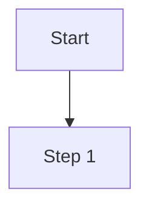
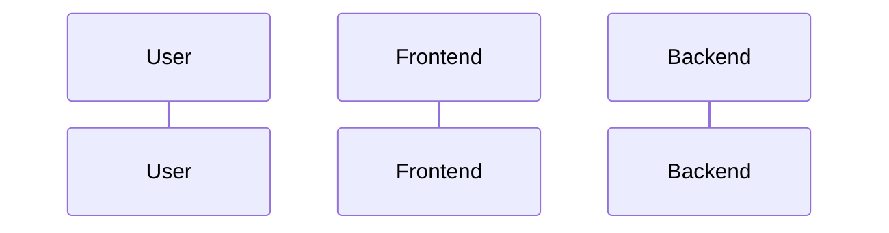

# Code to PRD Converter

This skill analyzes existing frontend and backend code to generate comprehensive PRD documents with SolarWire wireframes.

## Configuration

- **Output Directory**: `.solarwire` (modify here if needed)

---

## Overview

**Core Capability**: Read and understand the entire codebase, then reverse engineer into structured PRD documents.

### What This Skill Does

1. **Frontend Analysis**
   - Parse HTML/JSX/Vue components
   - Extract UI structure and layouts
   - Identify user interactions and flows

2. **Backend Analysis**
   - Parse API endpoints and routes
   - Extract data models and schemas
   - Identify business logic and rules

3. **PRD Generation**
   - Generate complete PRD documents
   - Create SolarWire wireframes
   - Document all features and interactions

## When to Invoke

- User wants to "reverse engineer" code to PRD
- User asks to "generate PRD from existing code"
- User provides a codebase and wants documentation
- User wants to understand an existing project's requirements

---

## Incremental Analysis Support

**⚠️ IMPORTANT: Frontend and backend code are often maintained by different teams. This skill supports incremental analysis:**

### Scenario 1: Frontend Only

When only frontend code is provided:
- Generate UI wireframes and page structures
- Document user interactions and flows
- Infer API requirements from frontend calls
- Mark backend sections as `[To be confirmed]`

### Scenario 2: Backend Only

When only backend code is provided:
- Document API endpoints and data models
- Extract business logic and validation rules
- Infer UI requirements from API responses
- Mark frontend sections as `[To be confirmed]`

### Scenario 3: Full Stack

When both frontend and backend code are provided:
- Generate complete PRD with all sections
- Cross-reference frontend calls with backend endpoints
- Validate consistency between UI and API

### Merging Incremental PRDs

When a new codebase is provided for an existing PRD:

```
1. Check if `.solarwire/[requirement-name]/solarwire-prd.md` exists
2. Ask user: "Found existing PRD. Do you want to:
   - Merge new analysis into existing PRD
   - Create a new PRD version
   - Overwrite existing PRD"
3. Merge strategy:
   - Frontend analysis → Update Page Details section
   - Backend analysis → Update API Reference and Data Models sections
   - Mark resolved `[To be confirmed]` sections
```

---

## Workflow

### Phase 1: Codebase Discovery

**Goal: Understand the project structure**

```
1. Ask user for codebase location or files
2. Scan project structure:
   - Frontend directory (src/, pages/, components/)
   - Backend directory (api/, routes/, models/)
   - Configuration files (package.json, tsconfig.json)
3. Identify tech stack:
   - Frontend: React/Vue/Angular/HTML
   - Backend: Node.js/Python/Java/Go
   - Database: MySQL/MongoDB/PostgreSQL
```

### Phase 2: Frontend Analysis

**Goal: Extract UI structure and interactions**

#### 2.1 Component Structure

Analyze frontend code to identify:

| Analysis Target | What to Extract |
|-----------------|-----------------|
| Pages/Routes | All page components and their routes |
| Components | Reusable UI components |
| Layouts | Page layout patterns |
| Navigation | Menu, tabs, breadcrumbs |

#### 2.2 UI Elements

For each page/component, identify:

| Element Type | What to Extract |
|--------------|-----------------|
| Forms | Input fields, validation rules, submit actions |
| Buttons | Click handlers, disabled conditions |
| Tables | Columns, data source, actions |
| Modals | Trigger conditions, content, actions |
| Lists | Data source, item structure, interactions |

#### 2.3 Interactions

Extract interaction patterns:

```
- Event handlers (onClick, onChange, onSubmit)
- State changes (useState, Vuex, Redux)
- Navigation flows (router.push, href)
- API calls (fetch, axios, graphql)
```

### Phase 3: Backend Analysis

**Goal: Extract API and business logic**

#### 3.1 API Endpoints

Analyze backend routes to identify:

| Analysis Target | What to Extract |
|-----------------|-----------------|
| Routes | All API endpoints (method, path) |
| Parameters | Request params, body, query |
| Responses | Response structure, status codes |
| Authentication | Auth requirements, permissions |

#### 3.2 Data Models

Analyze database schemas/models:

| Analysis Target | What to Extract |
|-----------------|-----------------|
| Entities | All data entities/tables |
| Fields | Field names, types, constraints |
| Relations | Entity relationships |
| Validation | Field validation rules |

#### 3.3 Business Logic

Extract business rules from code:

```
- Validation rules
- Calculation formulas
- State transitions
- Permission checks
- Error handling
```

### Phase 4: PRD Generation

**Goal: Generate complete PRD document**

Follow the exact PRD structure from `solarwire-prd` skill:

```markdown
# Product Requirements Document - [Project Name]

## Document Information
| Project Name | [Project Name] |
|-------------|----------------|
| Version | v1.0 |
| Created Date | [Date] |
| Author | Generated from codebase |

---

## 1. Product Overview

### 1.1 Product Background
[Inferred from codebase structure and comments]

### 1.2 Target Users
[Inferred from authentication and user-related code]

### 1.3 Core Value
[Inferred from main features]

### 1.4 User Stories

| ID | User Story | Acceptance Criteria | Priority |
|----|------------|---------------------|----------|
| US-001 | As a [role], I want to [action], so that [benefit] | - Given [context], when [action], then [result] | P0 |

---

## 2. Feature Scope

### 2.1 Feature List
| Module | Feature | Priority | Description |
|--------|---------|----------|-------------|
| [Module 1] | [Feature 1] | P0 | [Description] |

### 2.2 Feature Boundary
- Included: [List included features]
- Not Included: [List excluded features]

---

## 3. Business Flow

### 3.1 Core Business Flowchart


### 3.2 Interaction Sequence Diagram


---

## 4. Page Design

### 4.1 Page List
| Page Name | Page Type | Description |
|-----------|-----------|-------------|
| [Page 1] | Main Page | [Description] |

---

## 5. Page Details

[For each page, generate SolarWire wireframe with notes]

---

## 6. Non-functional Requirements

### 6.1 Performance Requirements
- Page load time: < 2 seconds
- API response time: < 500ms

### 6.2 Security Requirements
- [List security requirements]

### 6.3 Compatibility Requirements
- Browsers: Chrome 90+, Safari 14+
- Mobile: iOS 14+, Android 10+

---

## 7. Appendix

### 7.1 API Reference
[Generated from backend routes]

### 7.2 Data Models
[Generated from database schemas]
```

---

## Output File Structure

**All requirements are organized under the `.solarwire` directory, each in its own folder:**

```
.solarwire/                              # Root directory for all PRD outputs
├── [requirement-name-1]/                # Folder for requirement 1
│   ├── solarwire-prd.md                 # PRD document (fixed name)
│   ├── [page-name]-with-notes.svg       # Wireframe with notes
│   ├── [page-name]-without-notes.svg    # Wireframe without notes
│   └── ...                              # More SVGs for this requirement
│
├── [requirement-name-2]/                # Folder for requirement 2
│   ├── solarwire-prd.md
│   └── ...
│
└── ...                                  # More requirement folders
```

**Naming Convention:**
- Root directory: `.solarwire` (at project root)
- Requirement folder: Based on the requirement/project name
- PRD file: Always named `solarwire-prd.md`
- SVG files: Based on the `!title` attribute in each solarwire code block

---

## SVG Generation

This skill is **fully portable**. All dependencies are bundled in the `lib` directory.

After generating the PRD markdown file, run the SVG generation script:

```bash
node generate-svg.js .solarwire/[requirement-name]/solarwire-prd.md
```

**The script will:**
- Extract all `solarwire` code blocks from the markdown file
- Generate two SVG files for each block:
  - `[page-name]-with-notes.svg` - Includes note annotations
  - `[page-name]-without-notes.svg` - Clean wireframe only
- Save files to the same directory as the markdown file

**Updating Dependencies:**

If you need to update the bundled dependencies:

```bash
# Build the latest parser and renderer
cd SolarWire/packages/core/parser && npm run build
cd SolarWire/packages/core/renderer-svg && npm run build

# Copy to skill lib directory
cp -r SolarWire/packages/core/parser/dist/* solarwire-code-to-prd/lib/parser/
cp -r SolarWire/packages/core/renderer-svg/dist/* solarwire-code-to-prd/lib/renderer-svg/
```

---

## SolarWire Wireframe Specifications

### Core Principles (Must Strictly Follow)

#### 1. Syntax Rules

```
1. All elements must have coordinates @(x,y)
2. Write attributes directly without brackets: w=100 h=40 (not [w=100 h=40])
3. Text content MUST use double quotes: "Login" (not Login)
4. Attribute order: Content → Coordinates → Size → Other attributes → note
```

**Correct Example:**
```solarwire
["Login"] @(100,50) w=100 h=40 bg=#3B82F6 c=#FFFFFF note="Submit login form"
"Username" @(100,100)
(("Avatar")) @(100,150) w=40
```

**Incorrect Example:**
```solarwire
["Login"]                    // ❌ No coordinates
["Login"] [w=100 h=40]       // ❌ Attributes in brackets
["Login"] @(100,50) w=100    // ❌ Missing height
((Avatar)) @(100,50) w=40    // ❌ Text without double quotes
```

**⚠️ IMPORTANT: All text content MUST be wrapped in double quotes `""`**

| Element | Correct | Incorrect |
|---------|---------|-----------|
| Rectangle | `["Button"]` | `[Button]` |
| Circle | `(("Avatar"))` | `((Avatar))` |
| Rounded | `("Card")` | `(Card)` |
| Plain Text | `"Label"` | `Label` |

#### 2. Element Selection Principles

**Choose appropriate element types based on actual UI components:**

| Scenario | Recommended Element | Example |
|----------|---------------------|---------|
| Primary Buttons | Rectangle `[]` with background color | `["Login"] @(100,50) w=100 h=40 bg=#3B82F6 c=#FFFFFF` |
| Secondary Buttons | Rectangle `[]` with border | `["Cancel"] @(220,50) w=80 h=40 bg=#FFFFFF b=#E5E7EB` |
| Cards/Containers | Rounded Rectangle `()` | `("User Info Card") @(100,50) w=300 h=200` |
| Avatars | Circle with placeholder | `(("A")) @(100,50) w=40 bg=#E5E7EB c=#6B7280` |
| Icon Buttons | Circle with icon text | `(("?")) @(100,50) w=32 h=32 bg=#E5E7EB` |
| Labels/Text | Plain Text `""` | `"Username" @(100,50)` |
| Input Fields | Rectangle with placeholder | `["Enter username..."] @(100,50) w=280 h=40 bg=#FFFFFF b=#E5E7EB c=#9CA3AF` |
| Dividers | Line `--` | `-- @(0,100)->(400,100) b=#E5E7EB` |
| Data Tables | Table `##` | `## @(100,50) w=500 border=1` |

**Common Mistakes to Avoid:**
- ❌ `((Avatar))` - Text without double quotes
- ❌ `[Login]` - Text without double quotes
- ❌ Using placeholder `[?]` for buttons (use `["Button Text"]` instead)
- ❌ Using rectangle `[]` for plain labels (use `"Label"` instead)
- ❌ Overcrowding elements - use 10px spacing

#### 3. Page Organization Rules

**Each SolarWire code block handles only one independent view:**

| Situation | Handling Method | Example |
|-----------|-----------------|---------|
| Modals/Dialogs | Separate SolarWire fragment | `## Login Failed Modal` + independent code block |
| Different Page States | Separate fragment for each state | `## Login Page - Loading State`, `## Login Page - Error State` |
| Tab Switching | Separate fragment for each tab | `## Settings Page - Basic Info Tab`, `## Settings Page - Security Tab` |

**Do not mix multiple view states in one code block.**

#### 4. Container Rectangle Requirements

**Every page must have a container rectangle:**

```solarwire
!title="Page Name"
!c=#111827
!size=13
!bg=#F9FAFB
!r=0

// Container Rectangle - Represents screen/device boundary
[] @(0,0) w=375 h=812 bg=#FFFFFF

// Page content...
```

**Container Rectangle Specifications:**
- Place at the beginning of the code block
- Use `[]` rectangle (don't display text content)
- `bg=#FFFFFF` white background
- Dimensions by scenario:
  - Mobile: `w=375 h=812` (iPhone X) or `w=390 h=844` (iPhone 12+)
  - Web: `w=1440 h=900` or as needed
  - Admin Dashboard: `w=1920 h=1080`

**Container Size Principle: Container must contain all child elements**

**Forbidden: Child elements extending beyond parent container boundaries.**

---

## Element Mapping from Code

### Frontend Code to SolarWire Element

| Frontend Code | SolarWire Element |
|---------------|-------------------|
| `<button>Submit</button>` | `["Submit"] @(x,y) w=100 h=40` |
| `<input type="text" placeholder="Enter...">` | `["Enter..."] @(x,y) w=200 h=40 c=#9CA3AF` |
| `<input type="password">` | `["••••••"] @(x,y) w=200 h=40` |
| `<input type="checkbox">` | `[☑ "Label"] @(x,y)` |
| `<input type="radio">` | `[○ "Label"] @(x,y)` |
| `<select>` | `[▼ "Selected"] @(x,y) w=200 h=40` |
| `<textarea>` | `["Multi-line text..."] @(x,y) w=300 h=100` |
| `<h1>Title</h1>` | `"Title" @(x,y) size=24 bold` |
| `<p>Text</p>` | `"Text" @(x,y)` |
| `<a href="...">Link</a>` | `"Link" @(x,y) c=#3B82F6` |
| `` | `[?"Logo"] @(x,y) w=100 h=100` |
| `<table>` | `## @(x,y) w=500 border=1` |
| `<hr>` | `-- @(x1,y1)->(x2,y2) b=#E5E7EB` |
| `<div class="card">` | `("Card Title") @(x,y) w=300 h=200` |
| Timeline/Stepper | Convert to table or list |
| Progress bar | Show as text with percentage |

---

## Mock Data Generation

**⚠️ CRITICAL: Always generate realistic mock data, never leave fields empty**

### Why Mock Data Matters

Frontend code often:
- Uses components that display data
- Shows loading states while waiting for backend
- Displays lists/tables with dynamic data

**When reverse engineering, generate mock data that represents:**
- Typical data patterns
- Edge cases (long text, special characters)
- Empty states with meaningful placeholders

### Mock Data Rules

| Element Type | Mock Data Strategy |
|--------------|-------------------|
| **User names** | Use realistic names: "John Doe", "张三", "田中太郎" |
| **Emails** | Use realistic emails: "john@example.com" |
| **Dates** | Use realistic dates: "2024-01-15", "2024-01-15 14:30" |
| **Status** | Use meaningful values: "Active", "正常", "有効" |
| **Numbers** | Use realistic values: "¥1,234.00", "100 items" |
| **IDs** | Use realistic IDs: "USR-001", "202401150001" |
| **Descriptions** | Use meaningful text: "This is a sample description..." |
| **Empty states** | Use meaningful placeholders: "No data", "暂无数据" |

### Table Mock Data Example

**❌ Bad (Empty/Placeholder):**
```solarwire
## @(100,50) w=500 border=1
  # bg=#F9FAFB
    "ID"
    "Name"
    "Status"
  #
    ""
    ""
    ""
```

**✅ Good (Realistic Mock Data):**
```solarwire
## @(100,50) w=500 border=1 note="User list table
1. Data source
   - User list data from User Management module
2. Field descriptions
   - ID: Unique user identifier
   - Name: User display name
   - Status: 1=Active, 0=Disabled"
  # bg=#F9FAFB bold
    "ID"
    "Name"
    "Status"
  # bg=#F9FAFA
    "USR-001"
    "John Doe"
    "Active"
  #
    "USR-002"
    "张三"
    "Active"
  # bg=#EFF6FF
    "USR-003"
    "田中太郎"
    "Disabled"
```

---

## Complex UI Pattern Conversion

### Timeline/Stepper → Table or List

**Frontend Timeline/Stepper code:**
```jsx
<Steps current={1}>
  <Step title="Submitted" description="2024-01-15 10:00" />
  <Step title="Under Review" description="2024-01-15 14:30" />
  <Step title="Approved" description="Pending" />
</Steps>
```

**Convert to Table:**
```solarwire
## @(100,50) w=400 border=1 note="Approval timeline
1. Data source
   - Approval history from Workflow module
2. Field descriptions
   - Step: Approval stage name
   - Status: Current status
   - Time: Action timestamp"
  # bg=#F9FAFB bold
    "Step"
    "Status"
    "Time"
  # bg=#E6F7FF
    "Submitted"
    "✓ Completed"
    "2024-01-15 10:00"
  # bg=#E6F7FF
    "Under Review"
    "● In Progress"
    "2024-01-15 14:30"
  #
    "Approved"
    "○ Pending"
    "-"
```

**Or Convert to List:**
```solarwire
"Approval Timeline" @(100,50) bold

"1. Submitted" @(100,80)
"   ✓ Completed - 2024-01-15 10:00" @(100,100) c=#52C41A

"2. Under Review" @(100,130)
"   ● In Progress - 2024-01-15 14:30" @(100,150) c=#3B82F6

"3. Approved" @(100,180)
"   ○ Pending" @(100,200) c=#9CA3AF
```

### Progress Bar → Text with Percentage

**Frontend Progress Bar:**
```jsx
<Progress percent={60} />
```

**Convert to Text:**
```solarwire
"Upload Progress: 60%" @(100,50)
["████████████░░░░░░░░"] @(100,70) w=200 h=10 bg=#3B82F6
```

### Loading State → Placeholder with Note

**Frontend Loading:**
```jsx
{isLoading ? <Skeleton /> : <DataList data={data} />}
```

**Convert to Placeholder with Note:**
```solarwire
["Loading data..."] @(100,50) w=200 h=40 c=#9CA3AF note="Loading state
1. Display condition
   - Show while fetching data from backend
2. Behavior
   - Auto-hide when data loaded
   - Show actual data list on success"
```

---

## Complex Table Recognition

### UI Component Library Tables

| Library | Table Detection Pattern |
|---------|----------------------|
| Ant Design | `<Table columns={columns} dataSource={data} />` |
| Element UI | `<el-table :data="tableData">` |
| AG Grid | `<ag-grid :rowData="gridData">` |
| Material UI | `<Table>...</Table>` |

### Detection Rules

```javascript
// Detect table by tag
if (tagName === 'TABLE' || tagName === 'EL-TABLE' || tagName === 'AG-GRID') {
  return 'table';
}

// Detect by class names
if (className.includes('table') || className.includes('grid') || className.includes('list')) {
  return 'table';
}

// Detect by data-* attributes
if (attributes['data-source'] || attributes['data'] || attributes['row-data']) {
  return 'table';
}
```

---

## Frontend-Backend Data Mapping

When analyzing frontend code, infer backend data requirements:

| Frontend Pattern | Backend Requirement | Mock Data |
|------------------|---------------------|-----------|
| `{user.name}` | User API - name field | "John Doe" |
| `{items.map(...)}` | List API - array response | Generate 3-5 items |
| `{data.total}` | Pagination API - total count | "100" |
| `{item.status === 'active'}` | Status field with enum | "active", "inactive" |
| `{new Date(item.created)}` | Date field | "2024-01-15" |

---

## Note Writing Guidelines

**Core Principle: Notes describe functional behavior and business logic, not visual details or technical implementation**

---

##### 0. When to Read EXAMPLES.md

**📖 Read `EXAMPLES.md` when you encounter:**

| Scenario | What to Look Up |
|----------|-----------------|
| Writing complex button notes | "Button with Permission Control", "Batch Operations", "Form Submission" |
| Writing input field notes | "Input Field with Validation", "Search Bar with Filters", "Data Linkage" |
| Writing data table notes | "Data Table", "Table with Actions Column" |
| Writing statistics notes | "Statistics Card", "Calculated Field" |
| Writing navigation notes | "Pagination Component" |
| Handling special states | "Loading States", "Empty State Handling" |
| Unsure about note quality | "Common Mistakes" section |

**📖 EXAMPLES.md contains:**
- Complete note examples for each element type
- Good vs Bad comparisons
- All edge cases and error handling examples

**⚠️ Important:**
- SKILL.md contains the **rules** (what must be included)
- EXAMPLES.md contains the **examples** (how to write it)
- Always follow rules in SKILL.md, use EXAMPLES.md for reference

---

### 1. When to Write Notes

**Write notes for:**
- Interactive elements (buttons, links, etc.)
- Input elements with validation or logic
- Dropdowns (selection behavior, options source)
- Data display elements with complex rules (tables, lists)
- Elements with business logic (calculations, conditions)
- Complex concepts requiring additional explanation

**Skip notes for:**
- Pure visual elements (dividers, containers, decorative icons)
- Static labels and titles

**Common Sense Exemption (no note needed unless special behavior):**
- Back button (standard behavior: return to previous page)
- Close button
- Page selector
- Number stepper/incrementer

### 2. Note Structure Format

**Format Rules:**
```
First line: Element definition (what this element is, NOT element type)
First level: Numbered (1. 2. 3.)
Second level: - or # (if third level exists)
Third level: -- or -
```

**Example:**
```solarwire
["Enter password"] @(100,100) w=280 h=40 note="Password input
1. Input rules
   - Password displayed as dots
   - Minimum 6 characters, maximum 32 characters
   - Must contain both letters and numbers
2. Interaction
   - Show/hide toggle icon on the right
   - Validate format on blur
   - Display error on format failure: 'Invalid password format'
3. Special notes
   - Lock account for 15 minutes after 5 consecutive errors"
```

### 3. First Line: Element Definition

**The first line of a note MUST define what this element is (functional description, NOT element type).**

| Correct | Incorrect |
|---------|-----------|
| `Password input` | `[Password Field]` |
| `Username input` | `[Input Field]` |
| `User data table` | `[Data Table]` |
| `Submit form button` | `[Primary Button]` |

### 4. Content Requirements by Element Type

**Interactive/Operational Elements:**

Must include:
- What happens on click/operation
- Success/failure handling
- Disabled conditions
- Special handling (debounce, throttle, etc.)

**Example:**
```solarwire
["Login"] @(100,50) w=100 h=40 note="Login button
1. Click action
   - Validate username and password
   - Submit login request if validation passes
2. Success handling
   - Save login state
   - Redirect to homepage
3. Failure handling
   - Display error: 'Invalid username or password'
   - Clear password field
4. Disabled conditions
   - Disabled when username or password is empty"
```

**Elements with Logic:**

Must include:
- Show/hide conditions
- Calculation rules
- Validation rules
- State transitions

**Data Display Elements:**

Must include ALL of the following sections:

| Section | Required | Description |
|---------|----------|-------------|
| **1. Data source** | ✅ Required | Where data comes from, filtering conditions, sorting rules |
| **2. Display rules** | ✅ Required | Field meanings, formats, empty value handling |
| **3. Business rules** | Optional | Status mappings, conditional display, calculations |
| **4. Sorting/Filtering** | Optional | If applicable, describe sorting and filtering behavior |

> 📖 See EXAMPLES.md: "Data Table", "Table with Actions Column", "Statistics Card", "Status Badge"

**Example:**
```solarwire
## @(100,50) w=500 border=1 note="User list table
1. Data source
   - User list data from User Management module
   - Default sort: creation time descending
2. Field descriptions
   - ID: Unique user identifier
   - Username: Display nickname, show 'Not set' if empty
   - Status: 1='Active', 0='Disabled', disabled shown in red
   - Created: Format as YYYY-MM-DD HH:mm
3. Sorting rules
   - Support sorting by username and created time"
```

---

**Input Fields:**

Must include:
- Input rules (format, length, allowed characters)
- Validation (required, format check, error messages)
- Business rules (unique check, duplicate check)

> 📖 See EXAMPLES.md: "Input Field with Validation", "Search Bar with Filters", "Data Linkage"

---

**Dropdowns/Selects:**

Must include:
- Data source (options source, static or dynamic)
- Display rules (default, selected, options list)
- Business rules (required, default value, dependencies)

> 📖 See EXAMPLES.md: "Dropdown Options", "Data Linkage (Cascading Select)"

---

**Empty State Handling:**

| Data Type | Empty Display | Example |
|-----------|---------------|---------|
| Text | '-' or 'Not set' | "Contact: -" |
| Number | '0' or '--' | "Amount: ¥ --" |
| Date | '-' or 'Not specified' | "Last login: -" |
| Status | Default status | "Status: Pending" |
| List/Table | Empty state message | "No data available" |

> 📖 See EXAMPLES.md: "Empty State Handling", "Loading States"

---

**Tooltip/Toast:**

Describe directly in note, no separate wireframe needed.

> 📖 See EXAMPLES.md: "Tooltip/Toast Examples"

### 5.5 Common Mistakes in Note Writing

> 📖 For detailed examples, see EXAMPLES.md "Common Mistakes" section

| Mistake | Problem | Solution |
|---------|---------|----------|
| Missing Permission Control | No visibility/disabled rules | Add who can see/use the element |
| Incomplete Error Handling | Only generic "show error" | List all error types: validation, network, server, timeout, permission |
| Missing Data Source Details | Just "User data" | Add module, filters, sort, permission |
| Wrong First Line | "[Primary Button]" | Use functional description: "Login button" |
| Visual Details in Note | "Blue background, 14px font" | Remove, these are shown in wireframe |

---

### 5.6 Data Format Specifications

**When describing data display, always specify the format rules:**

**Date/Time Formats:**

| Type | Format | Example |
|------|--------|---------|
| Date only | YYYY-MM-DD | 2024-01-25 |
| Date with time | YYYY-MM-DD HH:mm | 2024-01-25 14:30 |
| Full datetime | YYYY-MM-DD HH:mm:ss | 2024-01-25 14:30:45 |
| Relative time | Within X days show relative | "3 days ago", "Just now" |
| Time only | HH:mm | 14:30 |

**Number Formats:**

| Type | Format | Example |
|------|--------|---------|
| Integer | With thousand separators | 1,234 |
| Decimal | 2 decimal places | 1,234.56 |
| Currency | With symbol and separators | ¥1,234.56 |
| Percentage | With % symbol | 68.5% |
| Large numbers | Abbreviated | 1.23万, 1.5M |

**Text Formats:**

| Type | Handling | Example |
|------|----------|---------|
| Long text | Truncate with ellipsis | "Long text content..." |
| Phone | Mask sensitive digits | 138****8000 |
| Email | Show full or truncate | zhang@example.com |
| ID | Partial mask | 110***********1234 |

**Status/Tag Display:**

Always describe status values with their visual representation:

```solarwire
"跟进中" @(100,50) note="Lead status
1. Display rules
   - Status values with visual style:
     - 待分配: Gray tag (#D1D5DB background)
     - 跟进中: Blue tag (#3B82F6 background)
     - 已转化: Green tag (#22C55E background)
     - 无效: Red tag (#EF4444 background)
   - All tags: White text, rounded corners, 4px padding"
```

---

### 5.7 Content Forbidden in Notes

**NEVER include:**

| Forbidden | Example (Don't Write) |
|-----------|----------------------|
| Colors | "Button is blue", "Text color #333" |
| Fonts | "Font size 14px", "Bold text" |
| Sizes | "Width 100px", "Height 40px" |
| Spacing | "Margin 16px", "Padding 8px" |
| Border | "Border radius 8px" |
| Shadows | "Box shadow 0 2px 4px" |
| Animations | "Fade in 0.3s" |
| Technical details | "API: /api/login", "Database: user_id" |

**Why?** These are:
- Already shown visually in wireframe
- Design decisions to be made later
- Subject to change during implementation

---

### 5.5 Common Mistakes in Note Writing

> 📖 For detailed examples, see EXAMPLES.md "Common Mistakes" section

| Mistake | Problem | Solution |
|---------|---------|----------|
| Missing Permission Control | No visibility/disabled rules | Add who can see/use the element |
| Incomplete Error Handling | Only generic "show error" | List all error types: validation, network, server, timeout, permission |
| Missing Data Source Details | Just "User data" | Add module, filters, sort, permission |
| Wrong First Line | "[Primary Button]" | Use functional description: "Login button" |
| Visual Details in Note | "Blue background, 14px font" | Remove, these are shown in wireframe |

---

### 5.6 Data Format Specifications

**When describing data display, always specify the format rules:**

**Date/Time Formats:**

| Type | Format | Example |
|------|--------|---------|
| Date only | YYYY-MM-DD | 2024-01-25 |
| Date with time | YYYY-MM-DD HH:mm | 2024-01-25 14:30 |
| Full datetime | YYYY-MM-DD HH:mm:ss | 2024-01-25 14:30:45 |
| Relative time | Within X days show relative | "3 days ago", "Just now" |
| Time only | HH:mm | 14:30 |

**Number Formats:**

| Type | Format | Example |
|------|--------|---------|
| Integer | With thousand separators | 1,234 |
| Decimal | 2 decimal places | 1,234.56 |
| Currency | With symbol and separators | ¥1,234.56 |
| Percentage | With % symbol | 68.5% |
| Large numbers | Abbreviated | 1.23万, 1.5M |

**Text Formats:**

| Type | Handling | Example |
|------|----------|---------|
| Long text | Truncate with ellipsis | "Long text content..." |
| Phone | Mask sensitive digits | 138****8000 |
| Email | Show full or truncate | zhang@example.com |
| ID | Partial mask | 110***********1234 |

**Status/Tag Display:**

Always describe status values with their visual representation:

```solarwire
"跟进中" @(100,50) note="Lead status
1. Display rules
   - Status values with visual style:
     - 待分配: Gray tag (#D1D5DB background)
     - 跟进中: Blue tag (#3B82F6 background)
     - 已转化: Green tag (#22C55E background)
     - 无效: Red tag (#EF4444 background)
   - All tags: White text, rounded corners, 4px padding"
```

### 6. Generate Notes from Code Analysis

| Code Pattern | Note Content |
|--------------|--------------|
| `onClick={handleSubmit}` | "Click action - Submit form data" |
| `required` attribute | "Validation - Required field" |
| `disabled={condition}` | "Disabled conditions - [condition]" |
| `onChange={handleChange}` | "Interaction - Update state on change" |
| `errorMessage` state | "Error handling - Display: [message]" |
| API call in handler | "API - Call [endpoint] on [action]" |

### 7. Examples: Good vs Bad Notes

**❌ Bad Note (Visual details + element type label):**
```solarwire
["Login"] @(100,50) w=100 h=40 note="[Primary Button]
- Blue background, white text
- Border radius 8px
- API: POST /api/auth/login"
```

**✅ Good Note (Functional behavior):**
```solarwire
["Login"] @(100,50) w=100 h=40 note="Login button
1. Click action
   - Validate username and password
2. Success handling
   - Save login state
   - Redirect to homepage
3. Failure handling
   - Display error: 'Invalid credentials'
4. Disabled conditions
   - Disabled when username or password is empty"
```

---

## Multi-language (i18n) Support

**⚠️ CRITICAL: Only add i18n when user explicitly confirms multi-language support is needed**

**If user does NOT need multi-language:**
- Do NOT add any i18n information to any element
- Write notes in the user's primary language only

**If user confirms multi-language support:**
- ALL meaningful text elements MUST include i18n translations
- Use full language names (e.g., "English", "中文", "日本語") instead of language codes
- Default language is based on user's primary language

### i18n Format for Single Text Element

```solarwire
["Login"] @(100,50) w=100 h=40 note="Login button
1. Click action
   - Validate username and password
2. i18n: English=Login, 中文=登录, 日本語=ログイン"
```

**Format:** `i18n: Language1=Text1, Language2=Text2, Language3=Text3`

### i18n Format for Table with Multiple Fields

```solarwire
## @(100,50) w=600 border=1 note="User list table
1. Data source
   - User list data from User Management module
2. Fields (i18n: English/中文/日本語)
   - ID: Unique user identifier [ID/ID/ID]
   - Name: User display name [Name/用户名/ユーザー名]
   - Status: 1=Active, 0=Disabled [Status/状态/ステータス]
     - Values: Active/正常/有効, Disabled/禁用/無効
   - Created: Account creation time [Created/创建时间/作成日時]
   - Actions: View and edit operations [Actions/操作/操作]
3. Buttons (i18n: English/中文/日本語)
   - View [View/查看/表示]
   - Edit [Edit/编辑/編集]
   - Delete [Delete/删除/削除]"
```

### i18n Format for Dropdown Options

```solarwire
["Select status"] @(100,50) w=200 h=36 note="Status dropdown
1. Options (i18n: English/中文/日本語)
   - All [All/全部/すべて]
   - Active [Active/正常/有効]
   - Disabled [Disabled/禁用/無効]
2. Default: All"
```

---

## Syntax Quick Reference

### Document-level Declarations

```solarwire
!title="Page Title"
!c=#111827        // gray-900: Default text color
!size=13          // Default font size
!bg=#F9FAFB       // gray-50: Page background color
!r=0              // Default border radius
```

### Basic Elements

| Symbol | Usage | Example |
|--------|-------|---------|
| `[]` | Button, input field, container | `["Confirm"] @(100,50) w=80 h=36` |
| `()` | Card, rounded container | `("Tip Card") @(100,50) w=200 h=100` |
| `(())` | Avatar, circular icon | `(("Avatar")) @(100,50) w=40` |
| `""` | Plain text, label | `"Username" @(100,50)` |
| `[?]` | Icon placeholder | `[?"Search"] @(100,50) w=32 h=32` |
| `<url>` | Real image | `<https://example.com/logo.png> @(100,50) w=40` |
| `--` | Divider line | `-- @(0,100)->(400,100)` |
| `##` | Table container | `## @(100,50) w=500 border=1` |
| `#` | Table row (MUST be inside `##`) | `  # bg=#F9FAFB` |

### Table Syntax (Indentation Required)

```solarwire
## @(x,y) w=width border=1 note="Data table
1. Data source
   - Data from relevant module
2. Field descriptions
   - Column 1: Description
   - Column 2: Description"
  # bg=#F2F2F2                  // Header row (indented 2 spaces)
    "Column 1"                  // Cell (indented 4 spaces)
    "Column 2"
    "Column 3"
  #                             // Data row (indented 2 spaces)
    "Data 1"                    // Cell (indented 4 spaces)
    "Data 2"
    "Data 3"
```

**⚠️ Indentation Rules:**
- Table `##` - No indentation
- Row `#` - 2 spaces indentation
- Cell content - 4 spaces indentation

**⚠️ CRITICAL: Table Row Must Be Inside Table**
- Row element `#` **CANNOT exist independently** - it MUST be inside a table container `##`
- A row without a parent table is **invalid syntax**

**⚠️ Table Child Element Restrictions:**
- Row `#` and cells **CANNOT have coordinates** `@(x,y)` - positions are determined by table structure
- Row `#` and cells **CANNOT have width/height** `w` `h` - sizes are determined by table container
- Row `#` and cells **CANNOT have border** `b` or `border` - border is set on table container `##`
- Only supported attributes for rows: `bg`, `c`, `size`, `bold`, `italic`, `align`
- Only supported attributes for cells: `bg`, `c`, `size`, `bold`, `italic`, `align`, `colspan`, `rowspan`

**⚠️ Table Cell Content Format:**
- **Use `[""]` (rectangle) for cell content** - text will be centered in the cell
- **Avoid `""` (plain text) for cells** - text will stick to the top-left corner
- Example: `["John Doe"]` ✅ (centered) vs `"John Doe"` ❌ (top-left aligned)

**⚠️ Table Note Rules:**
- **Table-level note**: Add `note` attribute to the table element `##` for overall table description
- **Row-level note**: `note` attribute is **NOT supported** on table rows `#`
- If you need to describe the table, put all information in the table-level note

### Common Attributes

| Attribute | Description | Example |
|-----------|-------------|---------|
| `w` `h` | Width, Height | `w=100 h=40` |
| `bg` | Background color | `bg=#3B82F6` |
| `c` | Text color | `c=#FFFFFF` or `c=#111827` |
| `b` | Border color | `b=#E5E7EB` |
| `r` | Border radius | `r=8` |
| `size` | Font size | `size=16` |
| `bold` | Bold text | `bold` |
| `opacity` | Element opacity (0-1) | `opacity=0.5` |
| `colspan` | Column span for table cells | `colspan=2` |
| `rowspan` | Row span for table cells | `rowspan=2` |
| `note` | Functional description | `note="Click to submit form"` |

---

## Color Standards (Tailwind CSS)

**All colors follow Tailwind CSS design system for modern, consistent UI.**

| Purpose | Tailwind | Hex | Usage |
|---------|----------|-----|-------|
| Primary text | gray-900 | `#111827` | Labels, headings, content |
| Secondary text | gray-500 | `#6B7280` | Descriptions, helper text |
| Tertiary text | gray-400 | `#9CA3AF` | Placeholder, timestamps |
| Page background | gray-50 | `#F9FAFB` | Page background |
| Card background | white | `#FFFFFF` | Cards, panels |
| Alternating row | gray-50 | `#F9FAFB` | Table alternating rows |
| Borders/Lines | gray-200 | `#E5E7EB` | Dividers, borders |
| Primary action | blue-500 | `#3B82F6` | Primary buttons, links |
| Primary light | blue-50 | `#EFF6FF` | Hover, selected background |
| Success | green-500 | `#22C55E` | Success states, positive |
| Success light | green-50 | `#F0FDF4` | Success background |
| Warning | amber-500 | `#F59E0B` | Warnings, attention |
| Warning light | amber-50 | `#FFFBEB` | Warning background |
| Error | red-500 | `#EF4444` | Errors, destructive |
| Error light | red-50 | `#FEF2F2` | Error background |
| Info | sky-500 | `#0EA5E9` | Information, tips |
| Info light | sky-50 | `#F0F9FF` | Info background |

---

## Spacing Standards

| Rule | Value |
|------|-------|
| Element spacing | 10px (unified) |
| Font size | 13px |
| Line height | 22px |

---

## Scenario Specifications

### Mobile App

**Characteristics:**
- Narrow canvas (375-430px)
- Vertical layout, bottom navigation
- Touch-friendly large buttons (min 44x44px)

**Container Size:** `w=375 h=812` (iPhone X) or `w=390 h=844` (iPhone 12+)

**Element Sizes:**
- Button height: 44-56px
- Input field height: 44-52px
- Text size: 13px (default), 18-22px (titles)
- Element spacing: 10px (unified), Page margins: 16-24px

### Web Client

**Characteristics:**
- Wide canvas (1200-1440px)
- Horizontal layout, top navigation
- Moderate button/input sizes

**Container Size:** `w=1440 h=900`

**Element Sizes:**
- Button height: 36-48px, width: min 80px
- Input field height: 36-44px, width: 200-400px
- Text size: 13px (default), 18-24px (titles)
- Element spacing: 10px (unified), Page margins: 24-48px

### Admin Dashboard

**Characteristics:**
- Very wide canvas (1440-1920px)
- Fixed left sidebar (200-280px)
- Data-intensive (tables, charts, cards)
- Many action buttons

**Container Size:** `w=1920 h=1080`

**Element Sizes:**
- Button height: 32-40px
- Input field height: 32-36px
- Table row height: 40-48px
- Sidebar width: 200-280px
- Text size: 13px (default), 16-20px (titles)
- Element spacing: 10px (unified), Page margins: 24-32px

---

## Modal Presentation Rules

**All modals MUST have a separate SolarWire wireframe, not just a simple description in a note.**

### Modal Types

| Type | Description |
|------|------|
| Confirmation modal | Delete confirmation, operation confirmation, etc. |
| Form modal | Create, edit, etc. |
| Information modal | Detail view, etc. |
| Alert modal | Success, failure, warning, etc. |

### Modal vs Tooltip/Toast

| Type | Handling | Description |
|------|----------|-------------|
| Modal | Separate SolarWire wireframe | Complete UI, interactions, action buttons |
| Tooltip | Describe directly in note | Simple text hint, no interaction |
| Toast | Describe directly in note | Simple message, auto-dismiss |

### Example: Modal Reference in Page Note

```solarwire
["Delete"] @(100,50) w=80 h=36 note="Delete button
1. Click action
   - Show delete confirmation modal (see 'Delete Confirmation Modal' wireframe)
   - Execute delete on confirmation
2. Success handling
   - Display Toast: 'Deleted successfully'
   - Refresh list data"
```

### Example: Separate Modal Wireframe

```solarwire
!title="Delete Confirmation Modal"
!c=#111827
!size=13
!bg=#F9FAFB

// Modal container
[] @(0,0) w=400 h=200 bg=#FFFFFF

// Modal title
"Confirm Delete" @(160,20) size=16 bold

// Modal content
"Are you sure you want to delete this item? This action cannot be undone." @(20,70) c=#111827

// Action buttons
["Cancel"] @(100,140) w=80 h=36 bg=#FFFFFF b=#E5E7EB
["Confirm"] @(220,140) w=80 h=36 bg=#EF4444 c=#FFFFFF
```

---

## Creating Clean, Realistic Wireframes

**Goal: Wireframes should look like actual UI, clean and professional**

### Key Principles

1. **Use Realistic Placeholder Content**
   - Use actual placeholder text, not generic labels
   - Example: `["Enter your email..."]` instead of `["Input"]`

2. **Proper Visual Hierarchy**
   - Primary buttons: Colored background (`bg=#3B82F6 c=#FFFFFF`)
   - Secondary buttons: Border only (`bg=#FFFFFF b=#E5E7EB`)

3. **Appropriate Element Types**
   - Buttons → Rectangle `[]` with text
   - Cards → Rounded rectangle `()`
   - Avatars → Circle with letter `(("A"))`
   - Labels → Plain text `""`

4. **Consistent Spacing**
   - Element spacing: 10px (unified)
   - Group related elements together

5. **Clean Layout**
   - Don't overcrowd elements
   - Use dividers `--` to separate sections
   - Container rectangle should contain all elements

---

## SVG Output Specifications

### Generation Requirements

Each page/tab/modal needs to generate two SVG files:

1. **With Notes Version** (`[page-name]-with-notes.svg`)
   - Contains note descriptions for all elements
   - For requirements review and development reference

2. **Without Notes Version** (`[page-name]-without-notes.svg`)
   - Displays only wireframe elements
   - For design reference and presentation

### SVG Rendering Specifications

- Use SolarWire renderer to convert solarwire code blocks in `.md` to SVG
- Ensure all elements use syntax supported by existing rules
- SVG dimensions match container rectangle dimensions
- Output path: Same directory as the `solarwire-prd.md` file

---

## Dependencies

This skill requires the `lib` directory with bundled dependencies for SVG generation. Copy from `solarwire-prd` skill:

```bash
# Copy lib directory
cp -r .trae/skills/solarwire-prd/lib packages/ai/skill/solarwire-code-to-prd/lib
```

---

## Example: Full Codebase Analysis

### Input: Project Structure

```
my-app/
├── frontend/
│   ├── src/
│   │   ├── pages/
│   │   │   ├── Login.tsx
│   │   │   ├── Dashboard.tsx
│   │   │   └── Users.tsx
│   │   ├── components/
│   │   │   ├── Header.tsx
│   │   │   └── Table.tsx
│   │   └── api/
│   │       └── auth.ts
├── backend/
│   ├── routes/
│   │   ├── auth.ts
│   │   └── users.ts
│   ├── models/
│   │   ├── User.ts
│   │   └── Session.ts
│   └── middleware/
│       └── auth.ts
└── package.json
```

### Analysis Steps

1. **Read Login.tsx** → Extract login form structure, validation, API calls
2. **Read Dashboard.tsx** → Extract dashboard layout, widgets, data sources
3. **Read Users.tsx** → Extract user list table, actions, filters
4. **Read auth.ts (frontend)** → Extract API client methods
5. **Read auth.ts (backend)** → Extract authentication endpoints
6. **Read users.ts** → Extract user management endpoints
7. **Read User.ts** → Extract user data model
8. **Read Session.ts** → Extract session data model

---

## Important Reminders

1. **Read All Code** - Analyze entire codebase, not just entry files
2. **Understand Context** - Infer business meaning from code patterns
3. **Follow SolarWire Syntax** - All elements must have coordinates, text in quotes
4. **Generate Complete PRD** - Include all sections from solarwire-prd skill
5. **Document APIs** - Extract all endpoints from backend routes
6. **Document Data Models** - Extract all schemas from database models
7. **Infer Business Logic** - Extract rules from validation and processing code
8. **Generate Wireframes** - Create SolarWire for every page/component
9. **Add Notes** - Document functionality from code analysis
10. **Output to .solarwire** - Save PRD to `.solarwire/[project-name]/solarwire-prd.md`
11. **Notes Describe Function and Business Logic** - Focus on behavior and logic, avoid visual details and technical implementation
12. **Not Every Element Needs a Note** - Skip notes for visual elements; common sense exemption for back button, close button, page selector
13. **First Line Defines Element** - Note first line must describe what the element is
14. **Note Structure Required** - First line: element definition; First level: numbered (1. 2. 3.); Second level: dash (-)
15. **Coordinates Must Be Complete** - Every element must have `@(x,y)`
16. **No Brackets for Attributes** - Write directly `w=100 h=40`
17. **Choose Elements Reasonably** - Buttons use rectangles, labels use text, only icons use placeholders
18. **Layout Close to Reality** - Wireframes should reflect actual page structure with 10px spacing
19. **Separate Modals/States/Tabs** - Each independent view in separate code block; all modals must have separate wireframe
20. **Table Row Must Be Inside Table** - Row element `#` CANNOT exist independently, MUST be inside table container `##`
21. **Table Child Element Restrictions** - Rows and cells CANNOT have coordinates, width, height, or border
22. **Container Rectangle Required** - First element of each page is white background container
23. **Generate Dual SVG Versions** - With notes and without notes versions
24. **Color Standards (Tailwind CSS)** - Use unified colors: #111827 (text), #6B7280 (secondary), #9CA3AF (tertiary), #E5E7EB (border), #FFFFFF (bg), #F9FAFB (alternating row), #3B82F6 (primary), #EF4444 (error), #22C55E (success)
25. **Font Standards** - Font size 13px, line height 22px
26. **i18n Only When Confirmed** - Add multi-language support ONLY when user explicitly confirms; if not confirmed, absolutely NO i18n information
