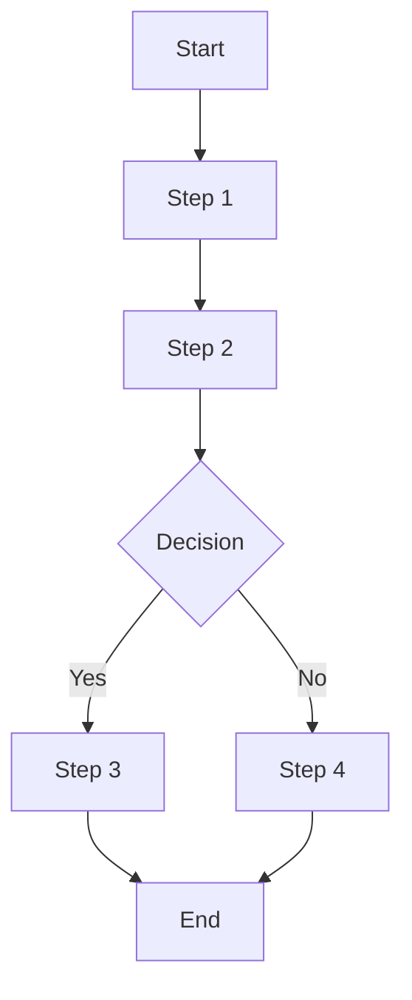
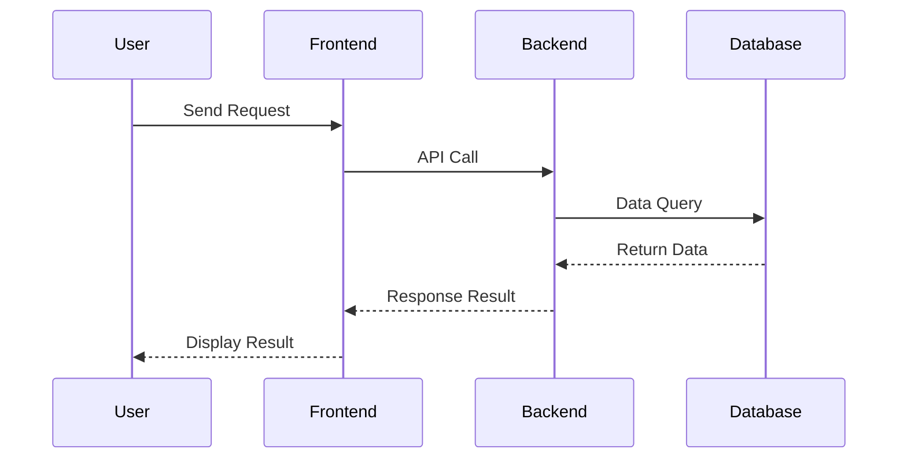

# SolarWire PRD 参考文档

## PRD 完整模板

```markdown
# Product Requirements Document - [Project Name]

## Document Information
| Project Name | [Project Name] |
|-------------|----------------|
| Version | v1.0 |
| Created Date | [Date] |
| Author | [Author] |

---

## 1. Product Overview

### 1.1 Product Background
[简要描述产品背景和目标]

### 1.2 Target Users
[描述目标用户群体]

### 1.3 Core Value
[产品为用户提供的核心价值]

### 1.4 User Stories

**格式：As a [user role], I want to [action], so that [benefit]**

| ID | User Story | Acceptance Criteria | Priority |
|----|------------|---------------------|----------|
| US-001 | As a [role], I want to [action], so that [benefit] | - Given [context], when [action], then [result] | P0 |
| US-002 | As a [role], I want to [action], so that [benefit] | - Given [context], when [action], then [result] | P0 |
| US-003 | As a [role], I want to [action], so that [benefit] | - Given [context], when [action], then [result] | P1 |

**User Story 编写指南：**
- **User Role**: 明确用户身份（如 "As a registered user", "As an admin"）
- **Action**: 用户想做什么（如 "I want to reset my password"）
- **Benefit**: 为什么想要这个（如 "so that I can regain access to my account"）
- **Acceptance Criteria**: 使用 Given-When-Then 格式定义可测试条件
- **Priority**: P0（必须有），P1（应该有），P2（最好有）

---

## 2. Feature Scope

### 2.1 Feature List
| Module | Feature | Priority | Description |
|--------|---------|----------|-------------|
| [Module 1] | [Feature 1] | P0 | [Description] |
| [Module 1] | [Feature 2] | P1 | [Description] |

### 2.2 Feature Boundary
- Included: [列出包含的功能]
- Not Included: [列出不包含的功能]

---

## 3. Business Flow

### 3.1 Core Business Flowchart


### 3.2 Interaction Sequence Diagram


---

## 4. Page Design

### 4.1 Page List
| Page Name | Page Type | Description |
|-----------|-----------|-------------|
| [Page 1] | Main Page | [Description] |
| [Page 2] | Modal | [Description] |

---

## 5. Page Details

> **核心原则：所有元素描述集成到 SolarWire 线框图的 note 中，实现 "所见即所读"**

### 5.1 [Page Name]

**Page Overview**: [一句话描述页面核心功能]

```solarwire
!size=14
!bg=#F9FAFB
!r=0

[] @(0,0) w=375 h=812 bg=#FFFFFF

["页面标题"] @(100, 20) w=200 h=40 size=18 bold

["内容区域"] @(20, 80) w=335 h=600 bg=#FFFFFF b=#E5E7EB r=8
```

---

## 6. Non-functional Requirements

### 6.1 Performance Requirements
- Page load time: < 2 seconds
- API response time: < 500ms

### 6.2 Security Requirements
- [列出安全要求]

### 6.3 Compatibility Requirements
- Browsers: Chrome 90+, Safari 14+
- Mobile: iOS 14+, Android 10+

---

## 7. Appendix

### 7.1 Glossary
| Term | Description |
|------|-------------|
| [Term 1] | [Description] |

### 7.2 References
- [Reference links]
```

---

## SolarWire 线框图规范

### 核心原则（必须严格遵守）

#### 1. 语法规则

```
1. 所有元素必须有坐标 @(x,y)
2. 属性直接写，不用括号：w=100 h=40（不是 [w=100 h=40]）
3. 文本内容必须用双引号："Login"（不是 Login）
4. 属性顺序：内容 → 坐标 → 尺寸 → 其他属性 → note
5. NOTE 属性必须使用三重引号 `"""`：note="""Note content"""（绝不用单引号或双引号）
```

**⚠️ 关键：始终使用三重引号 `"""` 包裹 note**
- 三重引号允许任何字符，包括换行和双引号
- 不需要转义任何内容
- 绝不能用单引号 `'` 或双引号 `"` 包裹 note

**正确示例：**
```solarwire
["Login"] @(100,50) w=100 h=40 bg=#3B82F6 c=#FFFFFF note="""Submit login form"""
"Username" @(100,100)
(("Avatar")) @(100,150) w=40  // 圆形 + 文本 - 必须用双引号
```

**错误示例：**
```
["Login"]                    // ❌ 无坐标
["Login"] [w=100 h=40]       // ❌ 属性在括号中
["Login"] @(100,50) w=100    // ❌ 缺少高度
((Avatar)) @(100,50) w=40    // ❌ 文本无双引号 - 错误！
(("Avatar")) @(100,50) w=40  // ✅ 正确 - 文本在双引号中
```

**⚠️ 重要：所有文本内容必须用双引号 `""` 包裹**

| 元素 | 正确 | 错误 |
|------|------|------|
| 矩形 | `["Button"]` | `[Button]` |
| 圆形 | `(("Avatar"))` | `((Avatar))` |
| 圆角 | `("Card")` | `(Card)` |
| 纯文本 | `"Label"` | `Label` |

#### 2. 元素选择原则

**根据实际 UI 组件选择合适的元素类型：**

| 场景 | 推荐元素 | 示例 |
|------|---------|------|
| 主按钮 | 矩形 `[]` + 背景色 | `["Login"] @(100,50) w=100 h=40 bg=#3B82F6 c=#FFFFFF` |
| 次要按钮 | 矩形 `[]` + 边框 | `["Cancel"] @(220,50) w=80 h=40 bg=#FFFFFF b=#E5E7EB` |
| 卡片/容器 | 圆角矩形 `()` | `("User Info Card") @(100,50) w=300 h=200` |
| 头像 | 圆形 + 占位符 | `(("A")) @(100,50) w=40 bg=#E5E7EB c=#6B7280` |
| 图标按钮 | 圆形 + 图标文本 | `(("?")) @(100,50) w=32 h=32 bg=#E5E7EB` |
| 标签/文本 | 纯文本 `""` | `"Username" @(100,50)` |
| 输入框 | 矩形 + 占位符 | `["Enter username..."] @(100,50) w=280 h=40 bg=#FFFFFF b=#E5E7EB c=#9CA3AF` |
| 分割线 | 线条 `--` | `-- @(0,100)->(400,100) b=#E5E7EB` |
| 数据表格 | 表格 `##` | `## @(100,50) w=500 border=1` |

#### 2.5 坐标系统

**锚点规则：**
所有元素使用 **左上角** 作为坐标锚点 `@(x,y)`。

**文本对齐计算：**

当文本与其他元素对齐时（如按钮内的标签），文本 Y 坐标不是目标元素的中心。

| 标准 | 值 |
|------|-----|
| 默认字体大小 | 13px |
| 默认行高 | 22px |
| 文本基线偏移 | 距顶部约 7px |

**对齐公式：**
```
Text Y = Target_Y + (Target_Height - Line_Height) / 2 + Baseline_Adjustment
```

**示例：**
```solarwire
// 按钮 + 居中文本
["Submit"] @(100,100) w=100 h=40 bg=#3B82F6 c=#FFFFFF

// 输入框上方的标签 - 与输入框对齐
"Username" @(100,175)  // 距输入框顶部 10px
["Enter username"] @(100,200) w=280 h=40 bg=#FFFFFF b=#E5E7EB
```

#### 3. 页面组织规则

**每个 SolarWire 代码块只处理一个独立视图：**

| 情况 | 处理方式 | 示例 |
|------|---------|------|
| 模态框/对话框 | 独立的 SolarWire 代码块 | `## Login Failed Modal` + 独立代码块 |
| 不同页面状态 | 每种状态独立代码块 | `## Login Page - Loading State`, `## Login Page - Error State` |
| 标签页切换 | 每个标签独立代码块 | `## Settings Page - Basic Info Tab`, `## Settings Page - Security Tab` |

**不要在一个代码块中混合多个视图状态。**

#### 4. 容器矩形要求

**每个页面必须有容器矩形：**

```solarwire
!size=14
!bg=#F9FAFB
!r=0

// 容器矩形 - 代表屏幕/设备边界，放在开头
[] @(0,0) w=375 h=812 bg=#FFFFFF

// 页面内容...
```

**容器矩形规格：**
- 放在代码块开头
- 使用 `[]` 矩形（不显示文本内容）
- `bg=#FFFFFF` 白色背景
- 按场景确定尺寸：
  - Mobile: `w=375 h=812` (iPhone X) 或 `w=390 h=844` (iPhone 12+)
  - Web: `w=1440 h=900` 或按需
  - Admin Dashboard: `w=1920 h=1080`

**容器尺寸原则：容器必须包含所有子元素**

**禁止：子元素超出父容器边界。**

#### 5. 笔记编写指南

**核心原则：笔记描述功能行为和业务逻辑，而非视觉细节或技术实现**

##### 0. 何时阅读 EXAMPLES.md

**📖 遇到以下情况时阅读 `EXAMPLES.md`：**

| 场景 | 查找内容 |
|------|---------|
| 编写复杂按钮笔记 | "Button with Permission Control", "Batch Operations", "Form Submission" |
| 编写输入框笔记 | "Input Field with Validation", "Search Bar with Filters", "Data Linkage" |
| 编写数据表格笔记 | "Data Table", "Table with Actions Column" |
| 编写统计笔记 | "Statistics Card", "Calculated Field" |
| 编写导航笔记 | "Pagination Component" |
| 处理特殊状态 | "Loading States", "Empty State Handling" |
| 不确定笔记质量 | "Common Mistakes" 部分 |

**📖 EXAMPLES.md 包含：**
- 每种元素类型的完整笔记示例
- 好笔记与坏笔记的对比
- 所有边界情况和错误处理示例

**⚠️ 重要：**
- SKILL.md 包含 **规则**（必须包含什么）
- EXAMPLES.md 包含 **示例**（怎么写）
- 始终遵循 SKILL.md 的规则，用 EXAMPLES.md 做参考

##### 1. 何时写笔记

**需要写笔记的元素：**
- 交互元素（按钮、链接等）
- 带验证或逻辑的输入元素
- 下拉选择（选择行为、选项来源）
- 带复杂规则的数据显示元素（表格、列表）
- 带业务逻辑的元素（计算、条件）
- 需要额外说明的复杂概念

**不需要写笔记的元素：**
- 纯视觉元素（分割线、容器、装饰性图标）
- 静态标签和标题

**常识豁免（除非有特殊行为，否则不需要笔记）：**
- 返回按钮（标准行为：返回上一页）
- 关闭按钮
- 页面选择器
- 数字步进器

**注意：** 如果豁免的元素有特殊验证或交互，则 **必须** 记录。

##### 2. 笔记结构格式

**格式规则：**
```
第一行：元素定义（这个元素是什么，不是元素类型）
第一级：数字编号（1. 2. 3.）
第二级：- 或 #（如果有第三级）
第三级：-- 或 -
```

**示例：**
```solarwire
["Enter password"] @(100,100) w=280 h=40 note="""Password input
1. Input rules
   - Password displayed as dots
   - Minimum 6 characters, maximum 32 characters
   - Must contain both letters and numbers
2. Interaction
   - Show/hide toggle icon on right
   - Validate format on blur
   - Display error on format failure: 'Invalid password format'
3. Special notes
   - Lock account for 15 minutes after 5 consecutive errors"""
```

##### 3. 第一行：元素定义

**笔记的第一行必须定义这个元素是什么（功能描述，不是元素类型）。**

| 正确 | 错误 |
|------|------|
| `Password input` | `[Password Field]` |
| `Username input` | `[Input Field]` |
| `User data table` | `[Data Table]` |
| `Submit form button` | `[Primary Button]` |

##### 4. 按元素类型的内容要求

**交互/操作元素：**

必须包含：
- 点击/操作后发生什么
- 成功/失败处理
- 禁用条件
- 特殊处理（防抖、节流等）

> 📖 见 EXAMPLES.md："Button with Permission Control", "Batch Operations", "Form Submission"

**带逻辑的元素：**

必须包含：
- 显示/隐藏条件
- 计算规则
- 验证规则
- 状态转换

**数据显示元素：**

必须包含以下所有章节：

| 部分 | 必需 | 描述 |
|------|------|------|
| **1. 数据来源** | ✅ 必需 | 数据来自哪里，过滤条件，排序规则 |
| **2. 显示规则** | ✅ 必需 | 字段含义、格式、空值处理 |
| **3. 业务规则** | 可选 | 状态映射、条件显示、计算 |
| **4. 排序/筛选** | 可选 | 如适用，描述排序和筛选行为 |

> 📖 见 EXAMPLES.md："Data Table", "Table with Actions Column", "Statistics Card", "Status Badge"

**输入字段：**

必须包含：
- 输入规则（格式、长度、允许字符）
- 验证（必填、格式检查、错误消息）
- 业务规则（唯一性检查、重复检查）

> 📖 见 EXAMPLES.md："Input Field with Validation", "Search Bar with Filters", "Data Linkage"

**下拉选择：**

必须包含：
- 数据来源（选项来源，静态还是动态）
- 显示规则（默认值、选中项、选项列表）
- 业务规则（必填、默认值、依赖关系）

> 📖 见 EXAMPLES.md："Dropdown Options", "Data Linkage (Cascading Select)"

**空状态处理：**

| 数据类型 | 空值显示 | 示例 |
|---------|---------|------|
| 文本 | '-' 或 '未设置' | "联系方式：-" |
| 数字 | '0' 或 '--' | "金额：¥ --" |
| 日期 | '-' 或 '未指定' | "最后登录：-" |
| 状态 | 默认状态 | "状态：待处理" |
| 列表/表格 | 空状态消息 | "暂无数据" |

> 📖 见 EXAMPLES.md："Empty State Handling", "Loading States"

##### 5. 笔记编写原则

| 原则 | 描述 |
|------|------|
| **必要性** | 仅为有意义的元素写笔记，避免过度文档化 |
| **完整性** | 完整描述元素，涵盖所有方面 |
| **单一职责** | 仅描述当前元素；受影响的元素在各自笔记中记录 |
| **组织性** | 使用标准格式，层次清晰 |
| **自解释** | 元素定义应清晰，无需二次解释 |
| **业务导向** | 描述业务逻辑，避免技术实现细节 |

##### 5.3 按元素类型的必需内容（快速参考）

> 📖 完整示例见 EXAMPLES.md

**按钮/操作：**
- ✅ 权限控制
- ✅ 点击动作
- ✅ 成功处理
- ✅ 失败处理（所有错误类型）
- 可选：禁用条件、Loading 状态

**输入字段：**
- ✅ 输入规则（格式、长度、允许字符）
- ✅ 验证（必填、格式检查、错误消息）
- 可选：显示规则、业务规则

**数据表格：**
- ✅ 数据来源（模块、过滤条件、默认排序）
- ✅ 显示规则（字段格式、空值处理、状态颜色）
- ✅ 操作列（可用操作、可见性、权限）
- 可选：排序/筛选、分页、行行为

**搜索/筛选：**
- ✅ 输入规则
- ✅ 搜索行为（防抖、触发、清除）
- ✅ 搜索范围（字段、匹配类型）
- ✅ 无结果处理

**下拉选择：**
- ✅ 数据来源（选项来源）
- ✅ 显示规则（默认值、选中项、选项列表）
- 可选：业务规则、Loading 行为

**表单：**
- ✅ 提交前验证
- ✅ 提交状态（loading、禁用、防双击）
- ✅ 成功处理
- ✅ 失败处理（所有错误类型）
- 可选：重试机制

##### 5.4 笔记编写常见错误

> 📖 详细示例见 EXAMPLES.md "Common Mistakes" 部分

| 错误 | 问题 | 解决方案 |
|------|------|---------|
| 缺少权限控制 | 无可见/禁用规则 | 添加谁可以看到/使用元素 |
| 错误处理不完整 | 仅通用 "显示错误" | 列出所有错误类型：验证、网络、服务器、超时、权限 |
| 缺少数据来源细节 | 仅 "用户数据" | 添加模块、过滤条件、排序、权限 |
| 第一行错误 | "[主按钮]" | 使用功能描述："登录按钮" |
| 笔记中的视觉细节 | "蓝色背景，14px 字体" | 删除，这些在线框图中已显示 |

##### 5.5 数据格式规范

**描述数据显示时，始终指定格式规则：**

**日期/时间格式：**

| 类型 | 格式 | 示例 |
|------|------|------|
| 仅日期 | YYYY-MM-DD | 2024-01-25 |
| 日期 + 时间 | YYYY-MM-DD HH:mm | 2024-01-25 14:30 |
| 完整日期时间 | YYYY-MM-DD HH:mm:ss | 2024-01-25 14:30:45 |
| 相对时间 | X 天内显示相对 | "3 天前", "刚刚" |
| 仅时间 | HH:mm | 14:30 |

**数字格式：**

| 类型 | 格式 | 示例 |
|------|------|------|
| 整数 | 千位分隔符 | 1,234 |
| 小数 | 2 位小数 | 1,234.56 |
| 货币 | 带符号和分隔符 | ¥1,234.56 |
| 百分比 | 带 % 符号 | 68.5% |
| 大数字 | 缩写 | 1.23万, 1.5M |

**文本格式：**

| 类型 | 处理 | 示例 |
|------|------|------|
| 长文本 | 截断 + 省略号 | "长文本内容..." |
| 电话 | 掩码敏感数字 | 138****8000 |
| 邮箱 | 显示完整或截断 | zhang@example.com |
| 身份证 | 部分掩码 | 110***********1234 |

**状态/标签显示：**

始终描述状态值及其视觉表现：

```solarwire
"跟进中" @(100,50) note="""Lead status
1. Display rules
   - Status values with visual style:
     - 待分配: Gray tag (#D1D5DB background)
     - 跟进中: Blue tag (#3B82F6 background)
     - 已转化: Green tag (#22C55E background)
     - 无效: Red tag (#EF4444 background)
   - All tags: White text, rounded corners, 4px padding"""
```

##### 6. 笔记中禁止的内容

**绝不包含：**

| 禁止 | 示例（不要这样写） |
|------|------------------|
| 颜色 | "按钮是蓝色的", "文本颜色 #333" |
| 字体 | "字体大小 14px", "粗体文本" |
| 尺寸 | "宽度 100px", "高度 40px" |
| 间距 | "边距 16px", "内边距 8px" |
| 边框 | "圆角 8px" |
| 阴影 | "阴影 0.2px 4px" |
| 动画 | "淡入 0.3s" |
| 技术细节 | "API: /api/login", "数据库：user_id" |

**为什么？** 这些是：
- 已经在线框图中视觉显示
- 稍后要做的设计决策
- 实现期间可能变更

##### 7. 多语言（i18n）支持

**⚠️ 关键：仅在用户明确确认需要多语言支持时添加 i18n**

**如果用户不需要多语言：**
- 不要向任何元素添加 i18n 信息
- 仅用用户的主要语言写笔记

**如果用户确认需要多语言支持：**
- 所有有意义的文本元素必须包含 i18n 翻译
- 使用完整语言名称（如 "English", "中文", "日本語"）而非语言代码
- 默认语言基于用户的主要语言

**i18n 格式（单文本元素）：**
```solarwire
["Login"] @(100,50) w=100 h=40 note="""Login button
1. Click action
   - Validate username and password
2. i18n: English=Login, 中文=登录, 日本語=ログイン"""
```

**格式：** `i18n: 语言1=文本1, 语言2=文本2, 语言3=文本3`

**⚠️ 重要：双引号内不要用双引号**
- 在 i18n 内使用单引号 `'` 包裹文本值
- 正确：`i18n: English=Login, 中文='登录', 日本語='ログイン'`
- 错误：`i18n: English=Login, 中文="登录", 日本語="ログイン"`

---

## SVG 输出规范

### 生成要求

每个页面/标签页/模态框需要生成两个 SVG 文件：

1. **带笔记版本**（`[page-name]-with-notes.svg`）
   - 包含所有元素的笔记描述
   - 用于需求评审和开发参考

2. **不带笔记版本**（`[page-name]-without-notes.svg`）
   - 仅显示线框元素
   - 用于设计参考和展示

### SVG 渲染规范

- 使用 SolarWire 渲染器将 `.md` 中的 solarwire 代码块转换为 SVG
- 确保所有元素使用现有规则支持的语法
- SVG 尺寸匹配容器矩形尺寸
- 输出路径：与 `solarwire-prd.md` 文件同目录（需求文件夹）

---

## 语法快速参考

### 文档级声明

```solarwire
!size=14          // 默认字体大小
!bg=#F9FAFB       // 页面背景色
!r=0              // 默认圆角
!bold             // 全局默认粗体
!line-height=24   // 全局默认行高
!gap=10           // 全局默认间距
```

### 基本元素

| 符号 | 用途 | 示例 |
|------|------|------|
| `[]` | 按钮、输入框、容器 | `["Confirm"] @(100,50) w=80 h=36` |
| `()` | 卡片、圆角容器 | `("Tip Card") @(100,50) w=200 h=100` |
| `(())` | 头像、圆形图标 | `(("Avatar")) @(100,50) w=40` |
| `""` | 纯文本、标签 | `"Username" @(100,50)` |
| `[?]` | 图标占位符 | `[?"Search"] @(100,50) w=32 h=32` |
| `<url>` | 真实图片 | `<https://example.com/logo.png> @(100,50) w=40` |
| `--` | 分割线 | `-- @(0,100)->(400,100)` |
| `##` | 表格容器 | `## @(100,50) w=500 border=1` |
| `#` | 表格行（必须在 `##` 内） | ` # bg=#F9FAFB` |

### 表格语法（需要缩进）

**表格使用严格的缩进：**

```solarwire
## @(x,y) w=width border=1 note="""Data table
1. Data source
   - Data from relevant module
2. Field descriptions
   - Column 1: Description
   - Column 2: Description
   - Column 3: Description"""
  # bg=#F9FAFB                  // 表头行（缩进 2 空格）
    ["Column 1"]                // 单元格（缩进 4 空格）
    ["Column 2"]
    ["Column 3"]
  #                             // 数据行（缩进 2 空格）
    ["Data 1"]                  // 单元格（缩进 4 空格）
    ["Data 2"]
    ["Data 3"]
  # bg=#F9FAFB                  // 交替行颜色
    ["Data 4"]
    ["Data 5"]
    ["Data 6"]
```

**⚠️ 缩进规则：**
- 表格 `##` - 无缩进
- 行 `#` - 2 空格缩进
- 单元格内容 - 4 空格缩进

**⚠️ 关键：表格行必须在表格容器内**
- 行元素 `#` **不能独立存在** - 必须在表格容器 `##` 内
- 无父表格的行是 **无效语法**
- 表格结构：`##`（容器）→ `#`（行）→ 单元格（内容）

**⚠️ 表格子元素限制：**
- 行 `#` 和单元格 **不能有坐标** `@(x,y)` - 位置由表格结构决定
- 行 `#` 和单元格 **不能有宽高** `w` `h` - 尺寸由表格容器决定
- 行 `#` 和单元格 **不能有边框** `b` 或 `border` - 边框在表格容器 `##` 上设置
- 行仅支持的属性：`bg`、`c`、`size`、`bold`、`italic`、`align`
- 单元格仅支持的属性：`bg`、`c`、`size`、`bold`、`italic`、`align`、`colspan`、`rowspan`

**⚠️ 表格单元格内容格式：**
- **使用 `[""]`（矩形）作为单元格内容** - 文本会在单元格中居中
- **避免 `""`（纯文本）用于单元格** - 文本会贴在左上角
- 示例：`["John Doe"]` ✅（居中）与 `"John Doe"` ❌（左上角对齐）

**⚠️ 表格笔记规则：**
- **表格级笔记**：在表格元素 `##` 上添加 `note` 属性用于整体表格描述
- **行级笔记**：`note` 属性 **不支持** 在表格行 `#` 上
- 如需描述表格，将所有信息放在表格级笔记中

### 属性参考

| 属性 | 说明 | 示例 | 渲染器属性名 |
|------|------|------|-------------|
| `w=` / `h=` | 宽高 | `w=200 h=100` | w / h |
| `bg=` | 背景色 | `bg=#F5F5F5` 或 `bg=transparent` | bg |
| `b=` | 边框色 | `b=#CCCCCC` | b |
| `s=` | 边框宽度 | `s=2` | s |
| `c=` | 文字颜色 | `c=#333333` | c |
| `r=` | 圆角半径 | `r=8` | r |
| `size=` | 字体大小 | `size=14` | size / text-size |
| `bold` | 粗体 | 布尔属性，写 `bold` 即可 | bold |
| `italic` | 斜体 | 布尔属性，写 `italic` 即可 | italic |
| `align=` | 文字对齐 | `align=l` (左) `align=c` (中) `align=r` (右) | align |
| `opacity=` | 透明度 | `opacity=0.8` (0-1) | opacity |
| `line-height=` | 行高 | `line-height=22` | line-height |
| `note=` | 备注提示 | `note=悬停显示此文本` | note (SVG title) |
| `colspan=` | 表格列合并 | `colspan=2` | colspan (仅表格) |
| `rowspan=` | 表格行合并 | `rowspan=2` | rowspan (仅表格) |

### 颜色标准（Tailwind CSS）

**所有颜色遵循 Tailwind CSS 设计系统，确保现代、一致的 UI。**

| 用途 | Tailwind | Hex | 用法 |
|------|---------|-----|------|
| 主文本 | gray-900 | `#111827` | 标签、标题、内容 |
| 次要文本 | gray-500 | `#6B7280` | 描述、辅助文本 |
| 三级文本 | gray-400 | `#9CA3AF` | 占位符、时间戳 |
| 页面背景 | gray-50 | `#F9FAFB` | 页面背景 |
| 卡片背景 | white | `#FFFFFF` | 卡片、面板 |
| 交替行 | gray-50 | `#F9FAFB` | 表格交替行 |
| 边框/线条 | gray-200 | `#E5E7EB` | 分割线、边框 |
| 主要操作 | blue-500 | `#3B82F6` | 主按钮、链接 |
| 主要浅色 | blue-50 | `#EFF6FF` | 悬停、选中背景 |
| 成功 | green-500 | `#22C55E` | 成功状态、正面 |
| 成功浅色 | green-50 | `#F0FDF4` | 成功背景 |
| 警告 | amber-500 | `#F59E0B` | 警告、注意 |
| 警告浅色 | amber-50 | `#FFFBEB` | 警告背景 |
| 错误 | red-500 | `#EF4444` | 错误、破坏性 |
| 错误浅色 | red-50 | `#FEF2F2` | 错误背景 |
| 信息 | sky-500 | `#0EA5E9` | 信息、提示 |
| 信息浅色 | sky-50 | `#F0F9FF` | 信息背景 |

### 间距标准

| 规则 | 值 |
|------|-----|
| 元素间距 | 10px（统一） |
| 字体大小 | 13px |
| 行高 | 22px |

### 模态框展示规则

**所有模态框必须有独立的 SolarWire 线框，不能仅在笔记中简单描述。**

**模态框类型：**
- 确认模态框：删除确认、操作确认等
- 表单模态框：创建、编辑等
- 信息模态框：详情查看等
- 警报模态框：成功、失败、警告等

**模态框 vs 提示/Toast：**

| 类型 | 处理 | 描述 |
|------|------|------|
| 模态框 | 独立 SolarWire 线框 | 完整 UI、交互、操作按钮 |
| 提示 | 直接在笔记中描述 | 简单文本提示，无交互 |
| Toast | 直接在笔记中描述 | 简单消息，自动消失 |

> 📖 见 EXAMPLES.md："Modal Examples" 获取完整模态框线框示例

---

## 场景规格

### Mobile App

**特点：**
- 窄画布（375-430px）
- 垂直布局，底部导航
- 触控友好大按钮（最小 44x44px）

**容器尺寸：** `w=375 h=812` (iPhone X) 或 `w=390 h=844` (iPhone 12+)

**元素尺寸：**
- 按钮高度：44-56px
- 输入框高度：44-52px
- 文字大小：13px（默认），18-22px（标题）
- 元素间距：10px（统一），页面边距：16-24px

**常见模式：**
- 登录：Logo + 标题 + 表单 + 按钮（全宽）
- 列表：搜索栏 + 列表项 + 下拉刷新
- 详情：返回按钮 + 标题 + 内容区 + 底部操作

**Mobile 特有字段：**
| 字段 | 类型 | 说明 |
|------|------|------|
| deviceToken | string | 设备推送令牌 |
| deviceId | string | 设备唯一标识 |
| osType | string | iOS/Android |
| appVersion | string | App 版本 |

**Mobile 特有规则：**
- 支持一键登录、第三方登录（微信、Apple ID）
- Token 有效期：7 天
- 可关闭推送通知

---

### Web Client

**特点：**
- 宽画布（1200-1440px）
- 水平布局，顶部导航
- 适中的按钮/输入尺寸

**容器尺寸：** `w=1440 h=900`

**元素尺寸：**
- 按钮高度：36-48px，宽度：最小 80px
- 输入框高度：36-44px，宽度：200-400px
- 文字大小：13px（默认），18-24px（标题）
- 元素间距：10px（统一），页面边距：24-48px

**常见模式：**
- 登录：居中布局，Logo + 表单 + 按钮
- 列表：搜索/筛选栏 + 数据表格 + 分页
- 详情：面包屑 + 标题 + 内容卡片 + 操作

**Web 特有字段：**
| 字段 | 类型 | 说明 |
|------|------|------|
| sessionId | string | Session ID |
| userAgent | string | 浏览器信息 |
| referrer | string | 来源页面 |

**Web 特有规则：**
- 支持密码、二维码、第三方登录
- Session 有效期：30 分钟无操作自动过期
- 浏览器：Chrome 90+, Safari 14+, Firefox 88+, Edge 90+

---

### Admin Dashboard

**特点：**
- 超宽画布（1440-1920px）
- 固定左侧边栏（200-280px）
- 数据密集型（表格、图表、卡片）
- 大量操作按钮

**容器尺寸：** `w=1920 h=1080`

**元素尺寸：**
- 按钮高度：32-40px
- 输入框高度：32-36px
- 表格行高度：40-48px
- 侧边栏宽度：200-280px
- 文字大小：13px（默认），16-20px（标题）
- 元素间距：10px（统一），页面边距：24-32px

**常见模式：**
- 列表：搜索/筛选 + 批量操作 + 表格 + 分页
- 统计：多个统计卡片 + 图表 + 时间选择器
- 表单：面包屑 + 多列表单 + 保存/取消

**Admin 特有字段：**
| 字段 | 类型 | 说明 |
|------|------|------|
| operatorId | string | 操作者 ID |
| operateTime | datetime | 操作时间 |
| operateType | string | 新增/编辑/删除/导出 |
| ipAddress | string | 操作 IP |

**Admin 特有规则：**
- 超级管理员：完全权限
- 管理员：查看/编辑，无删除
- 操作员：仅查看/导出
- 分页：20 条/页，最大导出 10000 条
- 敏感操作需确认
- 登录超时：30 分钟无操作
