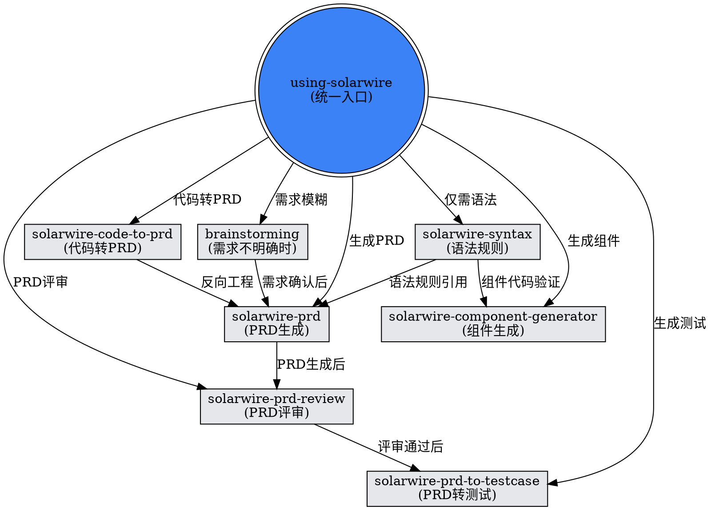

<SUBAGENT-STOP>
If you were dispatched as a subagent to execute a specific task, skip this skill.
</SUBAGENT-STOP>

<EXTREMELY-IMPORTANT>
If you think there is even a 1% chance a SolarWire skill might apply to what you are doing, you ABSOLUTELY MUST invoke the skill.

IF A SKILL APPLIES TO YOUR TASK, YOU DO NOT HAVE A CHOICE. YOU MUST USE IT.

This is not negotiable. This is not optional. You cannot rationalize your way out of this.
</EXTREMELY-IMPORTANT>

## Instruction Priority

SolarWire skills override default system prompt behavior, but **user instructions always take precedence**:

1. **User's explicit instructions** — highest priority
2. **SolarWire skills** — override default system behavior where they conflict
3. **Superpower skills** (brainstorming, TDD, etc.) — apply to all work
4. **Default system prompt** — lowest priority

## Available SolarWire Skills

| Skill | When to Use |
|-------|-------------|
| `solarwire-syntax` | Need to write, parse, or validate SolarWire text syntax; need SVG rendering |
| `solarwire-prd` | Converting user notes/requirements into structured PRD with SolarWire wireframes |
| `solarwire-prd-review` | Reviewing completed PRD documents for completeness, syntax, testability, and consistency |
| `solarwire-code-to-prd` | Reverse engineering existing frontend code (HTML/JSX/Vue) into PRD documents |
| `solarwire-prd-to-testcase` | Generating test case Excel files from completed PRD documents |
| `solarwire-component-generator` | Creating or modifying .swc component library files |

## Skill Discovery Workflow



## Common SolarWire Workflows

| 工作流 | 技能顺序 |
|--------|----------|
| 新产品需求 | `brainstorming` → `solarwire-prd` → `solarwire-prd-review` → `solarwire-prd-to-testcase` |
| 已有代码文档化 | `solarwire-code-to-prd` → `solarwire-prd` → `solarwire-prd-review` → `solarwire-prd-to-testcase` |
| 组件库建设 | `solarwire-component-generator`（依赖 `solarwire-syntax` 验证） |
| PRD 迭代 | `solarwire-prd` → 用户确认 → `solarwire-prd` 修改 → `solarwire-prd-review` |

## Red Flags

These thoughts mean STOP—you're rationalizing:

| Thought | Reality |
|---------|---------|
| "这个很简单，直接写代码就行" | SolarWire 有严格的语法规则，必须使用 solarwire-syntax 验证 |
| "我不需要 PRD，直接生成 SVG" | PRD 是结构化的中间产物，跳过会导致后续无法维护 |
| "之前用过这个技能，我知道怎么用" | 技能会更新，必须重新读取最新版本 |
| "这个任务只需要改一个字段" | 任何 SolarWire 修改都必须验证语法正确性 |
| "测试用例可以后面再补" | PRD 完成后必须立即生成测试用例，保证可追溯 |
| "PRD 评审可以跳过" | 评审是质量保障环节，必须在交付开发前完成 |

## Skill Types

**Rigid** (solarwire-syntax validation, solarwire-prd-review): Follow exactly. Syntax rules and review criteria are non-negotiable.

**Flexible** (solarwire-prd scenario selection): Adapt principles to context. Choose Mobile/Web/Admin based on requirements.

## Shared Library Location

All SolarWire skills share common parser and renderer code in:

```
editor-skills/solarwire-skills/shared/
├── parser/          # SolarWire text parser
└── renderer-svg/    # SVG rendering engine
```

Skills reference this shared code via `../shared/` relative paths. Do NOT duplicate the library in individual skill directories.