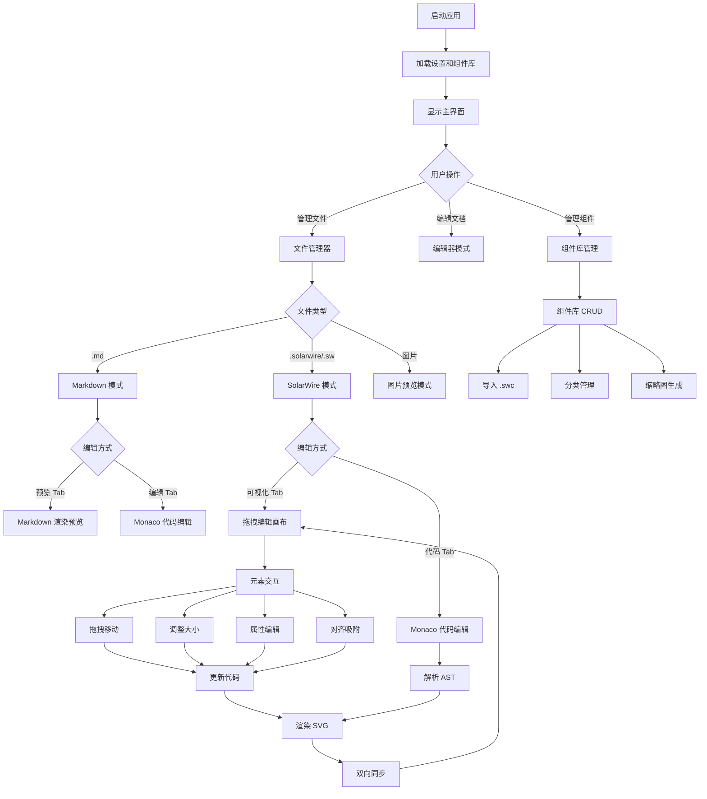
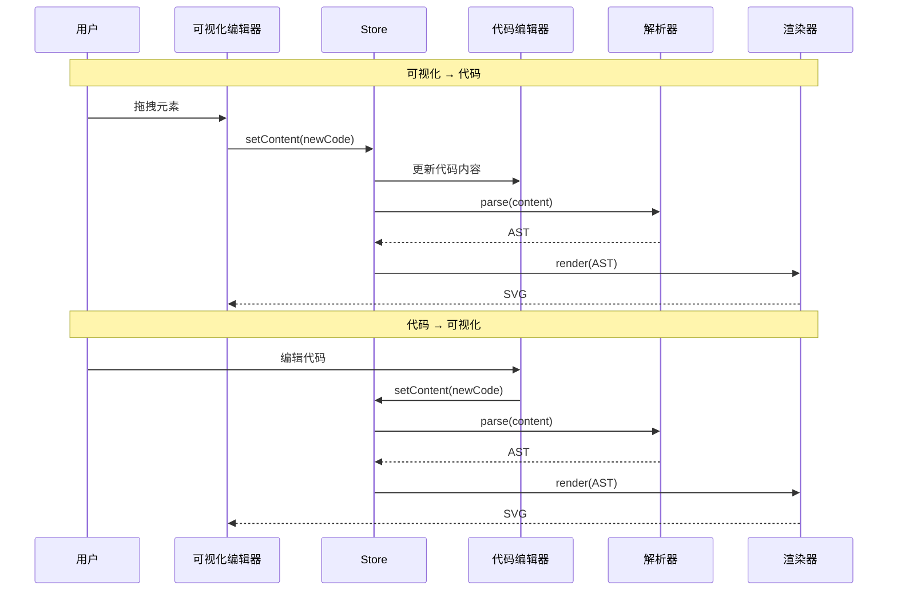
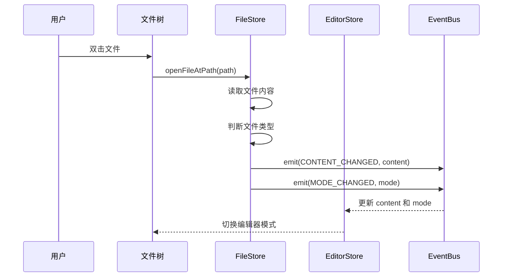

# SolarWire 编辑器 - 产品需求文档

## 文档信息

| 项目名称 | SolarWire 编辑器 |
|---------|------------------|
| 版本 | v1.0 |
| 创建日期 | 2026-05-07 |
| 类型 | 逆向工程 - 从代码生成 |

---

## 1. 产品概述

### 1.1 产品背景

SolarWire 编辑器是一款基于 Electron + React + TypeScript 的桌面应用，为产品经理、设计师和开发者提供 SolarWire 领域特定语言的完整编辑环境。支持代码编辑与可视化拖拽双模式、实时 SVG 预览、组件库管理、Markdown 编辑等功能。

### 1.2 目标用户

- **产品经理**：通过可视化拖拽快速创建 PRD 线框图
- **开发者**：直接编写 SolarWire 代码，利用语法高亮和自动补全
- **设计师**：管理组件库，复用设计片段

### 1.3 核心价值

- **双模式编辑**：可视化拖拽 ↔ 代码编辑双向同步
- **实时 SVG 预览**：代码变更即时渲染
- **组件库系统**：导入、管理、复用组件片段（.swc 格式）
- **7 种主题**：深色、浅色、毛玻璃、赛博朋克、纸质、极简
- **智能吸附**：对齐辅助线 + 间距标注

### 1.4 用户故事

| ID | 用户故事 | 验收标准 | 优先级 |
|----|---------|----------|--------|
| US-001 | 作为产品经理，我希望通过拖拽创建 SolarWire 文档 | - 拖拽元素到画布时元素被添加并生成代码<br>- 拖拽移动元素时位置实时更新 | P0 |
| US-002 | 作为开发者，我希望直接编辑代码并实时预览 | - 代码变更后预览实时更新<br>- 语法错误显示行号和错误信息 | P0 |
| US-003 | 作为用户，我希望通过文件树管理项目文件 | - 展开/折叠目录<br>- 双击打开文件<br>- 自动识别文件类型 | P0 |
| US-004 | 作为设计师，我希望管理和复用组件 | - 拖拽组件到画布插入代码<br>- 组件缩略图异步生成 | P0 |
| US-005 | 作为用户，我希望精确编辑元素属性 | - 位置/尺寸/样式/文本/阴影/备注全部可编辑<br>- 颜色选择器支持收藏色 | P1 |
| US-006 | 作为用户，我希望通过图层面板管理元素层级 | - 拖拽重排序<br>- 悬停显示备注<br>- Ctrl/Shift 多选 | P1 |
| US-007 | 作为用户，我希望在 Markdown 中嵌入 SolarWire 代码块 | - 打开 .md 文件时自动识别 solarwire 代码块<br>- 代码块可独立编辑 | P1 |
| US-008 | 作为用户，我希望自定义界面主题 | - 7 种主题可切换<br>- 主题持久化到 localStorage | P2 |

---

## 2. 功能范围

### 2.1 功能列表

| 模块 | 功能 | 优先级 | 描述 |
|------|------|--------|------|
| **应用布局** | 左右分栏布局 | P0 | 左侧面板（150-600px 可调）+ 右侧编辑区 |
| **应用布局** | 可调整分割线 | P0 | 拖拽分割线调整左右面板宽度 |
| **应用布局** | 7 种主题 | P2 | solid-dark/light, glass-dark/light, cyberpunk, paper, minimal |
| **左侧面板** | 文件管理器视图 | P0 | 文件树、目录展开折叠、双击打开 |
| **左侧面板** | SolarWire 视图 | P1 | 显示 .solarwire 文件和 Markdown 中的代码块片段 |
| **左侧面板** | 组件库管理视图 | P1 | 管理组件库（CRUD、分类、导入/导出） |
| **文件管理** | 文件树 | P0 | 显示目录结构，展开/折叠 |
| **文件管理** | 打开文件 | P0 | 双击打开 .md/.solarwire/.sw 文件 |
| **文件管理** | 打开图片 | P0 | 双击打开图片文件（png/jpg/gif/svg 等） |
| **文件管理** | 保存文件 | P0 | Ctrl+S 保存，支持代码块片段保存 |
| **文件管理** | 自动刷新 | P2 | 30 秒自动刷新文件树 |
| **文件管理** | Markdown 代码块片段 | P1 | 从 .md 文件中提取 ```solarwire 代码块 |
| **编辑器模式** | 空白模式 | P0 | 未打开文件时显示空白页 |
| **编辑器模式** | SolarWire 模式 | P0 | 可视化编辑 + 代码编辑双 Tab |
| **编辑器模式** | Markdown 模式 | P0 | 预览 + 编辑器双 Tab |
| **编辑器模式** | 图片预览模式 | P0 | 显示图片预览 |
| **编辑器模式** | 组件库管理模式 | P1 | 管理组件库的 CRUD 界面 |
| **SolarWire 可视化编辑** | SVG 预览渲染 | P0 | 实时将 SolarWire AST 渲染为 SVG |
| **SolarWire 可视化编辑** | 元素选择 | P0 | 单选、Ctrl 多选、Shift 范围选 |
| **SolarWire 可视化编辑** | 框选工具 | P0 | 包含框选、交叉框选 |
| **SolarWire 可视化编辑** | 元素拖拽移动 | P0 | 拖拽移动元素位置 |
| **SolarWire 可视化编辑** | 元素调整大小 | P0 | 8 方向调整手柄 |
| **SolarWire 可视化编辑** | 画布缩放 | P0 | 滚轮缩放（0.25x - 2x） |
| **SolarWire 可视化编辑** | 画布平移 | P0 | 空格+拖拽 或 平移模式 |
| **SolarWire 可视化编辑** | 标尺 | P1 | 水平/垂直标尺显示坐标 |
| **SolarWire 可视化编辑** | 智能吸附 | P0 | 对齐辅助线 + 间距标注 |
| **SolarWire 可视化编辑** | 备注显示 | P1 | 显示/隐藏元素备注 |
| **SolarWire 可视化编辑** | 图片拖入 | P0 | 拖拽图片文件到画布 |
| **SolarWire 可视化编辑** | 图片缓存 | P1 | 本地图片异步加载为 Base64 |
| **SolarWire 代码编辑** | Monaco 编辑器 | P0 | SolarWire 语法高亮 |
| **SolarWire 代码编辑** | 选中元素高亮 | P0 | 选中元素对应代码行高亮 |
| **SolarWire 代码编辑** | 错误行标记 | P0 | 语法错误行标红 |
| **SolarWire 代码编辑** | 跳转到错误 | P0 | 点击错误跳转到代码行 |
| **SolarWire 代码编辑** | 撤销/重做 | P0 | 最多 50 步历史 |
| **元素库** | 7 种基础元素 | P0 | 矩形/圆形/文本/线条/图片/占位符/表格 |
| **元素库** | 分类筛选 | P1 | 基础/高级/数据 |
| **元素库** | 搜索 | P1 | 按名称搜索 |
| **元素库** | 拖拽插入 | P0 | 拖拽元素到画布 |
| **属性面板** | 位置编辑 | P0 | X/Y 坐标，支持拖拽调整 |
| **属性面板** | 尺寸编辑 | P0 | 宽度/高度/圆角 |
| **属性面板** | 内边距编辑 | P1 | 上/右/下/左内边距 |
| **属性面板** | 填充色 | P0 | 颜色选择器 |
| **属性面板** | 边框 | P0 | 边框颜色/宽度 |
| **属性面板** | 透明度 | P1 | 0-1 滑块 |
| **属性面板** | 阴影 | P1 | 颜色/X偏移/Y偏移/模糊/扩展 |
| **属性面板** | 文本内容 | P0 | 单行/多行文本输入 |
| **属性面板** | 文本颜色 | P0 | 颜色选择器 |
| **属性面板** | 字体大小 | P0 | 数字输入 + 拖拽调整 |
| **属性面板** | 文本对齐 | P0 | 左/中/右对齐 |
| **属性面板** | 垂直对齐 | P1 | 上/中/下对齐 |
| **属性面板** | 粗体/斜体 | P1 | 切换按钮 |
| **属性面板** | 下划线/删除线 | P1 | 切换按钮 |
| **属性面板** | 行高/字间距 | P2 | 数字输入 |
| **属性面板** | 线条端点 | P0 | X2/Y2 坐标 |
| **属性面板** | 线条样式 | P1 | 实线/虚线/点线 |
| **属性面板** | 线条标签 | P2 | 线条上的标签文本 |
| **属性面板** | 图片 URL | P0 | 文本输入 + 文件浏览按钮 |
| **属性面板** | 备注 | P1 | 多行文本，可调整高度 |
| **图层面板** | 元素列表 | P1 | 显示类型图标+名称+行号+备注徽章 |
| **图层面板** | 拖拽排序 | P1 | 拖拽调整元素顺序 |
| **图层面板** | 备注悬停预览 | P1 | 悬停显示备注内容 |
| **图层面板** | 多选 | P1 | Ctrl/Shift 多选 |
| **组件库面板** | 组件库选择 | P0 | 下拉选择组件库 |
| **组件库面板** | 分类筛选 | P0 | 按分类过滤组件 |
| **组件库面板** | 搜索 | P0 | 按名称/描述搜索（150ms 防抖） |
| **组件库面板** | 缩略图 | P0 | 异步生成 SVG 缩略图 |
| **组件库面板** | 拖拽插入 | P0 | 拖拽组件到画布 |
| **组件库面板** | 错误组件 | P1 | 解析错误显示修复按钮 |
| **组件库面板** | 导入 .swc | P1 | 导入组件库文件 |
| **工具栏** | 图层面板开关 | P0 | 切换图层面板 |
| **工具栏** | 组件库开关 | P0 | 切换组件库面板 |
| **工具栏** | 备注开关 | P0 | 显示/隐藏备注 |
| **工具栏** | 吸附开关 | P0 | 启用/禁用智能吸附 |
| **工具栏** | 缩放控制 | P0 | 放大/缩小/百分比显示 |
| **工具栏** | 平移模式 | P0 | 切换画布平移模式 |
| **工具栏** | 选择工具 | P0 | 点选/包含框选/交叉框选 |
| **工具栏** | 置顶 | P1 | 将元素置于顶层 |
| **工具栏** | 对齐 | P1 | 左/中/右/上/中/下 6 种对齐 |
| **工具栏** | 元素库（紧凑） | P0 | 工具栏内嵌元素库 |
| **工具栏** | 导出 SVG | P1 | 导出当前页面为 SVG |
| **右键菜单** | 复制 | P0 | 复制选中元素 |
| **右键菜单** | 粘贴 | P0 | 粘贴元素到指定位置 |
| **右键菜单** | 删除 | P0 | 删除选中元素 |
| **错误面板** | 语法错误列表 | P0 | 可展开/折叠的错误列表 |
| **错误面板** | 错误/警告计数 | P0 | 显示错误和警告数量 |
| **错误面板** | 跳转到错误行 | P0 | 点击错误项跳转 |
| **错误卡片** | 行内错误提示 | P0 | 画布上方显示最多 3 个错误 |
| **反馈系统** | Toast 通知 | P1 | 操作结果通知 |
| **反馈系统** | 操作进度 | P1 | 长操作进度提示 |
| **反馈系统** | 确认对话框 | P1 | 危险操作确认 |
| **设置** | 主题色 | P1 | 自定义主色调 |
| **设置** | 收藏色 | P1 | 颜色选择器收藏色列表 |
| **多语言** | 中英文 | P2 | i18n 支持 |

### 2.2 功能边界

**包含**：
- SolarWire 代码编辑和可视化拖拽编辑
- 实时 SVG 预览渲染
- 属性编辑（位置、尺寸、样式、文本、阴影、备注、内边距）
- 7 种基础元素（矩形/圆形/文本/线条/图片/占位符/表格）
- 组件库管理（导入 .swc、分类、缩略图）
- 图层面板管理（排序、备注预览）
- 元素对齐和智能吸附
- Markdown 编辑和预览（含 SolarWire 代码块）
- 文件树管理
- 7 种主题
- 多语言界面
- 错误提示和跳转
- 反馈系统（Toast/进度/确认）

**不包含**：
- 云存储集成
- 协作编辑
- 插件系统
- 移动端支持
- Git 版本管理
- SVG 批量导出

---

## 3. 业务流程

### 3.1 核心业务流程图



### 3.2 SolarWire 双向同步流程



### 3.3 文件打开流程



---

## 4. 页面设计

### 4.1 页面列表

| 页面名称 | 页面类型 | 描述 |
|---------|---------|------|
| 主布局 | 主页面 | 左右分栏，左侧面板 + 右侧编辑区 |
| 左侧面板 | 面板 | 3 个 Tab：文件管理器/SolarWire/组件库管理 |
| 文件管理器 | 视图 | 文件树 + 操作按钮 |
| SolarWire 视图 | 视图 | .solarwire 文件和代码块片段列表 |
| 组件库管理视图 | 视图 | 组件库 CRUD 界面 |
| SolarWire 编辑模式 | 编辑模式 | 可视化 + 代码双 Tab |
| 可视化编辑器 | 编辑区域 | 工具栏 + 画布 + 属性面板 + 图层面板 + 组件库 |
| 代码编辑器 | 编辑区域 | Monaco 编辑器 + 错误面板 |
| Markdown 编辑模式 | 编辑模式 | 预览 + 编辑器双 Tab |
| 图片预览模式 | 编辑模式 | 图片显示 |
| 属性面板 | 侧边面板 | 选中元素的属性编辑 |
| 图层面板 | 侧边面板 | 元素层级列表 |
| 组件库面板 | 侧边面板 | 组件浏览和拖拽 |
| 工具栏 | 工具区域 | 视图控制 + 工具选择 + 操作按钮 |

---

## 5. 页面详情

### 5.1 主布局

**页面概述**：应用主界面，左右分栏布局，左侧面板宽度 150-600px 可调

```solarwire
!title="主布局"
!c=#1F2937
!size=12
!bg=#111827
!r=0

[] @(0,0) w=1440 h=900 bg=#111827

[] @(0,0) w=300 h=900 bg=#1F2937 b=#374151

[] @(0,0) w=300 h=48 bg=#111827

["📁"] @(12,12) w=24 h=24 bg=transparent c=#9CA3AF note="文件管理器 Tab
1. 点击操作
   - 切换到文件管理器视图"

["🎨"] @(48,12) w=24 h=24 bg=transparent c=#9CA3AF note="SolarWire Tab
1. 点击操作
   - 切换到 SolarWire 视图"

["🧩"] @(84,12) w=24 h=24 bg=transparent c=#9CA3AF note="组件库管理 Tab
1. 点击操作
   - 切换到组件库管理视图"

[] @(0,48) w=300 h=852 bg=#1F2937 note="视图内容区域
1. 显示规则
   - 根据当前 Tab 显示对应视图"

[] @(300,0) w=6 h=900 bg=#374151 note="可调整分割线
1. 拖拽操作
   - 调整左右面板宽度
2. 范围
   - 最小: 150px
   - 最大: 600px"

[] @(306,0) w=1134 h=900 bg=#1F2937 note="右侧编辑区域
1. 显示规则
   - 根据文件类型显示对应编辑模式
   - blank / solarwire / markdown / image / componentLibraryManager"
```

### 5.2 SolarWire 编辑模式

**页面概述**：可视化编辑 + 代码编辑双 Tab，可视化 Tab 为默认

```solarwire
!title="SolarWire 编辑模式"
!c=#1F2937
!size=12
!bg=#1F2937
!r=0

[] @(0,0) w=1134 h=900 bg=#1F2937

[] @(0,0) w=1134 h=40 bg=#111827

["🎨 可视化编辑"] @(12,10) w=120 h=20 bg=transparent c=#FCA506 bold note="可视化编辑 Tab (默认选中)
1. i18n: 可视化编辑 / Visual Editor
2. 点击操作
   - 切换到可视化编辑视图"

["💻 代码编辑"] @(144,10) w=100 h=20 bg=transparent c=#6B7280 note="代码编辑 Tab
1. i18n: 代码编辑 / Code Editor
2. 点击操作
   - 切换到代码编辑视图
   - 自动滚动到选中元素行"

[] @(0,40) w=1134 h=860 bg=#1F2937 note="编辑内容区域
1. 显示规则
   - 可视化 Tab: 显示 SolarWireVisualEditor
   - 代码 Tab: 显示 MonacoEditor + ErrorPanel"
```

### 5.3 可视化编辑器

**页面概述**：工具栏 + 画布 + 属性面板 + 图层面板 + 组件库面板

```solarwire
!title="可视化编辑器"
!c=#1F2937
!size=12
!bg=#1F2937
!r=0

[] @(0,0) w=1134 h=860 bg=#1F2937

[] @(0,0) w=1134 h=44 bg=#111827 b=#374151 note="工具栏"

["☰"] @(12,10) w=24 h=24 bg=transparent c=#9CA3AF note="图层面板开关
1. 点击操作
   - 显示/隐藏图层面板"

["📦"] @(44,10) w=24 h=24 bg=transparent c=#9CA3AF note="组件库开关
1. 点击操作
   - 显示/隐藏组件库面板"

["👁"] @(76,10) w=24 h=24 bg=transparent c=#9CA3AF note="备注开关
1. 点击操作
   - 显示/隐藏备注
2. 状态
   - 开: 👁
   - 关: 🙈"

["🧲"] @(108,10) w=24 h=24 bg=transparent c=#9CA3AF note="吸附开关
1. 点击操作
   - 启用/禁用智能吸附"

["-"] @(148,10) w=24 h=24 bg=transparent c=#9CA3AF note="缩小
1. 点击操作
   - scale = max(0.25, scale - 0.1)"

["100%"] @(176,10) w=48 h=24 bg=transparent c=#9CA3AF note="缩放比例
1. 显示规则
   - 当前缩放百分比"

["+"] @(228,10) w=24 h=24 bg=transparent c=#9CA3AF note="放大
1. 点击操作
   - scale = min(2.0, scale + 0.1)"

["👆"] @(264,10) w=24 h=24 bg=transparent c=#9CA3AF note="平移模式
1. 点击操作
   - 切换画布平移模式
2. 快捷操作
   - 按住空格临时启用"

["🖱"] @(300,10) w=24 h=24 bg=transparent c=#FCA506 note="点选工具 (选中)
1. 点击操作
   - 切换到点选模式"

["⬚"] @(332,10) w=24 h=24 bg=transparent c=#9CA3AF note="包含框选
1. 点击操作
   - 完全包含在框内的元素才被选中"

["⬛"] @(364,10) w=24 h=24 bg=transparent c=#9CA3AF note="交叉框选
1. 点击操作
   - 与框相交的元素都被选中"

["⬆"] @(400,10) w=24 h=24 bg=transparent c=#9CA3AF note="置顶
1. 点击操作
   - 将选中元素置于顶层
2. 禁用条件
   - 无选中元素"

["⬅"] @(436,10) w=24 h=24 bg=transparent c=#9CA3AF note="左对齐
1. 禁用条件
   - 选中元素 < 2"

["↔"] @(468,10) w=24 h=24 bg=transparent c=#9CA3AF note="水平居中
1. 禁用条件
   - 选中元素 < 2"

["➡"] @(500,10) w=24 h=24 bg=transparent c=#9CA3AF note="右对齐
1. 禁用条件
   - 选中元素 < 2"

["⬜"] @(544,10) w=24 h=24 bg=transparent c=#9CA3AF note="矩形元素
1. 拖拽操作
   - 拖拽到画布创建矩形"

["⭕"] @(576,10) w=24 h=24 bg=transparent c=#9CA3AF note="圆形元素
1. 拖拽操作
   - 拖拽到画布创建圆形"

["📝"] @(608,10) w=24 h=24 bg=transparent c=#9CA3AF note="文本元素
1. 拖拽操作
   - 拖拽到画布创建文本"

["📏"] @(640,10) w=24 h=24 bg=transparent c=#9CA3AF note="线条元素
1. 拖拽操作
   - 拖拽到画布创建线条"

["🖼"] @(672,10) w=24 h=24 bg=transparent c=#9CA3AF note="图片元素
1. 拖拽操作
   - 拖拽到画布创建图片"

["📦"] @(704,10) w=24 h=24 bg=transparent c=#9CA3AF note="占位符元素
1. 拖拽操作
   - 拖拽到画布创建占位符"

["📊"] @(736,10) w=24 h=24 bg=transparent c=#9CA3AF note="表格元素
1. 拖拽操作
   - 拖拽到画布创建表格"

["📥"] @(1098,10) w=24 h=24 bg=transparent c=#9CA3AF note="导出 SVG
1. 点击操作
   - 导出当前页面为 SVG 文件"

[] @(0,44) w=734 h=816 bg=#374151 note="画布区域
1. 显示规则
   - SVG 预览渲染
   - 标尺（水平+垂直）
   - 选中元素边框
   - 对齐辅助线
   - 拖拽预览
   - 框选矩形
2. 交互
   - 单击: 选中元素
   - Ctrl+单击: 多选
   - Shift+单击: 范围选
   - 拖拽: 移动元素
   - 滚轮: 缩放
   - 空格+拖拽: 平移
   - 右键: 上下文菜单"

[] @(734,44) w=400 h=816 bg=#1F2937 b=#374151 note="属性面板区域
1. 显示规则
   - 选中元素时显示属性编辑
   - 无选中时显示空状态"
```

### 5.4 属性面板

**页面概述**：编辑选中元素的所有属性，分组展示

```solarwire
!title="属性面板"
!c=#1F2937
!size=12
!bg=#1F2937
!r=0

[] @(0,0) w=400 h=816 bg=#1F2937

["属性"] @(16,12) w=80 h=24 bg=transparent c=#E5E7EB bold note="面板标题
1. i18n: 属性 / Properties"

["rectangle"] @(96,12) w=80 h=24 bg=transparent c=#9CA3AF note="元素类型
1. 显示规则
   - 当前选中元素的类型"

[] @(0,44) w=400 h=1 bg=#374151

["位置"] @(16,56) w=40 h=20 bg=transparent c=#6B7280 note="位置分组
1. i18n: 位置 / Position"

["X"] @(16,80) w=20 h=16 bg=transparent c=#9CA3AF

["100"] @(40,76) w=164 h=32 bg=#111827 b=#374151 c=#E5E7EB note="X 坐标
1. 输入规则
   - 数字输入
   - 支持拖拽调整（左右拖拽）"

["Y"] @(216,80) w=20 h=16 bg=transparent c=#9CA3AF

["200"] @(240,76) w=144 h=32 bg=#111827 b=#374151 c=#E5E7EB note="Y 坐标
1. 输入规则
   - 数字输入
   - 支持拖拽调整"

[] @(0,120) w=400 h=1 bg=#374151

["尺寸"] @(16,132) w=40 h=20 bg=transparent c=#6B7280 note="尺寸分组
1. i18n: 尺寸 / Size"

["W"] @(16,156) w=20 h=16 bg=transparent c=#9CA3AF

["200"] @(40,152) w=164 h=32 bg=#111827 b=#374151 c=#E5E7EB note="宽度
1. 输入规则
   - 数字输入
   - 最小值: 1"

["H"] @(216,156) w=20 h=16 bg=transparent c=#9CA3AF

["100"] @(240,152) w=144 h=32 bg=#111827 b=#374151 c=#E5E7EB note="高度
1. 输入规则
   - 数字输入
   - 最小值: 1"

["R"] @(16,192) w=20 h=16 bg=transparent c=#9CA3AF note="圆角标签
1. i18n: R (Radius)"

["8"] @(40,188) w=164 h=32 bg=#111827 b=#374151 c=#E5E7EB note="圆角
1. 输入规则
   - 数字输入
   - 最小值: 0
2. 显示规则
   - 仅矩形/圆角矩形元素显示"

["P-T"] @(16,228) w=30 h=16 bg=transparent c=#9CA3AF note="上内边距
1. 显示规则
   - 仅文本类元素显示"

["P-R"] @(16,264) w=30 h=16 bg=transparent c=#9CA3AF note="右内边距"

["P-B"] @(16,300) w=30 h=16 bg=transparent c=#9CA3AF note="下内边距"

["P-L"] @(16,336) w=30 h=16 bg=transparent c=#9CA3AF note="左内边距"

[] @(0,376) w=400 h=1 bg=#374151

["外观"] @(16,388) w=40 h=20 bg=transparent c=#6B7280 note="外观分组
1. i18n: 外观 / Appearance"

["填充"] @(16,412) w=40 h=16 bg=transparent c=#9CA3AF note="填充色
1. i18n: 填充 / Fill"

["#3B82F6"] @(64,408) w=120 h=32 bg=#3B82F6 b=#374151 note="填充色输入
1. 输入规则
   - 颜色选择器
   - 支持收藏色"

["边框"] @(200,412) w=40 h=16 bg=transparent c=#9CA3AF note="边框色
1. i18n: 边框 / Border"

["#E5E7EB"] @(248,408) w=120 h=32 bg=#E5E7EB b=#374151 note="边框色输入"

["宽度"] @(16,448) w=40 h=16 bg=transparent c=#9CA3AF note="边框宽度
1. i18n: 宽度 / Width"

["1"] @(64,444) w=120 h=32 bg=#111827 b=#374151 c=#E5E7EB note="边框宽度
1. 输入规则
   - 数字输入
   - 最小值: 0"

["透明度"] @(16,484) w=60 h=16 bg=transparent c=#9CA3AF note="透明度
1. i18n: 透明度 / Opacity"

["━━━━━━━━"] @(16,508) w=200 h=4 bg=#FCA506 note="透明度滑块
1. 输入规则
   - 范围 0-1
   - 步进 0.1"

["1.0"] @(224,504) w=40 h=16 bg=transparent c=#9CA3AF note="透明度数值"

[] @(0,528) w=400 h=1 bg=#374151

["▼ 阴影"] @(16,540) w=80 h=20 bg=transparent c=#6B7280 note="阴影分组 (默认折叠)
1. i18n: ▼ 阴影 / ▼ Shadow
2. 点击操作
   - 展开/折叠"

["颜色"] @(16,568) w=40 h=16 bg=transparent c=#9CA3AF

["#00000080"] @(64,564) w=80 h=32 bg=#00000080 b=#374151 note="阴影颜色
1. 输入规则
   - 带透明度的颜色"

["X"] @(156,568) w=20 h=16 bg=transparent c=#9CA3AF

["2"] @(180,564) w=40 h=32 bg=#111827 b=#374151 c=#E5E7EB note="X偏移"

["Y"] @(228,568) w=20 h=16 bg=transparent c=#9CA3AF

["4"] @(252,564) w=40 h=32 bg=#111827 b=#374151 c=#E5E7EB note="Y偏移"

["模糊"] @(16,604) w=40 h=16 bg=transparent c=#9CA3AF

["8"] @(64,600) w=120 h=32 bg=#111827 b=#374151 c=#E5E7EB note="模糊半径
1. 输入规则
   - 最小值: 0"

["扩展"] @(196,604) w=40 h=16 bg=transparent c=#9CA3AF

["0"] @(244,600) w=80 h=32 bg=#111827 b=#374151 c=#E5E7EB note="扩展半径
1. 输入规则
   - 最小值: 0"

[] @(0,644) w=400 h=1 bg=#374151

["文本"] @(16,656) w=40 h=20 bg=transparent c=#6B7280 note="文本分组
1. i18n: 文本 / Text
2. 显示规则
   - 仅文本类元素显示"

["内容"] @(16,680) w=40 h=16 bg=transparent c=#9CA3AF

["登录按钮"] @(16,704) w=368 h=32 bg=#111827 b=#374151 c=#E5E7EB note="文本内容
1. 输入规则
   - 单行文本: input
   - 多行文本: textarea (三引号语法)"

["颜色"] @(16,744) w=40 h=16 bg=transparent c=#9CA3AF

["#FFFFFF"] @(64,740) w=80 h=32 bg=#FFFFFF b=#374151 note="文本颜色"

["大小"] @(156,744) w=40 h=16 bg=transparent c=#9CA3AF

["14"] @(204,740) w=60 h=32 bg=#111827 b=#374151 c=#E5E7EB note="字体大小
1. 输入规则
   - 数字输入
   - 支持拖拽调整"

["B"] @(16,784) w=32 h=32 bg=#111827 b=#374151 c=#E5E7EB note="粗体
1. 快捷键: Bold"

["I"] @(52,784) w=32 h=32 bg=#111827 b=#374151 c=#E5E7EB note="斜体
1. 快捷键: Italic"

["U"] @(88,784) w=32 h=32 bg=#111827 b=#374151 c=#E5E7EB note="下划线
1. 快捷键: Underline"

["S"] @(124,784) w=32 h=32 bg=#111827 b=#374151 c=#E5E7EB note="删除线
1. 快捷键: Strikethrough"

[] @(0,816) w=400 h=1 bg=#374151

["▼ 备注"] @(16,828) w=80 h=20 bg=transparent c=#6B7280 note="备注分组 (默认折叠)
1. i18n: ▼ 备注 / ▼ Note
2. 点击操作
   - 展开/折叠
3. 输入规则
   - 多行文本
   - 可拖拽调整高度 (60-500px)"
```

### 5.5 图层面板

**页面概述**：显示元素层级列表，支持选择、拖拽排序、备注预览

```solarwire
!title="图层面板"
!c=#1F2937
!size=12
!bg=#1F2937
!r=0

[] @(0,0) w=280 h=600 bg=#1F2937

["图层"] @(12,12) w=60 h=24 bg=transparent c=#E5E7EB bold note="面板标题
1. i18n: 图层 / Layers"

["5"] @(236,12) w=32 h=24 bg=#374151 c=#9CA3AF r=4 note="元素计数"

[] @(0,44) w=280 h=1 bg=#374151

[] @(8,52) w=264 h=40 bg=#374151 r=4 note="图层项 (选中)
1. 点击: 选中
2. Ctrl+点击: 多选
3. Shift+点击: 范围选
4. 拖拽: 重排序"

["▭"] @(16,60) w=20 h=20 bg=transparent c=#9CA3AF note="矩形图标
1. 图标映射
   - ▭: rectangle
   - ○: circle
   - T: text
   - ╱: line
   - 🖼: image
   - □: placeholder
   - ⊞: table"

["登录按钮"] @(44,60) w=120 h=20 bg=transparent c=#E5E7EB note="元素名称
1. 显示规则
   - 文本元素: 显示文本前 20 字符
   - 图片元素: 显示文件名
   - 其他: 显示类型名"

["1"] @(216,60) w=20 h=20 bg=#70B603 c=#FFFFFF r=2 note="备注徽章
1. 显示规则
   - 有 note 属性时显示
   - 数字为备注序号
   - 背景色: #70B603"

["L3"] @(244,60) w=24 h=20 bg=transparent c=#6B7280 note="行号
1. 显示规则
   - 元素在代码中的行号"

[] @(8,96) w=264 h=40 bg=transparent note="图层项 (未选中)"

["T"] @(16,104) w=20 h=20 bg=transparent c=#9CA3AF

["用户名"] @(44,104) w=100 h=20 bg=transparent c=#9CA3AF

["L5"] @(244,104) w=24 h=20 bg=transparent c=#6B7280

[] @(8,140) w=264 h=40 bg=transparent note="图层项"

["▭"] @(16,148) w=20 h=20 bg=transparent c=#9CA3AF

["输入框背景"] @(44,148) w=100 h=20 bg=transparent c=#9CA3AF

["L7"] @(244,148) w=24 h=20 bg=transparent c=#6B7280

[] @(8,184) w=264 h=40 bg=transparent note="图层项"

["▭"] @(16,192) w=20 h=20 bg=transparent c=#9CA3AF

["提交按钮"] @(44,192) w=100 h=20 bg=transparent c=#9CA3AF

["2"] @(216,192) w=20 h=20 bg=#70B603 c=#FFFFFF r=2

["L10"] @(244,192) w=24 h=20 bg=transparent c=#6B7280

[] @(8,228) w=264 h=40 bg=transparent note="图层项"

["🖼"] @(16,236) w=20 h=20 bg=transparent c=#9CA3AF

["logo.png"] @(44,236) w=100 h=20 bg=transparent c=#9CA3AF

["L15"] @(244,236) w=24 h=20 bg=transparent c=#6B7280

[] @(8,280) w=260 h=200 bg=#111827 b=#374151 r=8 note="备注工具提示
1. 显示规则
   - 悬停有备注的图层项时显示
2. 位置规则
   - 优先右侧
   - 空间不足时左侧
   - 再不足时下方"

["1"] @(20,296) w=20 h=20 bg=#70B603 c=#FFFFFF r=2 note="备注编号"

["备注"] @(48,296) w=60 h=20 bg=transparent c=#E5E7EB bold

["点击提交登录表单"] @(20,324) w=236 h=140 bg=transparent c=#9CA3AF note="备注内容
1. 显示规则
   - 支持多行文本
   - 自动解析转义字符"
```

### 5.6 组件库面板

**页面概述**：浏览和管理组件库，支持分类、搜索、缩略图预览、拖拽插入

```solarwire
!title="组件库面板"
!c=#1F2937
!size=12
!bg=#1F2937
!r=0

[] @(0,0) w=320 h=700 bg=#1F2937

["组件库"] @(12,12) w=100 h=24 bg=transparent c=#E5E7EB bold note="面板标题
1. i18n: 组件库 / Component Library"

["🔄"] @(284,12) w=24 h=24 bg=transparent c=#9CA3AF note="刷新缩略图
1. 点击操作
   - 重新生成组件缩略图"

["UI 组件库"] @(12,48) w=296 h=32 bg=#111827 b=#374151 c=#E5E7EB note="组件库选择器
1. 输入规则
   - 下拉选择已导入的组件库"

["搜索组件..."] @(12,88) w=296 h=32 bg=#111827 b=#374151 c=#6B7280 note="搜索输入
1. 输入规则
   - 150ms 防抖
2. 搜索范围
   - 组件名称
   - 组件描述"

["全部"] @(12,128) w=40 h=28 bg=#FCA506 c=#111827 r=4 note="分类 (选中)
1. 点击操作
   - 过滤该分类组件"

["按钮"] @(56,128) w=48 h=28 bg=#111827 b=#374151 c=#9CA3AF r=4 note="分类"

["输入框"] @(108,128) w=56 h=28 bg=#111827 b=#374151 c=#9CA3AF r=4

["卡片"] @(168,128) w=40 h=28 bg=#111827 b=#374151 c=#9CA3AF r=4

["导航"] @(212,128) w=40 h=28 bg=#111827 b=#374151 c=#9CA3AF r=4

[] @(12,168) w=140 h=120 bg=#111827 b=#374151 r=4 note="组件卡片
1. 拖拽操作
   - 拖拽到画布插入组件代码"

["[缩略图]"] @(20,176) w=124 h=80 bg=#1F2937 note="组件缩略图
1. 显示规则
   - 异步生成的 SVG 预览
   - 加载中显示 spinner
   - 解析错误显示 ❌ + 🔧"

["登录按钮"] @(12,264) w=140 h=20 bg=transparent c=#E5E7EB note="组件名称"

["主要操作按钮"] @(12,284) w=140 h=16 bg=transparent c=#6B7280 note="组件描述"

[] @(164,168) w=140 h=120 bg=#111827 b=#374151 r=4 note="组件卡片"

["[缩略图]"] @(172,176) w=124 h=80 bg=#1F2937

["注册按钮"] @(164,264) w=140 h=20 bg=transparent c=#E5E7EB

["用户注册入口"] @(164,284) w=140 h=16 bg=transparent c=#6B7280

[] @(12,300) w=140 h=120 bg=#111827 b=#EF4444 r=4 note="错误组件卡片
1. 显示规则
   - 组件代码解析失败时显示"

["❌"] @(68,340) w=24 h=24 bg=transparent c=#EF4444 note="错误图标"

["🔧"] @(96,340) w=24 h=24 bg=transparent c=#FCA506 note="修复按钮
1. 点击操作
   - 打开组件库管理模式修复"

["损坏组件"] @(12,396) w=140 h=20 bg=transparent c=#EF4444

["解析失败"] @(12,416) w=140 h=16 bg=transparent c=#EF4444

[] @(12,440) w=296 h=32 bg=#111827 b=#374151 c=#9CA3AF r=4 note="加载进度
1. 显示规则
   - 生成缩略图时显示进度条"

["正在生成组件缩略图... (3/10)"] @(20,448) w=200 h=16 bg=transparent c=#9CA3AF note="加载文本"

["━━━━━━━━━━━━━━━━━━"] @(12,472) w=296 h=4 bg=#374151 note="进度条背景"

["━━━━━━"] @(12,472) w=89 h=4 bg=#FCA506 note="进度条填充 (30%)"
```

### 5.7 代码编辑器

**页面概述**：Monaco 编辑器 + 错误面板，支持语法高亮、行高亮、错误标记

```solarwire
!title="代码编辑器"
!c=#1F2937
!size=12
!bg=#1E1E1E
!r=0

[] @(0,0) w=1134 h=860 bg=#1E1E1E

[] @(0,0) w=1134 h=760 bg=#1E1E1E note="Monaco 编辑器
1. 语言: solarwire
2. 功能
   - 语法高亮
   - 行号
   - 选中元素行高亮 (黄色背景)
   - 错误行标红
   - 代码变更时触发预览渲染"

["1"] @(0,0) w=40 h=20 bg=#1E1E1E c=#858585 note="行号"

["!title=\"登录页面\""] @(40,0) w=200 h=20 bg=transparent c=#CE9178 note="SolarWire 语法高亮
1. 颜色
   - 标题: 橙色字符串
   - 属性: 蓝色关键字
   - 坐标: 绿色数字"

["[\"登录\"] @(100,100) w=200 h=48 bg=#3B82F6 c=#FFFFFF"] @(40,20) w=400 h=20 bg=#FFFFFF20 note="选中元素行高亮
1. 显示规则
   - 可视化编辑器选中元素时
   - 对应代码行高亮显示"

["[\"用户名\"] @(100,180)"] @(40,40) w=200 h=20 bg=transparent c=#E5E7EB

["[\"输入用户名...\"] @(100,205) w=300 h=44 bg=#FFFFFF b=#E5E7EB"] @(40,60) w=400 h=20 bg=#FF000020 note="错误行标记
1. 显示规则
   - 语法错误行红色背景"

[] @(0,760) w=1134 h=100 bg=#1F2937 b=#374151 note="错误面板
1. 显示规则
   - 有语法错误时显示
2. 可展开/折叠"

["❌ 2"] @(12,772) w=40 h=20 bg=#EF4444 c=#FFFFFF r=4 note="错误计数"

["⚠️ 1"] @(56,772) w=40 h=20 bg=#F59E0B c=#111827 r=4 note="警告计数"

["语法错误"] @(104,772) w=80 h=20 bg=transparent c=#EF4444 note="错误面板标题
1. i18n: 语法错误 / Syntax Errors"

["▶"] @(1110,772) w=16 h=20 bg=transparent c=#9CA3AF note="展开/折叠"

["行 5"] @(12,800) w=40 h=20 bg=transparent c=#EF4444 note="错误行号
1. 点击操作
   - 跳转到代码行"

["❌"] @(56,800) w=16 h=20 bg=transparent c=#EF4444 note="错误图标"

["无法解析元素属性 'bg'"] @(76,800) w=300 h=20 bg=transparent c=#EF4444 note="错误消息"

["行 12"] @(12,824) w=40 h=20 bg=transparent c=#F59E0B note="警告行号"

["⚠️"] @(56,824) w=16 h=20 bg=transparent c=#F59E0B note="警告图标"

["建议使用标准颜色格式"] @(76,824) w=300 h=20 bg=transparent c=#F59E0B note="警告消息"
```

### 5.8 Markdown 编辑模式

**页面概述**：预览 + 编辑器双 Tab，预览为默认

```solarwire
!title="Markdown 编辑模式"
!c=#1F2937
!size=12
!bg=#1F2937
!r=0

[] @(0,0) w=1134 h=900 bg=#1F2937

[] @(0,0) w=1134 h=40 bg=#111827

["👁 预览"] @(12,10) w=80 h=20 bg=transparent c=#FCA506 bold note="预览 Tab (默认选中)
1. i18n: 预览 / Preview
2. 点击操作
   - 切换到 Markdown 渲染预览
3. 渲染能力
   - Markdown 语法
   - Mermaid 图表
   - SolarWire 代码块渲染"

["✏️ 编辑器"] @(100,10) w=100 h=20 bg=transparent c=#6B7280 note="编辑器 Tab
1. i18n: 编辑器 / Editor
2. 点击操作
   - 切换到 Monaco 代码编辑器
3. 语言
   - markdown"

[] @(0,40) w=1134 h=860 bg=#1F2937 note="内容区域
1. 预览 Tab: MarkdownPreview 组件
2. 编辑器 Tab: MonacoEditor 组件"
```

### 5.9 右键菜单

**页面概述**：画布上右键弹出的上下文菜单

```solarwire
!title="右键菜单"
!c=#1F2937
!size=12
!bg=#111827
!r=0

[] @(200,150) w=180 h=120 bg=#111827 b=#374151 r=8 note="菜单容器
1. 显示规则
   - 右键点击画布时显示
2. 关闭条件
   - 点击菜单外区域
   - 按 Escape 键"

["复制 (Copy)"] @(12,8) w=156 h=32 bg=transparent c=#E5E7EB note="复制菜单项
1. 快捷键: Ctrl+C
2. 点击操作
   - 复制选中元素到剪贴板
   - 同时复制到系统剪贴板"

["粘贴 (Paste)"] @(12,44) w=156 h=32 bg=transparent c=#E5E7EB note="粘贴菜单项
1. 快捷键: Ctrl+V
2. 点击操作
   - 在右键位置粘贴元素"

["删除 (Delete)"] @(12,80) w=156 h=32 bg=transparent c=#EF4444 note="删除菜单项
1. 快捷键: Delete
2. 点击操作
   - 删除选中元素"
```

### 5.10 错误卡片

**页面概述**：画布上方显示的语法错误卡片，最多 3 个

```solarwire
!title="错误卡片"
!c=#1F2937
!size=12
!bg=#1F2937
!r=0

[] @(400,60) w=380 h=64 bg=#7F1D1D b=#991B1B r=8 note="错误卡片
1. 显示规则
   - 最多显示 3 个错误
2. 位置
   - 固定在画布右上角"

["❌"] @(416,76) w=20 h=20 bg=transparent c=#EF4444

["语法错误"] @(444,76) w=80 h=20 bg=transparent c=#FCA506 bold note="错误标题
1. i18n: 语法错误 / Syntax Error"

["第 5 行"] @(416,100) w=48 h=16 bg=#991B1B c=#FCA506 r=4 note="行号标签
1. 点击操作
   - 跳转到代码编辑器对应行"

["无法解析元素属性 'bg'"] @(472,100) w=280 h=16 bg=transparent c=#FCA506 note="错误消息"
```

### 5.11 左侧面板 - 文件管理器

**页面概述**：文件树视图，显示目录结构，支持展开折叠和双击打开

```solarwire
!title="文件管理器"
!c=#1F2937
!size=12
!bg=#1F2937
!r=0

[] @(0,0) w=300 h=852 bg=#1F2937

[] @(0,0) w=300 h=48 bg=#111827

["📁"] @(12,12) w=24 h=24 bg=transparent c=#FCA506 note="文件管理器 Tab (选中)
1. i18n: 📁 (File Manager)"

["🎨"] @(48,12) w=24 h=24 bg=transparent c=#6B7280 note="SolarWire Tab"

["🧩"] @(84,12) w=24 h=24 bg=transparent c=#6B7280 note="组件库管理 Tab"

[] @(0,48) w=300 h=804 bg=#1F2937

["▼"] @(12,68) w=16 h=16 bg=transparent c=#6B7280 note="展开图标
1. 点击操作
   - 折叠/展开目录"

["📁 Project"] @(32,64) w=100 h=20 bg=transparent c=#E5E7EB note="项目根目录"

["▼"] @(24,96) w=16 h=16 bg=transparent c=#6B7280

["📁 docs"] @(44,92) w=80 h=20 bg=transparent c=#E5E7EB note="docs 目录"

["📄 README.md"] @(44,120) w=120 h=20 bg=transparent c=#9CA3AF note="Markdown 文件
1. 双击操作
   - 在 Markdown 模式打开"

["▶"] @(24,148) w=16 h=16 bg=transparent c=#6B7280 note="折叠图标"

["📁 .solarwire"] @(44,144) w=100 h=20 bg=transparent c=#E5E7EB note=".solarwire 目录"

["📄 login.solarwire"] @(44,176) w=140 h=20 bg=transparent c=#9CA3AF note="SolarWire 文件
1. 双击操作
   - 在 SolarWire 模式打开"

["📄 user-profile.solarwire"] @(44,204) w=180 h=20 bg=transparent c=#9CA3AF

["🖼 logo.png"] @(44,232) w=100 h=20 bg=transparent c=#9CA3AF note="图片文件
1. 双击操作
   - 在图片预览模式打开"
```

---

## 6. 非功能性需求

### 6.1 性能需求

| 指标 | 要求 |
|------|------|
| 预览渲染 (< 100 元素) | < 500ms |
| 代码编辑响应 | < 100ms |
| 缩略图生成 | 异步，不阻塞 UI |
| 撤销历史 | 最多 50 步 |
| 文件自动刷新 | 30 秒间隔 |
| 组件搜索防抖 | 150ms |

### 6.2 安全需求

- SVG 清理：移除 `<script>`、`<iframe>`、`<embed>`、`<object>`、`<foreignObject>` 标签
- 事件属性清理：移除所有 `on*` 开头的属性
- URL 协议验证：阻止 `javascript:` 和 `xlink:href="javascript:"` 
- 文件访问控制：通过 Electron `setAllowedRoot` 限制访问范围

### 6.3 兼容性需求

- **Electron**: 27.0+
- **React**: 19.2.5
- **Zustand**: 4.4.0
- **操作系统**: Windows 10+, macOS 10.15+, Linux

### 6.4 可用性需求

| 功能 | 快捷键 |
|------|--------|
| 保存 | Ctrl+S |
| 撤销 | Ctrl+Z |
| 重做 | Ctrl+Y / Ctrl+Shift+Z |
| 删除 | Delete / Backspace |
| 复制 | Ctrl+C |
| 粘贴 | Ctrl+V |
| 缩放 | Ctrl+滚轮 |
| 平移 | 空格+拖拽 |
| 多选 | Ctrl+点击 |
| 范围选 | Shift+点击 |

### 6.5 数据持久化

| 数据 | 存储方式 | 键名 |
|------|---------|------|
| 主题 | localStorage | `solarwire-theme` |
| 设置 (主色/收藏色/选择工具) | localStorage | `solarwire-settings` |
| 组件库 | IndexedDB | `solarwire-component-library` |

---

## 7. 数据模型

### 7.1 编辑器模式

| 模式 | 触发条件 | 右侧面板组件 |
|------|---------|-------------|
| `blank` | 未打开文件 | BlankMode |
| `solarwire` | .solarwire / .sw 文件 | SolarWireMode |
| `markdown` | .md / .markdown / .txt 文件 | MarkdownMode |
| `image` | 图片文件 | ImagePreview |
| `componentLibraryManager` | 组件库管理视图 | ComponentLibraryManagerMode |

### 7.2 状态管理 (Zustand Stores)

| Store | 职责 | 关键状态 |
|-------|------|---------|
| `appStore` | 应用全局状态 | currentView, theme, settingsModalOpen |
| `editorStore` | 编辑器状态 | mode, content, isModified, history (50步) |
| `solarWireStore` | SolarWire 交互状态 | selectedElements, selectionTool, isPanMode, showNotes, dragState, resizeState |
| `previewStore` | 预览渲染状态 | scale, position, boxSelection, alignmentGuides, distanceLines, dragPreviewElement |
| `fileStore` | 文件管理 | currentPath, fileTree, selectedFile, fullFileContent, currentSnippet |
| `selectionStore` | 选择状态 | selectedItem (view + path + snippetId) |
| `componentLibraryStore` | 组件库 | libraries, activeLibraryId, searchQuery, activeCategoryId |
| `settingsStore` | 用户设置 | primaryColor, favoriteColors, noteTextareaHeight |
| `feedbackStore` | 反馈系统 | toasts, notifications, operations |
| `statusStore` | 状态栏 | currentFilePath, fileStatus, editorStatus |
| `i18nStore` | 国际化 | locale |

### 7.3 元素类型

| 类型 | 图标 | 分类 | 可编辑属性 |
|------|------|------|-----------|
| rectangle | ▭ | basic | 位置/尺寸/圆角/填充/边框/透明度/阴影/备注 |
| circle | ○ | basic | 位置/尺寸/填充/边框/透明度/阴影/备注 |
| text | T | basic | 位置/文本内容/颜色/大小/对齐/粗体/斜体/行高/字间距/备注 |
| line | ╱ | basic | 位置/端点(X2,Y2)/样式(实线/虚线/点线)/标签/备注 |
| image | 🖼 | advanced | 位置/尺寸/URL/备注 |
| placeholder | □ | advanced | 位置/尺寸/备注 |
| table | ⊞ | data | 位置/尺寸/备注 |

### 7.4 服务接口

| 服务 | 职责 | 接口方法 |
|------|------|---------|
| `IFileSystemService` | 文件读写 | readFile, writeFile, getFileTree, ensureDir, exists, mkdir |
| `syntaxErrorService` | 语法错误管理 | addListener, removeListener, clearErrors, runRendererCheck |
| `copy-paste-service` | 复制粘贴 | copyElements, pasteElements, copyToSystemClipboard |
| `ComponentLibraryManager` | 组件库管理 | CRUD 操作 |
| `IComponentLibraryStorage` | 组件库存储 | IndexedDB 实现 |
| `file-dialog-service` | 文件对话框 | openFileDialog |

---

## 8. 附录

### 8.1 术语表

| 术语 | 描述 |
|------|------|
| SolarWire | 领域特定语言 (DSL)，用于描述线框图 |
| AST | 抽象语法树 (Abstract Syntax Tree) |
| Monaco Editor | VS Code 的代码编辑器组件 |
| SVG | 可缩放矢量图形 |
| Zustand | React 状态管理库 |
| SWC | SolarWire Component (.swc 组件库文件格式) |
| Snippet | Markdown 文件中的 SolarWire 代码块片段 |
| EventBus | 事件总线，用于 Store 间通信 |

### 8.2 主题列表

| 主题 ID | 图标 | 名称 | 类型 |
|---------|------|------|------|
| solid-dark | 🌑 | 深色 | 深色 |
| solid-light | ☀️ | 浅色 | 浅色 |
| glass-dark | 🔮 | 毛玻璃深色 | 深色 |
| glass-light | 💎 | 毛玻璃浅色 | 浅色 |
| cyberpunk | ⚡ | 赛博朋克 | 深色 |
| paper | 📄 | 纸质 | 浅色 |
| minimal | ⬜ | 极简 | 浅色 |

### 8.3 文件类型识别

| 扩展名 | 编辑模式 |
|--------|---------|
| .md, .markdown, .txt | markdown |
| .solarwire, .sw | solarwire |
| .png, .jpg, .jpeg, .gif, .webp, .svg, .bmp, .ico | image |

### 8.4 EventBus 事件

| 事件 | 触发时机 |
|------|---------|
| CONTENT_CHANGED | 编辑器内容变更 |
| MODE_CHANGED | 编辑器模式切换 |
| FILE_OPENED | 文件打开 (start/set-path/complete/error) |
| FILE_SAVED | 文件保存 (start/complete/error) |
