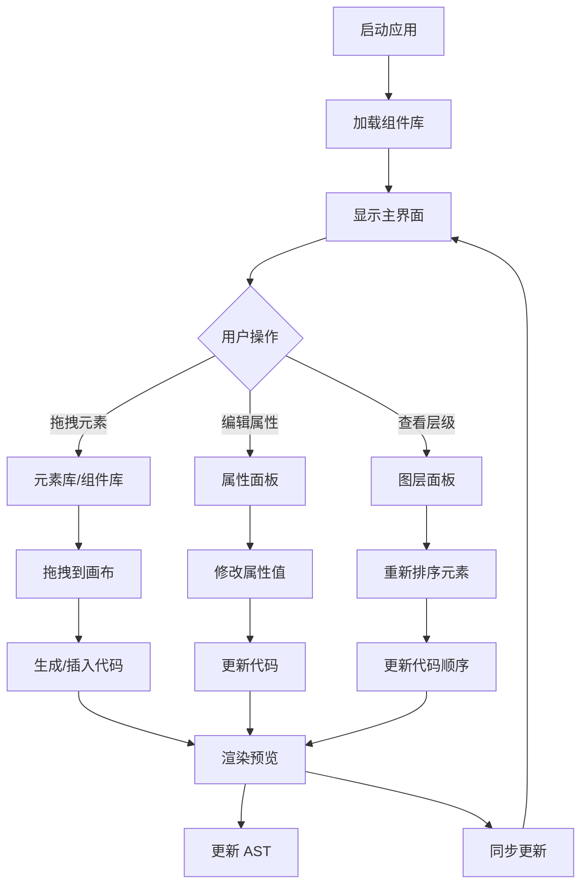
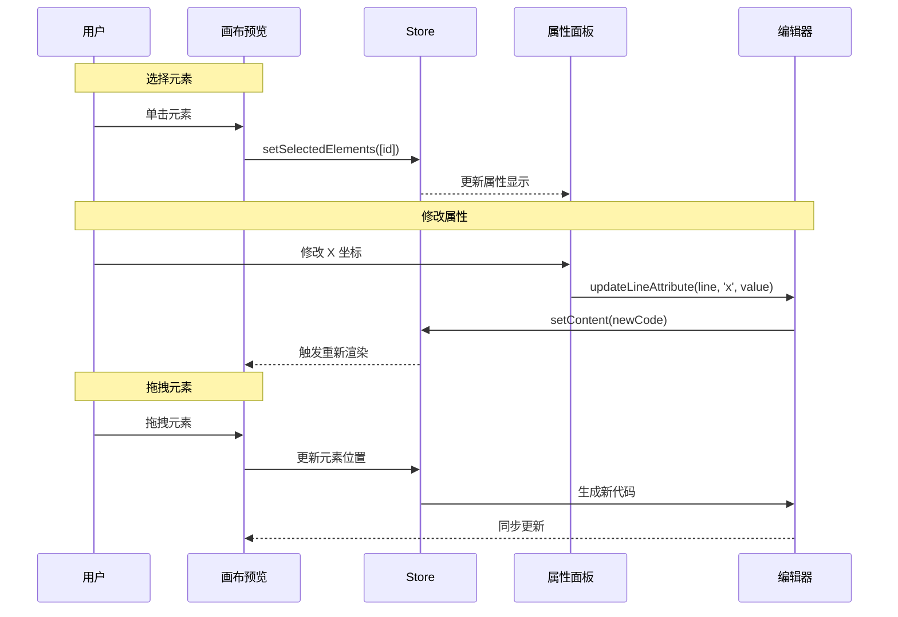

# SolarWire 编辑器 - 产品需求文档

## 文档信息

| 项目名称 | SolarWire 编辑器 |
|---------|------------------|
| 版本 | v2.0 |
| 创建日期 | 2026-05-07 |
| 作者 | SolarWire 团队 |
| 类型 | 逆向工程 - 从代码生成 |

---

## 1. 产品概述

### 1.1 产品背景

SolarWire 编辑器是一个专业的桌面应用程序，为产品经理、设计师和开发者提供 SolarWire 领域特定语言的可视化编辑能力。该应用基于 Electron、React 和 TypeScript 构建，集成了代码编辑、可视化拖拽编辑、实时预览、组件库管理等功能。

### 1.2 目标用户

- **产品经理**：使用可视化拖拽创建 PRD 线框图
- **开发者**：直接编辑 SolarWire 代码
- **设计师**：查看和管理组件库
- **技术文档编写者**：创建技术文档和线框图

### 1.3 核心价值

- **双模式编辑**：代码编辑 + 可视化拖拽，支持双向同步
- **实时预览**：即时渲染 SolarWire 代码为 SVG
- **组件库管理**：导入、管理、复用组件片段
- **高级属性编辑**：阴影、透明度、内边距、文本样式等
- **多语言支持**：中英文界面

### 1.4 用户故事

| ID | 用户故事 | 验收标准 | 优先级 |
|----|---------|----------|--------|
| US-001 | 作为产品经理，我希望通过拖拽创建和编辑 SolarWire 文档 | - 鉴于元素库已打开，当我拖拽元素到画布时，元素被添加<br>- 鉴于选中元素，当我调整大小时，属性实时更新 | P0 |
| US-002 | 作为开发者，我希望直接编辑代码并实时预览 | - 鉴于代码发生变化，当 300ms 无输入时，预览自动更新<br>- 鉴于出现语法错误，错误卡片显示行号和错误信息 | P0 |
| US-003 | 作为设计师，我希望管理和复用组件 | - 鉴于打开组件库，当我拖拽组件到画布时，组件代码被插入<br>- 鉴于组件有解析错误，缩略图显示错误图标和修复按钮 | P0 |
| US-004 | 作为用户，我希望精确控制元素样式 | - 鉴于选中元素，当我调整阴影参数时，实时预览阴影效果<br>- 鉴于调整内边距，元素内部间距实时更新 | P1 |
| US-005 | 作为用户，我希望在图层面板管理元素层级 | - 鉴于打开图层面板，当我拖拽元素时，元素层级重新排序<br>- 鉴于悬停有备注的元素，工具提示显示备注内容 | P1 |

---

## 2. 功能范围

### 2.1 功能列表

| 模块 | 功能 | 优先级 | 描述 |
|------|------|--------|------|
| 主编辑区 | SolarWire 可视化编辑器 | P0 | 画布渲染、元素交互、选择工具 |
| 主编辑区 | SVG 预览渲染 | P0 | 实时将 SolarWire 代码渲染为 SVG |
| 主编辑区 | 缩放和平移 | P0 | 滚轮缩放、空格+拖拽平移 |
| 元素选择 | 单选/多选 | P0 | Ctrl+点击多选、Shift+点击范围选择 |
| 元素选择 | 框选 | P0 | 选择工具模式：包含/相交 |
| 元素拖拽 | 元素移动 | P0 | 拖拽移动元素，智能吸附 |
| 元素拖拽 | 调整大小 | P0 | 8方向调整手柄 |
| 元素拖拽 | 对齐辅助线 | P0 | 元素对齐时显示辅助线 |
| 属性面板 | 位置属性 | P0 | X/Y 坐标输入 |
| 属性面板 | 尺寸属性 | P0 | 宽度/高度/圆角 |
| 属性面板 | 样式属性 | P0 | 填充色/边框色/边框宽度 |
| 属性面板 | 文本属性 | P0 | 文本内容/颜色/大小/对齐 |
| 属性面板 | 阴影编辑 | P1 | 阴影颜色/偏移/模糊/扩展 |
| 属性面板 | 备注编辑 | P1 | 元素备注（note 属性） |
| 图层面板 | 元素列表 | P1 | 显示所有元素及其层级 |
| 图层面板 | 元素重排序 | P1 | 拖拽调整元素顺序 |
| 图层面板 | 备注预览 | P1 | 悬停显示备注内容 |
| 组件库 | 组件分类 | P0 | 按分类组织组件 |
| 组件库 | 组件搜索 | P0 | 按名称/描述搜索 |
| 组件库 | 缩略图生成 | P0 | 异步生成组件预览 |
| 组件库 | 导入组件库 | P1 | 导入 .swc 文件 |
| 工具栏 | 视图切换 | P0 | 显示/隐藏图层、组件库 |
| 工具栏 | 缩放控制 | P0 | 放大/缩小按钮 |
| 工具栏 | 选择工具 | P0 | 选择/框选工具切换 |
| 工具栏 | 层级操作 | P1 | 置于顶层 |
| 工具栏 | 对齐操作 | P1 | 左对齐/居中/右对齐 |
| 工具栏 | 导出 SVG | P1 | 导出当前页面为 SVG |
| 右键菜单 | 复制/粘贴 | P0 | 上下文菜单操作 |
| 右键菜单 | 删除 | P0 | 删除选中元素 |
| 键盘快捷键 | 撤销/重做 | P0 | Ctrl+Z / Ctrl+Y |
| 键盘快捷键 | 删除 | P0 | Delete / Backspace |
| 状态管理 | 修改状态 | P0 | 跟踪内容是否已修改 |
| 状态管理 | 历史记录 | P0 | 最多 50 步撤销历史 |

### 2.2 功能边界

**包含**：
- SolarWire 代码编辑和可视化编辑
- 实时预览渲染
- 属性编辑（位置、尺寸、样式、文本、阴影、备注）
- 组件库管理和拖拽复用
- 图层面板管理
- 元素对齐和吸附
- 多语言界面
- 错误提示和跳转

**不包含**：
- 云存储集成
- 协作编辑
- 插件系统
- 移动端支持
- 导出为 PNG/JPG

---

## 3. 业务流程

### 3.1 核心业务流程图



### 3.2 元素交互流程



---

## 4. 页面设计

### 4.1 页面列表

| 页面名称 | 页面类型 | 描述 |
|---------|---------|------|
| 主布局 | 主页面 | 应用主界面，包含工具栏、画布、面板 |
| 工具栏 | 工具区域 | 视图控制、工具选择、操作按钮 |
| 画布区域 | 编辑区域 | SVG 渲染和元素交互 |
| 属性面板 | 侧边面板 | 编辑选中元素的属性 |
| 图层面板 | 侧边面板 | 元素列表和层级管理 |
| 组件库面板 | 侧边面板 | 组件浏览和拖拽 |
| 右键菜单 | 弹出菜单 | 上下文操作菜单 |
| 错误卡片 | 通知组件 | 语法错误显示 |

---

## 5. 页面详情

### 5.1 主布局

**页面概述**：应用主界面，包含顶部工具栏、画布预览区域、属性面板、图层/组件库面板

```solarwire
!title="SolarWire 编辑器主布局"
!c=#1F2937
!size=12
!bg=#F9FAFB
!r=0

[] @(0,0) w=1440 h=900 bg=#FFFFFF

[] @(0,0) w=1440 h=56 bg=#1F2937

["☰"] @(16,16) w=24 h=24 bg=transparent c=#FFFFFF note="菜单按钮
1. i18n: ☰ (Menu)
2. 点击操作
   - 显示主菜单"

["SolarWire"] @(48,16) w=100 h=24 bg=transparent c=#FFFFFF bold note="应用标题
1. i18n: SolarWire
2. 显示规则
   - 固定显示"

[] @(156,16) w=1 h=24 bg=#374151

["文件名.solarwire"] @(180,16) w=200 h=24 bg=transparent c=#9CA3AF note="当前文件名
1. 显示规则
   - 当前打开的文件名
   - 未保存时显示 *filename.solarwire"

[] @(400,16) w=1 h=24 bg=#374151

["已保存"] @(424,16) w=60 h=24 bg=transparent c=#22C55E note="保存状态
1. i18n: 已保存 / Saved
2. 显示规则
   - 绿色：已保存
   - 黄色：未保存"

[] @(500,0) w=56 h=56 bg=#111827

["图层"] @(520,16) w=48 h=24 bg=transparent c=#FFFFFF note="图层按钮
1. i18n: 图层 / Layers
2. 点击操作
   - 显示/隐藏图层面板"

[] @(560,0) w=56 h=56 bg=#111827

["组件"] @(576,16) w=48 h=24 bg=transparent c=#FFFFFF note="组件库按钮
1. i18n: 组件 / Components
2. 点击操作
   - 显示/隐藏组件库面板"

[] @(1300,8) w=32 h=32 bg=#3B82F6 r=16 c=#FFFFFF

["+"] @(1312,12) w=8 h=24 bg=transparent c=#FFFFFF bold note="新建按钮
1. i18n: + (New)
2. 点击操作
   - 显示新建菜单"

[] @(1340,8) w=32 h=32 bg=#374151 r=16 c=#FFFFFF

["⋮"] @(1350,12) w=12 h=24 bg=transparent c=#FFFFFF note="更多操作
1. i18n: ⋮ (More)
2. 点击操作
   - 显示更多操作菜单"

[] @(0,56) w=1440 h=48 bg=#F3F4F6

["选择工具"] @(16,64) w=80 h=32 bg=#3B82F6 c=#FFFFFF r=4 note="选择工具按钮
1. i18n: 选择工具 / Select
2. 点击操作
   - 切换到选择工具"

["框选"] @(104,64) w=56 h=32 bg=#FFFFFF b=#D1D5DB c=#374151 r=4 note="框选工具按钮
1. i18n: 框选 / Box Select
2. 点击操作
   - 切换到框选工具"

[] @(168,64) w=1 h=32 bg=#D1D5DB

["置顶"] @(184,64) w=56 h=32 bg=#FFFFFF b=#D1D5DB c=#374151 r=4 note="置顶按钮
1. i18n: 置顶 / Bring to Front
2. 点击操作
   - 将选中元素置于顶层
3. 禁用条件
   - 无选中元素时禁用"

["对齐"] @(248,64) w=56 h=32 bg=#FFFFFF b=#D1D5DB c=#374151 r=4 note="对齐按钮
1. i18n: 对齐 / Align
2. 点击操作
   - 显示对齐选项菜单"

["导出"] @(312,64) w=56 h=32 bg=#FFFFFF b=#D1D5DB c=#374151 r=4 note="导出按钮
1. i18n: 导出 / Export
2. 点击操作
   - 显示导出选项"

[] @(376,64) w=1 h=32 bg=#D1D5DB

["备注"] @(392,64) w=56 h=32 bg=#FFFFFF b=#D1D5DB c=#374151 r=4 note="备注开关
1. i18n: 备注 / Notes
2. 点击操作
   - 显示/隐藏备注"

["吸附"] @(456,64) w=56 h=32 bg=#FFFFFF b=#D1D5DB c=#374151 r=4 note="吸附开关
1. i18n: 吸附 / Snap
2. 点击操作
   - 启用/禁用对齐吸附"

[] @(520,64) w=1 h=32 bg=#D1D5DB

["−"] @(536,64) w=32 h=32 bg=#FFFFFF b=#D1D5DB c=#374151 r=4 note="缩小按钮
1. i18n: − (Zoom Out)
2. 点击操作
   - 缩小画布 (scale -= 0.1)"

["100%"] @(576,64) w=64 h=32 bg=#FFFFFF b=#D1D5DB c=#374151 r=4 note="缩放比例
1. 显示规则
   - 当前缩放比例"

["+"] @(648,64) w=32 h=32 bg=#FFFFFF b=#D1D5DB c=#374151 r=4 note="放大按钮
1. i18n: + (Zoom In)
2. 点击操作
   - 放大画布 (scale += 0.1)"

[] @(0,104) w=1440 h=796 bg=#E5E7EB

[] @(20,120) w=1100 h=760 bg=#FFFFFF b=#D1D5DB note="画布容器
1. 显示规则
   - 包含 SVG 预览内容"

[""] @(40,140) w=1060 h=720 bg=#FAFAFA note="SVG 预览区域
1. 显示规则
   - SolarWire 元素渲染区域
   - 支持缩放和平移"

[] @(1140,104) w=300 h=796 bg=#F9FAFB b=#D1D5DB

["属性"] @(1156,120) w=80 h=24 bg=transparent c=#1F2937 bold note="属性面板标题
1. i18n: 属性 / Properties
2. 显示规则
   - 选中元素时显示"

["未选中"] @(1156,160) w=100 h=24 bg=transparent c=#9CA3AF note="空状态
1. i18n: 未选中 / No Selection
2. 显示规则
   - 无选中元素时显示"
```

### 5.2 属性面板

**页面概述**：编辑选中元素的属性，支持位置、尺寸、样式、文本、阴影等

```solarwire
!title="属性面板"
!c=#1F2937
!size=12
!bg=#F9FAFB
!r=0

[] @(0,0) w=300 h=796 bg=#F9FAFB

["属性"] @(16,16) w=80 h=24 bg=transparent c=#1F2937 bold note="面板标题
1. i18n: 属性 / Properties"

[] @(0,48) w=300 h=1 bg=#E5E7EB

["位置"] @(16,64) w=40 h=20 bg=transparent c=#6B7280 note="分组标题
1. i18n: 位置 / Position"

["X"] @(16,92) w=20 h=16 bg=transparent c=#374151 note="X 坐标标签
1. i18n: X"

["100"] @(40,88) w=116 h=32 bg=#FFFFFF b=#D1D5DB c=#1F2937 note="X 坐标输入
1. 输入规则
   - 数字输入
   - 支持拖拽调整"

["Y"] @(168,92) w=20 h=16 bg=transparent c=#374151 note="Y 坐标标签
1. i18n: Y"

["200"] @(192,88) w=92 h=32 bg=#FFFFFF b=#D1D5DB c=#1F2937 note="Y 坐标输入
1. 输入规则
   - 数字输入
   - 支持拖拽调整"

[] @(0,136) w=300 h=1 bg=#E5E7EB

["尺寸"] @(16,152) w=40 h=20 bg=transparent c=#6B7280 note="分组标题
1. i18n: 尺寸 / Size"

["W"] @(16,180) w=20 h=16 bg=transparent c=#374151 note="宽度标签
1. i18n: W (Width)"

["200"] @(40,176) w=116 h=32 bg=#FFFFFF b=#D1D5DB c=#1F2937 note="宽度输入
1. 输入规则
   - 数字输入
   - 最小值: 1"

["H"] @(168,180) w=20 h=16 bg=transparent c=#374151 note="高度标签
1. i18n: H (Height)"

["100"] @(192,176) w=92 h=32 bg=#FFFFFF b=#D1D5DB c=#1F2937 note="高度输入
1. 输入规则
   - 数字输入
   - 最小值: 1"

["R"] @(16,216) w=20 h=16 bg=transparent c=#374151 note="圆角标签
1. i18n: R (Radius)"

["8"] @(40,212) w=116 h=32 bg=#FFFFFF b=#D1D5DB c=#1F2937 note="圆角输入
1. 输入规则
   - 数字输入
   - 最小值: 0"

[] @(0,260) w=300 h=1 bg=#E5E7EB

["外观"] @(16,276) w=40 h=20 bg=transparent c=#6B7280 note="分组标题
1. i18n: 外观 / Appearance"

["填充"] @(16,304) w=40 h=16 bg=transparent c=#374151 note="填充色标签
1. i18n: 填充 / Fill"

["#3B82F6"] @(64,300) w=100 h=32 bg=#3B82F6 b=#D1D5DB note="填充色输入
1. 输入规则
   - 颜色选择器
   - 显示当前颜色"

["边框"] @(16,340) w=40 h=16 bg=transparent c=#374151 note="边框色标签
1. i18n: 边框 / Border"

["#E5E7EB"] @(64,336) w=100 h=32 bg=#E5E7EB b=#D1D5DB note="边框色输入
1. 输入规则
   - 颜色选择器"

["宽度"] @(16,376) w=40 h=16 bg=transparent c=#374151 note="边框宽度标签
1. i18n: 宽度 / Width"

["1"] @(64,372) w=116 h=32 bg=#FFFFFF b=#D1D5DB c=#1F2937 note="边框宽度输入
1. 输入规则
   - 数字输入
   - 最小值: 0"

["透明度"] @(16,412) w=60 h=16 bg=transparent c=#374151 note="透明度标签
1. i18n: 透明度 / Opacity"

["━━━━━━━━"] @(16,436) w=200 h=4 bg=#3B82F6 note="透明度滑块
1. 显示规则
   - 范围 0-1"

["1.0"] @(224,436) w=40 h=16 bg=transparent c=#374151 note="透明度值
1. 显示规则
   - 当前透明度值"

[] @(0,456) w=300 h=1 bg=#E5E7EB

["文本"] @(16,472) w=40 h=20 bg=transparent c=#6B7280 note="分组标题
1. i18n: 文本 / Text"

["内容"] @(16,500) w=40 h=16 bg=transparent c=#374151 note="文本内容标签
1. i18n: 内容 / Content"

["登录按钮"] @(16,524) w=268 h=32 bg=#FFFFFF b=#D1D5DB c=#1F2937 note="文本内容输入
1. 输入规则
   - 单行文本"

["颜色"] @(16,564) w=40 h=16 bg=transparent c=#374151 note="文本颜色标签
1. i18n: 颜色 / Color"

["#FFFFFF"] @(64,560) w=100 h=32 bg=#FFFFFF b=#D1D5DB note="文本颜色输入
1. 输入规则
   - 颜色选择器"

["大小"] @(176,564) w=40 h=16 bg=transparent c=#374151 note="字体大小标签
1. i18n: 大小 / Size"

["14"] @(224,560) w=60 h=32 bg=#FFFFFF b=#D1D5DB c=#1F2937 note="字体大小输入
1. 输入规则
   - 数字输入
   - 最小值: 1"

["B"] @(16,604) w=32 h=32 bg=#FFFFFF b=#D1D5DB c=#374151 note="粗体按钮
1. i18n: B (Bold)
2. 点击操作
   - 切换粗体"

["I"] @(52,604) w=32 h=32 bg=#FFFFFF b=#D1D5DB c=#374151 note="斜体按钮
1. i18n: I (Italic)
2. 点击操作
   - 切换斜体"

["U"] @(88,604) w=32 h=32 bg=#FFFFFF b=#D1D5DB c=#374151 note="下划线按钮
1. i18n: U (Underline)
2. 点击操作
   - 切换下划线"

["S"] @(124,604) w=32 h=32 bg=#FFFFFF b=#D1D5DB c=#374151 note="删除线按钮
1. i18n: S (Strikethrough)
2. 点击操作
   - 切换删除线"

[] @(0,652) w=300 h=1 bg=#E5E7EB

["▼ 阴影"] @(16,668) w=80 h=20 bg=transparent c=#6B7280 note="阴影分组标题
1. i18n: ▼ 阴影 / ▼ Shadow
2. 点击操作
   - 展开/折叠阴影设置"

[] @(0,700) w=300 h=96 bg=#F3F4F6

["颜色"] @(24,716) w=40 h=16 bg=transparent c=#374151 note="阴影颜色标签
1. i18n: 颜色 / Color"

["#00000080"] @(72,712) w=80 h=32 bg=#00000080 b=#D1D5DB note="阴影颜色输入
1. 输入规则
   - 带透明度的颜色"

["X"] @(160,716) w=20 h=16 bg=transparent c=#374151 note="X偏移标签
1. i18n: X"

["2"] @(184,712) w=36 h=32 bg=#FFFFFF b=#D1D5DB c=#1F2937 note="X偏移输入
1. 输入规则
   - 数字输入"

["Y"] @(228,716) w=20 h=16 bg=transparent c=#374151 note="Y偏移标签
1. i18n: Y"

["4"] @(252,712) w=24 h=32 bg=#FFFFFF b=#D1D5DB c=#1F2937 note="Y偏移输入
1. 输入规则
   - 数字输入"

["模糊"] @(24,756) w=40 h=16 bg=transparent c=#374151 note="模糊标签
1. i18n: 模糊 / Blur"

["8"] @(72,752) w=104 h=32 bg=#FFFFFF b=#D1D5DB c=#1F2937 note="模糊输入
1. 输入规则
   - 数字输入
   - 最小值: 0"

["扩展"] @(184,756) w=40 h=16 bg=transparent c=#374151 note="扩展标签
1. i18n: 扩展 / Spread"

["0"] @(232,752) w=44 h=32 bg=#FFFFFF b=#D1D5DB c=#1F2937 note="扩展输入
1. 输入规则
   - 数字输入"

[] @(0,796) w=300 h=1 bg=#E5E7EB

["▼ 备注"] @(16,812) w=80 h=20 bg=transparent c=#6B7280 note="备注分组标题
1. i18n: ▼ 备注 / ▼ Note
2. 点击操作
   - 展开/折叠备注设置"

["点击提交登录表单"] @(16,840) w=268 h=80 bg=#FFFFFF b=#D1D5DB c=#1F2937 note="备注输入
1. 输入规则
   - 多行文本
   - 支持 resize"
```

### 5.3 图层面板

**页面概述**：显示元素层级列表，支持选择、重排序、备注预览

```solarwire
!title="图层面板"
!c=#1F2937
!size=12
!bg=#F9FAFB
!r=0

[] @(0,0) w=280 h=600 bg=#F9FAFB

["图层"] @(12,12) w=60 h=24 bg=transparent c=#1F2937 bold note="面板标题
1. i18n: 图层 / Layers"

["5"] @(236,12) w=32 h=24 bg=#E5E7EB c=#6B7280 r=4 note="元素数量
1. 显示规则
   - 当前元素总数"

[] @(0,44) w=280 h=1 bg=#E5E7EB

[] @(12,56) w=256 h=44 bg=#FFFFFF b=#3B82F6 c=#1F2937 note="图层项 (选中)
1. 点击操作
   - 选中元素
2. Ctrl+点击
   - 多选
3. Shift+点击
   - 范围选择
4. 拖拽操作
   - 重新排序"

["▭"] @(20,68) w=20 h=20 bg=transparent c=#6B7280 note="元素类型图标
1. 图标映射
   - ▭: 矩形
   - ○: 圆形
   - T: 文本
   - ╱: 线条"

["登录按钮"] @(48,68) w=120 h=20 bg=transparent c=#1F2937 note="元素名称
1. 显示规则
   - 文本元素显示文本内容
   - 其他显示元素类型"

["1"] @(220,68) w=20 h=20 bg=#22C55E c=#FFFFFF r=2 note="备注徽章
1. 显示规则
   - 有备注时显示编号
   - 背景色: #70B603"

["L3"] @(244,68) w=20 h=20 bg=transparent c=#9CA3AF note="行号
1. 显示规则
   - 元素在代码中的行号"

[] @(12,104) w=256 h=44 bg=#FFFFFF b=#D1D5DB c=#1F2937 note="图层项"

["T"] @(20,116) w=20 h=20 bg=transparent c=#6B7280 note="元素类型图标"

["用户名"] @(48,116) w=100 h=20 bg=transparent c=#1F2937 note="元素名称"

["L5"] @(244,116) w=20 h=20 bg=transparent c=#9CA3AF note="行号"

[] @(12,152) w=256 h=44 bg=#FFFFFF b=#D1D5DB c=#1F2937 note="图层项"

["▭"] @(20,164) w=20 h=20 bg=transparent c=#6B7280 note="元素类型图标"

["输入框背景"] @(48,164) w=100 h=20 bg=transparent c=#1F2937 note="元素名称"

["L7"] @(244,164) w=20 h=20 bg=transparent c=#9CA3AF note="行号"

[] @(12,200) w=256 h=44 bg=#FFFFFF b=#D1D5DB c=#1F2937 note="图层项"

["▭"] @(20,212) w=20 h=20 bg=transparent c=#6B7280 note="元素类型图标"

["提交按钮"] @(48,212) w=100 h=20 bg=transparent c=#1F2937 note="元素名称"

["L10"] @(244,212) w=20 h=20 bg=transparent c=#9CA3AF note="行号"

[] @(12,248) w=256 h=44 bg=#FFFFFF b=#D1D5DB c=#1F2937 note="图层项"

["🖼"] @(20,260) w=20 h=20 bg=transparent c=#6B7280 note="元素类型图标"

["logo.png"] @(48,260) w=100 h=20 bg=transparent c=#1F2937 note="元素名称"

["L15"] @(244,260) w=20 h=20 bg=transparent c=#9CA3AF note="行号"

[] @(12,300) w=260 h=280 bg=#FFFFFF b=#3B82F6 note="备注工具提示
1. 显示规则
   - 悬停有备注的元素时显示
2. 位置规则
   - 自动调整避免超出边界"

["1"] @(24,316) w=20 h=20 bg=#70B603 c=#FFFFFF r=2 note="备注编号徽章"

["备注"] @(52,316) w=60 h=20 bg=transparent c=#1F2937 bold note="备注标题

["点击提交登录表单"] @(24,344) w=236 h=200 bg=transparent c=#374151 note="备注内容
1. 显示规则
   - 支持多行文本"
```

### 5.4 组件库面板

**页面概述**：浏览和管理组件库，支持分类、搜索、缩略图预览、拖拽插入

```solarwire
!title="组件库面板"
!c=#1F2937
!size=12
!bg=#F9FAFB
!r=0

[] @(0,0) w=320 h=700 bg=#F9FAFB

["组件库"] @(12,12) w=100 h=24 bg=transparent c=#1F2937 bold note="面板标题
1. i18n: 组件库 / Component Library"

["🔄"] @(284,12) w=24 h=24 bg=transparent c=#6B7280 note="刷新按钮
1. 点击操作
   - 刷新组件列表"

["全部"] @(12,52) w=40 h=28 bg=#3B82F6 c=#FFFFFF r=4 note="分类按钮 (选中)
1. 点击操作
   - 显示该分类组件"

["按钮"] @(56,52) w=48 h=28 bg=#FFFFFF b=#D1D5DB c=#374151 r=4 note="分类按钮
1. 点击操作
   - 显示该分类组件"

["输入框"] @(108,52) w=56 h=28 bg=#FFFFFF b=#D1D5DB c=#374151 r=4 note="分类按钮
1. 点击操作
   - 显示该分类组件"

["卡片"] @(168,52) w=40 h=28 bg=#FFFFFF b=#D1D5DB c=#374151 r=4 note="分类按钮
1. 点击操作
   - 显示该分类组件"

["导航"] @(212,52) w=40 h=28 bg=#FFFFFF b=#D1D5DB c=#374151 r=4 note="分类按钮
1. 点击操作
   - 显示该分类组件"

["搜索组件..."] @(12,92) w=296 h=36 bg=#FFFFFF b=#D1D5DB c=#9CA3AF note="搜索输入
1. 输入规则
   - 实时搜索 (150ms 防抖)
2. 搜索范围
   - 组件名称
   - 组件描述"

[] @(12,140) w=296 h=1 bg=#E5E7EB

["加载中..."] @(120,320) w=80 h=24 bg=transparent c=#6B7280 note="加载状态
1. 显示规则
   - 生成缩略图时显示"

[] @(12,180) w=140 h=120 bg=#FFFFFF b=#D1D5DB note="组件卡片
1. 拖拽操作
   - 拖拽到画布插入组件"

["[登录]"] @(22,290) w=120 h=20 bg=transparent c=#1F2937 note="组件缩略图
1. 显示规则
   - 渲染后的 SVG 预览"

["登录按钮"] @(12,312) w=140 h=20 bg=transparent c=#1F2937 note="组件名称
1. 显示规则
   - 组件名称"

["主要操作按钮"] @(12,336) w=140 h=16 bg=transparent c=#9CA3AF note="组件描述
1. 显示规则
   - 组件描述 (如果有)"

[] @(164,180) w=140 h=120 bg=#FFFFFF b=#D1D5DB note="组件卡片"

["[注册]"] @(174,290) w=120 h=20 bg=transparent c=#1F2937 note="组件缩略图"

["注册按钮"] @(164,312) w=140 h=20 bg=transparent c=#1F2937 note="组件名称"

["用户注册入口"] @(164,336) w=140 h=16 bg=transparent c=#9CA3AF note="组件描述"

[] @(12,316) w=140 h=120 bg=#FFFFFF b=#D1D5DB note="组件卡片"

["❌"] @(80,344) w=24 h=24 bg=transparent c=#EF4444 note="错误图标
1. 显示规则
   - 组件解析错误时显示"

["🔧"] @(108,344) w=24 h=24 bg=transparent c=#3B82F6 note="修复按钮
1. 点击操作
   - 打开发组件编辑器修复"

["损坏组件"] @(12,380) w=140 h=20 bg=transparent c=#1F2937 note="组件名称"

["解析失败"] @(12,404) w=140 h=16 bg=transparent c=#EF4444 note="错误信息
1. 显示规则
   - 显示解析错误原因"

[] @(164,316) w=140 h=120 bg=#FFFFFF b=#D1D5DB note="组件卡片 (禁用)

["[忘记密码]"] @(174,426) w=120 h=20 bg=transparent c=#9CA3AF note="组件缩略图"

["忘记密码"] @(164,448) w=140 h=20 bg=transparent c=#9CA3AF note="组件名称"
```

### 5.5 工具栏

**页面概述**：顶部工具栏，包含视图控制、工具选择、操作按钮

```solarwire
!title="工具栏"
!c=#1F2937
!size=12
!bg=#F3F4F6
!r=0

[] @(0,0) w=1440 h=48 bg=#F3F4F6

["🖱"] @(16,12) w=32 h=24 bg=#3B82F6 c=#FFFFFF r=4 note="选择工具 (选中)
1. 图标: 🖱 (鼠标)
2. 点击操作
   - 切换到选择工具"

["⊡"] @(56,12) w=32 h=24 bg=#FFFFFF b=#D1D5DB c=#374151 r=4 note="框选工具
1. 图标: ⊡ (框选)
2. 点击操作
   - 切换到框选工具"

[] @(96,12) w=1 h=24 bg=#D1D5DB

["⬆"] @(112,12) w=32 h=24 bg=#FFFFFF b=#D1D5DB c=#374151 r=4 note="置顶按钮
1. 图标: ⬆ (上箭头)
2. 点击操作
   - 将选中元素置于顶层
3. 禁用条件
   - 无选中元素"

["≡"] @(152,12) w=32 h=24 bg=#FFFFFF b=#D1D5DB c=#374151 r=4 note="对齐按钮
1. 图标: ≡ (对齐)
2. 点击操作
   - 显示对齐选项:
     - 左对齐
     - 水平居中
     - 右对齐
     - 顶对齐
     - 垂直居中
     - 底对齐"

["📤"] @(192,12) w=32 h=24 bg=#FFFFFF b=#D1D5DB c=#374151 r=4 note="导出按钮
1. 图标: 📤 (导出)
2. 点击操作
   - 导出当前页面为 SVG"

[] @(232,12) w=1 h=24 bg=#D1D5DB

["📝"] @(248,12) w=32 h=24 bg=#FFFFFF b=#3B82F6 c=#374151 r=4 note="备注开关 (开)
1. 图标: 📝 (备注)
2. 点击操作
   - 切换备注显示/隐藏"

["⊞"] @(288,12) w=32 h=24 bg=#FFFFFF b=#D1D5DB c=#374151 r=4 note="吸附开关
1. 图标: ⊞ (网格)
2. 点击操作
   - 切换对齐吸附开/关"

[] @(328,12) w=1 h=24 bg=#D1D5DB

["−"] @(344,12) w=32 h=24 bg=#FFFFFF b=#D1D5DB c=#374151 r=4 note="缩小按钮
1. 图标: − (减号)
2. 点击操作
   - scale = max(0.25, scale - 0.1)"

["75%"] @(384,12) w=48 h=24 bg=#FFFFFF b=#D1D5DB c=#374151 r=4 note="缩放比例
1. 显示规则
   - 当前缩放百分比
2. 点击操作
   - 重置为 100%"

["+"] @(440,12) w=32 h=24 bg=#FFFFFF b=#D1D5DB c=#374151 r=4 note="放大按钮
1. 图标: + (加号)
2. 点击操作
   - scale = min(2.0, scale + 0.1)"
```

### 5.6 右键菜单

**页面概述**：元素上的右键上下文菜单

```solarwire
!title="右键菜单"
!c=#1F2937
!size=12
!bg=#FFFFFF
!r=0

[] @(200,150) w=180 h=200 bg=#FFFFFF b=#E5E7EB r=4 note="菜单容器
1. 显示规则
   - 固定宽度 180px
   - 高度根据菜单项数量"

["复制"] @(12,8) w=60 h=32 bg=transparent c=#1F2937 note="复制菜单项
1. 快捷键: Ctrl+C
2. 点击操作
   - 复制选中元素到剪贴板"

["粘贴"] @(12,40) w=60 h=32 bg=transparent c=#1F2937 note="粘贴菜单项
1. 快捷键: Ctrl+V
2. 点击操作
   - 从剪贴板粘贴元素"

[] @(0,72) w=180 h=1 bg=#E5E7EB

["删除"] @(12,80) w=60 h=32 bg=transparent c=#EF4444 note="删除菜单项
1. 快捷键: Delete
2. 点击操作
   - 删除选中元素"

["置于顶层"] @(12,112) w=100 h=32 bg=transparent c=#1F2937 note="置顶菜单项
1. 点击操作
   - 将元素移到最上层"

["置于底层"] @(12,144) w=100 h=32 bg=transparent c=#1F2937 note="置底菜单项
1. 点击操作
   - 将元素移到底层"

[] @(0,176) w=180 h=1 bg=#E5E7EB

["复制元素代码"] @(12,184) w=120 h=32 bg=transparent c=#1F2937 note="复制代码菜单项
1. 点击操作
   - 复制元素对应的代码"
```

### 5.7 错误卡片

**页面概述**：显示语法错误信息，支持跳转到代码行

```solarwire
!title="错误卡片"
!c=#1F2937
!size=12
!bg=#FEF2F2
!r=0

[] @(400,80) w=400 h=80 bg=#FEF2F2 b=#FECACA r=8 note="错误卡片
1. 显示规则
   - 最多显示 3 个错误
2. 位置
   - 固定在画布右上角"

["❌"] @(416,96) w=24 h=24 bg=transparent c=#EF4444 note="错误图标
1. 图标: ❌ (错误)"

["语法错误"] @(448,96) w=80 h=24 bg=transparent c=#EF4444 bold note="错误标题
1. i18n: 语法错误 / Syntax Error"

["第 5 行"] @(368,96) w=60 h=24 bg=#FEE2E2 c=#DC2626 r=4 note="行号标签
1. 显示规则
   - 跳转到代码行"

["无法解析元素属性 'bg'"] @(416,128) w=360 h=24 bg=transparent c=#991B1B note="错误消息
1. 显示规则
   - 完整的错误描述"

["查看代码"] @(296,96) w=64 h=24 bg=#3B82F6 c=#FFFFFF r=4 note="跳转按钮
1. i18n: 查看代码 / View in Code
2. 点击操作
   - 切换到代码编辑器
   - 跳转到错误行"
```

---

## 6. 非功能性需求

### 6.1 性能需求

| 指标 | 要求 |
|------|------|
| 预览渲染 (< 100 元素) | < 500ms |
| 代码编辑响应 | < 100ms |
| 缩略图生成 | 异步，不阻塞 UI |
| 撤销历史 | 最多 50 步 |

### 6.2 安全需求

- SVG 清理：移除 `<script>`、`<iframe>` 等危险标签
- 事件处理清理：移除 `on*` 属性
- URL 验证：阻止 `javascript:` 协议

### 6.3 兼容性需求

- **Electron**: 27.0+
- **React**: 19.2.5
- **Node.js**: 18+ (Electron)
- **浏览器**: Chromium (Electron 内核)

### 6.4 可用性需求

| 功能 | 快捷键 |
|------|--------|
| 撤销 | Ctrl+Z |
| 重做 | Ctrl+Y / Ctrl+Shift+Z |
| 删除 | Delete / Backspace |
| 全选 | Ctrl+A |
| 保存 | Ctrl+S |

---

## 7. 数据模型

### 7.1 状态管理 (Zustand Stores)

| Store | 职责 | 关键状态 |
|-------|------|---------|
| `editorStore` | 编辑器状态 | mode, content, isModified, history |
| `solarWireStore` | SolarWire 状态 | selectedElements, selectionTool, isPanMode |
| `previewStore` | 预览状态 | scale, position, alignmentGuides |
| `selectionStore` | 选择状态 | selectedItem |
| `componentLibraryStore` | 组件库 | libraries, activeLibraryId |

### 7.2 服务接口

| 服务 | 职责 |
|------|------|
| `IFileSystemService` | 文件读写 |
| `syntaxErrorService` | 语法错误管理 |
| `copy-paste-service` | 复制粘贴 |
| `ComponentLibraryManager` | 组件库管理 |

---

## 8. 附录

### 8.1 术语表

| 术语 | 描述 |
|------|------|
| SolarWire | 领域特定语言，用于描述线框图 |
| AST | 抽象语法树 |
| Monaco Editor | VS Code 的代码编辑器组件 |
| SVG | 可缩放矢量图形 |
| Zustand | React 状态管理库 |
| SWC | SolarWire Component (组件库文件格式) |

### 8.2 组件类型

| 类型 | 图标 | 属性 |
|------|------|------|
| rectangle | ▭ | 矩形元素 |
| circle | ○ | 圆形元素 |
| text | T | 文本元素 |
| line | ╱ | 线条元素 |
| image | 🖼 | 图片元素 |
| placeholder | □ | 占位符元素 |
| table | ⊞ | 表格元素 |

### 8.3 快捷键映射

| 功能 | Windows/Linux | macOS |
|------|--------------|-------|
| 撤销 | Ctrl+Z | Cmd+Z |
| 重做 | Ctrl+Y | Cmd+Shift+Z |
| 删除 | Delete | Backspace |
| 复制 | Ctrl+C | Cmd+C |
| 粘贴 | Ctrl+V | Cmd+V |
| 保存 | Ctrl+S | Cmd+S |
| 放大 | Ctrl++ | Cmd++ |
| 缩小 | Ctrl+- | Cmd+- |
