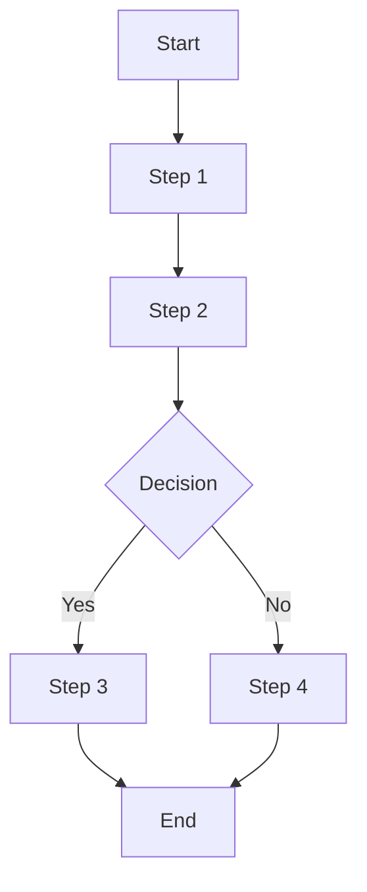
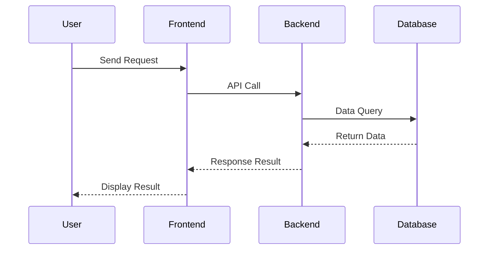

# PRD Workflow

## Prerequisites

Load core rule files (syntax.md, note-guide.md, standards.md) as specified in SKILL.md before starting. Do not rely solely on summaries in this file.

---

## Configuration

- **Output Directory**: `.solarwire`

---

## Overview

This skill generates complete Product Requirements Documents (PRD), including:
1. **Complete PRD Document** (.md format)
2. **Mermaid Flowcharts/Sequence Diagrams**
3. **SolarWire Wireframes** (embedded in .md, each page with complete element descriptions)

---

## Scenario Detection

Before starting the workflow, determine which scenario applies:

### Scenario A: New Requirement
- User has a new requirement (may include new pages AND modifications to existing pages)
- Follow full Five Elements confirmation with user
- New pages: write complete wireframe with full page framework
- Modified pages: complete wireframe drawn from existing code or known PRD, changes marked with `[NEW]`/`[MODIFIED]`/`[REMOVED]`

### Scenario B: Code Reverse Engineering
- User provides existing codebase
- All pages inferred from code
- Five Elements answered from code analysis (no user questioning needed)
- Generate PRD following same template

**Detection Method:**
1. Ask user: "Do you have a new requirement, or do you want me to analyze existing code?"
2. Based on answer, select scenario and adjust workflow accordingly

---

## Code Reverse Engineering Sub-flow (Scenario B)

When user wants to generate PRD from existing code:

### Phase C1: Codebase Discovery
1. Ask user for codebase location
2. Scan project structure (frontend/backend)
3. Identify tech stack
4. Determine analysis scope

### Phase C2: Five Elements from Code (Reverse: Presentation → Strategy)

When reverse-engineering from code, extract the five UX layers in reverse order — from the most concrete (what you can see) to the most abstract (why it exists):

1. **Presentation Layer**: Infer visual hierarchy from component structure and styling
2. **Framework Layer**: Extract page layouts and interaction patterns from components
3. **Structure Layer**: Extract navigation hierarchy and page organization from routes/menus
4. **Scope Layer**: Identify all pages, features, and their relationships from code
5. **Strategy Layer**: Infer from codebase structure, comments, business logic

**Why reverse?** Code is an already-implemented product. We start from what's visible and concrete (UI, layout), then work backward to understand the structure, scope, and ultimately the business strategy that drove the implementation.

### Phase C3: Frontend Analysis
- Resolve full component tree (CRITICAL: never stop at page level)
- Extract UI elements, state, data flow
- Map frontend code to SolarWire elements

### Phase C4: Backend Analysis
- Extract API endpoints and data models
- Extract business logic and validation rules

### Phase C5: PRD Generation
- Generate PRD following the same template
- Include all five elements layers in document
- Run renderer validation

**Key Rules for Code Reverse Engineering:**
- Notes describe user-visible behavior ONLY, never API endpoints or technical implementation
- Resolve full component tree recursively - NEVER stop at page level
- Generate realistic mock data, never leave fields empty
- Use EARS style for all note descriptions

---

## Workflow

### Phase 0: Exploration & Preparation

**Goal: Understand project context and scope before collecting requirements**

**Step 0: Explore Project Context**
- Check existing code files (if any)
- Check existing documentation (if any)
- Check existing PRD documents in `.solarwire/` directory (if any)
- Check recent git commits (if any)
- Understand project background and goals

**Step 1: Related Feature Impact Analysis (CRITICAL)**
- Scan existing codebase for features related to the new requirement
- Scan existing PRDs in `.solarwire/` for features that may need modification
- Identify frontend components that can be reused (see Component Reuse Rules below)
- Produce an impact analysis report:

```
Based on the new requirement, I've analyzed the existing codebase and PRDs:

**Directly Related Features (must modify):**
1. [Feature A] - [Why it needs modification] - [Affected pages/components]
2. [Feature B] - [Why it needs modification] - [Affected pages/components]

**Indirectly Related Features (may need modification):**
1. [Feature C] - [Potential impact] - [Needs confirmation]

**Reusable Components:**
1. [Component X] - [Can be used for] - [Location in codebase]

**No Impact:**
- [Feature D] - [Why no impact]

Should I include the related feature modifications in this PRD?
```

**Related Feature Impact Analysis Rules:**
- MUST scan codebase for: shared components, shared API endpoints, shared data models, shared utilities
- MUST scan existing PRDs for: pages that reference the same data/entities, pages with shared navigation, pages with cross-references
- MUST identify frontend components that match the new requirement's UI needs
- If related features need modification, include them in the current PRD's Change Summary
- If unsure about indirect impact, ask user to confirm

**Component Reuse Rules:**
- When generating wireframes, if existing frontend code has suitable components, use those components to draw the corresponding wireframe elements
- Identify reusable components by scanning: component library files, shared component directories, UI framework components
- In the wireframe note, document the component reference: `Component: [ComponentName] from [path]`
- If no existing component matches, design new elements as usual

**Step 2: Scope Check**
- Determine if project needs to be decomposed into multiple sub-projects
- If too large, help user decompose and select first sub-project
- Decomposition criteria:
  - >5 independent modules → needs decomposition
  - >10 pages → needs decomposition
  - Multiple independent business flows → needs decomposition
- If decomposition required, follow the directory structure in SKILL.md File Structure Convention

**Step 3: Multiple Approaches Comparison (Optional)**
- Provide 2-3 design approaches
- Each with trade-off analysis
- Recommend one approach

---

### Phase 1: Five Elements Confirmation (CRITICAL)

**Goal: Systematically confirm requirements through 5 UX layers. Do NOT proceed to next layer until current layer is fully understood. Ask probing questions, follow first principles.**

**Step 4: Strategy Layer (战略层)**
```
Let me understand the business context:

1. What business problem are we trying to solve?
2. What is the business background that led to this need?
3. Who are the target users? What are their pain points?
4. What is the expected outcome / success criteria?
5. Why now? What triggered this requirement?
```

**Step 5: Terminal Type Confirmation (CRITICAL)**
```
Before proceeding, I need to confirm the target platform:

What is the terminal type for this requirement?
- Mobile App (iOS/Android, narrow canvas, touch-first)
- Web Client (Desktop browser, wide canvas, mouse+keyboard)
- Admin Dashboard (Data-intensive, sidebar layout, many actions)

This will determine container sizes, element dimensions, and overall layout patterns.
```

**Step 6: Scope Layer (范围层)**
```
Based on the strategy and impact analysis, let's define the scope:

1. What changes are involved?
   - New pages/modals/features to ADD
   - Existing pages/modals/features to MODIFY (including related features from impact analysis)
   - Features to REMOVE
2. Which existing pages are affected? (Including related features identified in Step 1)
3. What is explicitly OUT OF SCOPE?
4. Are there any dependencies on other systems/features?
```

**Step 7: Structure Layer (结构层)**
```
Based on the scope, let's define the structure:

1. How should pages be organized? (Navigation hierarchy)
2. For NEW pages: What features should each page have?
3. For MODIFIED pages: What features need to change?
4. What are the user flows between pages?
5. Are there any shared components across pages?
```

**Step 8: Framework Layer (框架层)**
```
Based on the structure, let's define the framework:

1. What is the page layout for each page?
2. What are the main interaction patterns?
3. How should information be organized within each page?
4. What are the key user interactions?
```

**Step 9: Presentation Layer (表现层)**
```
Based on the framework, let's define the presentation:

1. What is the visual hierarchy? (Primary vs secondary information)
2. How should information be grouped/partitioned?
3. Are there any UX design preferences?
4. What is the overall visual tone?
```

**Five Elements Rules:**
- MUST complete each layer before moving to the next
- If user cannot answer a question, probe deeper - don't assume
- If user seems uncertain, offer 2-3 options with trade-offs

**CRITICAL — Five Elements Are a Working Method ONLY:**
- The Five Elements (Strategy, Scope, Structure, Framework, Presentation) are a **requirement confirmation workflow tool**, NOT a PRD document structure
- **NEVER** create any "Five Elements" section, chapter, or heading in the PRD document
- Information gathered during Five Elements confirmation MUST be distributed into the standard PRD sections:
  - Strategy Layer → Product Overview (1.1-1.3), User Stories (1.4), Expected Outcome (3.1-3.3)
  - Scope Layer → Feature Scope (2.1-2.2), Feature Boundary
  - Structure Layer → Business Flow (4.1-4.2), Page Design (5.1)
  - Framework Layer → Page Details (6.1-x), Wireframes
  - Presentation Layer → Wireframes, visual specifications within notes
- If AI attempts to add Five Elements headings to the PRD, it is a violation of this rule

**Step 10: Multi-language Confirmation**
```
Does this project require multi-language support?

If yes:
- Which languages need to be supported?
- Common options: English, Chinese, 日本語, 한국어, Deutsch, Français, Español, etc.
- The default language will be set based on your primary language.

If no:
- All notes will be written in default language only.
- No i18n information will be added to any elements.
```

**Multi-language Rules:**

1. **Only when explicitly confirmed**: Add i18n information ONLY when user explicitly confirms multi-language support is needed
2. **Never add i18n if not requested**: If user says no multi-language, absolutely DO NOT add any i18n information
3. **All meaningful elements**: If multi-language is confirmed, ALL meaningful text elements MUST include i18n translations
4. **Default language**: Based on user's primary language (the language they use to communicate)

**Elements requiring i18n (if multi-language is confirmed):**
- Button text
- Label text
- Placeholder text
- Error/Success messages
- Table headers
- Menu items
- Page titles
- Status values

**Elements NOT requiring i18n:**
- User input data (usernames, comments, etc.)
- System generated data (IDs, timestamps, etc.)
- Decorative elements
- Icons

---

### Phase 2: Requirements Validation

**Step 11: Requirements Summary**
```
Here's my understanding of requirements:

**Product Type**: [Type]
**Terminal Type**: [Mobile/Web/Admin]
**Core Pages**:
1. [Page 1] - [Brief description]
2. [Page 2] - [Brief description]
3. ...

**Multi-language**: [Yes/No + Languages]

**Special Requirements**:
- [Requirement 1]
- [Requirement 2]

Is this understanding correct? Any adjustments or additions needed?
```

**Step 12: Requirements Confirmation Gate**
- User MUST confirm requirements
- If adjustments needed, identify which layer needs revision:
  - Business problem changed → go back to Step 4 (Strategy)
  - Terminal type changed → go back to Step 5 (Terminal Type)
  - Scope/pages changed → go back to Step 6 (Scope)
  - Structure/navigation changed → go back to Step 7 (Structure)
  - Layout/interaction changed → go back to Step 8 (Framework)
  - Visual preferences changed → go back to Step 9 (Presentation)
- After revision, re-run Step 11 (Requirements Summary) and re-confirm

---

### Phase 3: Generate & Quality

**Step 13: Generate PRD**
- Generate complete PRD document
- Save to `.solarwire/[requirement-name]/solarwire-prd.md`

**Step 14: Spec Self-Review**

#### Check 1: Placeholder Scan
```
Check items:
- Any "TBD", "To Be Determined", "Pending"
- Any "TODO", "To Be Completed"
- Incomplete sections
- Vague requirement descriptions

If found:
- Fix or clarify immediately
- No placeholders allowed
```

#### Check 2: Internal Consistency
```
Check items:
- Product type matches page design
- Core features list matches page details
- Multi-language rules are consistent throughout document
- Color standards are used consistently
- Font standards are used consistently

If contradictions found:
- Priority: Page details > Feature list > Product type
- Unify standards
```

#### Check 3: Scope Check
```
Check items:
- Focused on implementable scope
- Not too many independent subsystems
- Doesn't need decomposition

Criteria:
- If >5 independent modules → needs decomposition
- If >10 pages → needs decomposition
- If multiple independent business flows → needs decomposition

If needs decomposition:
- Go back to Phase 0 Step 2
- Help user decompose and select first sub-project
```

#### Check 3.5: PRD Structure Compliance (CRITICAL)
```
Check items:
- PRD document has exactly 8 top-level sections: Product Overview, Feature Scope, Expected Outcome, Business Flow, Page Design, Page Details, Non-functional Requirements, Appendix
- No "Five Elements", "UX Layers", "Strategy Analysis", or similar sections exist
- Sections are in the correct order (1→2→3→4→5→6→7→8)
- All section titles use the user's communication language (not English unless user communicates in English)
- Section numbering is preserved (1.1, 1.2, 1.3, 1.4, 2.1, 2.2, etc.)

If violations found:
- Remove unauthorized sections
- Reorder sections to match template
- Translate section titles to user language
- Fix numbering
```

#### Check 4: Ambiguity Check
```
Check items:
- Requirements with two possible interpretations
- Vague business rules (e.g., "appropriate", "reasonable")
- Undefined terms

If ambiguity found:
- Choose one interpretation and make it explicit
- Add term definitions to Appendix
- Clarify business rules (e.g., "appropriate permissions" → "read-only permissions")

**Note: Visual ambiguity is allowed**
- Visual descriptions like "appropriate spacing", "reasonable layout" don't need quantification
- But functional requirements must be clear (e.g., "user can edit" not "user might be able to edit")
```

#### Check 5: Renderer Validation (CRITICAL)
```
Run: node sw-skills/solarwire/validate-sw.js .solarwire/[requirement-name]/

If errors found:
- Fix SolarWire syntax errors in the PRD
- Re-run validation until all blocks pass
- Common fixes:
  - note="..." → note="""...""" (triple quotes)
  - </solarwire> → ``` (proper closing)
  - @(x,y) on table cells → remove coordinates
  - Missing @(x,y) on elements → add coordinates
  - stroke/strokeWidth → b=/s=
  - (("text")) → ("text")
  - ("text") as rounded rect → ["text"] r=N
  - Pure text in ["text"] → "text"
  - Rectangle with text content but without vertical-align=m → add vertical-align=m (container rectangles without text do not need this)

If validation fails more than 2 times:
- Discard the current wireframe entirely
- Regenerate from scratch using a different approach
- Common causes of repeated failure: coordinate calculation errors, element type mismatches, attribute misuse

MUST pass validation before proceeding to Step 15
```

**Fix Principle:**
- Fix all issues immediately, no need to re-review
- Proceed to Step 15 after fixing

**Step 15: User Review Gate**
```
PRD generated and passed self-review

**File Location:** `.solarwire/[requirement-name]/solarwire-prd.md`

**Includes:**
- Product Overview (1.1-1.4)
- Feature Scope (2.1-2.2)
- Expected Outcome (3.1-3.3)
- Business Flow (4.1-4.2)
- Page Design (5.1-6.x)
- Non-functional Requirements (7.1-7.3)
- Appendix (8.1-8.2)

**Please review:**
1. Completeness - Any missing features?
2. Accuracy - Any misunderstandings?
3. Page Design - Matches expectations?
4. Business Logic - Correct?

**Review Method:**
- Edit directly in file
- Or tell me what needs adjustment

Please start reviewing, let me know if you have any questions.
```

**User Review Gate Rules:**
- MUST wait for user to explicitly confirm "ok" or "no problem"
- If user requests changes, categorize the change type and follow the recovery path:
  - **Minor text/label changes** → fix directly in the file, no regeneration needed
  - **Missing features on existing pages** → go back to Step 13, regenerate only the affected page's wireframe
  - **Business logic changes** → go back to Step 6 (Scope) or Step 7 (Structure), re-confirm affected areas, then regenerate PRD from Step 13
  - **Major redesign (layout, flow, architecture)** → go back to Step 4 (Strategy), re-run Five Elements for the affected scope, then regenerate full PRD
- After any regeneration, MUST re-run Check 1-5 before presenting to user again
- Track changes in Change Log with version bump

---

### Error Recovery Map

Use this table to determine the correct recovery path for any issue encountered during workflow execution:

| Issue Type | Detected At | Recovery Action | Notes |
|-----------|------------|-----------------|-------|
| User rejects business direction | Phase 1 Step 4-9 | Return to the rejected layer, re-discuss | Record what was rejected and why |
| User rejects terminal type | Phase 1 Step 5 | Return to Step 5, re-confirm | May affect all subsequent layout decisions |
| User rejects scope | Phase 1 Step 6 or Phase 2 Step 12 | Return to Step 6, re-define scope | May need to re-run Step 1 (impact analysis) |
| User rejects page structure | Phase 1 Step 7 | Return to Step 7, re-organize pages | Affects all downstream pages |
| User rejects layout | Phase 1 Step 8 or Phase 3 user review | Return to Step 8, re-design framework | Keep strategy and scope unchanged |
| User rejects visual style | Phase 1 Step 9 or Phase 3 user review | Return to Step 9, adjust presentation | Keep strategy, scope, structure, framework unchanged |
| Contradictory requirements | Phase 2 Step 11-12 | Ask user to clarify the contradiction | Do not proceed until resolved |
| Too many independent modules | Phase 3 Check 3 | Return to Phase 0 Step 2, decompose | May need to create sub-projects |
| PRD structure violations | Phase 3 Check 3.5 | Fix directly (add/remove/reorder sections) | Always retry Check 3.5 after fixing |
| Placeholder/vague text | Phase 3 Check 1 | Fix directly, fill in missing content | Must have zero placeholders before proceeding |
| Internal inconsistency | Phase 3 Check 2 | Fix directly, apply priority rules | Page details take highest priority |
| Ambiguous requirements | Phase 3 Check 4 | Fix directly by choosing one interpretation | Document the choice in Appendix |
| SolarWire syntax errors | Phase 3 Check 5 | Fix directly using common fixes list | Re-run validation after each fix |
| Validation fails >2 times | Phase 3 Check 5 | Discard wireframe, regenerate from scratch | Likely a fundamental layout approach error |
| User requests feature addition | Phase 3 Step 15 (user review) | Go to Step 13, regenerate affected pages | Do not modify other pages unless impacted |
| User requests logic change | Phase 3 Step 15 (user review) | Go to Step 6-7, re-confirm, then Step 13 | Re-run all checks after regeneration |
| User requests major redesign | Phase 3 Step 15 (user review) | Go to Step 4, re-run Five Elements | Treat as a new requirement cycle |

**Recovery Rules:**
- After any recovery, re-run the workflow from the recovery point forward
- Do NOT skip steps during recovery — the full sequence must execute
- Record what caused the recovery in the PRD's Change Log
- If the same issue causes recovery more than twice, escalate to the user with options
- Never silently ignore or auto-fix issues without user awareness

---

### Phase 4: Output

**Step 16: Save PRD**
- Save to `.solarwire/[requirement-name]/solarwire-prd.md`
- No SVG generation (handled by editor application)

---

## Complete Checklist

You MUST complete each step in order:

**Phase 0: Exploration & Preparation**
1. [ ] Explore project context (code, docs, existing PRDs, commits)
2. [ ] Related feature impact analysis (scan codebase and existing PRDs for related features)
3. [ ] Scope check (needs decomposition?)
4. [ ] Multiple approaches comparison (optional)

**Phase 1: Five Elements Confirmation**
5. [ ] Strategy Layer - business context and goals
6. [ ] Terminal Type Confirmation - Mobile/Web/Admin
7. [ ] Scope Layer - changes, affected pages (including related features), out-of-scope
8. [ ] Structure Layer - page organization and user flows
9. [ ] Framework Layer - page layouts and interaction patterns
10. [ ] Presentation Layer - visual hierarchy and design preferences
11. [ ] Multi-language confirmation

**Phase 2: Requirements Validation**
12. [ ] Requirements summary
13. [ ] Requirements confirmation gate (user MUST confirm)

**Phase 3: Generate & Quality**
14. [ ] Generate PRD
15. [ ] Spec self-review (5 checks)
16. [ ] Renderer validation (MUST pass)
17. [ ] User review gate (user MUST review)

**Phase 4: Output**
18. [ ] Save PRD to `.solarwire/[requirement-name]/solarwire-prd.md`

---

## PRD Document Structure

> **STRUCTURE IS IMMUTABLE — DO NOT ADD, REMOVE, OR REORDER SECTIONS**
> 
> The following structure must be followed exactly. AI may NOT:
> - Add new top-level sections (e.g., "Five Elements", "UX Layers", "Strategy Analysis")
> - Remove any existing section
> - Reorder sections
> - Rename sections to synonyms (e.g., "Product Overview" → "Product Background")
>
> **Language Rule: All section titles MUST use the user's communication language. The template below uses English placeholders for illustration — AI must translate every heading to the user's language before generating the document. Internal content (user stories, notes, descriptions) also follows the user's language.**

```markdown
# [Product Requirements Document - Project Name translated to user language]

## Document Information
| Project Name | [Project Name] |
| Version | v1.0 |
| Type | New Feature / Incremental Feature |
| Terminal Type | Mobile App / Web Client / Admin Dashboard |
| Created Date | [Date] |

## Change Log
| Version | Date | Changes |
|---------|------|---------|
| v1.0 | [Date] | Initial PRD |

---

## 1. Product Overview [translate to user language]
### 1.1 Product Background [translate to user language]
[Brief description of product background and goals]

### 1.2 Target Users [translate to user language]
[Description of target user groups]

### 1.3 Core Value [translate to user language]
[Core value provided to users by product]

### 1.4 User Stories [translate to user language]

**Format: As a [user role], I want to [action], so that [benefit] — translated to user language**

| ID | User Story | Acceptance Criteria | Priority |
|----|------------|---------------------|----------|
| US-001 | As a [role], I want to [action], so that [benefit] | - Given [context], when [action], then [result] | P0 |
| US-002 | As a [role], I want to [action], so that [benefit] | - Given [context], when [action], then [result] | P0 |

**User Story Writing Guidelines:**
- **User Role**: Identify who the user is (e.g., "As a registered user", "As an admin")
- **Action**: What the user wants to do (e.g., "I want to reset my password")
- **Benefit**: Why the user wants this (e.g., "so that I can regain access to my account")
- **Acceptance Criteria**: Use Given-When-Then format to define testable conditions
- **Priority**: P0 (Must have), P1 (Should have), P2 (Nice to have)

---

## 2. Feature Scope [translate to user language]
### 2.1 Feature List [translate to user language]
| Module | Feature | Priority | Description |
|--------|---------|----------|-------------|
| [Module 1] | [Feature 1] | P0 | [Description] |
| [Module 1] | [Feature 2] | P1 | [Description] |

### 2.2 Feature Boundary [translate to user language]
- Included: [List included features]
- Not Included: [List excluded features]

---

## 3. Expected Outcome [translate to user language]

### 3.1 Success Metrics [translate to user language]
| Metric | Target | Measurement Method |
|--------|--------|-------------------|
| [Metric 1] | [Target value] | [How to measure] |

### 3.2 Expected User Behavior Changes [translate to user language]
- [Before → After description]

### 3.3 Business Impact [translate to user language]
- [Expected business impact]

---

## 4. Business Flow [translate to user language]
### 4.1 Core Business Flowchart [translate to user language]


### 4.2 Interaction Sequence Diagram [translate to user language]


---

## 5. Page Design [translate to user language]
### 5.1 Page List [translate to user language]
| Page Name | Page Type | Change Type | Description |
|-----------|-----------|-------------|-------------|
| [Page 1] | Main Page | New | [Description] |
| [Page 2] | Modal | New | [Description] |

(Change Type: New = new page, Modified = modified existing page)

---

## 6. Page Details [translate to user language]

> **Core Principle: All element descriptions are integrated into the SolarWire wireframe notes for "what you see is what you read"**

### 6.1 [Page Name] (New)

**Page Overview**: [One sentence describing core functionality of page]

```solarwire
!title="[Page Name]"
!c=#111827
!size=13
!bg=#F9FAFB

[] @(0,0) w=[container_width] h=[container_height] bg=#FFFFFF b=#FFFFFF

// Global UI elements (navigation, sidebar, etc.) — derive from project code or standards.md Section 13
// Page content — calculate coordinates using standards.md Section 13 Layout Calculation Rules
// Each interactive element must have a note describing its behavior (see note-guide.md)
```

**Note**: The container `[] @(0,0)` uses `b=#FFFFFF` to prevent the default black border. Derive layout from project frontend code; use standards.md Section 13 for coordinate calculation rules when no code exists.

---

## 7. Non-functional Requirements [translate to user language]
### 7.1 Performance Requirements [translate to user language]
- Page load time: < 2 seconds
- API response time: < 500ms

### 7.2 Security Requirements [translate to user language]
- [List security requirements]

### 7.3 Compatibility Requirements [translate to user language]
- Browsers: Chrome 90+, Safari 14+
- Mobile: iOS 14+, Android 10+

---

## 8. Appendix [translate to user language]
### 8.1 Glossary [translate to user language]
| Term | Description |
|------|-------------|
| [Term 1] | [Description] |

### 8.2 References [translate to user language]
- [Reference links]
```

---

## Modification & Incremental Rules

When the requirement involves modifications to existing pages:

### Document Information
- Declare `Type: Incremental Feature`
- Include original PRD reference

### Change Summary Chapter
```markdown
## Change Summary
### Affected Pages
| Page | Change Type | Description |
|------|-------------|-------------|
| [Page 1] | Modified | [Brief description of what changed] |
| [Page 2] | New | [Brief description] |
```

### Content Rules
- User Stories: Only write new ones
- Feature List: Only write new features
- Business Flow: Only write new flows
- Page Details:
  - Modified pages: Draw the **complete page** with all global UI elements. Page layout and unchanged elements are derived from existing frontend code or known PRD wireframes. Changes are marked with `[NEW]`, `[MODIFIED]`, `[REMOVED]`.
  - New pages: Write complete wireframe with full page framework.

### Incremental Page Wireframe Rules

- Even if only one element is changed, the wireframe must show the complete page including navigation, sidebar, breadcrumbs, etc.
- Page layout source priority:
  1. Existing frontend code (parse component structure)
  2. Known PRD wireframes (from `.solarwire/` directory)
  3. Context inference based on terminal type
- Change markers: `[NEW]`, `[MODIFIED]`, `[REMOVED]`
- Unchanged elements kept but without detailed notes (optional `[UNCHANGED]` marker)
- Refer to `standards.md` Section 12 for full incremental wireframe rules.

---

## Output File Structure

```
.solarwire/
├── [parent-requirement]/                # If split into sub-requirements
│   ├── solarwire-prd.md                 # May contain overall overview chapter
│   ├── [sub-requirement-1]/
│   │   ├── solarwire-prd.md
│   │   ├── dev-design.md
│   │   ├── implementation-plan.md
│   │   ├── test-cases.xlsx
│   │   └── archive/
│   ├── [sub-requirement-2]/
│   │   └── ...
│   └── ...
├── [single-requirement]/
│   ├── solarwire-prd.md
│   ├── test-cases.xlsx
│   ├── dev-design.md
│   └── archive/
│       └── solarwire-prd-v1.0.md
```

---

## Multiple Approaches Comparison

**Trigger Conditions:**
- When project has multiple viable design approaches
- When user is uncertain about implementation approach
- When trade-offs need to be weighed

**Approach Format:**
```
For [feature/module], I've analyzed 3 implementation approaches:

**Approach A: [Approach Name]**
- Description: [Brief description]
- Pros:
  - [Pro 1]
  - [Pro 2]
- Cons:
  - [Con 1]
  - [Con 2]

**Approach B: [Approach Name]**
- Description: [Brief description]
- Pros:
  - [Pro 1]
  - [Pro 2]
- Cons:
  - [Con 1]
  - [Con 2]

**Approach C: [Approach Name]**
- Description: [Brief description]
- Pros:
  - [Pro 1]
  - [Pro 2]
- Cons:
  - [Con 1]
  - [Con 2]

**My Recommendation: Approach [X]**
- Reason: [Recommendation reason]

Which approach would you like to choose?
```

---

## Important Reminders

1. **Confirm Requirements Step by Step** - Don't rush to generate, fully understand requirements first
2. **First Line Defines Element** - Note first line must describe what element is (e.g., "Login button"), not element type (e.g., "[Primary Button]")
3. **Layout Close to Reality** - Wireframes should reflect actual page structure with 10px spacing
4. **PRD Includes Changelog** - All PRDs must have version tracking via Change Log table
5. **Document Language** - Write documents (including titles) in the user's communication language. If unsure, ask the user.
6. **Modified Elements Show Before→After** - When describing modifications to existing elements, notes must describe the change: "Was: [old behavior]. Now: [new behavior]" or use [MODIFIED] prefix with change description.
7. **PRD Structure Is Immutable** - The PRD must have exactly 8 top-level sections in fixed order: Product Overview, Feature Scope, Expected Outcome, Business Flow, Page Design, Page Details, Non-functional Requirements, Appendix. Never add, remove, or reorder sections. Never add "Five Elements", "UX Layers", or similar structural sections. All section titles must use the user's communication language.
8. **Five Elements Are Internal Workflow Only** - The Five Elements (Strategy, Scope, Structure, Framework, Presentation) are used during requirement confirmation conversations. They must NEVER appear as headings or sections in the PRD document. Their content is distributed into the standard PRD sections as defined in the Five Elements Rules.

> For all other rules (syntax, notes, colors, spacing, element selection, modals, tables, i18n, etc.), strictly follow syntax.md, note-guide.md, and standards.md.

---