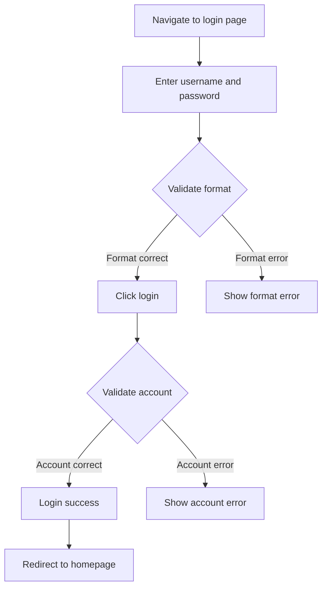

# SolarWire PRD to Test Case Generator

## Prerequisites

Load core rule files (syntax.md, note-guide.md, standards.md) as specified in SKILL.md before starting. Do not rely solely on summaries in this file.

## Configuration

- **Input**: `.solarwire/[requirement-name]/solarwire-prd.md`
- **Output**: `.solarwire/[requirement-name]/test-cases.xlsx`

---

## Overview

This skill guides AI to read and understand SolarWire PRD documents, then generate **detailed, executable** test cases in Markdown format.

**Core Principle**: Test cases must be:
1. **Executable** - Clear steps that can be followed
2. **Verifiable** - Expected results that can be checked
3. **Specific** - Exact test data, not vague descriptions
4. **Complete** - All necessary information included

**Focus**: Black-box functional testing only

---

## Test Case Quality Standards

### Bad Test Case (Too Vague)

| Field | Content |
|-------|---------|
| Name | Login Button-Click Action |
| Steps | 1. View Login button<br>2. Click button |
| Expected | Validate username and password |

**Problems**:
- "View" is not a specific action
- "Verify" cannot determine pass/fail
- Missing test data

### Good Test Case (Executable)

| Field | Content |
|-------|---------|
| Name | Login Page-Login Button-Normal Login Success |
| Precondition | 1. Registered test account: testuser@example.com / Test@123<br>2. User not logged in<br>3. Login page opened |
| Steps | 1. Enter in username input field: testuser@example.com<br>2. Enter in password input field: Test@123<br>3. Click 'Login' button |
| Test Data | Username: testuser@example.com<br>Password: Test@123 |
| Expected | 1. Login success, page redirects to homepage<br>2. Top navigation bar shows user avatar<br>3. token field exists in localStorage |
| Priority | P0 |

---

## How to Read PRD Document

### PRD Document Structure

```markdown
# Product Requirements Document - [Project Name]

## Document Information
## 1. Product Overview
   ### 1.4 User Stories
## 2. Feature Scope
   ### 2.1 Feature List
## 3. Business Flow
## 4. Page Design
## 5. Page Details (with SolarWire wireframes)
```

### Reading Order for Test Case Generation

1. **Document Information** → Project name, version
2. **User Stories (1.4)** → Acceptance test cases
3. **Feature List (2.1)** → Feature coverage test cases
4. **Business Flows (3.x)** → Flow path test cases
5. **Page Details (5.x)** → Detailed UI test cases from SolarWire notes

---

## Section 1: Reading User Stories

### User Story Format

```markdown
| ID | User Story | Acceptance Criteria | Priority |
| US-001 | As a user, I want to login, so that I can access my account |
  - Given user is on login page, when entering valid credentials, then login succeeds
  - Given user is on login page, when entering invalid credentials, then error shows
```

### How to Generate Detailed Test Cases

**Step 1**: Extract Given-When-Then
**Step 2**: Convert to specific test steps
**Step 3**: Add concrete test data
**Step 4**: Define verifiable expected results

### Example: US-001 Login

**Original Acceptance Criteria:**
```
Given user is on login page, when entering valid credentials, then login succeeds
```

**Generated Test Case:**

| Field | Content |
|-------|---------|
| ID | TC-001 |
| Module | Login Page |
| Name | US-001-User Login-Valid Credentials Login Success |
| Type | Functional Test |
| Precondition | 1. Registered test account: testuser@example.com, password: Test@123<br>2. User not logged in state<br>3. Browser opened, navigated to login page |
| Steps | 1. Enter in username input field: testuser@example.com<br>2. Enter in password input field: Test@123<br>3. Click 'Login' button |
| Test Data | Username: testuser@example.com<br>Password: Test@123 |
| Expected | 1. Page redirects to homepage (URL changes to /home)<br>2. Top navigation bar shows user avatar and username<br>3. auth_token field exists in browser localStorage<br>4. Login button no longer displayed |
| Priority | P0 |
| Related | US-001 |
| Remark | Verify normal login flow |

---

## Section 2: Reading Feature List

### Feature List Format

```markdown
| Module | Feature | Priority | Description |
| User Management | User Login | P0 | Support user login feature |
```

### How to Generate Test Cases

Each feature generates a feature coverage test case with specific verification points.

### Example

| Field | Content |
|-------|---------|
| ID | TC-002 |
| Module | User Management |
| Name | User Login Feature-Feature Verification |
| Type | Functional Test |
| Precondition | 1. System deployed and running normally<br>2. Test account registered |
| Steps | 1. Navigate to login page<br>2. Enter valid username and password<br>3. Click login button<br>4. Verify login success<br>5. Logout<br>6. Enter invalid username and password<br>7. Click login button<br>8. Verify login failure message |
| Test Data | Valid account: testuser@example.com / Test@123<br>Invalid account: invalid@test.com / wrong123 |
| Expected | 1. Valid account login success, redirect to homepage<br>2. Invalid account login failure, show error message<br>3. Error message content is "Invalid username or password" |
| Priority | P0 |
| Related | User Login Feature |

---

## Section 3: Reading Business Flows

### Mermaid Flowchart Format



### How to Generate Test Cases

**Identify all paths** and generate one test case per path.

### Path Analysis Example

| Path | Test Scenario | Key Verification Points |
|------|--------------|------------------------|
| Happy Path | A→B→C(correct)→D→F(correct)→G→I | Normal login complete flow |
| Format Error | A→B→C(error)→E | Format validation |
| Account Error | A→B→C(correct)→D→F(error)→H | Account verification failed |

### Generated Test Case: Happy Path

| Field | Content |
|-------|---------|
| ID | TC-003 |
| Module | Business Flow Test |
| Name | Login Flow-Normal Login Complete Flow |
| Type | Functional Test |
| Precondition | 1. Registered account: flowtest@example.com / Flow@123<br>2. Browser opened |
| Steps | 1. Enter login page URL in browser address bar<br>2. Verify page loaded, login form displayed<br>3. Enter in username input field: flowtest@example.com<br>4. Enter in password input field: Flow@123<br>5. Verify login button is clickable (not disabled)<br>6. Click login button<br>7. Wait for page redirect (max 3 seconds)<br>8. Verify current URL is homepage URL |
| Test Data | Username: flowtest@example.com<br>Password: Flow@123 |
| Expected | 1. Step 2: Login form displays normally, contains username, password input fields and login button<br>2. Step 5: Login button is clickable, background color is theme color<br>3. Step 7: Redirect completed within 3 seconds<br>4. Step 8: URL changes to /home or configured homepage path |
| Priority | P0 |
| Remark | Verify complete login flow, including page load, input, click, redirect steps |

---

## Section 4: Reading SolarWire Wireframes

### SolarWire Code Block Structure

SolarWire code blocks contain wireframe definitions with embedded notes. When reading PRD documents:

- `!title="Page Name"` → Module name for test cases
- `["Element Text"]` → Interactive element (button, input, etc.)
- `note="""..."""` → Element behavior description (source for test case generation)

**Key Reading Rules:**
- Every note describes testable behavior
- First line of note = element definition (use as test case name prefix)
- Numbered sections = test scenarios
- Dash items = specific conditions and expected results

### How to Read Page Title

```
!title="Login Page"  →  Module = Login Page
```

### How to Read Element Content

```
["Enter phone or email"]  →  Input field placeholder = "Enter phone or email"
["Login"]                 →  Button text = "Login"
```

---

## Section 5: Reading Notes (KEY FOR TEST CASES)

### Note Structure

```
note="""[Element Definition]
1. [Section Name]
   - [Detail 1]
   - [Detail 2]
2. [Section Name]
   - [Detail 1]"""
```

### First Line: Element Definition

The first line defines what this element IS. Use it as test case name prefix.

---

## Detailed Test Case Generation Rules

### Rule 1: Click Action / Click

**Test Type**: Functional Test

**Generation Steps**:
1. Identify the click trigger
2. List all preconditions for clicking
3. Define exact click action
4. List all observable results

---

### Rule 2: Success Handling / Success

**Test Type**: Functional Test

**Generation Steps**:
1. Define success state
2. List all observable success indicators
3. Verify each indicator separately

---

### Rule 3: Failure Handling / Failure

**Test Type**: Exception Test

**Generation Steps**:
1. Identify failure scenarios
2. Define how to trigger each failure
3. List all error indicators
4. Verify error message content exactly as quoted in note

---

### Rule 4: Input Rules / Input Rules

**Test Type**: Form Validation + Boundary Test

**Generation Steps**:
1. Extract length constraints → Generate boundary tests (min-1, min, max, max+1)
2. Extract format rules → Generate valid/invalid format tests
3. Extract character rules → Generate character validation tests
4. Extract display rules → Generate UI display tests

---

### Rule 5: Validation / Validation

**Test Type**: Form Validation

Generate tests for each validation rule: required check, format check, boundary check. Verify exact error messages as quoted in note.

---

### Rule 6: Disabled Conditions / Disabled Conditions

**Test Type**: UI Test

For each disabled condition, generate a test verifying: button is disabled, gray appearance, prohibited cursor, no response on click.

---

### Rule 7: Visibility Conditions / Visibility Conditions

**Test Type**: UI Test

For each visibility condition, generate tests for both shown and hidden states.

---

### Rule 8: Data Source / Data Source

**Test Type**: Functional Test

Generate tests for: data loading verification, default sort, field display rules (including empty state), status value display.

---

### Rule 9: Options / Options

**Test Type**: Functional Test

Generate tests for: options list display, default value, option selection function.

---

### Rule 10: Tooltip / Tooltip

**Test Type**: UI Test

Generate test for: tooltip content display, position, appearance/disappearance behavior.

---

### Rule 11: i18n / i18n

**Test Type**: i18n Test

For each language, generate test verifying correct text display.

---

## Section 6: Reading Table Elements

### Table Syntax

```solarwire
## @(100,50) w=500 border=1 note="""User list table
1. Data source
   - Always shows user list data from User Management module
2. Field descriptions
   - ID: Always shows unique user identifier
   - Name: Always shows user display name
   - Status: While status is Active, show 'Active'; While status is Disabled, show 'Disabled'
3. Sorting rules
   - When column header is clicked, sort by that column; default sort: created time descending"""
  # bg=#F9FAFB
    "ID"
    "Name"
    "Status"
    "Actions"
  # bg=#FFFFFF
    "1"
    "John Doe"
    "Active"
    "View | Edit"
```

### Generated Test Cases for Tables

**TC-090: Column Header Display**

| Field | Content |
|-------|---------|
| ID | TC-090 |
| Module | User List Page |
| Name | User List Table-Column Header Display Verification |
| Type | UI Test |
| Precondition | 1. Logged into system<br>2. User list page opened |
| Steps | 1. Check table first row (header row)<br>2. Record column names |
| Test Data | None |
| Expected | 1. Header row background color is #F9FAFB<br>2. Column names in order: ID, Name, Status, Actions<br>3. Column name text displayed in bold |
| Priority | P2 |

**TC-091: Sort Function-Sort by Name**

| Field | Content |
|-------|---------|
| ID | TC-091 |
| Module | User List Page |
| Name | User List Table-Sort Function-Sort by Name |
| Type | Functional Test |
| Precondition | 1. Logged into system<br>2. User list page opened<br>3. Multiple data records exist in list |
| Steps | 1. Click Name column header<br>2. Observe sort indicator change<br>3. Record Name values of first and last rows<br>4. Click Name column header again<br>5. Observe sort order change |
| Test Data | None |
| Expected | 1. After click, Name column header shows sort arrow (ascending)<br>2. Data sorted by Name ascending (A-Z)<br>3. After clicking again, changes to descending (Z-A)<br>4. Arrow direction changes accordingly |
| Priority | P1 |

---

## Test Case Output Format

### Step 1: Generate Markdown Test Cases

First, write all test cases to `.solarwire/[requirement-name]/test-cases.md` in the following Markdown format:

```markdown
# Test Cases - [Project Name]

## Document Information
| Project Name | [Name] |
| Version | v1.0 |
| Base PRD | .solarwire/[req-name]/solarwire-prd.md |
| Created Date | [Date] |

## Change Log
| Version | Date | Changes |
|---------|------|---------|
| v1.0 | [Date] | Initial test cases generated |

## Test Cases

### [Module Name]

| ID | Module | Name | Type | Precondition | Steps | Test Data | Expected Result | Priority | Related | Boundary | Exception | Remark |
|----|--------|------|------|-------------|-------|-----------|----------------|----------|---------|----------|-----------|--------|
| TC-001 | Login Page | Login Button-Click Action-Normal Login Success | Functional Test | 1. Registered account... | 1. Enter username... | Username: test@example.com | 1. Login success... | P0 | US-001 | | | |
| TC-002 | Login Page | Login Button-Success Handling-Token Save Verification | Functional Test | 1. Login page opened... | 1. Enter valid username... | Username: test@example.com | 1. token field exists in Local Storage... | P0 | US-001 | | | |

### [Another Module Name]

| ID | Module | Name | Type | Precondition | Steps | Test Data | Expected Result | Priority | Related | Boundary | Exception | Remark |
|----|--------|------|------|-------------|-------|-----------|----------------|----------|---------|----------|-----------|--------|
| TC-050 | User List Page | User List Table-Data Source-Data Loading Verification | Functional Test | 1. Logged in as admin account... | 1. Open user list page... | None | 1. Table displays user data... | P1 | | | | |

## Statistics
| Item | Count |
|------|-------|
| Total | N |
| P0 | N |
| P1 | N |
| P2 | N |
| Functional Test | N |
| Form Validation | N |
| Boundary Test | N |
| Exception Test | N |
| UI Test | N |
| i18n Test | N |
```

### Step 2: Convert Markdown to Excel

After generating the Markdown file, convert it to xlsx using the generate-excel script:

```bash
node sw-skills/solarwire/lib/generate-excel.js from-md \
  --input .solarwire/[requirement-name]/test-cases.md \
  --output .solarwire/[requirement-name]/test-cases.xlsx
```

**Excel Output Structure**:
- **Test Cases** sheet: All test cases in a flat table with styled headers (blue) and priority color-coding (P0=red, P1=amber)
- **By Module** sheet: Test cases grouped by module with module headers
- **Statistics** sheet: Summary counts by priority, type, and module

**Alternative: Batch Mode** (for large PRDs, to avoid context overflow):

```bash
# Initialize
node sw-skills/solarwire/lib/generate-excel.js create --output .solarwire/[req-name]/test-cases.xlsx

# Append each module's test cases as they are generated
node sw-skills/solarwire/lib/generate-excel.js append-batch \
  --file .solarwire/[req-name]/test-cases.xlsx \
  --json-file .solarwire/[req-name]/batch-tc.json

# Finalize (generates xlsx from accumulated data)
node sw-skills/solarwire/lib/generate-excel.js finalize --file .solarwire/[req-name]/test-cases.xlsx
```

For batch mode, write each batch of test cases to `.solarwire/[req-name]/batch-tc.json` as a JSON array:
```json
[
  {"id":"TC-001","module":"Login Page","name":"Login Success","type":"Functional Test","precondition":"...","steps":"...","test_data":"...","expected":"...","priority":"P0"}
]
```

---

## Incremental Feature Test Cases

When adding test cases for incremental features (PRD already has existing test cases):

1. Add a **Regression Notes** section after Statistics
2. List potentially affected existing test cases
3. Only write new/changed test cases

### Regression Notes Template

```markdown
## Regression Notes

### Affected Existing Test Cases
| Test Case ID | Module | Impact | Action Required |
|-------------|--------|--------|----------------|
| TC-001 | Login Page | Login flow changed | Needs re-verification |

### New Test Cases
[Only new/changed test cases in standard format]
```

---

## Priority Rules

### Inherited Priority

| Source | Test Case Priority |
|--------|-------------------|
| User Story P0 | P0 |
| User Story P1 | P1 |
| User Story P2 | P2 |
| Feature P0 | P0 |
| Feature P1 | P1 |

### Default Priority by Test Type

| Test Type | Default Priority |
|-----------|-----------------|
| Functional Test - Core flow | P0 |
| Functional Test - Auxiliary function | P1 |
| Form Validation | P0 |
| Boundary Test | P1 |
| Exception Test | P1 |
| UI Test | P2 |
| i18n Test | P2 |

---

## Test Case Naming Convention

### Format

```
[Element definition]-[Test scenario]-[Specific condition/data]
```

### Examples

| Name | Description |
|------|-------------|
| Login Button-Click Action-Validate and Submit Login | Click login button functional test |
| Login Button-Success Handling-Token Save Verification | Token save verification after login success |
| Username Input-Input Rules-Phone Format Valid | Phone format validation |
| Username Input-Format Validation-Insufficient Digits | Phone insufficient digits validation |
| Login Button-Disabled State-Username Empty | Button disabled when username empty |
| User List Table-Field Display-Status Value Display | Table status field display verification |

---

## Workflow

### Step 1: Read PRD File

Read the PRD file at: `.solarwire/[requirement-name]/solarwire-prd.md`

### Step 2: Parse Document Structure

1. Extract document information (project name, version)
2. Extract user stories with Given-When-Then
3. Extract feature list
4. Extract business flow diagrams
5. Extract all SolarWire code blocks with notes

### Step 3: Generate Detailed Test Cases

For each section:
1. **User Stories** → Generate acceptance test cases with specific test data
2. **Features** → Generate feature coverage test cases
3. **Business Flows** → Generate flow path test cases
4. **SolarWire Notes** → Generate detailed UI/Functional/Boundary test cases

### Step 4: Add Specific Details

For each test case, ensure:
- **Precondition**: Specific, verifiable conditions
- **Steps**: Numbered, executable actions
- **Test Data**: Exact values to input
- **Expected Result**: Observable, verifiable outcomes

### Step 5: Output Test Cases

Write all test cases to `.solarwire/[requirement-name]/test-cases.md` in the Markdown format defined above.

**IMPORTANT**: To avoid context overflow, generate test cases in batches. Write each module's test cases as they are generated, then append the next module.

### Step 6: Convert to Excel

After all test cases are written to the .md file, run the conversion script:

```bash
node sw-skills/solarwire/lib/generate-excel.js from-md \
  --input .solarwire/[requirement-name]/test-cases.md \
  --output .solarwire/[requirement-name]/test-cases.xlsx
```

Verify the xlsx file was generated successfully.

### Step 7: Generate Statistics

After all test cases are generated, calculate and append the Statistics section.

---

## Important Reminders

1. **Executable Steps** - Each step must be a specific action, not vague description
2. **Verifiable Results** - Expected results must be checkable
3. **Specific Data** - Use exact test data values, not descriptions
4. **Complete Information** - All necessary context included in each test case
5. **Black-Box Only** - Focus on user-visible behavior
6. **Fine-Grained** - Each note item generates separate, detailed test cases
7. **Page-Based Modules** - Use `!title` as module name
8. **Excel Output** - Final output is .xlsx (generate .md first, then convert using `node sw-skills/solarwire/lib/generate-excel.js from-md`)
9. **NOTE MUST USE TRIPLE QUOTES** - When referencing SolarWire code in test cases, always use `note="""..."""`, NEVER use `note="..."` or `note='...'`
10. **Document Language** - Write documents in the user's communication language. If unsure, ask the user.
