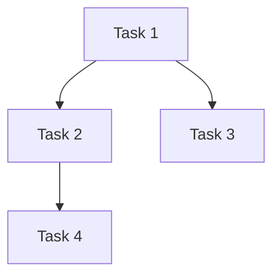

# Workflow: PRD to Implementation Plan

## Prerequisites

Load core rule files (syntax.md, note-guide.md, standards.md) as specified in SKILL.md before starting. Do not rely solely on summaries in this file.

## Configuration

- **Output Directory**: `.solarwire`
- **Input**: PRD document + Dev Design document

## Overview

### Phase 1: Input Analysis

**Step 1: Read PRD**
- Read the PRD document
- Extract feature list, page list, business flows
- Identify all functional requirements

**Step 2: Read Dev Design**
- Read the dev design document
- Extract technical architecture, data models, API design
- Identify technical dependencies

**Step 3: Cross-Reference**
- Map PRD features to dev design components
- Identify any gaps between PRD and dev design
- If gaps found, ask user to clarify

### Phase 2: Task Breakdown

**Step 4: Decompose into Tasks**

For each feature/page from PRD:
- Break into implementation tasks
- Each task should be independently completable
- Task granularity: 1-4 hours of work per task

**Task Types:**

| Type | Description | Example |
|------|-------------|---------|
| Database | Schema creation, migration | Create user table |
| API | Endpoint implementation | Implement login API |
| Frontend-Page | New page implementation | Implement login page |
| Frontend-Component | Reusable component | Implement user avatar component |
| Integration | Connect frontend to backend | Connect login form to API |
| Testing | Write tests | Unit tests for login flow |
| Configuration | Setup/config changes | Configure authentication middleware |

**Step 5: Identify Dependencies**
- Which tasks depend on others?
- Which tasks can run in parallel?
- Critical path identification

**Step 6: Estimate Effort**

| Size | Effort | Criteria |
|------|--------|----------|
| XS | 0.5-1 hour | Simple config, single field change |
| S | 1-2 hours | Single component, simple API |
| M | 2-4 hours | Full page, complex component |
| L | 4-8 hours | Multi-page feature, complex API |
| XL | 8-16 hours | Cross-cutting feature, architecture change |

### Phase 3: Execution Plan

**Step 7: Define Execution Order**
- Group tasks into phases
- Define milestones
- Identify critical path

**Phase Template:**
```
Phase 1: Foundation (Milestone: Data layer ready)
- Task 1.1: Create database schema [S]
- Task 1.2: Setup API framework [S]

Phase 2: Core Features (Milestone: Core flow working)
- Task 2.1: Implement login API [M]
- Task 2.2: Implement login page [M]
- Task 2.3: Connect login flow [S]

Phase 3: Extended Features (Milestone: All features complete)
- Task 3.1: Implement user list [M]
- Task 3.2: Implement user profile [M]

Phase 4: Polish (Milestone: Production ready)
- Task 4.1: Write tests [L]
- Task 4.2: Error handling [M]
- Task 4.3: Performance optimization [S]
```

**Step 8: Identify Risks**

| Risk | Impact | Likelihood | Mitigation |
|------|--------|------------|------------|
| [Risk description] | High/Medium/Low | High/Medium/Low | [Mitigation strategy] |

### Phase 4: Output

**Step 9: Generate Implementation Plan**
- Save to `.solarwire/[requirement-name]/implementation-plan.md`

**Step 10: User Review Gate**
- Present plan to user
- Wait for confirmation
- If adjustments needed, go back to Step 4

## Implementation Plan Document Structure

```markdown
# Implementation Plan - [Project Name]

## Document Information
| Project Name | [Name] |
| Version | v1.0 |
| Base PRD | .solarwire/[req-name]/solarwire-prd.md |
| Base Dev Design | .solarwire/[req-name]/dev-design.md |
| Created Date | [Date] |

## Change Log
| Version | Date | Changes |
|---------|------|---------|
| v1.0 | [Date] | Initial plan |

---

## 1. Task Summary

| Category | Count | Total Effort |
|----------|-------|-------------|
| Database | N | Xh |
| API | N | Xh |
| Frontend-Page | N | Xh |
| Frontend-Component | N | Xh |
| Integration | N | Xh |
| Testing | N | Xh |
| Configuration | N | Xh |
| **Total** | **N** | **Xh** |

## 2. Dependency Graph



## 3. Execution Plan

### Phase 1: [Phase Name] (Est: Xh)
**Milestone**: [Milestone description]

| Task ID | Task | Type | Size | Dependencies | Description |
|---------|------|------|------|-------------|-------------|
| T1.1 | [Task name] | [Type] | [S/M/L] | - | [Description] |
| T1.2 | [Task name] | [Type] | [S/M/L] | T1.1 | [Description] |

### Phase 2: [Phase Name] (Est: Xh)
...

## 4. Critical Path
T1.1 → T1.2 → T2.1 → T3.1 → T4.1

## 5. Risk Assessment

| Risk | Impact | Likelihood | Mitigation |
|------|--------|------------|------------|
| [Risk] | [H/M/L] | [H/M/L] | [Mitigation] |

## 6. Parallel Execution Opportunities

| Parallel Group | Tasks | Can Run Simultaneously |
|---------------|-------|----------------------|
| Group A | T1.1, T1.3 | Yes - no dependencies |
| Group B | T2.1, T2.2 | Yes - no dependencies |
```

## Important Reminders

1. **Read Both Documents** - Must read both PRD and dev design before planning
2. **Cross-Reference** - Every task must trace back to a PRD feature and dev design component
3. **Task Granularity** - Each task should be 1-4 hours, independently completable
4. **Dependency Analysis** - Identify ALL dependencies, not just obvious ones
5. **Critical Path** - Always identify the critical path
6. **Risk Assessment** - Consider technical risks, integration risks, and scope risks
7. **Realistic Estimates** - Use the effort size guide, don't underestimate
8. **User Confirmation Required** - Must get user approval before considering plan final

> For common rules (document language, etc.), follow SKILL.md Red Lines.