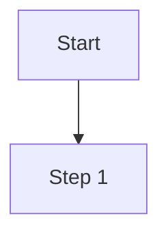
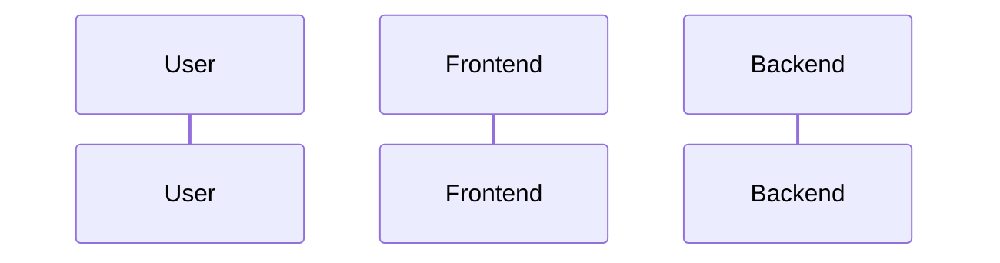

# Code to PRD Workflow

## Inlined Syntax Rules (CRITICAL)

- note必须用三引号: `note="""..."""`，绝不使用 `note="..."` 或 `note='...'`
- SolarWire代码块用 ` ```solarwire ` 开头，` ``` ` 结尾
- 边框颜色用 `b=`，边框宽度用 `s=`
- 圆形用 `("text")`，圆角矩形用 `["text"] r=N`
- 表格单元格和行不能指定 @(x,y)、w、h
- 幻觉属性禁止：multiline, truncate, stroke, strokeWidth
- 所有元素必须有坐标 @(x,y)
- See [syntax.md](syntax.md) for complete syntax reference
- See [note-guide.md](note-guide.md) for note writing rules
- See [standards.md](standards.md) for color/spacing/scenario standards

---

## Configuration

- **Output Directory**: `.solarwire`

---

## Overview

**Core Capability**: Read and understand the entire codebase, then reverse engineer into structured PRD documents with SolarWire wireframes.

### What This Skill Does

1. **Frontend Analysis**
   - Parse HTML/JSX/Vue components
   - Extract UI structure and layouts
   - Identify user interactions and flows

2. **Backend Analysis**
   - Parse API endpoints and routes
   - Extract data models and schemas
   - Identify business logic and rules

3. **PRD Generation**
   - Generate complete PRD documents
   - Create SolarWire wireframes
   - Document all features and interactions

## When to Invoke

- User wants to "reverse engineer" code to PRD
- User asks to "generate PRD from existing code"
- User provides a codebase and wants documentation
- User wants to understand an existing project's requirements

---

## Incremental Analysis Support

**IMPORTANT: Frontend and backend code are often maintained by different teams. This skill supports incremental analysis:**

### Scenario 1: Frontend Only

When only frontend code is provided:
- Generate UI wireframes and page structures
- Document user interactions and flows
- Infer API requirements from frontend calls
- Mark backend sections as `[To be confirmed]`

### Scenario 2: Backend Only

When only backend code is provided:
- Document API endpoints and data models
- Extract business logic and validation rules
- Infer UI requirements from API responses
- Mark frontend sections as `[To be confirmed]`

### Scenario 3: Full Stack

When both frontend and backend code are provided:
- Generate complete PRD with all sections
- Cross-reference frontend calls with backend endpoints
- Validate consistency between UI and API

### Merging Incremental PRDs

When a new codebase is provided for an existing PRD:

```
1. Check if `.solarwire/[requirement-name]/solarwire-prd.md` exists
2. Ask user: "Found existing PRD. Do you want to:
   - Merge new analysis into existing PRD
   - Create a new PRD version
   - Overwrite existing PRD"
3. Merge strategy:
   - Frontend analysis → Update Page Details section
   - Backend analysis → Update API Reference and Data Models sections
   - Mark resolved `[To be confirmed]` sections
```

---

## Workflow

### Phase 1: Codebase Discovery

**Goal: Understand the project structure**

```
1. Ask user for codebase location or files
2. Scan project structure:
   - Frontend directory (src/, pages/, components/)
   - Backend directory (api/, routes/, models/)
   - Configuration files (package.json, tsconfig.json)
3. Identify tech stack:
   - Frontend: React/Vue/Angular/HTML
   - Backend: Node.js/Python/Java/Go
   - Database: MySQL/MongoDB/PostgreSQL
4. Determine analysis scope:
   - Frontend only
   - Backend only
   - Full stack
5. Ask user to confirm scope
```

### Phase 2: Frontend Analysis

**Goal: Extract UI structure and interactions**

#### 2.1 Component Resolution (CRITICAL)

**Problem**: Well-decoupled code splits UI into many layers. A page file may only render `<LoginForm />`, while the actual form elements are in deeply nested child components. If you only read the page file, you will miss all UI elements.

**Rule**: You MUST recursively trace every component reference until you reach the actual UI elements (HTML tags, UI library components).

**Resolution Steps:**

```
1. Read page file (e.g., Login.tsx)
2. Identify all component references (e.g., <LoginForm />, <Footer />)
3. For each referenced component:
   a. Find its source file (check imports, conventions)
   b. Read the component source
   c. Identify its child components
   d. Repeat until reaching actual UI elements
4. Build complete component tree for the page
```

**Component Resolution Table:**

| Code Pattern | Resolution Action |
|--------------|-------------------|
| `<ComponentName />` | Find and read ComponentName source file |
| `<ComponentName prop={value} />` | Trace prop value to understand data flow |
| `{children}` | Read parent to understand what children are passed |
| `import Component from './Component'` | Read ./Component file |
| `import { Component } from '@/components'` | Search components directory for Component |
| `import Component from 'ui-library'` | Recognize as UI library component, map to SolarWire element |
| `render={() => <Component />}` | Read Component, this is a deferred render |
| `React.lazy(() => import('./Component'))` | Read Component, this is a lazy-loaded component |
| HOC: `withAuth(Component)` | Read Component + understand HOC behavior |
| Custom Hook: `useAuth()` | Read hook source, extract state/effects that affect UI |

**Component Tree Example:**

```
Login.tsx
├── LoginForm.tsx
│   ├── InputField.tsx (username)
│   ├── InputField.tsx (password)
│   ├── Checkbox.tsx (remember me)
│   └── SubmitButton.tsx
├── SocialLogin.tsx
│   ├── WeChatButton.tsx
│   └── DingTalkButton.tsx
└── Footer.tsx
    ├── Link (terms)
    └── Link (privacy)
```

**CRITICAL**: Do NOT stop at the page level. You must resolve the FULL component tree before generating wireframes. A page that only renders `<LoginForm />` without resolving LoginForm will produce an empty wireframe.

#### 2.2 Component Structure

Analyze frontend code to identify:

| Analysis Target | What to Extract |
|-----------------|-----------------|
| Pages/Routes | All page components and their routes |
| Components | Reusable UI components (resolve full tree) |
| Layouts | Page layout patterns |
| Navigation | Menu, tabs, breadcrumbs |

#### 2.3 UI Elements

For each page/component, identify (after full component resolution):

| Element Type | What to Extract |
|--------------|-----------------|
| Forms | Input fields, validation rules, submit actions |
| Buttons | Click handlers, disabled conditions |
| Tables | Columns, data source, actions |
| Modals | Trigger conditions, content, actions |
| Lists | Data source, item structure, interactions |

#### 2.4 State & Data Flow Tracing

**Problem**: Business logic is often in custom hooks, context providers, or state management stores, not in the component itself. You must trace these to understand the full behavior.

| Code Pattern | Resolution Action |
|--------------|-------------------|
| `const [state, setState] = useState()` | Extract initial state and all setState calls |
| `const { data } = useQuery()` | Trace query to understand data source |
| `const value = useContext()` | Find provider, extract provided value |
| `const store = useSelector()` | Find reducer, extract state shape |
| `const [state, dispatch] = useReducer()` | Read reducer, extract all actions |
| Custom hook `useXxx()` | Read hook source, extract returned state/methods |
| `useEffect(() => {}, [dep])` | Extract side effects and dependencies |
| `props.xxx` | Trace from parent component |

#### 2.5 Interactions

Extract interaction patterns:

```
- Event handlers (onClick, onChange, onSubmit)
- State changes (useState, Vuex, Redux)
- Navigation flows (router.push, href)
- API calls (fetch, axios, graphql)
```

### Phase 3: Backend Analysis

**Goal: Extract API and business logic**

#### 3.1 API Endpoints

Analyze backend routes to identify:

| Analysis Target | What to Extract |
|-----------------|-----------------|
| Routes | All API endpoints (method, path) |
| Parameters | Request params, body, query |
| Responses | Response structure, status codes |
| Authentication | Auth requirements, permissions |

#### 3.2 Data Models

Analyze database schemas/models:

| Analysis Target | What to Extract |
|-----------------|-----------------|
| Entities | All data entities/tables |
| Fields | Field names, types, constraints |
| Relations | Entity relationships |
| Validation | Field validation rules |

#### 3.3 Business Logic

Extract business rules from code:

```
- Validation rules
- Calculation formulas
- State transitions
- Permission checks
- Error handling
```

### Phase 4: PRD Generation

**Goal: Generate complete PRD document**

Follow the exact PRD structure from workflow-prd.md:

```markdown
# Product Requirements Document - [Project Name]

## Document Information
| Project Name | [Project Name] |
|-------------|----------------|
| Version | v1.0 |
| Type | Reverse Engineering |
| Created Date | [Date] |

---

## 1. Product Overview

### 1.1 Product Background
[Inferred from codebase structure and comments]

### 1.2 Target Users
[Inferred from authentication and user-related code]

### 1.3 Core Value
[Inferred from main features]

### 1.4 User Stories

| ID | User Story | Acceptance Criteria | Priority |
|----|------------|---------------------|----------|
| US-001 | As a [role], I want to [action], so that [benefit] | - Given [context], when [action], then [result] | P0 |

---

## 2. Feature Scope

### 2.1 Feature List
| Module | Feature | Priority | Description |
|--------|---------|----------|-------------|
| [Module 1] | [Feature 1] | P0 | [Description] |

### 2.2 Feature Boundary
- Included: [List included features]
- Not Included: [List excluded features]

---

## 3. Business Flow

### 3.1 Core Business Flowchart


### 3.2 Interaction Sequence Diagram


---

## 4. Page Design

### 4.1 Page List
| Page Name | Page Type | Description |
|-----------|-----------|-------------|
| [Page 1] | Main Page | [Description] |

---

## 5. Page Details

[For each page, generate SolarWire wireframe with notes]

---

## 6. Non-functional Requirements

### 6.1 Performance Requirements
- Page load time: < 2 seconds
- API response time: < 500ms

### 6.2 Security Requirements
- [List security requirements]

### 6.3 Compatibility Requirements
- Browsers: Chrome 90+, Safari 14+
- Mobile: iOS 14+, Android 10+

---

## 7. Appendix

### 7.1 Glossary
[Key terms and definitions from codebase analysis]

### 7.2 References
- Frontend codebase: [path]
- Backend codebase: [path]
- API documentation: [if available]
```

---

## Output File Structure

```
.solarwire/                              # Root directory for all PRD outputs
├── [project-name]/                      # Folder for project
│   └── solarwire-prd.md                 # PRD document (fixed name)
│
├── [requirement-name-2]/                # Folder for requirement 2
│   └── solarwire-prd.md
│
└── ...                                  # More requirement folders
```

**Naming Convention:**
- Root directory: `.solarwire` (at project root)
- Requirement folder: Based on the requirement/project name
- PRD file: Always named `solarwire-prd.md`

---

## Frontend Code to SolarWire Element Mapping

### Element Mapping Table

| Frontend Code | SolarWire Element |
|---------------|-------------------|
| `<button>Submit</button>` | `["Submit"] @(x,y) w=100 h=40 bg=#3B82F6 c=#FFFFFF` |
| `<input type="text" placeholder="Enter...">` | `["Enter..."] @(x,y) w=200 h=40 bg=#FFFFFF b=#E5E7EB c=#9CA3AF` |
| `<input type="password">` | `["••••••"] @(x,y) w=200 h=40 bg=#FFFFFF b=#E5E7EB` |
| `<input type="checkbox">` | `"☑ Label" @(x,y)` |
| `<input type="radio">` | `"○ Label" @(x,y)` |
| `<select>` | `["Select option  ▾"] @(x,y) w=200 h=40 bg=#FFFFFF b=#E5E7EB` |
| `<textarea>` | `"""Line 1\nLine 2\nLine 3""" @(x,y) w=300` |
| `<h1>Title</h1>` | `"Title" @(x,y) size=24 bold` |
| `<p>Text</p>` | `"Text" @(x,y)` |
| `<a href="...">Link</a>` | `"Link" @(x,y) c=#3B82F6 text-decoration=underline` |
| `` | `[?"Logo"] @(x,y) w=100 h=100 bg=#F9FAFB b=#E5E7EB s=1` |
| `<table>` | `## @(x,y) w=500 border=1` |
| `<hr>` | `-- @(x1,y1)->(x2,y2) c=#E5E7EB` |
| `<div class="card">` | `["Card Title"] @(x,y) w=300 h=200 r=8 bg=#FFFFFF b=#E5E7EB s=1` |
| Timeline/Stepper | Convert to table or list |
| Progress bar | Two overlapping rectangles (background + fill) |

### UI Component Library Detection

| Library | Table Detection Pattern |
|---------|----------------------|
| Ant Design | `<Table columns={columns} dataSource={data} />` |
| Element UI | `<el-table :data="tableData">` |
| AG Grid | `<ag-grid :rowData="gridData">` |
| Material UI | `<Table>...</Table>` |

### Frontend-Backend Data Mapping

| Frontend Pattern | Backend Requirement | Mock Data |
|------------------|---------------------|-----------|
| `{user.name}` | User API - name field | "John Doe" |
| `{items.map(...)}` | List API - array response | Generate 3-5 items |
| `{data.total}` | Pagination API - total count | "100" |
| `{item.status === 'active'}` | Status field with enum | "active", "inactive" |
| `{new Date(item.created)}` | Date field | "2024-01-15" |

---

## Mock Data Generation

**CRITICAL: Always generate realistic mock data, never leave fields empty**

### Mock Data Rules

| Element Type | Mock Data Strategy |
|--------------|-------------------|
| **User names** | Use realistic names: "John Doe", "张三", "田中太郎" |
| **Emails** | Use realistic emails: "john@example.com" |
| **Dates** | Use realistic dates: "2024-01-15", "2024-01-15 14:30" |
| **Status** | Use meaningful values: "Active", "正常", "有効" |
| **Numbers** | Use realistic values: "¥1,234.00", "100 items" |
| **IDs** | Use realistic IDs: "USR-001", "202401150001" |
| **Descriptions** | Use meaningful text: "This is a sample description..." |
| **Empty states** | Use meaningful placeholders: "No data", "暂无数据" |

### Table Mock Data Example

**Bad (Empty/Placeholder):**
```solarwire
## @(100,50) w=500 border=1
  # bg=#F9FAFB
    "ID"
    "Name"
    "Status"
  #
    ""
    ""
    ""
```

**Good (Realistic Mock Data):**
```solarwire
## @(100,50) w=500 border=1 note="""User list table
1. Data source
   - User list data from User Management module
2. Field descriptions
   - ID: Unique user identifier
   - Name: User display name
   - Status: 1=Active, 0=Disabled"""
  # bg=#F9FAFB bold
    ["ID"]
    ["Name"]
    ["Status"]
  # bg=#F9FAFA
    ["USR-001"]
    ["John Doe"]
    ["Active"]
  #
    ["USR-002"]
    ["张三"]
    ["Active"]
  # bg=#F9FAFB
    ["USR-003"]
    ["田中太郎"]
    ["Disabled"]
```

---

## Complex UI Pattern Conversion

### Timeline/Stepper → Table or List

**Frontend Timeline/Stepper code:**
```jsx
<Steps current={1}>
  <Step title="Submitted" description="2024-01-15 10:00" />
  <Step title="Under Review" description="2024-01-15 14:30" />
  <Step title="Approved" description="Pending" />
</Steps>
```

**Convert to Table:**
```solarwire
## @(100,50) w=400 border=1 note="""Approval timeline
1. Data source
   - Approval history from Workflow module
2. Field descriptions
   - Step: Approval stage name
   - Status: Current status
   - Time: Action timestamp"""
  # bg=#F9FAFB bold
    ["Step"]
    ["Status"]
    ["Time"]
  # bg=#EFF6FF
    ["Submitted"]
    ["✓ Completed"]
    ["2024-01-15 10:00"]
  # bg=#EFF6FF
    ["Under Review"]
    ["● In Progress"]
    ["2024-01-15 14:30"]
  #
    ["Approved"]
    ["○ Pending"]
    ["-"]
```

**Or Convert to List:**
```solarwire
"Approval Timeline" @(100,50) bold

"1. Submitted" @(100,80)
"   ✓ Completed - 2024-01-15 10:00" @(100,100) c=#22C55E

"2. Under Review" @(100,130)
"   ● In Progress - 2024-01-15 14:30" @(100,150) c=#3B82F6

"3. Approved" @(100,180)
"   ○ Pending" @(100,200) c=#9CA3AF
```

### Progress Bar → Text with Percentage

**Frontend Progress Bar:**
```jsx
<Progress percent={60} />
```

**Convert to Rectangles:**
```solarwire
"Upload Progress: 60%" @(100,50)
[] @(100,70) w=200 h=10 bg=#E5E7EB r=5
[] @(100,70) w=120 h=10 bg=#3B82F6 r=5
```

### Loading State → Placeholder with Note

**Frontend Loading:**
```jsx
{isLoading ? <Skeleton /> : <DataList data={data} />}
```

**Convert to Placeholder with Note:**
```solarwire
["Loading data..."] @(100,50) w=200 h=40 c=#9CA3AF note="""Loading state
1. Display condition
   - Show while fetching data from backend
2. Behavior
   - Auto-hide when data loaded
   - Show actual data list on success"""
```

---

## Note Writing Guidelines

Key rules when generating notes from code analysis:
| Code Pattern | Note Content |
|--------------|--------------|
| `onClick={handleSubmit}` | "Click action - Submit form data" |
| `required` attribute | "Validation - Required field" |
| `disabled={condition}` | "Disabled conditions - [condition]" |
| `onChange={handleChange}` | "Interaction - Update state on change" |
| `errorMessage` state | "Error handling - Display: [message]" |
| API call in handler | "API - Call [endpoint] on [action]" |

---

## Multi-language (i18n) Support

CRITICAL: Only add i18n when user explicitly confirms multi-language support is needed.

---

## SolarWire Wireframe Specifications

Key principles when generating wireframes from code:
1. All elements must have coordinates @(x,y)
2. Text content MUST use double quotes
3. Choose appropriate element types based on UI components
4. Each code block handles only one independent view
5. Every page must have a container rectangle

### Code Block Format (CRITICAL)

All SolarWire wireframes MUST be enclosed in standard Markdown code blocks.

**Correct format:**

````markdown
```solarwire
!title="Page Name"
!c=#111827
!size=13
!bg=#F9FAFB

[] @(0,0) w=1440 h=900 bg=#FFFFFF

// ... elements ...
```
````

**Wrong formats (NEVER use):**
```
</solarwire>       // Never use HTML-like closing tags
<end>              // Never use custom closing tags
```

**Rule**: Always use triple backticks with `solarwire` language tag. Opening is ` ```solarwire `, closing is ` ``` `. Nothing else.

### Table Cell Rules (CRITICAL)

**NEVER assign coordinates or dimensions to table cell elements.**

Table cells are auto-sized by the table renderer. The `w` and `h` attributes are reserved for the table itself.

**Wrong (NEVER do this):**
```solarwire
## @(100,50) w=500 border=1
  # bg=#F9FAFB
    ["ID"] @(100,60) w=100 h=30
    ["Name"] @(200,60) w=200 h=30
```

**Correct:**
```solarwire
## @(100,50) w=500 border=1
  # bg=#F9FAFB
    ["ID"]
    ["Name"]
```

**Also wrong (NEVER do this on table rows):**
```solarwire
## @(100,50) w=500 border=1
  # @(100,80) w=300 h=30
    ["Value"]
```

**Rule**:
- Table (`##`): can have `@(x,y)`, `w`, `h`
- Table row (`#`): can have `bg`, `c`, `b`, `s`, etc. but NOT `@(x,y)`, `w`, `h`
- Table cells: can have `bg`, `c`, `b`, `s`, `colspan`, `rowspan`, etc. but NOT `@(x,y)`, `w`, `h`

---

## Example: Full Codebase Analysis

### Input: Project Structure

```
my-app/
├── frontend/
│   ├── src/
│   │   ├── pages/
│   │   │   ├── Login.tsx
│   │   │   ├── Dashboard.tsx
│   │   │   └── Users.tsx
│   │   ├── components/
│   │   │   ├── Header.tsx
│   │   │   └── Table.tsx
│   │   └── api/
│   │       └── auth.ts
├── backend/
│   ├── routes/
│   │   ├── auth.ts
│   │   └── users.ts
│   ├── models/
│   │   ├── User.ts
│   │   └── Session.ts
│   └── middleware/
│       └── auth.ts
└── package.json
```

### Analysis Steps

1. **Read Login.tsx** → Extract login form structure, validation, API calls
2. **Read Dashboard.tsx** → Extract dashboard layout, widgets, data sources
3. **Read Users.tsx** → Extract user list table, actions, filters
4. **Read auth.ts (frontend)** → Extract API client methods
5. **Read auth.ts (backend)** → Extract authentication endpoints
6. **Read users.ts** → Extract user management endpoints
7. **Read User.ts** → Extract user data model
8. **Read Session.ts** → Extract session data model

---

## Important Reminders

1. **Read All Code** - Analyze entire codebase, not just entry files
2. **Resolve Full Component Tree** - Recursively trace every component reference until reaching actual UI elements. NEVER stop at the page level
3. **Trace State & Data Flow** - Follow custom hooks, context, and state management to understand full behavior
4. **Understand Context** - Infer business meaning from code patterns
5. **Follow SolarWire Syntax** - Use syntax rules from [syntax.md](syntax.md)
6. **Generate Complete PRD** - Use PRD template from [workflow-prd.md](workflow-prd.md)
7. **Document APIs** - Extract all endpoints from backend routes
8. **Document Data Models** - Extract all schemas from database models
9. **Infer Business Logic** - Extract rules from validation and processing code
10. **Generate Wireframes** - Create SolarWire for every page/component
11. **Add Notes** - Use note writing rules from [note-guide.md](note-guide.md)
12. **Output to .solarwire** - Save PRD to `.solarwire/[project-name]/solarwire-prd.md`
13. **NOTE MUST USE TRIPLE QUOTES** - Always use `note="""..."""`, NEVER use `note="..."` or `note='...'`. Single/double quotes for notes will cause parsing errors
14. **Resolve Full Component Tree** - Must recursively resolve all component references before generating wireframes
