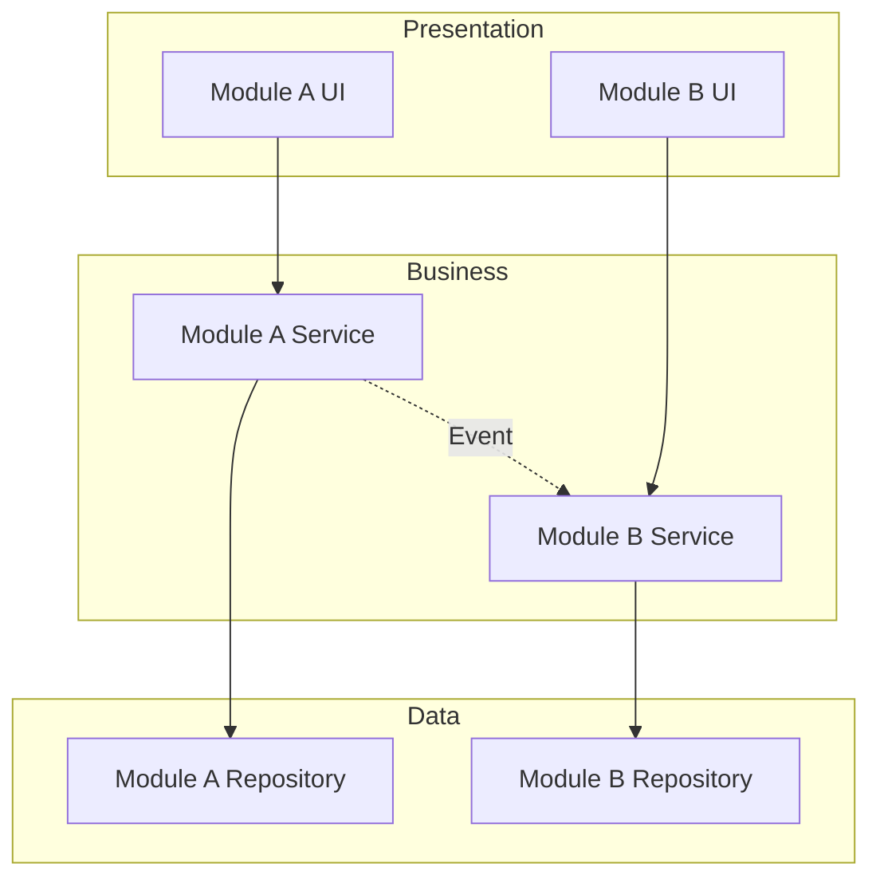
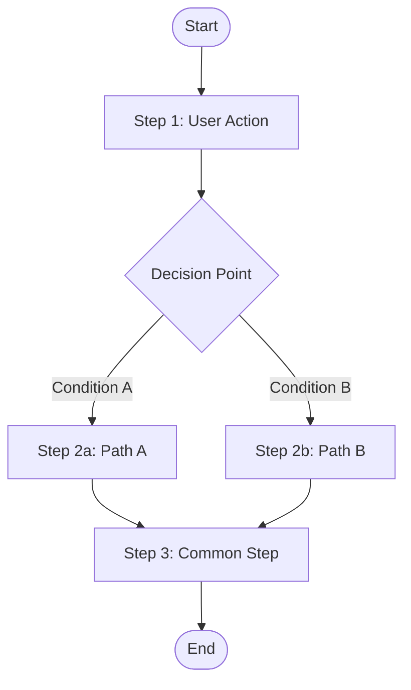
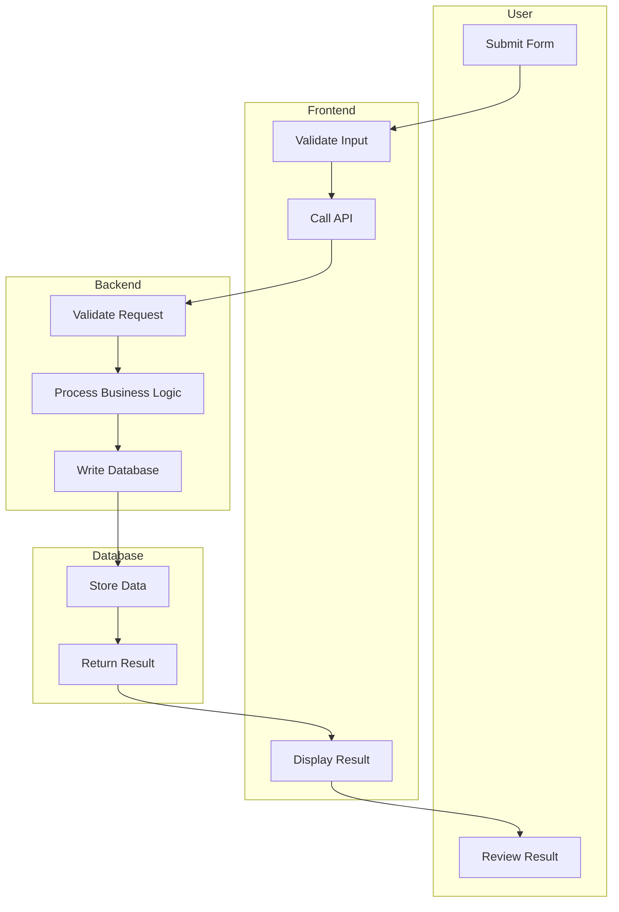
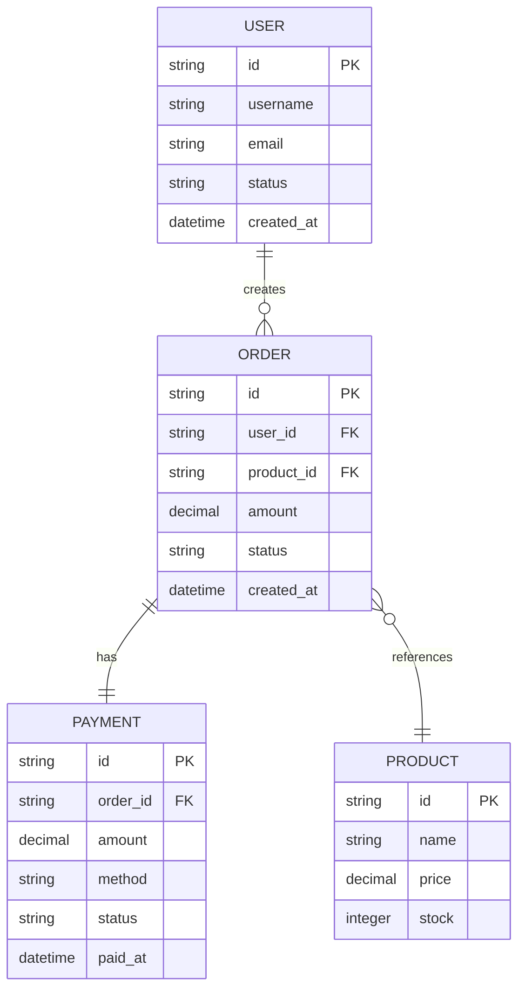

## Inlined Syntax Rules (CRITICAL)

- note必须用三引号: `note="""..."""`，绝不使用 `note="..."` 或 `note='...'`
- SolarWire代码块用 ` ```solarwire ` 开头，` ``` ` 结尾
- 边框颜色用 `b=`，边框宽度用 `s=`
- 圆形用 `("text")`，圆角矩形用 `["text"] r=N`
- 表格单元格和行不能指定 @(x,y)、w、h
- 幻觉属性禁止：multiline, truncate, stroke, strokeWidth
- 所有元素必须有坐标 @(x,y)
- See [syntax.md](syntax.md) for complete syntax reference
- See [note-guide.md](note-guide.md) for note writing rules
- See [standards.md](standards.md) for color/spacing/scenario standards

# Technical Design Document Generator

## Configuration

- **Output Directory**: `.solarwire`

---

## Overview

**Core Capability**: Generate technical design documents from confirmed PRD, bridging "what to build" and "how to build it".

### What This Skill Does

1. **Read PRD** - Parse confirmed PRD document, extract all requirements
2. **System Architecture** - Design module structure and dependencies
3. **Business Flow** - Generate detailed flow and swimlane diagrams
4. **Data Model** - Define entities, fields, and relationships
5. **Database Schema** - Design table structures with indexes and constraints
6. **API Definition** - Define all API endpoints with request/response formats
7. **Self-Review** - Validate consistency with PRD
8. **User Confirmation** - Get user sign-off on technical design

## When to Invoke

- User says "generate technical design" or "dev design"
- PRD has been confirmed and user wants to proceed to implementation
- User asks "how should we implement this?"
- User wants to bridge PRD and coding phase

---

## Workflow

### Step 1: Read PRD

**Goal: Extract all requirements from confirmed PRD**

```
1. Read `.solarwire/[requirement-name]/solarwire-prd.md`
2. Extract:
   - User Stories (Section 1.4)
   - Feature List (Section 2.1)
   - Feature Boundary (Section 2.2)
   - Business Flow (Section 3)
   - Page List (Section 4)
   - Page Details (Section 5)
   - Non-functional Requirements (Section 6)
   - API Reference (Section 7.1)
   - Data Models (Section 7.2)
3. Validate PRD completeness:
   - All sections present
   - No [To be confirmed] markers
   - User Stories have acceptance criteria
4. If PRD is incomplete:
   - Report missing sections to user
   - Ask user to complete PRD first
   - Do NOT proceed with incomplete PRD
```

**PRD Extraction Checklist:**

| Section | What to Extract | Why Needed |
|---------|----------------|------------|
| User Stories | Roles, actions, benefits | API permission design |
| Feature List | Modules, features, priorities | Module decomposition |
| Business Flow | Flow steps, decisions | Flow and swimlane diagrams |
| Page Details | UI elements, interactions | API endpoints, data models |
| Non-functional | Performance, security | Architecture constraints |
| API Reference | Existing endpoints | API design baseline |
| Data Models | Existing entities | Database schema baseline |

### Step 2: System Architecture

**Goal: Design module structure and dependencies**

```
1. Decompose system into modules based on Feature List
2. Define module responsibilities (Single Responsibility Principle)
3. Identify module dependencies
4. Determine communication patterns between modules
5. Generate Mermaid architecture diagram
```

**Module Decomposition Rules:**

| PRD Feature Count | Module Strategy |
|-------------------|-----------------|
| 1-3 features | Single module |
| 4-8 features | Group by business domain |
| 9+ features | Layered architecture (presentation, business, data) |

**Architecture Diagram Format:**



**Architecture Description Template:**

For each module, document:

| Item | Description |
|------|-------------|
| Module Name | [Name] |
| Responsibility | [What this module does] |
| Dependencies | [Which modules it depends on] |
| Exposed Interfaces | [What it provides to other modules] |
| Communication | [Sync/Async, Event/HTTP] |

### Step 3: Business Flow & Swimlane

**Goal: Generate detailed flow and swimlane diagrams from PRD**

#### 3.1 Core Business Flow

Generate Mermaid flowchart from PRD Business Flow section:



**Flow Diagram Rules:**

| Rule | Description |
|------|-------------|
| Start/End | Use rounded rectangle `([text])` |
| Process | Use rectangle `[text]` |
| Decision | Use diamond `{text}` |
| Arrows | Use `-->` with optional label `-->|label|` |
| Sub-flows | Use subgraph for grouping |
| Error paths | Include error handling branches |

**Flow Depth Requirements:**

| PRD Flow Level | Dev Design Flow Level |
|----------------|----------------------|
| High-level step | Expand to system-level operations |
| User action | Include validation, processing, response |
| Decision | Include all conditions and error paths |
| Data operation | Include read/write/validate details |

#### 3.2 Swimlane Diagram

Generate Mermaid swimlane diagram showing actor responsibilities:



**Swimlane Rules:**

| Rule | Description |
|------|-------------|
| Actors | User, Frontend, Backend, Database, External Service |
| Flow direction | Top to bottom (TD) or left to right (LR) |
| Each step | Belongs to exactly one actor |
| Cross-lane | Use arrows to show handoff |
| Error handling | Include error return paths |

### Step 4: Data Model

**Goal: Define entities, fields, and relationships**

**Entity Definition Template:**

For each entity from PRD:

| Field | Type | Required | Default | Description |
|-------|------|----------|---------|-------------|
| id | string (UUID) | Yes | Auto-generated | Primary key |
| [field] | [type] | [yes/no] | [value] | [description] |
| created_at | datetime | Yes | Current time | Creation timestamp |
| updated_at | datetime | Yes | Current time | Last update timestamp |

**Entity Relationship Template:**

| Entity A | Relationship | Entity B | Description |
|----------|-------------|----------|-------------|
| User | 1:N | Order | One user has many orders |
| Order | N:1 | Product | Many orders reference one product |
| Order | 1:1 | Payment | One order has one payment |

**Mermaid ER Diagram:**



**Data Model Rules:**

| Rule | Description |
|------|-------------|
| Every entity | Must have `id` (UUID), `created_at`, `updated_at` |
| Foreign keys | Named as `[entity]_id` |
| Status fields | Use string enum, document all values |
| Amount fields | Use decimal, specify precision |
| Soft delete | Add `deleted_at` field if needed |
| Audit fields | Add `created_by`, `updated_by` if needed |

**Type Mapping Reference:**

| Business Type | Database Type | Description |
|---------------|---------------|-------------|
| ID | VARCHAR(36) / UUID | Primary key |
| Short text | VARCHAR(50-255) | Names, titles |
| Long text | TEXT | Descriptions, content |
| Integer | INT / BIGINT | Counts, quantities |
| Decimal | DECIMAL(10,2) | Money, rates |
| Boolean | TINYINT(1) | Flags |
| Date | DATE | Birth date, event date |
| DateTime | DATETIME / TIMESTAMP | Created at, updated at |
| JSON | JSON | Flexible data, settings |
| Enum | VARCHAR(20) | Status, type fields |

### Step 5: Database Schema

**Goal: Design complete table structures with indexes and constraints**

**Table Schema Template:**

| Table | Field | Type | Nullable | Default | Constraint | Description |
|-------|-------|------|----------|---------|------------|-------------|
| users | id | VARCHAR(36) | NO | - | PK | Primary key |
| users | username | VARCHAR(50) | NO | - | UNIQUE | Login name |
| users | email | VARCHAR(255) | NO | - | UNIQUE | Email address |
| users | password_hash | VARCHAR(255) | NO | - | - | Hashed password |
| users | status | VARCHAR(20) | NO | 'active' | CHECK IN (...) | Account status |
| users | created_at | DATETIME | NO | CURRENT_TIMESTAMP | - | Creation time |
| users | updated_at | DATETIME | NO | CURRENT_TIMESTAMP | ON UPDATE | Last update |

**Index Design Template:**

| Table | Index Name | Fields | Type | Purpose |
|-------|-----------|--------|------|---------|
| users | idx_users_email | email | UNIQUE | Email lookup |
| users | idx_users_status | status | NORMAL | Status filter |
| orders | idx_orders_user_id | user_id | NORMAL | User's orders |
| orders | idx_orders_created_at | created_at | NORMAL | Time range query |
| orders | idx_orders_user_status | user_id, status | COMPOSITE | User orders by status |

**Constraint Design Template:**

| Table | Constraint | Type | Definition | Error Message |
|-------|-----------|------|------------|---------------|
| users | ck_users_status | CHECK | status IN ('active', 'disabled', 'locked') | Invalid user status |
| orders | ck_orders_amount | CHECK | amount >= 0 | Order amount cannot be negative |
| orders | fk_orders_user | FOREIGN KEY | user_id REFERENCES users(id) | User not found |

**Database Schema Rules:**

| Rule | Description |
|------|-------------|
| Primary key | Always UUID stored as VARCHAR(36) |
| Foreign key | Always `[table]_id`, reference parent PK |
| Timestamps | All tables have `created_at`, `updated_at` |
| Soft delete | Use `deleted_at` DATETIME NULL, never physical delete |
| Status | Use VARCHAR(20) with CHECK constraint |
| Indexes | Add for: FK fields, frequently filtered fields, sort fields |
| Composite indexes | For common query combinations |
| Naming | Table names: snake_case plural; Field names: snake_case |

### Step 6: API Definition

**Goal: Define all API endpoints with request/response formats**

**API Definition Template:**

| Method | Path | Description | Auth | Request Body | Response | Error Codes |
|--------|------|-------------|------|-------------|----------|-------------|
| POST | /api/v1/users | Create user | Required | CreateUserReq | UserResp | 400, 409, 500 |
| GET | /api/v1/users | List users | Required | - | UserListResp | 400, 500 |
| GET | /api/v1/users/:id | Get user | Required | - | UserResp | 404, 500 |
| PUT | /api/v1/users/:id | Update user | Required | UpdateUserReq | UserResp | 400, 404, 500 |
| DELETE | /api/v1/users/:id | Delete user | Required | - | EmptyResp | 404, 500 |

**Request/Response Schema Template:**

```
### POST /api/v1/users - Create User

Request:
{
  "username": "string, required, 3-50 chars, alphanumeric",
  "email": "string, required, valid email format",
  "password": "string, required, 8-32 chars, must contain letter and number",
  "role": "string, optional, enum: [admin, user], default: user"
}

Response (201):
{
  "id": "string, UUID",
  "username": "string",
  "email": "string",
  "role": "string",
  "status": "string",
  "created_at": "string, ISO 8601 datetime"
}

Error (400):
{
  "error": "VALIDATION_ERROR",
  "message": "Invalid request body",
  "details": [
    { "field": "email", "message": "Invalid email format" }
  ]
}

Error (409):
{
  "error": "CONFLICT",
  "message": "Username already exists"
}
```

**API Design Rules:**

| Rule | Description |
|------|-------------|
| RESTful | Use standard HTTP methods (GET, POST, PUT, DELETE) |
| Versioning | Prefix with `/api/v1/` |
| Authentication | All endpoints require auth unless explicitly public |
| Pagination | List endpoints support `page`, `page_size`, `sort`, `order` |
| Filtering | List endpoints support field-based filters as query params |
| Response format | Always JSON with consistent structure |
| Error format | Always include `error` code and `message` |
| Status codes | 200 (OK), 201 (Created), 400 (Bad Request), 401 (Unauthorized), 403 (Forbidden), 404 (Not Found), 409 (Conflict), 500 (Server Error) |

**Pagination Response Template:**

```
{
  "items": [...],
  "total": 100,
  "page": 1,
  "page_size": 20,
  "total_pages": 5
}
```

**API-Page Mapping:**

For each page in PRD, derive required APIs:

| Page Element | API Requirement |
|-------------|-----------------|
| List/Table | GET list API with pagination |
| Create Form | POST create API |
| Edit Form | GET detail API + PUT update API |
| Delete Button | DELETE API |
| Search/Filter | GET list API with query params |
| Dropdown options | GET options API or embedded in list |
| Statistics | GET statistics/aggregation API |
| File Upload | POST upload API |
| Export | GET export API |

### Step 7: Self-Review

**Goal: Validate technical design consistency with PRD**

#### Check 1: PRD Coverage

```
Check items:
- Every User Story has corresponding API endpoints
- Every Feature has corresponding module and data model
- Every Page has corresponding API endpoints
- Every Business Flow step is covered in flow diagrams
- Every UI interaction has API support

If missing:
- Add missing APIs, data models, or flow steps
- Document why certain PRD items are deferred (if any)
```

#### Check 2: Data Model Consistency

```
Check items:
- All API request/response fields exist in data models
- All foreign keys reference existing tables
- All status values have CHECK constraints
- All required fields are NOT NULL
- No orphan tables (every table is used by at least one API)

If inconsistent:
- Add missing fields to data models
- Add missing tables
- Fix foreign key references
```

#### Check 3: API Consistency

```
Check items:
- All API endpoints have request/response schemas
- All error codes are documented
- All auth requirements are specified
- No duplicate endpoints
- All page interactions are supported by APIs

If inconsistent:
- Add missing schemas
- Document missing error codes
- Remove or merge duplicate endpoints
```

#### Check 4: Architecture Consistency

```
Check items:
- All modules have clear responsibilities
- No circular dependencies between modules
- All module communication is documented
- Architecture supports non-functional requirements

If inconsistent:
- Refactor module boundaries
- Break circular dependencies
- Add missing communication patterns
```

**Fix Principle:**
- Fix all issues immediately, no need to re-review
- Proceed to Step 8 after fixing

### Step 8: User Confirmation

**Goal: Get user sign-off on technical design**

```
Technical design document generated and passed self-review.

File Location: .solarwire/[requirement-name]/dev-design.md

Includes:
- System Architecture (Section 1)
- Business Flow & Swimlane (Section 2)
- Data Model (Section 3)
- Database Schema (Section 4)
- API Definition (Section 5)

Please review:
1. Architecture - Is the module decomposition reasonable?
2. Data Model - Are entities and relationships correct?
3. Database Schema - Are indexes and constraints sufficient?
4. API Design - Are endpoints and schemas complete?
5. Business Flow - Are all paths covered?

Review Method:
- Edit directly in file
- Or tell me what needs adjustment

After review approval, this document will serve as the technical blueprint for implementation.

Please start reviewing, let me know if you have any questions.
```

**User Confirmation Rules:**
- MUST wait for user to explicitly confirm "ok" or "no problem"
- If user requests changes, go back to relevant step to update
- If user only needs minor adjustments, can fix inline

---

## Output Document Structure

```markdown
# Technical Design Document - [Project Name]

## Document Information
| Project Name | [Name] |
| Version | v1.0 |
| Base PRD | .solarwire/[req-name]/solarwire-prd.md |
| Created Date | [Date] |

## Change Log
| Version | Date | Changes |
|---------|------|---------|
| v1.0 | [Date] | Initial design |

---

## 1. System Architecture

### 1.1 Architecture Overview
[Mermaid diagram]

### 1.2 Module Description
[Module table for each module]

### 1.3 Module Dependencies
[Dependency description]

---

## 2. Business Flow

### 2.1 Core Business Flow
[Mermaid flowchart]

### 2.2 Swimlane Diagram
[Mermaid flowchart with subgraph]

---

## 3. Data Model

### 3.1 Entity Relationship
[Mermaid ER diagram]

### 3.2 Entity Definitions
[Entity field tables]

### 3.3 Entity Relationships
[Relationship table]

---

## 4. Database Schema

### 4.1 Table Structures
[Table schema tables]

### 4.2 Indexes
[Index tables]

### 4.3 Constraints
[Constraint tables]

---

## 5. API Definition

### 5.1 API Overview
[API summary table]

### 5.2 API Details
[Detailed request/response schemas for each endpoint]

---
```

---

## Incremental Feature Development Design

When designing for an incremental feature on top of an existing system:

### Marking Convention

| Mark | Meaning | Description |
|------|---------|-------------|
| **[New]** | New addition | Brand new module, table, API, or field |
| **[Modified]** | Changed from base | Existing item with changes |
| **[Unchanged]** | No change | Existing item referenced but not changed |

### Modified API/Table Rules

- Only write the **changed parts**, not the entire definition
- Include reference to base design
- Document what changed and why

**Example - Modified Table:**

```markdown
### users [Modified]

Changes from base design:
- Added field: `last_login_at` DATETIME NULL [New]
- Added field: `login_count` INT NOT NULL DEFAULT 0 [New]
- Modified constraint: `status` CHECK now includes 'suspended'

| Table | Field | Type | Nullable | Default | Constraint | Description |
|-------|-------|------|----------|---------|------------|-------------|
| users | last_login_at | DATETIME | YES | NULL | - | Last login time [New] |
| users | login_count | INT | NO | 0 | - | Total login count [New] |
```

**Example - Modified API:**

```markdown
### GET /api/v1/users [Modified]

Changes from base design:
- Added query param: `role` (filter by role) [New]
- Added query param: `login_after` (filter by last login time) [New]
- Response: Added `last_login_at`, `login_count` fields [New]
```

### Base PRD Reference

Always include reference to the base PRD:

```markdown
## Document Information
| Project Name | [Name] |
| Version | v1.1 |
| Base PRD | .solarwire/[req-name]/solarwire-prd.md |
| Base Dev Design | .solarwire/[req-name]/dev-design.md |
| Created Date | [Date] |
| Change Type | Incremental Feature |
```

---

## Output File Structure

```
.solarwire/                              # Root directory for all outputs
├── [requirement-name]/                  # Folder for requirement
│   ├── solarwire-prd.md                 # PRD document
│   └── dev-design.md                    # Technical design document
│
├── [requirement-name-2]/                # Folder for requirement 2
│   ├── solarwire-prd.md
│   └── dev-design.md
│
└── ...                                  # More requirement folders
```

**Naming Convention:**
- Root directory: `.solarwire` (at project root)
- Requirement folder: Based on the requirement/project name
- Dev design file: Always named `dev-design.md`

---

## Mermaid Diagram Standards

### Flowchart Conventions

| Element | Mermaid Syntax | Usage |
|---------|---------------|-------|
| Start/End | `([text])` | Rounded rectangle |
| Process | `[text]` | Rectangle |
| Decision | `{text}` | Diamond |
| Sub-process | `[[text]]` | Double rectangle |
| Data | `[(text)]` | Cylinder |
| Comment | `>text]` | Flag shape |

### Sequence Diagram Conventions

| Element | Mermaid Syntax | Usage |
|---------|---------------|-------|
| Participant | `participant` | System component |
| Message | `->>` | Synchronous call |
| Return | `-->>` | Response |
| Self-call | `->>+` / `-->>-` | Activation bar |
| Note | `Note over` | Annotation |
| Alt block | `alt` / `else` | Conditional |
| Loop block | `loop` | Iteration |

### ER Diagram Conventions

| Relationship | Mermaid Syntax | Example |
|-------------|---------------|---------|
| One to One | `\|\|--\|\|` | USER \|\|--\|\| PROFILE |
| One to Many | `\|\|--o{` | USER \|\|--o{ ORDER |
| Many to One | `}o--\|\|` | ORDER }o--\|\| PRODUCT |
| Many to Many | `}o--o{` | STUDENT }o--o{ COURSE |

---

## Design Decision Records

For important design decisions, document the rationale:

```markdown
### Decision: [Decision Title]

**Context**: [Why this decision is needed]

**Options Considered**:
1. [Option A] - Pros: [...], Cons: [...]
2. [Option B] - Pros: [...], Cons: [...]
3. [Option C] - Pros: [...], Cons: [...]

**Decision**: [Chosen option]

**Rationale**: [Why this option was chosen]

**Consequences**: [Impact of this decision]
```

---

## Important Reminders

1. **PRD Must Be Confirmed** - Never start dev design without confirmed PRD
2. **Read PRD Completely** - Extract all requirements before designing
3. **Architecture First** - Design architecture before data model and API
4. **Data Model Before API** - Define entities before endpoints
5. **Consistency Check** - Self-review against PRD after design
6. **User Confirmation Required** - Must get user sign-off before implementation
7. **No Placeholders** - All sections must be complete, no TBD or TODO
8. **Mermaid Diagrams** - Use Mermaid for all diagrams, no other formats
9. **Incremental Marking** - Use [New], [Modified], [Unchanged] for incremental features
10. **Modified Only Changes** - For modified items, only document what changed
11. **Base PRD Reference** - Always reference base PRD in document info
12. **Every Page Needs APIs** - Derive API requirements from every page in PRD
13. **Every Entity Needs Table** - Every data model entity maps to a database table
14. **Indexes For Performance** - Add indexes for FK, filter, and sort fields
15. **Constraints For Integrity** - Add CHECK constraints for status and enum fields
16. **Error Codes Documented** - Every API endpoint must document possible error codes
17. **Pagination Standard** - All list APIs support pagination with standard params
18. **Soft Delete Preferred** - Use `deleted_at` instead of physical delete
19. **UUID Primary Keys** - Use UUID for all primary keys
20. **Audit Fields** - Include `created_at`, `updated_at` on all tables
