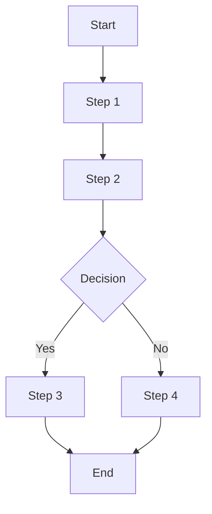
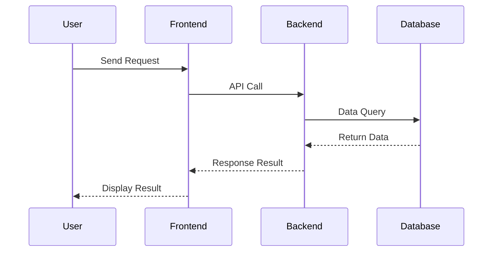

# PRD Workflow

## Inlined Syntax Rules (CRITICAL)

- note must use triple quotes: `note="""..."""`, never use `note="..."` or `note='...'`
- SolarWire code blocks start with ` ```solarwire ` and end with ` ``` `
- Border color uses `b=`, border width uses `s=`
- Circle uses `("text")`, rounded rectangle uses `["text"] r=N`
- Table cells and rows cannot specify @(x,y), w, h
- Table cell content should use `["text"]` (rectangle) instead of `"text"` — rectangles support more text formatting (bold, italic, size, color, alignment, etc.)
- Hallucinated attributes forbidden: multiline, truncate, stroke, strokeWidth
- All elements must have coordinates @(x,y)
- Plain text must use text element `"text"`, not rectangle `["text"]` to wrap plain text
- Rectangle element text must have `vertical-align=m` (vertically centered), `align=l` (horizontally left-aligned)
- After generating wireframes must run `node sw-skills/solarwire/validate-sw.js <path>` validation, fix syntax and re-validate if failed
- See [syntax.md](syntax.md) for complete syntax reference
- See [note-guide.md](note-guide.md) for note writing rules
- See [standards.md](standards.md) for color/spacing/scenario standards

## Inlined Note Writing Rules (CRITICAL)

- Note first line: functional description (e.g., "Login button"), NOT element type (e.g., "[Primary Button]")
- Note structure: First line = element definition; First level = numbered (1. 2. 3.); Second level = dash (-); Third level = double dash (--)
- EARS description style: Use condition-action patterns
  - Always [behavior] - for always-true behaviors
  - When [event], [behavior] - for event-triggered behaviors
  - While [condition], [behavior] - for state-dependent behaviors
  - If [condition], [behavior] - for exception/boundary handling
- Avoid bare enumerations (BAD: "Status: 1=Active, 0=Disabled"; GOOD: "While status is Active, show green tag 'Active'")
- Error messages MUST be quoted exactly as user sees them
- Forbidden in notes: visual details, technical implementation, API endpoints, CSS properties
- For modified elements: note must describe before→after change (e.g., "Was: [old behavior]. Now: [new behavior]")
- See [note-guide.md](note-guide.md) for complete note writing reference

---

## Configuration

- **Output Directory**: `.solarwire`

---

## Overview

This skill generates complete Product Requirements Documents (PRD), including:
1. **Complete PRD Document** (.md format)
2. **Mermaid Flowcharts/Sequence Diagrams**
3. **SolarWire Wireframes** (embedded in .md, each page with complete element descriptions)

---

## Scenario Detection

Before starting the workflow, determine which scenario applies:

### Scenario A: New Requirement
- User has a new requirement (may include new pages AND modifications to existing pages)
- Follow full Five Elements confirmation with user
- New pages: write complete wireframe
- Modified pages: only describe changed parts (Delta Only), do not copy unchanged content from old PRDs
- Existing page structure inferred from current code when available

### Scenario B: Code Reverse Engineering
- User provides existing codebase
- All pages inferred from code
- Five Elements answered from code analysis (no user questioning needed)
- Generate PRD following same template

**Detection Method:**
1. Ask user: "Do you have a new requirement, or do you want me to analyze existing code?"
2. Based on answer, select scenario and adjust workflow accordingly

---

## Code Reverse Engineering Sub-flow (Scenario B)

When user wants to generate PRD from existing code:

### Phase C1: Codebase Discovery
1. Ask user for codebase location
2. Scan project structure (frontend/backend)
3. Identify tech stack
4. Determine analysis scope

### Phase C2: Five Elements from Code
Extract the five UX layers from code analysis:

1. **Strategy Layer**: Infer from codebase structure, comments, business logic
2. **Scope Layer**: Identify all pages, features, and their relationships from code
3. **Structure Layer**: Extract navigation hierarchy and page organization from routes/menus
4. **Framework Layer**: Extract page layouts and interaction patterns from components
5. **Presentation Layer**: Infer visual hierarchy from component structure and styling

### Phase C3: Frontend Analysis
- Resolve full component tree (CRITICAL: never stop at page level)
- Extract UI elements, state, data flow
- Map frontend code to SolarWire elements

### Phase C4: Backend Analysis
- Extract API endpoints and data models
- Extract business logic and validation rules

### Phase C5: PRD Generation
- Generate PRD following the same template
- Include all five elements layers in document
- Run renderer validation

**Key Rules for Code Reverse Engineering:**
- Notes describe user-visible behavior ONLY, never API endpoints or technical implementation
- Resolve full component tree recursively - NEVER stop at page level
- Generate realistic mock data, never leave fields empty
- Use EARS style for all note descriptions

---

## Workflow

### Phase 0: Exploration & Preparation

**Goal: Understand project context and scope before collecting requirements**

**Step 0: Explore Project Context**
- Check existing code files (if any)
- Check existing documentation (if any)
- Check recent git commits (if any)
- Understand project background and goals

**Step 1: Scope Check**
- Determine if project needs to be decomposed into multiple sub-projects
- If too large, help user decompose and select first sub-project
- Decomposition criteria:
  - >5 independent modules → needs decomposition
  - >10 pages → needs decomposition
  - Multiple independent business flows → needs decomposition

**Step 2: Multiple Approaches Comparison (Optional)**
- Provide 2-3 design approaches
- Each with trade-off analysis
- Recommend one approach

---

### Phase 1: Five Elements Confirmation (CRITICAL)

**Goal: Systematically confirm requirements through 5 UX layers. Do NOT proceed to next layer until current layer is fully understood. Ask probing questions, follow first principles.**

**Step 3: Strategy Layer (战略层)**
```
Let me understand the business context:

1. What business problem are we trying to solve?
2. What is the business background that led to this need?
3. Who are the target users? What are their pain points?
4. What is the expected outcome / success criteria?
5. Why now? What triggered this requirement?
```

**Step 4: Scope Layer (范围层)**
```
Based on the strategy, let's define the scope:

1. What changes are involved?
   - New pages/modals/features to ADD
   - Existing pages/modals/features to MODIFY
   - Features to REMOVE
2. Which existing pages are affected? (If modifying existing features)
3. What is explicitly OUT OF SCOPE?
4. Are there any dependencies on other systems/features?
```

**Step 5: Structure Layer (结构层)**
```
Based on the scope, let's define the structure:

1. How should pages be organized? (Navigation hierarchy)
2. For NEW pages: What features should each page have?
3. For MODIFIED pages: What features need to change?
4. What are the user flows between pages?
5. Are there any shared components across pages?
```

**Step 6: Framework Layer (框架层)**
```
Based on the structure, let's define the framework:

1. What is the page layout for each page?
2. What are the main interaction patterns?
3. How should information be organized within each page?
4. What are the key user interactions?
```

**Step 7: Presentation Layer (表现层)**
```
Based on the framework, let's define the presentation:

1. What is the visual hierarchy? (Primary vs secondary information)
2. How should information be grouped/partitioned?
3. Are there any UX design preferences?
4. What is the overall visual tone?
```

**Five Elements Rules:**
- MUST complete each layer before moving to the next
- If user cannot answer a question, probe deeper - don't assume
- If user seems uncertain, offer 2-3 options with trade-offs
- All layers feed into the PRD document structure
- For modifications to existing features: focus on what CHANGES, not re-describing what stays the same

**Step 8: Multi-language Confirmation**
```
Does this project require multi-language support?

If yes:
- Which languages need to be supported?
- Common options: English, Chinese, 日本語, 한국어, Deutsch, Français, Español, etc.
- The default language will be set based on your primary language.

If no:
- All notes will be written in default language only.
- No i18n information will be added to any elements.
```

**Multi-language Rules:**

1. **Only when explicitly confirmed**: Add i18n information ONLY when user explicitly confirms multi-language support is needed
2. **Never add i18n if not requested**: If user says no multi-language, absolutely DO NOT add any i18n information
3. **All meaningful elements**: If multi-language is confirmed, ALL meaningful text elements MUST include i18n translations
4. **Default language**: Based on user's primary language (the language they use to communicate)

**Elements requiring i18n (if multi-language is confirmed):**
- Button text
- Label text
- Placeholder text
- Error/Success messages
- Table headers
- Menu items
- Page titles
- Status values

**Elements NOT requiring i18n:**
- User input data (usernames, comments, etc.)
- System generated data (IDs, timestamps, etc.)
- Decorative elements
- Icons

---

### Phase 2: Requirements Validation

**Step 9: Requirements Summary**
```
Here's my understanding of requirements:

**Product Type**: [Type]
**Core Pages**:
1. [Page 1] - [Brief description]
2. [Page 2] - [Brief description]
3. ...

**Multi-language**: [Yes/No + Languages]

**Special Requirements**:
- [Requirement 1]
- [Requirement 2]

Is this understanding correct? Any adjustments or additions needed?
```

**Step 10: Requirements Confirmation Gate**
- User MUST confirm requirements
- If adjustments needed, go back to Phase 1

---

### Phase 3: Generate & Quality

**Step 11: Generate PRD**
- Generate complete PRD document
- Save to `.solarwire/[requirement-name]/solarwire-prd.md`

**Step 12: Spec Self-Review**

#### Check 1: Placeholder Scan
```
Check items:
- Any "TBD", "To Be Determined", "Pending"
- Any "TODO", "To Be Completed"
- Incomplete sections
- Vague requirement descriptions

If found:
- Fix or clarify immediately
- No placeholders allowed
```

#### Check 2: Internal Consistency
```
Check items:
- Product type matches page design
- Core features list matches page details
- Multi-language rules are consistent throughout document
- Color standards are used consistently
- Font standards are used consistently

If contradictions found:
- Priority: Page details > Feature list > Product type
- Unify standards
```

#### Check 3: Scope Check
```
Check items:
- Focused on implementable scope
- Not too many independent subsystems
- Doesn't need decomposition

Criteria:
- If >5 independent modules → needs decomposition
- If >10 pages → needs decomposition
- If multiple independent business flows → needs decomposition

If needs decomposition:
- Go back to Phase 0 Step 1
- Help user decompose and select first sub-project
```

#### Check 4: Ambiguity Check
```
Check items:
- Requirements with two possible interpretations
- Vague business rules (e.g., "appropriate", "reasonable")
- Undefined terms

If ambiguity found:
- Choose one interpretation and make it explicit
- Add term definitions to Appendix
- Clarify business rules (e.g., "appropriate permissions" → "read-only permissions")

**Note: Visual ambiguity is allowed**
- Visual descriptions like "appropriate spacing", "reasonable layout" don't need quantification
- But functional requirements must be clear (e.g., "user can edit" not "user might be able to edit")
```

#### Check 5: Renderer Validation (CRITICAL)
```
Run: node sw-skills/solarwire/validate-sw.js .solarwire/[requirement-name]/

If errors found:
- Fix SolarWire syntax errors in the PRD
- Re-run validation until all blocks pass
- Common fixes:
  - note="..." → note="""...""" (triple quotes)
  - </solarwire> → ``` (proper closing)
  - @(x,y) on table cells → remove coordinates
  - Missing @(x,y) on elements → add coordinates
  - stroke/strokeWidth → b=/s=
  - (("text")) → ("text")
  - ("text") as rounded rect → ["text"] r=N
  - Pure text in ["text"] → "text"
  - Rectangle without vertical-align=m → add vertical-align=m

MUST pass validation before proceeding to Step 13
```

**Fix Principle:**
- Fix all issues immediately, no need to re-review
- Proceed to Step 13 after fixing

**Step 13: User Review Gate**
```
PRD generated and passed self-review

**File Location:** `.solarwire/[requirement-name]/solarwire-prd.md`

**Includes:**
- Product Overview (1.1-1.4)
- Feature Scope (2.1-2.2)
- Expected Outcome (3.1-3.3)
- Business Flow (4.1-4.2)
- Page Design (5.1-6.x)
- Non-functional Requirements (7.1-7.3)
- Appendix (8.1-8.2)

**Please review:**
1. Completeness - Any missing features?
2. Accuracy - Any misunderstandings?
3. Page Design - Matches expectations?
4. Business Logic - Correct?

**Review Method:**
- Edit directly in file
- Or tell me what needs adjustment

Please start reviewing, let me know if you have any questions.
```

**User Review Gate Rules:**
- MUST wait for user to explicitly confirm "ok" or "no problem"
- If user requests changes, go back to Step 11 to regenerate PRD
- If user only needs minor adjustments, can fix before Step 14

---

### Phase 4: Output

**Step 14: Save PRD**
- Save to `.solarwire/[requirement-name]/solarwire-prd.md`
- No SVG generation (handled by editor application)

---

## Complete Checklist

You MUST complete each step in order:

**Phase 0: Exploration & Preparation**
1. [ ] Explore project context (code, docs, commits)
2. [ ] Scope check (needs decomposition?)
3. [ ] Multiple approaches comparison (optional)

**Phase 1: Five Elements Confirmation**
4. [ ] Strategy Layer - business context and goals
5. [ ] Scope Layer - changes, affected pages, out-of-scope
6. [ ] Structure Layer - page organization and user flows
7. [ ] Framework Layer - page layouts and interaction patterns
8. [ ] Presentation Layer - visual hierarchy and design preferences
9. [ ] Multi-language confirmation

**Phase 2: Requirements Validation**
10. [ ] Requirements summary
11. [ ] Requirements confirmation gate (user MUST confirm)

**Phase 3: Generate & Quality**
12. [ ] Generate PRD
13. [ ] Spec self-review (4 checks)
14. [ ] Renderer validation: `node sw-skills/solarwire/validate-sw.js .solarwire/[requirement-name]/` (MUST pass)
15. [ ] User review gate (user MUST review)

**Phase 4: Output**
16. [ ] Save PRD to `.solarwire/[requirement-name]/solarwire-prd.md`

---

## PRD Document Structure

```markdown
# Product Requirements Document - [Project Name]

## Document Information
| Project Name | [Project Name] |
| Version | v1.0 |
| Type | New Feature / Incremental Feature |
| Created Date | [Date] |

## Change Log
| Version | Date | Changes |
|---------|------|---------|
| v1.0 | [Date] | Initial PRD |

---

## 1. Product Overview
### 1.1 Product Background
[Brief description of product background and goals]

### 1.2 Target Users
[Description of target user groups]

### 1.3 Core Value
[Core value provided to users by product]

### 1.4 User Stories

**Format: As a [user role], I want to [action], so that [benefit]**

| ID | User Story | Acceptance Criteria | Priority |
|----|------------|---------------------|----------|
| US-001 | As a [role], I want to [action], so that [benefit] | - Given [context], when [action], then [result] | P0 |
| US-002 | As a [role], I want to [action], so that [benefit] | - Given [context], when [action], then [result] | P0 |
| US-003 | As a [role], I want to [action], so that [benefit] | - Given [context], when [action], then [result] | P1 |

**User Story Writing Guidelines:**
- **User Role**: Identify who the user is (e.g., "As a registered user", "As an admin")
- **Action**: What the user wants to do (e.g., "I want to reset my password")
- **Benefit**: Why the user wants this (e.g., "so that I can regain access to my account")
- **Acceptance Criteria**: Use Given-When-Then format to define testable conditions
- **Priority**: P0 (Must have), P1 (Should have), P2 (Nice to have)

---

## 2. Feature Scope
### 2.1 Feature List
| Module | Feature | Priority | Description |
|--------|---------|----------|-------------|
| [Module 1] | [Feature 1] | P0 | [Description] |
| [Module 1] | [Feature 2] | P1 | [Description] |

### 2.2 Feature Boundary
- Included: [List included features]
- Not Included: [List excluded features]

---

## 3. Expected Outcome

### 3.1 Success Metrics
| Metric | Target | Measurement Method |
|--------|--------|-------------------|
| [Metric 1] | [Target value] | [How to measure] |

### 3.2 Expected User Behavior Changes
- [Before → After description]

### 3.3 Business Impact
- [Expected business impact]

---

## 4. Business Flow
### 4.1 Core Business Flowchart


### 4.2 Interaction Sequence Diagram


---

## 5. Page Design
### 5.1 Page List
| Page Name | Page Type | Change Type | Description |
|-----------|-----------|-------------|-------------|
| [Page 1] | Main Page | New | [Description] |
| [Page 2] | Modal | New | [Description] |

(Change Type: New = new page, Modified = modified existing page)

---

## 6. Page Details

> **Core Principle: All element descriptions are integrated into the SolarWire wireframe notes for "what you see is what you read"**

### 6.1 [Page Name] (New)

**Page Overview**: [One sentence describing core functionality of page]

```solarwire
!title="[Page Name]"
!c=#111827
!size=13
!bg=#F9FAFB

[] @(0,0) w=1440 h=900 bg=#FFFFFF

// Page Content - Each element has detailed note description
["Logo"] @(50,50) w=120 h=60 note="""Logo
1. Click action
   - When clicked, return to homepage"""

"User Login" @(100,150) size=24 bold

"Username" @(100,220)
["Enter phone or email"] @(100,245) w=300 h=44 bg=#FFFFFF b=#E5E7EB note="""Username input
1. Input rules
   - Always supports phone number or email input
   - Always automatically trims leading/trailing spaces
   - If input exceeds 50 characters, truncate to 50
2. Validation
   - If format is invalid on blur, show 'Please enter a valid phone number or email'"""

"Password" @(100,310)
["Enter password"] @(100,335) w=300 h=44 bg=#FFFFFF b=#E5E7EB note="""Password input
1. Input rules
   - Always display password as dots
   - If input is less than 6 or more than 32 characters, show validation error
   - If password does not contain both letters and numbers, show validation error
2. Interaction
   - When eye icon is clicked, toggle password visibility"""

["Login"] @(100,450) w=300 h=48 bg=#3B82F6 c=#FFFFFF size=16 note="""Login button
1. Click action
   - When clicked, validate username and password
2. Success handling
   - When login succeeds, save login state and redirect to homepage
3. Failure handling
   - If login fails, show modal 'Invalid username or password' and clear password field
4. Disabled conditions
   - While username or password is empty, disable button"""
```

---

## 7. Non-functional Requirements
### 7.1 Performance Requirements
- Page load time: < 2 seconds
- API response time: < 500ms

### 7.2 Security Requirements
- [List security requirements]

### 7.3 Compatibility Requirements
- Browsers: Chrome 90+, Safari 14+
- Mobile: iOS 14+, Android 10+

---

## 8. Appendix
### 8.1 Glossary
| Term | Description |
|------|-------------|
| [Term 1] | [Description] |

### 8.2 References
- [Reference links]
```

---

## Modification & Incremental Rules

When the requirement involves modifications to existing pages (which is common in most new requirements):

### Document Information
- Declare `Type: Incremental Feature`

### Change Summary Chapter
Add a chapter listing affected pages:
```markdown
## Change Summary
### Affected Pages
| Page | Change Type | Description |
|------|-------------|-------------|
| [Page 1] | Modified | [Brief description of what changed] |
| [Page 2] | New | [Brief description] |
```

### Content Rules
- User Stories: Only write new ones
- Feature List: Only write new features
- Business Flow: Only write new flows
- Page Details:
  - Modified pages: Only describe changed elements (Delta Only), do not copy unchanged content from old PRDs
  - New pages: Write complete wireframe
- When modifying existing elements, notes must show before→after (Was: X. Now: Y)
- Existing page structure inferred from code when available

### Delta Only Rules

For modified pages, only draw and describe the changed elements. Do NOT copy or re-describe unchanged parts.

**Change Type Markers:**

| Change Type | Note Prefix | Description |
|-------------|-------------|-------------|
| NEW | `[NEW]` | Brand new element added to the page |
| MODIFIED | `[MODIFIED]` + change description | Existing element with changes |
| REMOVED | `[REMOVED]` + reason | Element removed from the page |

**Delta Only Example:**
```solarwire
!title="User Profile - Changes"
!c=#111827
!size=13
!bg=#F9FAFB

[] @(0,0) w=1440 h=900 bg=#FFFFFF

// Only changed elements are drawn below

["WeChat Login"] @(100,500) w=300 h=44 note="""[NEW] WeChat login button
1. Click action
   - When clicked, initiate WeChat authorization login
2. Success handling
   - When WeChat authorization succeeds, bind WeChat account and redirect to homepage"""

["Login"] @(100,450) w=300 h=48 note="""[MODIFIED] Login button
1. NEW: Loading state
   - While login is in progress, show loading spinner and disable button to prevent double-click
2. Existing behavior unchanged
   - When clicked, validate username and password
   - When login succeeds, save login state and redirect to homepage"""

// REMOVED elements are listed in note only, not drawn
```

**Modified Page Annotation:**
```markdown
### 6.x [Page Name] (Modified)

**Page Overview**: [One sentence description of what changed]
**Changes**: Only changed elements are shown below. Unchanged elements are not repeated.
```

---

## Output File Structure

```
.solarwire/
├── [requirement-name]/
│   ├── solarwire-prd.md
│   ├── test-cases.md
│   ├── dev-design.md
│   └── archive/
│       └── solarwire-prd-v1.0.md
```

**Naming Convention:**
- Root directory: `.solarwire` (at project root)
- Requirement folder: Based on requirement/project name (e.g., `user-login-system/`, `order-management/`)
- PRD file: Always named `solarwire-prd.md`

---

## Multiple Approaches Comparison

**Trigger Conditions:**
- When project has multiple viable design approaches
- When user is uncertain about implementation approach
- When trade-offs need to be weighed

**Approach Format:**
```
For [feature/module], I've analyzed 3 implementation approaches:

**Approach A: [Approach Name]**
- Description: [Brief description]
- Pros:
  - [Pro 1]
  - [Pro 2]
- Cons:
  - [Con 1]
  - [Con 2]

**Approach B: [Approach Name]**
- Description: [Brief description]
- Pros:
  - [Pro 1]
  - [Pro 2]
- Cons:
  - [Con 1]
  - [Con 2]

**Approach C: [Approach Name]**
- Description: [Brief description]
- Pros:
  - [Pro 1]
  - [Pro 2]
- Cons:
  - [Con 1]
  - [Con 2]

**My Recommendation: Approach [X]**
- Reason: [Recommendation reason]

Which approach would you like to choose?
```

---

## Important Reminders

1. **Confirm Requirements Step by Step** - Don't rush to generate, fully understand requirements first
2. **Notes Describe Function and Business Logic** - Focus on behavior and logic, avoid visual details and technical implementation
3. **Not Every Element Needs a Note** - Skip notes for visual elements; common sense exemption for back button, close button, page selector, number stepper
4. **First Line Defines Element** - Note first line must describe what element is (e.g., "Login button"), not element type (e.g., "[Primary Button]")
5. **No Brackets for Attributes** - Write directly `w=100 h=40`
6. **Choose Elements Reasonably** - Buttons use rectangles, labels use text, only icons use placeholders
7. **Layout Close to Reality** - Wireframes should reflect actual page structure with 10px spacing
8. **Separate Modals/States/Tabs** - Each independent view in separate code block; all modals must have separate wireframe
9. **Table Row Must Be Inside Table** - Row element `#` CANNOT exist independently, MUST be inside table container `##`
10. **Container Rectangle Required** - First element of each page is white background container
11. **Color Standards (Tailwind CSS)** - Use unified colors: #111827 (text), #6B7280 (secondary), #E5E7EB (border), #FFFFFF (bg), #F9FAFB (alternating row), #3B82F6 (primary), #EF4444 (error)
12. **Font Standards** - Font size 13px, line height 22px
13. **i18n Only When Confirmed** - Add multi-language support ONLY when user explicitly confirms; if not confirmed, absolutely NO i18n information; if confirmed, ALL meaningful elements MUST include i18n translations using full language names (English, Chinese, 日本語)
14. **Modified Pages Use Delta Only** - When modifying existing pages, only describe changed elements; do not copy or re-describe unchanged parts from old PRDs
15. **PRD Includes Changelog** - All PRDs must have version tracking via Change Log table
16. **Document Language** - Write documents in the user's communication language. If unsure, ask the user.
17. **Interactive Floating Cards as Separate Pages** - Popovers, action cards from "More" buttons, actionable tooltips MUST be drawn as separate SolarWire code blocks (like modals). Simple text success/error messages should NOT be drawn separately - write them in the triggering element's note instead.
18. **Modified Elements Show Before→After** - When describing modifications to existing elements, notes must describe the change: "Was: [old behavior]. Now: [new behavior]" or use [MODIFIED] prefix with change description. Do NOT just describe the new state without context of what changed.

---
