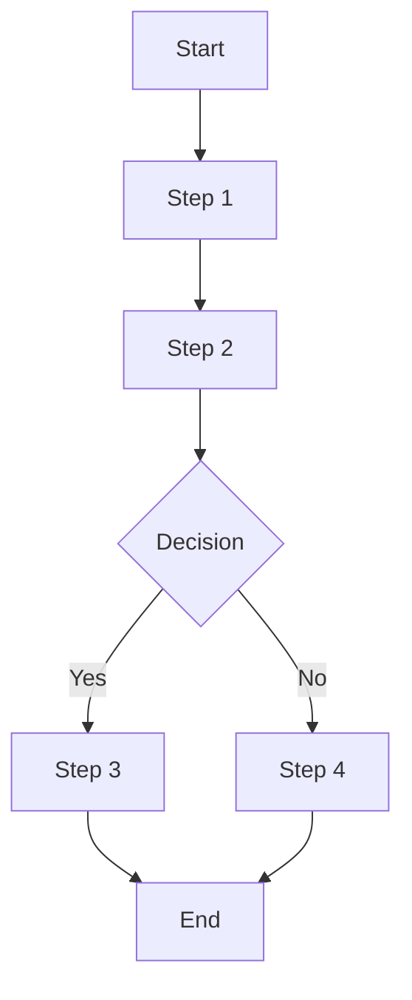
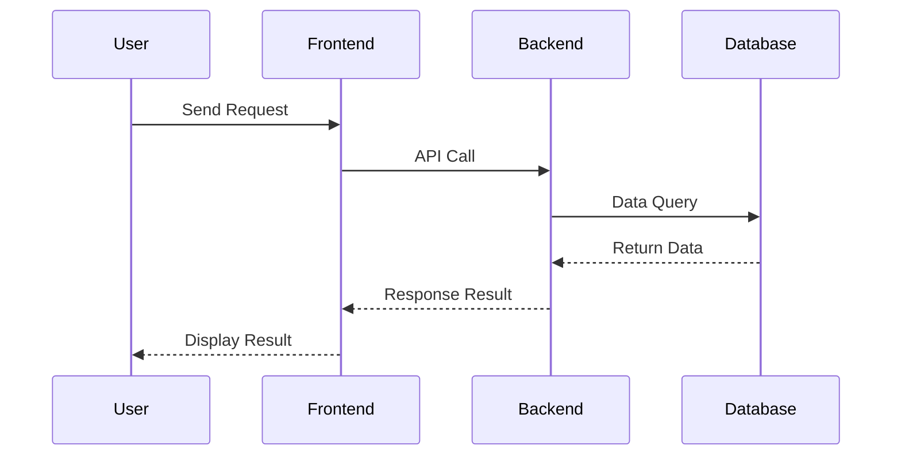

# PRD Workflow

## Inlined Syntax Rules (CRITICAL)

- note必须用三引号: `note="""..."""`，绝不使用 `note="..."` 或 `note='...'`
- SolarWire代码块用 ` ```solarwire ` 开头，` ``` ` 结尾
- 边框颜色用 `b=`，边框宽度用 `s=`
- 圆形用 `("text")`，圆角矩形用 `["text"] r=N`
- 表格单元格和行不能指定 @(x,y)、w、h
- 幻觉属性禁止：multiline, truncate, stroke, strokeWidth
- 所有元素必须有坐标 @(x,y)
- See [syntax.md](syntax.md) for complete syntax reference
- See [note-guide.md](note-guide.md) for note writing rules
- See [standards.md](standards.md) for color/spacing/scenario standards

---

## Configuration

- **Output Directory**: `.solarwire`

---

## Overview

This skill generates complete Product Requirements Documents (PRD), including:
1. **Complete PRD Document** (.md format)
2. **Mermaid Flowcharts/Sequence Diagrams**
3. **SolarWire Wireframes** (embedded in .md, each page with complete element descriptions)

---

## Workflow

### Phase 0: Exploration & Preparation

**Goal: Understand project context and scope before collecting requirements**

**Step 0: Explore Project Context**
- Check existing code files (if any)
- Check existing documentation (if any)
- Check recent git commits (if any)
- Understand project background and goals

**Step 1: Scope Check**
- Determine if project needs to be decomposed into multiple sub-projects
- If too large, help user decompose and select first sub-project
- Decomposition criteria:
  - >5 independent modules → needs decomposition
  - >10 pages → needs decomposition
  - Multiple independent business flows → needs decomposition

**Step 2: Multiple Approaches Comparison (Optional)**
- Provide 2-3 design approaches
- Each with trade-off analysis
- Recommend one approach

---

### Phase 1: Requirements Collection

**Goal: Confirm user requirements step by step, don't rush to generate**

**Step 3: Product Type Confirmation**
```
What type of application is this?
- Mobile App
- Web Client
- Admin Dashboard
- Other (please describe)

Please select or describe your product type.
```

**Step 4: Core Features Confirmation**
```
What core features/pages does this product need?

For example:
- User Login/Register
- Home Page
- Profile Center
- Product List
- Order Management
...
```

**Step 5: Multi-language Confirmation**
```
Does this project require multi-language support?

If yes:
- Which languages need to be supported?
- Common options: English, 中文, 日本語, 한국어, Deutsch, Français, Español, etc.
- The default language will be set based on your primary language.

If no:
- All notes will be written in default language only.
- No i18n information will be added to any elements.
```

**Multi-language Rules:**

1. **Only when explicitly confirmed**: Add i18n information ONLY when user explicitly confirms multi-language support is needed
2. **Never add i18n if not requested**: If user says no multi-language, absolutely DO NOT add any i18n information
3. **All meaningful elements**: If multi-language is confirmed, ALL meaningful text elements MUST include i18n translations
4. **Default language**: Based on user's primary language (the language they use to communicate)

**Elements requiring i18n (if multi-language is confirmed):**
- Button text
- Label text
- Placeholder text
- Error/Success messages
- Table headers
- Menu items
- Page titles
- Status values

**Elements NOT requiring i18n:**
- User input data (usernames, comments, etc.)
- System generated data (IDs, timestamps, etc.)
- Decorative elements
- Icons

---

### Phase 2: Requirements Validation

**Step 6: Requirements Summary**
```
Here's my understanding of requirements:

**Product Type**: [Type]
**Core Pages**:
1. [Page 1] - [Brief description]
2. [Page 2] - [Brief description]
3. ...

**Multi-language**: [Yes/No + Languages]

**Special Requirements**:
- [Requirement 1]
- [Requirement 2]

Is this understanding correct? Any adjustments or additions needed?
```

**Step 7: Requirements Confirmation Gate**
- User MUST confirm requirements
- If adjustments needed, go back to Phase 1

---

### Phase 3: Generate & Quality

**Step 8: Generate PRD**
- Generate complete PRD document
- Save to `.solarwire/[requirement-name]/solarwire-prd.md`

**Step 9: Spec Self-Review**

#### Check 1: Placeholder Scan
```
Check items:
- Any "TBD", "To Be Determined", "待定"
- Any "TODO", "待完成"
- Incomplete sections
- Vague requirement descriptions

If found:
- Fix or clarify immediately
- No placeholders allowed
```

#### Check 2: Internal Consistency
```
Check items:
- Product type matches page design
- Core features list matches page details
- Multi-language rules are consistent throughout document
- Color standards are used consistently
- Font standards are used consistently

If contradictions found:
- Priority: Page details > Feature list > Product type
- Unify standards
```

#### Check 3: Scope Check
```
Check items:
- Focused on implementable scope
- Not too many independent subsystems
- Doesn't need decomposition

Criteria:
- If >5 independent modules → needs decomposition
- If >10 pages → needs decomposition
- If multiple independent business flows → needs decomposition

If needs decomposition:
- Go back to Phase 0 Step 1
- Help user decompose and select first sub-project
```

#### Check 4: Ambiguity Check
```
Check items:
- Requirements with two possible interpretations
- Vague business rules (e.g., "appropriate", "reasonable")
- Undefined terms

If ambiguity found:
- Choose one interpretation and make it explicit
- Add term definitions to Appendix
- Clarify business rules (e.g., "appropriate permissions" → "read-only permissions")

**Note: Visual ambiguity is allowed**
- Visual descriptions like "appropriate spacing", "reasonable layout" don't need quantification
- But functional requirements must be clear (e.g., "user can edit" not "user might be able to edit")
```

**Fix Principle:**
- Fix all issues immediately, no need to re-review
- Proceed to Step 10 after fixing

**Step 10: User Review Gate**
```
PRD generated and passed self-review

**File Location:** `.solarwire/[requirement-name]/solarwire-prd.md`

**Includes:**
- Product Overview (1.1-1.4)
- Feature Scope (2.1-2.2)
- Business Flow (3.1-3.2)
- Page Design (4.1-5.x)
- Non-functional Requirements (6.1-6.3)
- Appendix (7.1-7.2)

**Please review:**
1. Completeness - Any missing features?
2. Accuracy - Any misunderstandings?
3. Page Design - Matches expectations?
4. Business Logic - Correct?

**Review Method:**
- Edit directly in file
- Or tell me what needs adjustment

Please start reviewing, let me know if you have any questions.
```

**User Review Gate Rules:**
- MUST wait for user to explicitly confirm "ok" or "no problem"
- If user requests changes, go back to Step 8 to regenerate PRD
- If user only needs minor adjustments, can fix before Step 11

---

### Phase 4: Output

**Step 11: Save PRD**
- Save to `.solarwire/[requirement-name]/solarwire-prd.md`
- No SVG generation (handled by editor application)

---

## Complete Checklist

You MUST complete each step in order:

**Phase 0: Exploration & Preparation**
1. [ ] Explore project context (code, docs, commits)
2. [ ] Scope check (needs decomposition?)
3. [ ] Multiple approaches comparison (optional)

**Phase 1: Requirements Collection**
4. [ ] Product type confirmation
5. [ ] Core features confirmation
6. [ ] Multi-language confirmation

**Phase 2: Requirements Validation**
7. [ ] Requirements summary
8. [ ] Requirements confirmation gate (user MUST confirm)

**Phase 3: Generate & Quality**
9. [ ] Generate PRD
10. [ ] Spec self-review (4 checks)
11. [ ] User review gate (user MUST review)

**Phase 4: Output**
12. [ ] Save PRD to `.solarwire/[requirement-name]/solarwire-prd.md`

---

## PRD Document Structure

```markdown
# Product Requirements Document - [Project Name]

## Document Information
| Project Name | [Project Name] |
| Version | v1.0 |
| Type | New Feature / Incremental Feature |
| Base Requirement | (仅增量特性时填写) |
| Created Date | [Date] |

## Change Log
| Version | Date | Changes |
|---------|------|---------|
| v1.0 | [Date] | Initial PRD |

---

## 1. Product Overview
### 1.1 Product Background
[Brief description of product background and goals]

### 1.2 Target Users
[Description of target user groups]

### 1.3 Core Value
[Core value provided to users by product]

### 1.4 User Stories

**Format: As a [user role], I want to [action], so that [benefit]**

| ID | User Story | Acceptance Criteria | Priority |
|----|------------|---------------------|----------|
| US-001 | As a [role], I want to [action], so that [benefit] | - Given [context], when [action], then [result] | P0 |
| US-002 | As a [role], I want to [action], so that [benefit] | - Given [context], when [action], then [result] | P0 |
| US-003 | As a [role], I want to [action], so that [benefit] | - Given [context], when [action], then [result] | P1 |

**User Story Writing Guidelines:**
- **User Role**: Identify who the user is (e.g., "As a registered user", "As an admin")
- **Action**: What the user wants to do (e.g., "I want to reset my password")
- **Benefit**: Why the user wants this (e.g., "so that I can regain access to my account")
- **Acceptance Criteria**: Use Given-When-Then format to define testable conditions
- **Priority**: P0 (Must have), P1 (Should have), P2 (Nice to have)

---

## 2. Feature Scope
### 2.1 Feature List
| Module | Feature | Priority | Description |
|--------|---------|----------|-------------|
| [Module 1] | [Feature 1] | P0 | [Description] |
| [Module 1] | [Feature 2] | P1 | [Description] |

### 2.2 Feature Boundary
- Included: [List included features]
- Not Included: [List excluded features]

---

## 3. Business Flow
### 3.1 Core Business Flowchart


### 3.2 Interaction Sequence Diagram


---

## 4. Page Design
### 4.1 Page List
| Page Name | Page Type | Change Type | Description |
|-----------|-----------|-------------|-------------|
| [Page 1] | Main Page | New | [Description] |
| [Page 2] | Modal | New | [Description] |

（增量特性时Change Type列为New/Modified）

---

## 5. Page Details

> **Core Principle: All element descriptions are integrated into the SolarWire wireframe notes for "what you see is what you read"**

### 5.1 [Page Name] (New)

**Page Overview**: [One sentence describing core functionality of page]

```solarwire
!title="[Page Name]"
!c=#111827
!size=13
!bg=#F9FAFB

[] @(0,0) w=1440 h=900 bg=#FFFFFF

// Page Content - Each element has detailed note description
["Logo"] @(50,50) w=120 h=60 note="""Logo
1. Click action
   - Return to homepage"""

"User Login" @(100,150) size=24 bold

"Username" @(100,220)
["Enter phone or email"] @(100,245) w=300 h=44 bg=#FFFFFF b=#E5E7EB note="""Username input
1. Input rules
   - Supports phone number or email
   - Automatically trims leading/trailing spaces
   - Max length: 50 characters
2. Validation
   - Format: 11-digit phone number or email format
   - Error message: 'Please enter a valid phone number or email'"""

"Password" @(100,310)
["Enter password"] @(100,335) w=300 h=44 bg=#FFFFFF b=#E5E7EB note="""Password input
1. Input rules
   - Password displayed as dots
   - Min length: 6 characters, Max: 32 characters
   - Must contain letters and numbers
2. Interaction
   - Show/hide toggle icon on right"""

["Login"] @(100,450) w=300 h=48 bg=#3B82F6 c=#FFFFFF size=16 note="""Login button
1. Click action
   - Validate username and password
2. Success handling
   - Save login state
   - Redirect to homepage
3. Failure handling
   - Display modal: 'Invalid username or password'
   - Clear password field
4. Disabled conditions
   - Disabled when username or password is empty"""
```

---

## 6. Non-functional Requirements
### 6.1 Performance Requirements
- Page load time: < 2 seconds
- API response time: < 500ms

### 6.2 Security Requirements
- [List security requirements]

### 6.3 Compatibility Requirements
- Browsers: Chrome 90+, Safari 14+
- Mobile: iOS 14+, Android 10+

---

## 7. Appendix
### 7.1 Glossary
| Term | Description |
|------|-------------|
| [Term 1] | [Description] |

### 7.2 References
- [Reference links]
```

---

## Incremental Feature PRD Rules

When creating a PRD for an incremental feature (new feature based on existing requirement):

### Document Information
- Declare `Type: Incremental Feature`
- Declare `Base Requirement: [base-req-name] (vX.X)`

### Change Summary Chapter
Add a chapter listing affected/unaffected pages:
```markdown
## Change Summary
### Affected Pages
| Page | Change Type | Base Section |
|------|-------------|-------------|
| [Page 1] | Modified | .solarwire/[base-req]/solarwire-prd.md - Section 5.1 |
| [Page 2] | New | - |

### Unaffected Pages
| Page | Base Section |
|------|-------------|
| [Page 3] | .solarwire/[base-req]/solarwire-prd.md - Section 5.3 |
```

### Content Rules
- User Stories: Only write new ones
- Feature List: Only write new features
- Business Flow: Only write new flows
- Page Details:
  - Modified pages: Use Base+Delta mode (copy original wireframe, mark changes with color + note prefix)
  - New pages: Write complete wireframe

### Base+Delta Change Marking Rules

| Change Type | Border Color | Background | Note Prefix | Opacity |
|-------------|-------------|------------|-------------|---------|
| NEW | b=#22C55E | bg=#F0FDF4 | [NEW] | 1.0 |
| MODIFIED | b=#F59E0B | bg=#FFFBEB | [MODIFIED] + change description | 1.0 |
| REMOVED | b=#EF4444 | bg=#FEF2F2 | [REMOVED] + reason | opacity=0.4 |
| UNCHANGED | Original | Original | No prefix | 1.0 |

**Base+Delta Example:**
```solarwire
!title="User Profile (Modified)"
!c=#111827
!size=13
!bg=#F9FAFB

[] @(0,0) w=1440 h=900 bg=#FFFFFF

// UNCHANGED: Original header
["Logo"] @(50,50) w=120 h=60 note="""Logo
1. Click action
   - Return to homepage"""

// NEW: Social login section
["WeChat Login"] @(100,500) w=300 h=44 bg=#F0FDF4 b=#22C55E note="""[NEW] WeChat login button
1. Click action
   - WeChat authorization login
2. Success handling
   - Bind WeChat account
   - Redirect to homepage"""

// MODIFIED: Login button now shows loading
["Login"] @(100,450) w=300 h=48 bg=#FFFBEB b=#F59E0B size=16 note="""[MODIFIED] Login button
1. Click action
   - Validate username and password
2. Success handling
   - Save login state
   - Redirect to homepage
3. Failure handling
   - Display modal: 'Invalid username or password'
4. NEW: Loading state
   - Show loading spinner during login
   - Disable button to prevent double-click"""

// REMOVED: Old SMS login
["SMS Login"] @(100,600) w=300 h=44 bg=#FEF2F2 b=#EF4444 opacity=0.4 note="""[REMOVED] SMS login button
- Reason: Replaced by WeChat login for better UX"""
```

**Modified Page Annotation:**
```markdown
### 5.x [Page Name] (Modified)

**Page Overview**: [One sentence description]
**Base**: .solarwire/[base-req]/solarwire-prd.md - Section 5.x
```

---

## Output File Structure

```
.solarwire/
├── [requirement-name]/
│   ├── solarwire-prd.md
│   ├── test-cases.md
│   ├── dev-design.md
│   └── archive/
│       └── solarwire-prd-v1.0.md
```

**Naming Convention:**
- Root directory: `.solarwire` (at project root)
- Requirement folder: Based on requirement/project name (e.g., `user-login-system/`, `order-management/`)
- PRD file: Always named `solarwire-prd.md`

---

## Multiple Approaches Comparison

**Trigger Conditions:**
- When project has multiple viable design approaches
- When user is uncertain about implementation approach
- When trade-offs need to be weighed

**Approach Format:**
```
For [feature/module], I've analyzed 3 implementation approaches:

**Approach A: [Approach Name]**
- Description: [Brief description]
- Pros:
  - [Pro 1]
  - [Pro 2]
- Cons:
  - [Con 1]
  - [Con 2]

**Approach B: [Approach Name]**
- Description: [Brief description]
- Pros:
  - [Pro 1]
  - [Pro 2]
- Cons:
  - [Con 1]
  - [Con 2]

**Approach C: [Approach Name]**
- Description: [Brief description]
- Pros:
  - [Pro 1]
  - [Pro 2]
- Cons:
  - [Con 1]
  - [Con 2]

**My Recommendation: Approach [X]**
- Reason: [Recommendation reason]

Which approach would you like to choose?
```

---

## Important Reminders

1. **Confirm Requirements Step by Step** - Don't rush to generate, fully understand requirements first
2. **Notes Describe Function and Business Logic** - Focus on behavior and logic, avoid visual details and technical implementation
3. **Not Every Element Needs a Note** - Skip notes for visual elements; common sense exemption for back button, close button, page selector, number stepper
4. **First Line Defines Element** - Note first line must describe what element is (e.g., "Login button"), not element type (e.g., "[Primary Button]")
5. **Note Structure Required** - First line: element definition; First level: numbered (1. 2. 3.); Second level: dash (-); Third level: double dash (--)
6. **Coordinates Must Be Complete** - Every element must have `@(x,y)`
7. **No Brackets for Attributes** - Write directly `w=100 h=40`
8. **Choose Elements Reasonably** - Buttons use rectangles, labels use text, only icons use placeholders
9. **Layout Close to Reality** - Wireframes should reflect actual page structure with 10px spacing
10. **Separate Modals/States/Tabs** - Each independent view in separate code block; all modals must have separate wireframe
11. **Table Row Must Be Inside Table** - Row element `#` CANNOT exist independently, MUST be inside table container `##`
12. **Table Child Element Restrictions** - Rows and cells CANNOT have coordinates `@(x,y)`, width `w`, height `h`, or border `b`; only support style attributes (`bg`, `c`, `size`, `bold`, `italic`, `align`, `colspan`, `rowspan`)
13. **Container Rectangle Required** - First element of each page is white background container
14. **Color Standards (Tailwind CSS)** - Use unified colors: #111827 (text), #6B7280 (secondary), #E5E7EB (border), #FFFFFF (bg), #F9FAFB (alternating row), #3B82F6 (primary), #EF4444 (error)
15. **Font Standards** - Font size 13px, line height 22px
16. **i18n Only When Confirmed** - Add multi-language support ONLY when user explicitly confirms; if not confirmed, absolutely NO i18n information; if confirmed, ALL meaningful elements MUST include i18n translations using full language names (English, 中文, 日本語)
17. **Incremental Feature Uses Base+Delta** - Modified pages use Base+Delta mode with color-coded change markers
18. **PRD Includes Changelog** - All PRDs must have version tracking via Change Log table
19. **NOTE MUST USE TRIPLE QUOTES** - Always use `note="""..."""`, NEVER use `note="..."` or `note='...'`. Single/double quotes for notes will cause parsing errors

---

## Attribute Reference

### Supported Attributes

| Attribute | Description | Example |
|-----------|-------------|---------|
| `w` `h` | Width, Height | `w=100 h=40` |
| `bg` | Background color | `bg=#3B82F6` |
| `c` | Text color | `c=#FFFFFF` or `c=#111827` |
| `b` | Border color | `b=#E5E7EB` |
| `s` | Border width | `s=2` |
| `r` | Border radius | `r=8` |
| `size` | Font size | `size=16` |
| `bold` | Bold text | `bold` |
| `italic` | Italic text | `italic` |
| `opacity` | Element opacity (0-1) | `opacity=0.5` |
| `letter-spacing` | Letter spacing | `letter-spacing=2` |
| `vertical-align` | Vertical alignment | `vertical-align=m` |
| `padding-top` | Top padding | `padding-top=16` |
| `padding-right` | Right padding | `padding-right=8` |
| `padding-bottom` | Bottom padding | `padding-bottom=16` |
| `padding-left` | Left padding (overrides padding) | `padding-left=8` |
| `text-decoration` | Text decoration | `text-decoration=underline` |
| `line-height` | Line height | `line-height=22` |
| `style` | Border style | `style=dashed` or `style=dotted` |
| `shadow-x` | Shadow X offset | `shadow-x=2` |
| `shadow-y` | Shadow Y offset | `shadow-y=4` |
| `shadow-blur` | Shadow blur radius | `shadow-blur=8` |
| `shadow-color` | Shadow color | `shadow-color=#00000020` |
| `colspan` | Column span for table cells | `colspan=2` |
| `rowspan` | Row span for table cells | `rowspan=2` |
| `note` | Functional description | `note="""Description"""` |

### Forbidden Attributes (Hallucinated)

These attributes do NOT exist in SolarWire syntax and must NEVER be used:
- `multiline` - Does not exist
- `truncate` - Does not exist
- `stroke` - Use `b=` instead for border color
- `strokeWidth` - Use `s=` instead for border width
