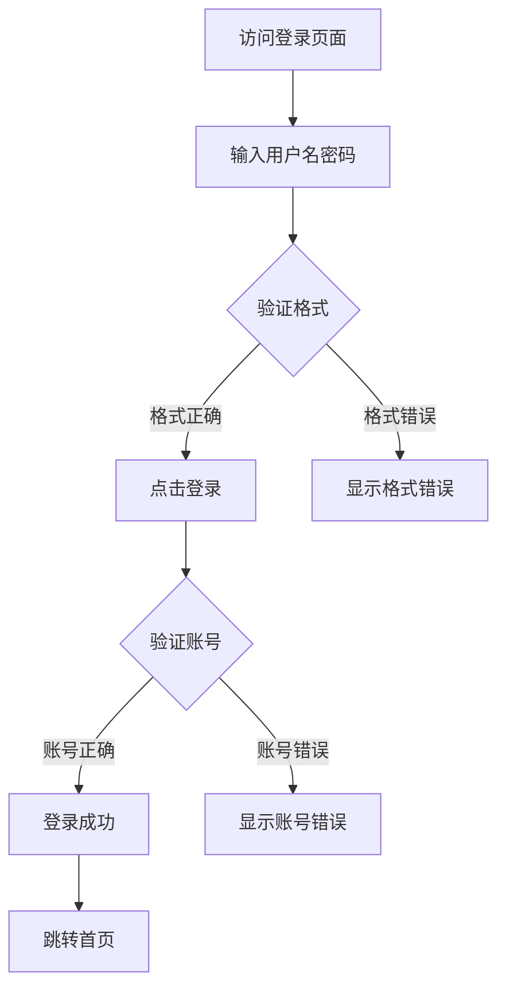

## Inlined Syntax Rules (CRITICAL)

- note必须用三引号: `note="""..."""`，绝不使用 `note="..."` 或 `note='...'`
- SolarWire代码块用 ` ```solarwire ` 开头，` ``` ` 结尾
- 边框颜色用 `b=`，边框宽度用 `s=`
- 圆形用 `("text")`，圆角矩形用 `["text"] r=N`
- 表格单元格和行不能指定 @(x,y)、w、h
- 幻觉属性禁止：multiline, truncate, stroke, strokeWidth
- 所有元素必须有坐标 @(x,y)
- See [syntax.md](syntax.md) for complete syntax reference
- See [note-guide.md](note-guide.md) for note writing rules
- See [standards.md](standards.md) for color/spacing/scenario standards

# SolarWire PRD to Test Case Generator

## Configuration

- **Input**: `.solarwire/[requirement-name]/solarwire-prd.md`
- **Output**: `.solarwire/[requirement-name]/test-cases.md`

---

## Overview

This skill guides AI to read and understand SolarWire PRD documents, then generate **detailed, executable** test cases in Markdown format.

**Core Principle**: Test cases must be:
1. **Executable** - Clear steps that can be followed
2. **Verifiable** - Expected results that can be checked
3. **Specific** - Exact test data, not vague descriptions
4. **Complete** - All necessary information included

**Focus**: Black-box functional testing only

---

## Test Case Quality Standards

### Bad Test Case (Too Vague)

| Field | Content |
|-------|---------|
| Name | Login button-点击操作 |
| Steps | 1. 查看Login button<br>2. 点击按钮 |
| Expected | 验证用户名和密码 |

**Problems**:
- "查看" is not a specific action
- "验证" cannot determine pass/fail
- Missing test data

### Good Test Case (Executable)

| Field | Content |
|-------|---------|
| Name | 登录页面-登录按钮-正常登录成功 |
| Precondition | 1. 用户已注册账号：testuser@example.com / Test@123<br>2. 用户未登录<br>3. 已打开登录页面 |
| Steps | 1. 在用户名输入框输入：testuser@example.com<br>2. 在密码输入框输入：Test@123<br>3. 点击"登录"按钮 |
| Test Data | 用户名：testuser@example.com<br>密码：Test@123 |
| Expected | 1. 登录成功，页面跳转到首页<br>2. 顶部导航栏显示用户头像<br>3. localStorage 中存在 token 字段 |
| Priority | P0 |

---

## How to Read PRD Document

### PRD Document Structure

```markdown
# Product Requirements Document - [Project Name]

## Document Information
## 1. Product Overview
   ### 1.4 User Stories
## 2. Feature Scope
   ### 2.1 Feature List
## 3. Business Flow
## 4. Page Design
## 5. Page Details (with SolarWire wireframes)
```

### Reading Order for Test Case Generation

1. **Document Information** → Project name, version
2. **User Stories (1.4)** → Acceptance test cases
3. **Feature List (2.1)** → Feature coverage test cases
4. **Business Flows (3.x)** → Flow path test cases
5. **Page Details (5.x)** → Detailed UI test cases from SolarWire notes

---

## Section 1: Reading User Stories

### User Story Format

```markdown
| ID | User Story | Acceptance Criteria | Priority |
| US-001 | As a user, I want to login, so that I can access my account |
  - Given user is on login page, when entering valid credentials, then login succeeds
  - Given user is on login page, when entering invalid credentials, then error shows
```

### How to Generate Detailed Test Cases

**Step 1**: Extract Given-When-Then
**Step 2**: Convert to specific test steps
**Step 3**: Add concrete test data
**Step 4**: Define verifiable expected results

### Example: US-001 Login

**Original Acceptance Criteria:**
```
Given user is on login page, when entering valid credentials, then login succeeds
```

**Generated Test Case:**

| Field | Content |
|-------|---------|
| ID | TC-001 |
| Module | 登录页面 |
| Name | US-001-用户登录-有效凭证登录成功 |
| Type | 功能测试 |
| Precondition | 1. 已注册测试账号：testuser@example.com，密码：Test@123<br>2. 用户未登录状态<br>3. 已打开浏览器，访问登录页面 |
| Steps | 1. 在用户名输入框中输入：testuser@example.com<br>2. 在密码输入框中输入：Test@123<br>3. 点击"登录"按钮 |
| Test Data | 用户名：testuser@example.com<br>密码：Test@123 |
| Expected | 1. 页面跳转到首页（URL 变为 /home）<br>2. 顶部导航栏显示用户头像和用户名<br>3. 浏览器 localStorage 中存在 auth_token 字段<br>4. 不再显示登录按钮 |
| Priority | P0 |
| Related | US-001 |
| Remark | 验证正常登录流程 |

---

## Section 2: Reading Feature List

### Feature List Format

```markdown
| Module | Feature | Priority | Description |
| 用户管理 | 用户登录 | P0 | 支持用户登录功能 |
```

### How to Generate Test Cases

Each feature generates a feature coverage test case with specific verification points.

### Example

| Field | Content |
|-------|---------|
| ID | TC-002 |
| Module | 用户管理 |
| Name | 用户登录功能-功能验证 |
| Type | 功能测试 |
| Precondition | 1. 系统已部署并正常运行<br>2. 已注册测试账号 |
| Steps | 1. 访问登录页面<br>2. 输入有效的用户名和密码<br>3. 点击登录按钮<br>4. 验证登录成功<br>5. 退出登录<br>6. 输入无效的用户名和密码<br>7. 点击登录按钮<br>8. 验证登录失败提示 |
| Test Data | 有效账号：testuser@example.com / Test@123<br>无效账号：invalid@test.com / wrong123 |
| Expected | 1. 有效账号登录成功，跳转首页<br>2. 无效账号登录失败，显示错误提示<br>3. 错误提示内容为"用户名或密码错误" |
| Priority | P0 |
| Related | 用户登录功能 |

---

## Section 3: Reading Business Flows

### Mermaid Flowchart Format



### How to Generate Test Cases

**Identify all paths** and generate one test case per path.

### Path Analysis Example

| Path | Test Scenario | Key Verification Points |
|------|--------------|------------------------|
| Happy Path | A→B→C(正确)→D→F(正确)→G→I | 正常登录全流程 |
| Format Error | A→B→C(错误)→E | 格式校验 |
| Account Error | A→B→C(正确)→D→F(错误)→H | 账号验证失败 |

### Generated Test Case: Happy Path

| Field | Content |
|-------|---------|
| ID | TC-003 |
| Module | 业务流程测试 |
| Name | 登录流程-正常登录完整流程 |
| Type | 功能测试 |
| Precondition | 1. 已注册账号：flowtest@example.com / Flow@123<br>2. 浏览器已打开 |
| Steps | 1. 在浏览器地址栏输入登录页面URL<br>2. 验证页面加载完成，显示登录表单<br>3. 在用户名输入框输入：flowtest@example.com<br>4. 在密码输入框输入：Flow@123<br>5. 验证登录按钮可点击（非禁用状态）<br>6. 点击登录按钮<br>7. 等待页面跳转（最长3秒）<br>8. 验证当前URL为首页URL |
| Test Data | 用户名：flowtest@example.com<br>密码：Flow@123 |
| Expected | 1. 步骤2：登录表单正常显示，包含用户名、密码输入框和登录按钮<br>2. 步骤5：登录按钮为可点击状态，背景色为主题色<br>3. 步骤7：3秒内完成跳转<br>4. 步骤8：URL 变为 /home 或配置的首页路径 |
| Priority | P0 |
| Remark | 验证完整登录流程，包含页面加载、输入、点击、跳转各环节 |

---

## Section 4: Reading SolarWire Wireframes

### SolarWire Code Block Structure

```solarwire
!title="Login Page"
!c=#333333
!size=13
!bg=#F2F2F2

[] @(0,0) w=1440 h=900 bg=#FFFFFF

"Login" @(720,50) c=#333333 size=24 bold

["Enter phone or email"] @(100,200) w=280 h=40 bg=#FFFFFF b=#F2F2F2 note="""Username input
1. Input rules
   - Supports phone number or email
   - Automatically trim spaces
   - Max length: 50 characters
2. Validation
   - Format: 11-digit phone or email format
   - Error: 'Please enter valid phone or email'"""

["Enter password"] @(100,260) w=280 h=40 bg=#FFFFFF b=#F2F2F2 note="""Password input
1. Input rules
   - Display as dots
   - Min 6 chars, max 32 chars
   - Must contain letters and numbers
2. Interaction
   - Eye icon to toggle visibility
   - Validate on blur
   - Error: 'Invalid password format'"""

["Login"] @(100,320) w=280 h=44 bg=#1890FF c=#FFFFFF note="""Login button
1. Click action
   - Validate all inputs
   - Submit login request
2. Success handling
   - Save token to localStorage
   - Redirect to homepage
3. Failure handling
   - Show error toast: 'Invalid credentials'
   - Clear password field
   - Shake button animation
4. Disabled conditions
   - Disabled when any input is empty
   - Disabled when format validation fails"""
```

### How to Read Page Title

```
!title="Login Page"  →  Module = 登录页面
```

### How to Read Element Content

```
["Enter phone or email"]  →  输入框 placeholder = "Enter phone or email"
["Login"]                 →  按钮文字 = "Login"
```

---

## Section 5: Reading Notes (KEY FOR TEST CASES)

### Note Structure

```
note="""[Element Definition]
1. [Section Name]
   - [Detail 1]
   - [Detail 2]
2. [Section Name]
   - [Detail 1]"""
```

### First Line: Element Definition

The first line defines what this element IS. Use it as test case name prefix.

---

## Detailed Test Case Generation Rules

### Rule 1: Click Action / 点击

**Test Type**: 功能测试

**Generation Steps**:
1. Identify the click trigger
2. List all preconditions for clicking
3. Define exact click action
4. List all observable results

**Example Note:**
```
1. Click action
   - Validate username and password
   - Submit login request
```

**Generated Test Case:**

| Field | Content |
|-------|---------|
| ID | TC-010 |
| Module | 登录页面 |
| Name | Login按钮-点击操作-验证并提交登录 |
| Type | 功能测试 |
| Precondition | 1. 已打开登录页面<br>2. 已注册测试账号：logintest@example.com / Login@123<br>3. 用户未登录 |
| Steps | 1. 在用户名输入框输入：logintest@example.com<br>2. 在密码输入框输入：Login@123<br>3. 观察登录按钮状态（应为可点击）<br>4. 点击"Login"按钮<br>5. 观察页面变化 |
| Test Data | 用户名：logintest@example.com<br>密码：Login@123 |
| Expected | 1. 步骤3：登录按钮背景色为 #1890FF，鼠标悬停时显示手型光标<br>2. 步骤5：按钮显示 loading 状态（可选）<br>3. 步骤5：发送登录请求到后端<br>4. 步骤5：请求参数包含 username 和 password 字段 |
| Priority | P0 |
| Remark | 验证点击登录按钮触发的验证和提交逻辑 |

---

### Rule 2: Success Handling / 成功

**Test Type**: 功能测试

**Generation Steps**:
1. Define success state
2. List all observable success indicators
3. Verify each indicator separately

**Example Note:**
```
2. Success handling
   - Save token to localStorage
   - Redirect to homepage
```

**Generated Test Cases:**

**TC-011: Token保存验证**

| Field | Content |
|-------|---------|
| ID | TC-011 |
| Module | 登录页面 |
| Name | Login按钮-成功处理-Token保存验证 |
| Type | 功能测试 |
| Precondition | 1. 已打开登录页面<br>2. 已注册账号：tokentest@example.com / Token@123<br>3. 浏览器开发者工具已打开（Application > Local Storage） |
| Steps | 1. 输入有效用户名：tokentest@example.com<br>2. 输入有效密码：Token@123<br>3. 点击登录按钮<br>4. 打开浏览器开发者工具 > Application > Local Storage<br>5. 查看当前域名的存储内容 |
| Test Data | 用户名：tokentest@example.com<br>密码：Token@123 |
| Expected | 1. Local Storage 中存在 auth_token 或 token 字段<br>2. Token 值为非空字符串（通常为 JWT 格式）<br>3. Token 有效期符合系统设计（如24小时） |
| Priority | P0 |

**TC-012: 页面跳转验证**

| Field | Content |
|-------|---------|
| ID | TC-012 |
| Module | 登录页面 |
| Name | Login按钮-成功处理-页面跳转验证 |
| Type | 功能测试 |
| Precondition | 1. 已打开登录页面<br>2. 已注册账号：redirecttest@example.com / Redirect@123 |
| Steps | 1. 记录当前页面 URL<br>2. 输入有效用户名：redirecttest@example.com<br>3. 输入有效密码：Redirect@123<br>4. 点击登录按钮<br>5. 等待页面跳转（最长5秒）<br>6. 检查当前页面 URL |
| Test Data | 用户名：redirecttest@example.com<br>密码：Redirect@123 |
| Expected | 1. 步骤5：5秒内完成页面跳转<br>2. 步骤6：URL 变为首页路径（如 /home 或 /dashboard）<br>3. 页面顶部导航栏显示用户头像和用户名<br>4. 页面不显示登录/注册按钮 |
| Priority | P0 |

---

### Rule 3: Failure Handling / 失败

**Test Type**: 异常测试

**Generation Steps**:
1. Identify failure scenarios
2. Define how to trigger each failure
3. List all error indicators
4. Verify error message content

**Example Note:**
```
3. Failure handling
   - Show error toast: 'Invalid credentials'
   - Clear password field
   - Shake button animation
```

**Generated Test Cases:**

**TC-013: 错误提示验证**

| Field | Content |
|-------|---------|
| ID | TC-013 |
| Module | 登录页面 |
| Name | Login按钮-失败处理-错误提示显示 |
| Type | 异常测试 |
| Precondition | 1. 已打开登录页面<br>2. 准备无效账号数据 |
| Steps | 1. 在用户名输入框输入：wronguser@example.com<br>2. 在密码输入框输入：WrongPassword@123<br>3. 点击登录按钮<br>4. 观察页面响应 |
| Test Data | 用户名：wronguser@example.com（未注册）<br>密码：WrongPassword@123 |
| Expected | 1. 页面显示错误提示（toast 或 表单下方）<br>2. 错误提示内容为"Invalid credentials"或"用户名或密码错误"<br>3. 错误提示使用红色文字或红色背景<br>4. 错误提示在3秒后自动消失（或需手动关闭） |
| Priority | P1 |
| Exception | 使用未注册的账号登录 |

**TC-014: 密码清空验证**

| Field | Content |
|-------|---------|
| ID | TC-014 |
| Module | 登录页面 |
| Name | Login按钮-失败处理-密码字段清空 |
| Type | 异常测试 |
| Precondition | 1. 已打开登录页面 |
| Steps | 1. 在用户名输入框输入：testuser@example.com<br>2. 在密码输入框输入：WrongPassword@123<br>3. 点击登录按钮<br>4. 观察密码输入框状态 |
| Test Data | 用户名：testuser@example.com（已注册）<br>密码：WrongPassword@123（错误密码） |
| Expected | 1. 登录失败后，密码输入框内容被清空<br>2. 密码输入框为空白状态<br>3. 用户名输入框保持原值不变<br>4. 光标焦点回到密码输入框 |
| Priority | P1 |
| Exception | 使用正确用户名但错误密码登录 |

---

### Rule 4: Input Rules / 输入规则

**Test Type**: 表单验证 + 边界测试

**Generation Steps**:
1. Extract length constraints → Generate boundary tests (min-1, min, max, max+1)
2. Extract format rules → Generate valid/invalid format tests
3. Extract character rules → Generate character validation tests
4. Extract display rules → Generate UI display tests

**Example Note:**
```
1. Input rules
   - Supports phone number or email
   - Automatically trim spaces
   - Max length: 50 characters
```

**Generated Test Cases:**

**TC-020: 手机号格式-有效**

| Field | Content |
|-------|---------|
| ID | TC-020 |
| Module | 登录页面 |
| Name | Username输入框-输入规则-手机号格式有效 |
| Type | 表单验证 |
| Precondition | 1. 已打开登录页面<br>2. 用户名输入框为空 |
| Steps | 1. 在用户名输入框输入：13812345678<br>2. 观察输入框状态<br>3. 点击密码输入框（触发 blur）<br>4. 观察是否显示错误提示 |
| Test Data | 手机号：13812345678 |
| Expected | 1. 输入框正常显示输入内容<br>2. 不显示格式错误提示<br>3. 输入框边框保持默认颜色（非红色） |
| Priority | P0 |

**TC-021: 邮箱格式-有效**

| Field | Content |
|-------|---------|
| ID | TC-021 |
| Module | 登录页面 |
| Name | Username输入框-输入规则-邮箱格式有效 |
| Type | 表单验证 |
| Precondition | 1. 已打开登录页面 |
| Steps | 1. 在用户名输入框输入：test@example.com<br>2. 点击密码输入框触发校验<br>3. 观察是否显示错误提示 |
| Test Data | 邮箱：test@example.com |
| Expected | 1. 不显示格式错误提示<br>2. 输入框边框保持默认颜色 |
| Priority | P0 |

**TC-022: 无效格式**

| Field | Content |
|-------|---------|
| ID | TC-022 |
| Module | 登录页面 |
| Name | Username输入框-输入规则-无效格式校验 |
| Type | 表单验证 |
| Precondition | 1. 已打开登录页面 |
| Steps | 1. 在用户名输入框输入：abc123<br>2. 点击密码输入框触发校验<br>3. 观察错误提示 |
| Test Data | 无效格式：abc123 |
| Expected | 1. 显示错误提示："Please enter valid phone or email"<br>2. 输入框边框变为红色<br>3. 错误提示显示在输入框下方 |
| Priority | P0 |

**TC-023: 空格自动去除**

| Field | Content |
|-------|---------|
| ID | TC-023 |
| Module | 登录页面 |
| Name | Username输入框-输入规则-空格自动去除 |
| Type | 功能测试 |
| Precondition | 1. 已打开登录页面 |
| Steps | 1. 在用户名输入框输入： test@example.com （前后有空格）<br>2. 点击密码输入框触发 blur<br>3. 观察输入框内容变化 |
| Test Data | 带空格的邮箱： test@example.com |
| Expected | 1. 输入框内容自动变为：test@example.com（无前后空格）<br>2. 不显示格式错误提示 |
| Priority | P1 |

**TC-024: 最大长度限制**

| Field | Content |
|-------|---------|
| ID | TC-024 |
| Module | 登录页面 |
| Name | Username输入框-输入规则-最大长度限制 |
| Type | 边界测试 |
| Precondition | 1. 已打开登录页面 |
| Steps | 1. 准备一个51字符的字符串<br>2. 尝试在用户名输入框输入该字符串<br>3. 观察实际输入的字符数 |
| Test Data | 51字符邮箱：aaaaaaaaaaaaaaaaaaaaaaaaaaaaaaaaaaaaaaaaaaaaaaaaaaa@test.com |
| Expected | 1. 输入框只接受前50个字符<br>2. 第51个字符无法输入<br>3. 不显示错误提示（静默限制） |
| Priority | P1 |
| Boundary | 49字符（有效）、50字符（边界）、51字符（超限） |

---

### Rule 5: Validation / 校验

**Test Type**: 表单验证

**Example Note:**
```
2. Validation
   - Format: 11-digit phone number or email format
   - Error message: 'Please enter a valid phone number or email'
```

**Generated Test Cases:**

**TC-025: 手机号格式校验-有效**

| Field | Content |
|-------|---------|
| ID | TC-025 |
| Module | 登录页面 |
| Name | Username输入框-格式校验-11位手机号有效 |
| Type | 表单验证 |
| Precondition | 1. 已打开登录页面 |
| Steps | 1. 在用户名输入框输入：13812345678<br>2. 点击其他区域触发 blur<br>3. 观察校验结果 |
| Test Data | 手机号：13812345678 |
| Expected | 1. 不显示错误提示<br>2. 输入框边框为默认颜色 |
| Priority | P0 |

**TC-026: 手机号格式校验-位数不足**

| Field | Content |
|-------|---------|
| ID | TC-026 |
| Module | 登录页面 |
| Name | Username输入框-格式校验-手机号位数不足 |
| Type | 表单验证 |
| Precondition | 1. 已打开登录页面 |
| Steps | 1. 在用户名输入框输入：1381234567（10位）<br>2. 点击其他区域触发 blur<br>3. 观察校验结果 |
| Test Data | 手机号：1381234567（10位） |
| Expected | 1. 显示错误提示："Please enter a valid phone number or email"<br>2. 输入框边框变为红色 |
| Priority | P0 |

---

### Rule 6: Disabled Conditions / 禁用条件

**Test Type**: UI测试

**Example Note:**
```
4. Disabled conditions
   - Disabled when any input is empty
   - Disabled when format validation fails
```

**Generated Test Cases:**

**TC-030: 用户名为空时按钮禁用**

| Field | Content |
|-------|---------|
| ID | TC-030 |
| Module | 登录页面 |
| Name | Login按钮-禁用状态-用户名为空 |
| Type | UI测试 |
| Precondition | 1. 已打开登录页面<br>2. 所有输入框为空 |
| Steps | 1. 保持用户名输入框为空<br>2. 在密码输入框输入：Test@123<br>3. 观察登录按钮状态 |
| Test Data | 密码：Test@123 |
| Expected | 1. 登录按钮处于禁用状态<br>2. 按钮背景色为灰色（如 #AAAAAA 或 #CCCCCC）<br>3. 鼠标悬停时显示禁止光标<br>4. 点击按钮无响应 |
| Priority | P1 |

**TC-031: 密码为空时按钮禁用**

| Field | Content |
|-------|---------|
| ID | TC-031 |
| Module | 登录页面 |
| Name | Login按钮-禁用状态-密码为空 |
| Type | UI测试 |
| Precondition | 1. 已打开登录页面 |
| Steps | 1. 在用户名输入框输入：test@example.com<br>2. 保持密码输入框为空<br>3. 观察登录按钮状态 |
| Test Data | 用户名：test@example.com |
| Expected | 1. 登录按钮处于禁用状态<br>2. 按钮背景色为灰色<br>3. 点击按钮无响应 |
| Priority | P1 |

**TC-032: 格式校验失败时按钮禁用**

| Field | Content |
|-------|---------|
| ID | TC-032 |
| Module | 登录页面 |
| Name | Login按钮-禁用状态-格式校验失败 |
| Type | UI测试 |
| Precondition | 1. 已打开登录页面 |
| Steps | 1. 在用户名输入框输入：invalid-format<br>2. 点击密码输入框触发校验<br>3. 在密码输入框输入：Test@123<br>4. 观察登录按钮状态 |
| Test Data | 用户名：invalid-format<br>密码：Test@123 |
| Expected | 1. 用户名显示格式错误提示<br>2. 登录按钮处于禁用状态<br>3. 按钮背景色为灰色 |
| Priority | P1 |

---

### Rule 7: Visibility Conditions / 显示条件

**Test Type**: UI测试

**Example Note:**
```
1. Visibility conditions
   - Show when >= 1 items selected
   - Hide when no items selected
```

**Generated Test Cases:**

**TC-040: 选中项目后显示**

| Field | Content |
|-------|---------|
| ID | TC-040 |
| Module | 用户列表页面 |
| Name | 批量删除按钮-显示条件-选中项目后显示 |
| Type | UI测试 |
| Precondition | 1. 已登录系统<br>2. 已打开用户列表页面<br>3. 列表中存在至少3条数据 |
| Steps | 1. 观察批量删除按钮初始状态<br>2. 点击第一行数据的复选框<br>3. 观察批量删除按钮状态变化 |
| Test Data | 无 |
| Expected | 1. 步骤1：批量删除按钮隐藏或不可见<br>2. 步骤3：批量删除按钮显示出来<br>3. 按钮位置在表格上方工具栏区域 |
| Priority | P1 |

**TC-041: 取消选中后隐藏**

| Field | Content |
|-------|---------|
| ID | TC-041 |
| Module | 用户列表页面 |
| Name | 批量删除按钮-显示条件-取消选中后隐藏 |
| Type | UI测试 |
| Precondition | 1. 已登录系统<br>2. 已打开用户列表页面<br>3. 已选中1条数据，批量删除按钮显示 |
| Steps | 1. 点击已选中行的复选框（取消选中）<br>2. 观察批量删除按钮状态变化 |
| Test Data | 无 |
| Expected | 1. 批量删除按钮隐藏或消失<br>2. 工具栏区域不再显示该按钮 |
| Priority | P1 |

---

### Rule 8: Data Source / 数据来源

**Test Type**: 功能测试

**Example Note:**
```
1. Data source
   - User list data from User Management module
   - Default sort: creation time descending
2. Field descriptions
   - ID: Unique user identifier
   - Name: User display name, show 'Not set' if empty
   - Status: 1='Active', 0='Disabled', disabled shown in red
   - Created: Format as YYYY-MM-DD HH:mm
```

**Generated Test Cases:**

**TC-050: 数据加载验证**

| Field | Content |
|-------|---------|
| ID | TC-050 |
| Module | 用户列表页面 |
| Name | 用户列表表格-数据来源-数据加载验证 |
| Type | 功能测试 |
| Precondition | 1. 已登录管理员账号<br>2. 用户管理模块中存在测试数据 |
| Steps | 1. 打开用户列表页面<br>2. 等待数据加载完成<br>3. 检查表格数据行数 |
| Test Data | 无 |
| Expected | 1. 表格显示用户管理模块中的用户数据<br>2. 数据加载时显示 loading 状态<br>3. 加载完成后表格显示数据行 |
| Priority | P1 |

**TC-051: 默认排序验证**

| Field | Content |
|-------|---------|
| ID | TC-051 |
| Module | 用户列表页面 |
| Name | 用户列表表格-数据来源-默认排序验证 |
| Type | 功能测试 |
| Precondition | 1. 已登录管理员账号<br>2. 存在多个不同创建时间的用户数据 |
| Steps | 1. 打开用户列表页面<br>2. 记录第一行和第二行的创建时间<br>3. 比较两个时间的大小关系 |
| Test Data | 无 |
| Expected | 1. 第一行的创建时间 >= 第二行的创建时间<br>2. 数据按创建时间降序排列（最新在前） |
| Priority | P1 |

**TC-052: 字段显示-Name为空**

| Field | Content |
|-------|---------|
| ID | TC-052 |
| Module | 用户列表页面 |
| Name | 用户列表表格-字段显示-Name为空时显示 |
| Type | 功能测试 |
| Precondition | 1. 已登录管理员账号<br>2. 存在 Name 字段为空的用户数据 |
| Steps | 1. 打开用户列表页面<br>2. 找到 Name 为空的用户行<br>3. 观察 Name 列的显示内容 |
| Test Data | Name 为空的用户记录 |
| Expected | 1. Name 列显示文本 "Not set" 或 "未设置"<br>2. 文字颜色可能为灰色表示未设置状态 |
| Priority | P2 |

**TC-053: 字段显示-Status状态值**

| Field | Content |
|-------|---------|
| ID | TC-053 |
| Module | 用户列表页面 |
| Name | 用户列表表格-字段显示-Status状态值显示 |
| Type | 功能测试 |
| Precondition | 1. 已登录管理员账号<br>2. 存在 Active 和 Disabled 状态的用户 |
| Steps | 1. 打开用户列表页面<br>2. 找到 Status=1 的用户行，观察显示<br>3. 找到 Status=0 的用户行，观察显示 |
| Test Data | Status=1 和 Status=0 的用户记录 |
| Expected | 1. Status=1 的行显示 "Active" 或 "正常"<br>2. Status=0 的行显示 "Disabled" 或 "禁用"<br>3. Disabled 状态的文字显示为红色 |
| Priority | P1 |

---

### Rule 9: Options / 选项

**Test Type**: 功能测试

**Example Note:**
```
1. Options (i18n: English/中文/日本語)
   - All [All/全部/すべて]
   - Active [Active/正常/有効]
   - Disabled [Disabled/禁用/無効]
2. Default: All
```

**Generated Test Cases:**

**TC-060: 选项列表显示**

| Field | Content |
|-------|---------|
| ID | TC-060 |
| Module | 用户列表页面 |
| Name | 状态筛选下拉框-选项列表显示 |
| Type | 功能测试 |
| Precondition | 1. 已登录系统<br>2. 已打开用户列表页面 |
| Steps | 1. 找到状态筛选下拉框<br>2. 点击下拉框展开选项列表<br>3. 检查显示的选项 |
| Test Data | 无 |
| Expected | 1. 下拉框展开后显示3个选项<br>2. 选项分别为：All、Active、Disabled<br>3. 每个选项可点击选择 |
| Priority | P0 |

**TC-061: 默认值验证**

| Field | Content |
|-------|---------|
| ID | TC-061 |
| Module | 用户列表页面 |
| Name | 状态筛选下拉框-默认值验证 |
| Type | 功能测试 |
| Precondition | 1. 已登录系统<br>2. 首次打开用户列表页面 |
| Steps | 1. 观察状态筛选下拉框的默认显示值 |
| Test Data | 无 |
| Expected | 1. 下拉框默认显示 "All"<br>2. 列表显示所有状态的用户数据 |
| Priority | P1 |

**TC-062: 选项选择功能**

| Field | Content |
|-------|---------|
| ID | TC-062 |
| Module | 用户列表页面 |
| Name | 状态筛选下拉框-选项选择功能 |
| Type | 功能测试 |
| Precondition | 1. 已登录系统<br>2. 已打开用户列表页面 |
| Steps | 1. 点击状态筛选下拉框<br>2. 选择 "Active" 选项<br>3. 观察下拉框显示值变化<br>4. 观察列表数据变化 |
| Test Data | 无 |
| Expected | 1. 下拉框显示值变为 "Active"<br>2. 列表只显示 Status=Active 的用户数据<br>3. 下拉框自动收起 |
| Priority | P0 |

---

### Rule 10: Tooltip / 提示

**Test Type**: UI测试

**Example Note:**
```
1. Tooltip content
   - Hover to show: 'Supports phone number or email login'
```

**Generated Test Cases:**

**TC-070: 提示内容显示**

| Field | Content |
|-------|---------|
| ID | TC-070 |
| Module | 登录页面 |
| Name | 帮助图标-提示内容显示 |
| Type | UI测试 |
| Precondition | 1. 已打开登录页面<br>2. 用户名输入框旁存在帮助图标(?) |
| Steps | 1. 找到用户名输入框旁的帮助图标<br>2. 将鼠标悬停在帮助图标上<br>3. 等待提示出现<br>4. 观察提示内容 |
| Test Data | 无 |
| Expected | 1. 悬停约0.5秒后显示提示框<br>2. 提示内容为："Supports phone number or email login"<br>3. 提示框显示在图标附近（上方或右侧）<br>4. 鼠标移开后提示框消失 |
| Priority | P2 |

---

### Rule 11: i18n / 多语言

**Test Type**: 国际化测试

**Example Note:**
```
2. i18n: English=Login, 中文=登录, 日本語=ログイン
```

**Generated Test Cases:**

**TC-080: 英文语言显示**

| Field | Content |
|-------|---------|
| ID | TC-080 |
| Module | 登录页面 |
| Name | Login按钮-多语言-英文显示 |
| Type | 国际化测试 |
| Precondition | 1. 已打开登录页面<br>2. 系统语言设置为 English |
| Steps | 1. 刷新页面确保语言设置生效<br>2. 检查登录按钮文字 |
| Test Data | 无 |
| Expected | 1. 登录按钮显示文字 "Login"<br>2. 其他UI元素也显示英文 |
| Priority | P2 |

**TC-081: 中文语言显示**

| Field | Content |
|-------|---------|
| ID | TC-081 |
| Module | 登录页面 |
| Name | Login按钮-多语言-中文显示 |
| Type | 国际化测试 |
| Precondition | 1. 已打开登录页面<br>2. 系统语言设置为中文 |
| Steps | 1. 切换系统语言为中文<br>2. 刷新页面<br>3. 检查登录按钮文字 |
| Test Data | 无 |
| Expected | 1. 登录按钮显示文字 "登录"<br>2. 其他UI元素也显示中文 |
| Priority | P2 |

---

## Section 6: Reading Table Elements

### Table Syntax

```solarwire
## @(100,50) w=500 border=1 note="""User list table
1. Data source
   - User list data from User Management module
2. Field descriptions
   - ID: Unique user identifier
   - Name: User display name
   - Status: 1=Active, 0=Disabled
3. Sorting rules
   - Support sorting by name and created time"""
  # bg=#F2F2F2
    "ID"
    "Name"
    "Status"
    "Actions"
  # bg=#FAFAFA
    "1"
    "John Doe"
    "Active"
    "View | Edit"
```

### Generated Test Cases for Tables

**TC-090: 表格列头显示**

| Field | Content |
|-------|---------|
| ID | TC-090 |
| Module | 用户列表页面 |
| Name | 用户列表表格-列头显示验证 |
| Type | UI测试 |
| Precondition | 1. 已登录系统<br>2. 已打开用户列表页面 |
| Steps | 1. 检查表格第一行（表头行）<br>2. 记录各列的列名 |
| Test Data | 无 |
| Expected | 1. 表头行背景色为 #F2F2F2<br>2. 列名依次为：ID、Name、Status、Actions<br>3. 列名文字加粗显示 |
| Priority | P2 |

**TC-091: 排序功能-按Name排序**

| Field | Content |
|-------|---------|
| ID | TC-091 |
| Module | 用户列表页面 |
| Name | 用户列表表格-排序功能-按Name排序 |
| Type | 功能测试 |
| Precondition | 1. 已登录系统<br>2. 已打开用户列表页面<br>3. 列表中存在多条数据 |
| Steps | 1. 点击 Name 列头<br>2. 观察排序指示器变化<br>3. 记录第一行和最后一行的 Name 值<br>4. 再次点击 Name 列头<br>5. 观察排序顺序变化 |
| Test Data | 无 |
| Expected | 1. 点击后 Name 列头显示排序箭头（升序）<br>2. 数据按 Name 升序排列（A-Z）<br>3. 再次点击后变为降序排列（Z-A）<br>4. 箭头方向随之改变 |
| Priority | P1 |

---

## Test Case Output Format (.md)

```markdown
# Test Cases - [Project Name]

## Document Information
| Project Name | [Name] |
| Version | v1.0 |
| Base PRD | .solarwire/[req-name]/solarwire-prd.md |
| Created Date | [Date] |

## Change Log
| Version | Date | Changes |
|---------|------|---------|
| v1.0 | [Date] | Initial test cases generated |

## Test Cases

### [Module Name]

| ID | Module | Name | Type | Precondition | Steps | Test Data | Expected Result | Priority | Related | Boundary | Exception | Remark |
|----|--------|------|------|-------------|-------|-----------|----------------|----------|---------|----------|-----------|--------|
| TC-001 | 登录页面 | Login按钮-点击操作-正常登录成功 | 功能测试 | 1. 已注册账号... | 1. 输入用户名... | 用户名：test@example.com | 1. 登录成功... | P0 | US-001 | | | |
| TC-002 | 登录页面 | Login按钮-成功处理-Token保存验证 | 功能测试 | 1. 已打开登录页面... | 1. 输入有效用户名... | 用户名：test@example.com | 1. Local Storage中存在token... | P0 | US-001 | | | |

### [Another Module Name]

| ID | Module | Name | Type | Precondition | Steps | Test Data | Expected Result | Priority | Related | Boundary | Exception | Remark |
|----|--------|------|------|-------------|-------|-----------|----------------|----------|---------|----------|-----------|--------|
| TC-050 | 用户列表页面 | 用户列表表格-数据来源-数据加载验证 | 功能测试 | 1. 已登录管理员账号... | 1. 打开用户列表页面... | 无 | 1. 表格显示用户数据... | P1 | | | | |

## Statistics
| Item | Count |
|------|-------|
| Total | N |
| P0 | N |
| P1 | N |
| P2 | N |
| 功能测试 | N |
| 表单验证 | N |
| 边界测试 | N |
| 异常测试 | N |
| UI测试 | N |
| 国际化测试 | N |
```

---

## Incremental Feature Test Cases

When adding test cases for incremental features (PRD already has existing test cases):

1. Add a **Regression Notes** section after Statistics
2. List potentially affected existing test cases
3. Only write new/changed test cases

### Regression Notes Template

```markdown
## Regression Notes

### Affected Existing Test Cases
| Test Case ID | Module | Impact | Action Required |
|-------------|--------|--------|----------------|
| TC-001 | 登录页面 | 登录流程变更 | 需重新验证 |

### New Test Cases
[Only new/changed test cases in standard format]
```

---

## Priority Rules

### Inherited Priority

| Source | Test Case Priority |
|--------|-------------------|
| User Story P0 | P0 |
| User Story P1 | P1 |
| User Story P2 | P2 |
| Feature P0 | P0 |
| Feature P1 | P1 |

### Default Priority by Test Type

| Test Type | Default Priority |
|-----------|-----------------|
| 功能测试 - 核心流程 | P0 |
| 功能测试 - 辅助功能 | P1 |
| 表单验证 | P0 |
| 边界测试 | P1 |
| 异常测试 | P1 |
| UI测试 | P2 |
| 国际化测试 | P2 |

---

## Test Case Naming Convention

### Format

```
[元素定义]-[测试场景]-[具体条件/数据]
```

### Examples

| Name | Description |
|------|-------------|
| Login按钮-点击操作-验证并提交登录 | 点击登录按钮的功能测试 |
| Login按钮-成功处理-Token保存验证 | 登录成功后的Token保存验证 |
| Username输入框-输入规则-手机号格式有效 | 手机号格式验证 |
| Username输入框-格式校验-位数不足 | 手机号位数不足的校验 |
| Login按钮-禁用状态-用户名为空 | 用户名为空时按钮禁用 |
| 用户列表表格-字段显示-Status状态值显示 | 表格状态字段显示验证 |

---

## Workflow

### Step 1: Read PRD File

Read the PRD file at: `.solarwire/[requirement-name]/solarwire-prd.md`

### Step 2: Parse Document Structure

1. Extract document information (project name, version)
2. Extract user stories with Given-When-Then
3. Extract feature list
4. Extract business flow diagrams
5. Extract all SolarWire code blocks with notes

### Step 3: Generate Detailed Test Cases

For each section:
1. **User Stories** → Generate acceptance test cases with specific test data
2. **Features** → Generate feature coverage test cases
3. **Business Flows** → Generate flow path test cases
4. **SolarWire Notes** → Generate detailed UI/Functional/Boundary test cases

### Step 4: Add Specific Details

For each test case, ensure:
- **Precondition**: Specific, verifiable conditions
- **Steps**: Numbered, executable actions
- **Test Data**: Exact values to input
- **Expected Result**: Observable, verifiable outcomes

### Step 5: Output Test Cases

Write all test cases to `.solarwire/[requirement-name]/test-cases.md` in the Markdown format defined above.

**IMPORTANT**: To avoid context overflow, generate test cases in batches. Write each module's test cases as they are generated, then append the next module.

### Step 6: Generate Statistics

After all test cases are generated, calculate and append the Statistics section.

---

## Important Reminders

1. **Executable Steps** - Each step must be a specific action, not vague description
2. **Verifiable Results** - Expected results must be checkable
3. **Specific Data** - Use exact test data values, not descriptions
4. **Complete Information** - All necessary context included in each test case
5. **Black-Box Only** - Focus on user-visible behavior
6. **Fine-Grained** - Each note item generates separate, detailed test cases
7. **Page-Based Modules** - Use `!title` as module name
8. **Chinese Output** - Use Chinese for field names and test case content (unless PRD is in another language)
9. **Markdown Output** - Output format is .md, not .xlsx
10. **NOTE MUST USE TRIPLE QUOTES** - When referencing SolarWire code in test cases, always use `note="""..."""`, NEVER use `note="..."` or `note='...'`
